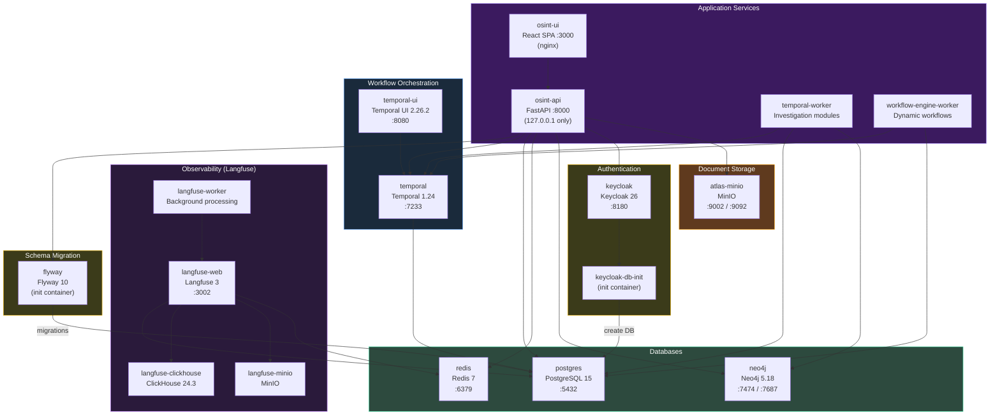
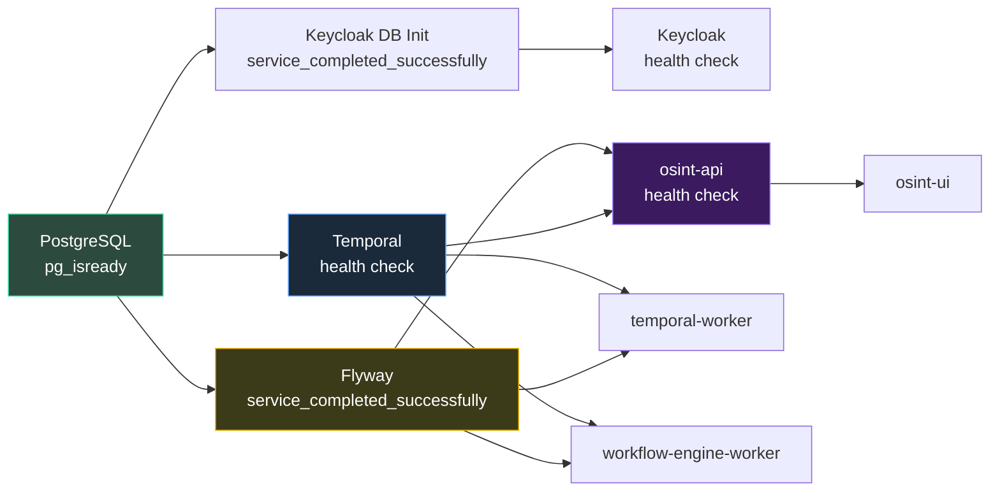

# Atlas — Infrastructure & Deployment

Atlas runs as a Docker Compose stack with 17+ containers spanning application services, databases, workflow orchestration, authentication, observability, and document storage. All containers communicate over a shared `osint-network` bridge network with health-check-enforced initialization ordering.

## Docker Compose Architecture

The deployment is defined in `docker-compose.yml` with an optional `docker-compose.dev.yml` overlay for development. All services join the `osint-network` Docker bridge network, ensuring container-to-container communication by service name.



## Service Inventory

| Service | Image | Port(s) | Purpose |
|---------|-------|---------|---------|
| `osint-api` | Custom (Dockerfile) | 8000 (127.0.0.1) | FastAPI backend with 30+ domain routers |
| `temporal-worker` | Custom (Dockerfile) | -- | Investigation module execution (7 parallel OSINT agents) |
| `workflow-engine-worker` | Custom (Dockerfile) | -- | Dynamic compliance workflow execution (YAML-compiled schemas) |
| `osint-ui` | Custom (frontend/) | 3000:80 (nginx) | React SPA served via nginx reverse proxy |
| `postgres` | postgres:15-alpine | 5432 | Shared database for app, Keycloak, Langfuse, and Temporal |
| `flyway` | flyway/flyway:10-alpine | -- | Schema migrations (init container, 105+ versioned SQL files) |
| `redis` | redis:7-alpine | 6379 | Cache layer and rate limiting backend |
| `temporal` | temporalio/auto-setup:1.24 | 7233 | Durable workflow orchestration server |
| `temporal-ui` | temporalio/ui:2.26.2 | 8080 | Temporal monitoring and debugging dashboard |
| `keycloak` | keycloak:26.0 | 8180 | OIDC/JWT authentication with RBAC |
| `keycloak-db-init` | postgres:15-alpine | -- | Creates the Keycloak database (init container) |
| `neo4j` | neo4j:5.18-community | 7474 / 7687 | Knowledge graph with APOC plugin |
| `langfuse-web` | langfuse/langfuse:3 | 3002 | LLM observability dashboard |
| `langfuse-worker` | langfuse/langfuse-worker:3 | -- | Background trace and event processing |
| `langfuse-clickhouse` | clickhouse/clickhouse-server:24.3 | -- | Columnar analytics storage for Langfuse |
| `langfuse-minio` | minio/minio | -- | Blob storage for Langfuse events and exports |
| `atlas-minio` | minio/minio | 9002 / 9092 | Document storage for investigation evidence and reports |

Additional init containers (`langfuse-db-init`, `langfuse-minio-init`, `atlas-minio-init`) handle one-time database and bucket setup.

## Initialization Chain

Service startup ordering is enforced through Docker Compose health checks and `depends_on` conditions. The chain ensures no application container starts before its dependencies are fully operational.



1. **PostgreSQL** starts first (health check: `pg_isready`)
2. **Flyway** runs all 105+ versioned SQL migrations after PostgreSQL is healthy (runs once, exits)
3. **Keycloak DB init** creates the Keycloak database after PostgreSQL is healthy (runs once, exits)
4. **Keycloak** starts after its DB init completes
5. **Temporal** starts after PostgreSQL is healthy (uses PostgreSQL as its backing store)
6. **API** starts after both Flyway and Temporal are healthy
7. **Workers** start after Temporal is healthy and Flyway completes
8. **UI** starts after the API is healthy
9. **Langfuse** starts after its DB init, ClickHouse, Redis, and MinIO are ready

## Dockerfile Patterns

### Backend (osint-api, temporal-worker, workflow-engine-worker)

All three application containers share the same Dockerfile with different entry points. The image is based on `python:3.14-slim` and includes system dependencies required by WeasyPrint for PDF generation:

- **pango** and **gdk-pixbuf** -- layout engine and image rendering for HTML-to-PDF conversion
- **fonts-noto** -- Unicode font family required for Romanian diacritics, CJK characters, and other non-Latin scripts in generated compliance reports

The entry points differ per service:

| Container | Entry Point |
|-----------|------------|
| `osint-api` | `uvicorn src.main:app --host 0.0.0.0 --port 8000` |
| `temporal-worker` | `python -m src.worker` |
| `workflow-engine-worker` | `python -m src.workflow_worker` |

### Frontend (osint-ui)

The frontend uses a multi-stage Docker build for production-optimized images:

**Stage 1 -- Builder** (`node:25-alpine`):
- Installs dependencies via `npm ci`
- Runs `npm run build` to produce a static Vite bundle

**Stage 2 -- Runtime** (`nginx:alpine`):
- Copies the built `dist/` directory into nginx's serving root
- Injects one of two nginx configuration files based on the `AUTH_PROXY_ENABLED` toggle:
  - **Standard config** -- direct passthrough to the backend API
  - **Authentik config** -- adds `auth_request` directives for Authentik forward-auth proxy, enabling SSO integration when deployed behind Authentik

The `AUTH_PROXY_ENABLED` environment variable controls which nginx config is used at container build time.

## Development Overrides

The `docker-compose.dev.yml` override file modifies the stack for local development:

| Service | Development Override |
|---------|---------------------|
| `osint-api` | Mounts source code as a volume, runs `uvicorn --reload` for hot-reloading |
| `osint-ui` | Replaces nginx with a `npm run dev` command running the Vite development server with HMR |
| HMR ports | Maps additional ports for Vite's WebSocket-based hot module replacement |
| Volumes | Source directories mounted read-write into containers |

Usage:

```bash
docker-compose -f docker-compose.yml -f docker-compose.dev.yml up -d
```

## Database Architecture

Atlas uses a single PostgreSQL 15 instance hosting four logical databases. This simplifies deployment and backup operations at the cost of shared resource contention.

| Database | Owner | Purpose |
|----------|-------|---------|
| `osint_reports` | `osint` | Application data: investigations, entities, risk scores, ontology, configurations, reference data, workflow schemas, mutation queue |
| Keycloak DB | `keycloak` | Authentication realms, users, roles, sessions |
| Langfuse DB | `langfuse` | LLM traces, observations, scores, prompt versions |
| Temporal DB | `temporal` | Workflow execution history, task queues, visibility records |

Flyway manages only the `osint_reports` schema. Other databases use their own migration strategies (Keycloak auto-migrates on startup, Temporal uses `auto-setup`, Langfuse manages its own migrations).

### Named Volumes

Persistent data survives container restarts through Docker named volumes:

| Volume | Service | Purpose |
|--------|---------|---------|
| `postgres-data` | postgres | All four database data directories |
| `neo4j-data` | neo4j | Graph data and indexes |
| `neo4j-logs` | neo4j | Neo4j transaction and query logs |

MinIO containers use their own internal volumes for blob data persistence.

## Security

### Network Binding

The API container binds to `127.0.0.1:8000` rather than `0.0.0.0:8000`. This prevents direct external access to the API, forcing all traffic through the nginx reverse proxy (or Authentik forward-auth proxy in SSO deployments). Only the nginx-served frontend container exposes a publicly accessible port.

### Rate Limiting

Rate limiting uses SlowAPI with Redis-backed distributed storage. When Redis is unavailable, the limiter falls back to in-memory storage. Four tiers are applied based on endpoint cost:

| Tier | Limit | Applied To |
|------|-------|-----------|
| **Default** | 60/minute | All read endpoints (GET) |
| **Write** | 30/minute | Create/update/delete mutations (POST, PUT, DELETE) |
| **Expensive** | 10/minute | AI-powered operations (start investigation, risk evaluation, report generation) |
| **Status** | 120/minute | Health checks, status polling, progress queries |

Rate limit responses include a `Retry-After` header with seconds until the limit resets. Exceeding the limit returns HTTP 429 Too Many Requests.

### Authentication

Every endpoint (except `/health` and `/public/*`) requires a valid Keycloak JWT in the `Authorization: Bearer <token>` header. The `PlatformAuthMiddleware` validates tokens and extracts `AuthContext` with `user_id`, `tenant_id`, and roles. See [API Reference](./api-reference) for role-based access details.

## Observability

### Langfuse LLM Tracing

Langfuse is deployed as a self-hosted observability stack with always-on tracing. Every LLM call across all 7 investigation modules is instrumented with:

- **Token counts** -- input and output tokens per call
- **Latency** -- wall-clock time per LLM invocation
- **Cost tracking** -- computed from model pricing tables
- **Prompt metadata** -- which prompt template, version, and model were used
- **Quality scoring** -- LLM-as-judge quality evaluation on investigation outputs

The Langfuse deployment consists of five containers:

| Container | Role |
|-----------|------|
| `langfuse-web` | Dashboard UI and API server (port 3002) |
| `langfuse-worker` | Background processing for async trace ingestion |
| `langfuse-clickhouse` | ClickHouse 24.3 columnar database for analytics queries |
| `langfuse-minio` | MinIO for event and export blob storage |
| `langfuse-db-init` | One-time database schema initialization |

Langfuse uses the shared PostgreSQL instance for its primary database and ClickHouse for high-volume analytics queries (trace aggregation, cost rollups, latency percentiles).

### Per-Agent Tracing

Each investigation module generates its own Langfuse trace with:

- Agent identifier (crew + agent name)
- Investigation ID for cross-referencing
- Module-specific metadata (country code, enrichment status)
- Tool call details (MCP server, tool name, arguments, response time)
- Ontology validation attempts and feedback loop iterations

This enables per-agent performance analysis, cost attribution, and quality comparison across model versions.

## CI/CD Pipeline

Atlas uses GitHub Actions with self-hosted on-premises runners for CI/CD. The pipeline runs 5 parallel jobs on every push to `main` and on pull requests.

| Job | What It Tests |
|-----|--------------|
| **Backend tests** | pytest suite with PostgreSQL integration (34% coverage, growing) |
| **PostgreSQL integration** | Database migration tests, repository layer verification |
| **Neo4j integration** | Graph sync tests, Cypher query validation |
| **Frontend lint + build** | ESLint, TypeScript type-checking, Vite production build |
| **Security scan** | ruff (Python linting for security patterns) + pip-audit (dependency vulnerability check) |

### Dependency Management

Dependabot is configured for weekly automated dependency update pull requests across both Python (pip) and JavaScript (npm) ecosystems.

## Configuration

Atlas uses `pydantic-settings` for configuration management. Settings are loaded from environment variables with `.env` file fallback. The `.env.example` file contains 196 lines covering all configurable parameters.

### Configuration Categories

| Category | Key Variables | Purpose |
|----------|--------------|---------|
| **API** | `HOST`, `PORT`, `LOG_LEVEL`, `CORS_ORIGINS` | Server binding and CORS policy |
| **Database** | `DATABASE_URL`, `DB_POOL_SIZE`, `DB_MAX_OVERFLOW` | PostgreSQL connection pooling |
| **Redis** | `REDIS_URL`, `REDIS_DB` | Cache and rate limiting backend |
| **Temporal** | `TEMPORAL_HOST`, `TEMPORAL_NAMESPACE`, `TEMPORAL_TASK_QUEUE` | Workflow orchestration connection |
| **LLM** | `OPENROUTER_API_KEY`, `ANTHROPIC_API_KEY`, `DEFAULT_MODEL` | LLM provider credentials and model selection |
| **MCP** | `MCP_TIMEOUT`, `MCP_CIRCUIT_BREAKER_*` | MCP server resilience settings |
| **MinIO** | `MINIO_ENDPOINT`, `MINIO_ACCESS_KEY`, `MINIO_SECRET_KEY`, `MINIO_BUCKET` | Document storage credentials |
| **Auth** | `KEYCLOAK_URL`, `KEYCLOAK_REALM`, `KEYCLOAK_CLIENT_ID` | Authentication provider settings |
| **CORS** | `CORS_ORIGINS`, `CORS_METHODS`, `CORS_HEADERS` | Cross-origin request policy |
| **Rate Limiting** | `RATE_LIMIT_DEFAULT`, `RATE_LIMIT_WRITE`, `RATE_LIMIT_EXPENSIVE` | Per-tier rate limit overrides |
| **Workflow** | `WORKFLOW_TASK_QUEUE`, `WORKFLOW_NAMESPACE` | Workflow engine worker settings |
| **Investigation** | `INVESTIGATION_TIMEOUT`, `MODULE_TIMEOUT`, `ENRICHMENT_TIMEOUT` | Investigation pipeline timeouts |
| **Langfuse** | `LANGFUSE_PUBLIC_KEY`, `LANGFUSE_SECRET_KEY`, `LANGFUSE_HOST` | Observability connection |
| **Neo4j** | `NEO4J_URI`, `NEO4J_USER`, `NEO4J_PASSWORD` | Knowledge graph connection |

All settings have sensible defaults for development. Production deployments override via environment variables or a mounted `.env` file.
