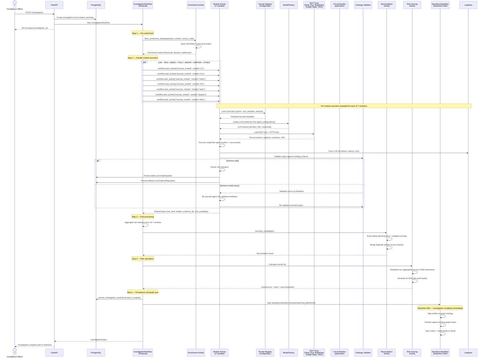
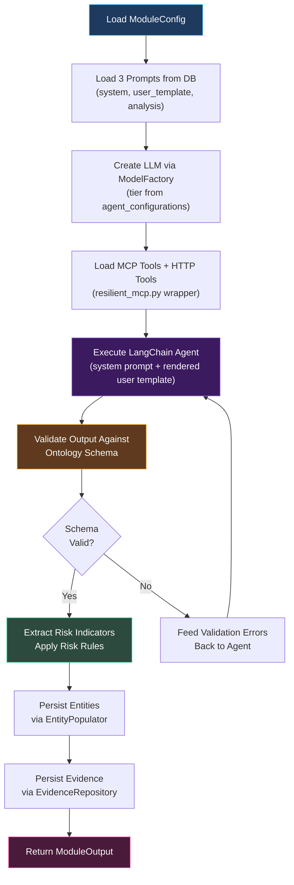
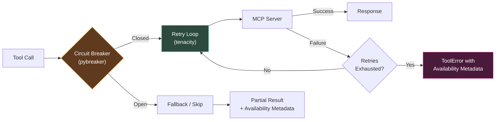
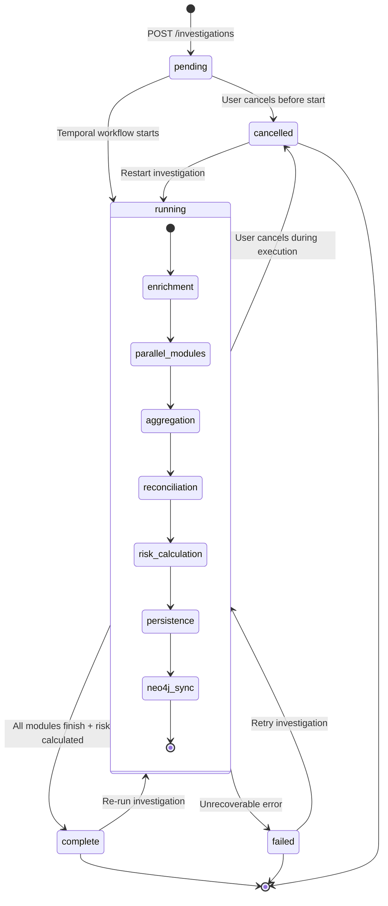

# Atlas — Investigation Pipeline

The investigation pipeline is Atlas's core runtime. It takes a company name, optional registration number, and country code as input, executes 7 specialized LLM agent modules in parallel via Temporal, reconciles discovered entities, scores risk across EBA-defined dimensions, and syncs the knowledge graph to Neo4j. This page documents every stage of the pipeline in detail.

## Overview: 7-Module Parallel Architecture

Atlas decomposes a KYB investigation into 7 independent research modules that execute simultaneously. Each module is a specialized LLM agent backed by a `ModuleConfig` dataclass that defines its prompts, result model, and template variables. There are no inter-module dependencies -- every module discovers entities independently, and reconciliation merges duplicates after all modules complete.

This parallel architecture means a full investigation completes in the time of its slowest module (typically 2-4 minutes) rather than the sum of all modules (which would be 15-25 minutes sequentially).

```mermaid
flowchart LR
    subgraph Input["Investigation Request"]
        REQ["Company Name<br/>Registration Number<br/>Country Code<br/>Website"]
    end

    subgraph Enrichment["Pre-Enrichment"]
        ENR["NorthData /<br/>Provider Fetch"]
    end

    subgraph Modules["7 Parallel Modules"]
        direction TB
        CIR["CIR<br/>Corporate Identity<br/>& Registration"]
        ROA["ROA<br/>Registered &<br/>Operational Addresses"]
        MEBO["MEBO<br/>Management, Employees<br/>& Beneficial Owners"]
        FRLS["FRLS<br/>Financial, Regulatory<br/>& Licensing Status"]
        AMLRR["AMLRR<br/>Adverse Media,<br/>Litigation & Rep Risk"]
        SPEPWS["SPEPWS<br/>Sanctions, PEP &<br/>Watchlist Screening"]
        DFWO["DFWO<br/>Digital Footprint &<br/>Website Ownership"]
    end

    subgraph PostProcess["Post-Processing"]
        RECON["Entity<br/>Reconciliation"]
        RISK["Risk Scoring<br/>(Weighted-Max)"]
        SYNC["Neo4j Graph<br/>Sync"]
    end

    REQ --> ENR --> Modules
    Modules --> RECON --> RISK --> SYNC

    style Input fill:#1e3a5f,stroke:#38bdf8,color:#fff
    style Enrichment fill:#2d4a3e,stroke:#34d399,color:#fff
    style Modules fill:#3b1a5f,stroke:#a78bfa,color:#fff
    style PostProcess fill:#5f3a1e,stroke:#f59e0b,color:#fff
```



## Full Pipeline Sequence

The following diagram shows the complete flow from API request through Temporal execution to final output, including the per-module execution detail.



## Starting an Investigation

An investigation begins with a `POST /investigations` request:

```json
{
  "company_name": "Acme Corp BV",
  "registration_number": "0123.456.789",
  "country_code": "BE",
  "website": "https://acme-corp.be",
  "modules": null
}
```

| Field | Required | Description |
|-------|----------|-------------|
| `company_name` | Yes | Legal name of the company to investigate |
| `registration_number` | No | Official registry number (enables pre-enrichment from NorthData and other providers) |
| `country_code` | No | ISO 2-letter country code (enables country-specific enrichment) |
| `website` | No | Company website URL (used by the DFWO module for domain analysis) |
| `modules` | No | List of specific modules to run. `null` runs all 7. Pass a subset for focused investigations |

The API creates a PostgreSQL investigation record with status `pending`, then starts a Temporal workflow with an `InvestigationInput` dataclass containing these fields plus a generated `investigation_id` and optional `company_id`.

## The 7 Investigation Modules

Each module is a specialized LLM agent designed for a specific compliance research domain. All 7 execute in parallel with no inter-module dependencies.

| Module | Full Name | Focus | Key Risk Rules |
|--------|-----------|-------|---------------|
| **CIR** | Corporate Identity & Registration | Company registration, legal status, directors, incorporation details | Company not active (+30), no directors found (+20), nominee director detected (+25), recently incorporated (+15) |
| **ROA** | Registered & Operational Addresses | Physical presence, address verification, operational locations | Virtual office detected (+20), registered/operational address mismatch (+15), mass registration address (+20), formation agent indicator (+10) |
| **MEBO** | Management, Employees & Beneficial Owners | Directors, UBOs, key personnel, ownership structures | Complex ownership structure (+25), nominee UBO detected (+30), circular ownership (+25), high-risk jurisdiction in ownership chain (+20), PEP connection (+30) |
| **FRLS** | Financial, Regulatory & Licensing Status | Financial health, licenses, regulatory compliance, annual accounts | Missing required licenses (+40 CRITICAL), going concern warning (+30), no annual accounts filed (+20), regulatory enforcement action (+25) |
| **AMLRR** | Adverse Media, Litigation & Reputation Risk | Media screening, court records, fraud allegations, ESG violations | Active litigation (+25), sanctions nexus in media (+40), fraud allegations (+30), regulatory enforcement coverage (+20) |
| **SPEPWS** | Sanctions, PEP & Watchlist Screening | OFAC/EU/UN sanctions, PEP databases, global watchlists | Direct sanctions match (+50 CRITICAL), indirect sanctions connection (+40), PEP match (+30), formerly sanctioned (+15) |
| **DFWO** | Digital Footprint & Website Ownership | WHOIS, DNS, SSL certificates, web presence analysis | Domain/company name mismatch (+15), privacy WHOIS (+10), domain age < 1 year (+10), SSL certificate mismatch (+10) |

### Per-Module Execution Detail

Every module follows the same execution pattern within the `execute_module` Temporal activity:



Each `ModuleOutput` contains:
- `risk_level` -- module-level risk assessment (clear/low/medium/high/critical)
- `entities` -- structured entities discovered by this module (Company, Person, Address, License, etc.)
- `risk_indicators` -- list of `RiskIndicator` objects with category, severity, title, description, evidence, and linked entity
- `evidence_ids` -- references to persisted evidence for audit trail
- `tool_availability` -- metadata dict tracking the status of each tool server (available, circuit_open, timeout, error)
- `data_quality_score` -- assessment of the completeness and reliability of findings

## Prompt Architecture

Each module uses 3 prompts, all stored in the PostgreSQL `prompts` table and loaded at runtime:

| Prompt | Purpose | Typical Length |
|--------|---------|---------------|
| **System prompt** | Defines the agent's role, expertise, and behavioral constraints. Sets the compliance research persona | 500-1000 tokens |
| **User template** | Jinja2 template rendered with investigation context (company name, registration number, enrichment data, country code). Contains the specific research instructions | 800-2000 tokens |
| **Analysis prompt** | Post-research structured extraction. Instructs the agent to organize findings into the ontology-aligned result schema | 300-600 tokens |

Prompts are versioned in the database. Compliance officers can edit prompts through the Settings UI without code deployment. The `PromptRepository` loads the active version for each module at investigation time.

### Role Assignments

| Module | Agent Role |
|--------|-----------|
| CIR | `registry_researcher` |
| ROA | `address_researcher` |
| MEBO | `ownership_researcher` |
| FRLS | `regulatory_analyst` |
| AMLRR | `media_analyst` |
| SPEPWS | `screening_specialist` |
| DFWO | `digital_analyst` |

## MCP Tool Integration

Atlas uses `langchain-mcp-adapters` (0.2.2) to bridge MCP tool servers into the LangChain tool ecosystem. MCP servers are configured per-tenant in the database and discovered dynamically at runtime.

### Available MCP Servers

| MCP Server | Purpose | Primary Modules |
|-----------|---------|-----------------|
| **Tavily** | Web search and news search | AMLRR, CIR, FRLS |
| **Exa** | Semantic search with content extraction | AMLRR, MEBO, DFWO |
| **BrightData** | Web scraping and data extraction | CIR, ROA, MEBO |
| **Google Maps** | Address verification and geocoding | ROA |
| **VAT VIES** | EU VAT number validation | CIR, FRLS |
| **OpenSanctions** | Sanctions, PEP, and watchlist screening | SPEPWS |
| **OpenCorporates** | Company registry lookups across jurisdictions | CIR |
| **Companies House** | UK company registry | CIR |
| **News** | Adverse media screening | AMLRR |
| **LinkedIn** | Professional profile verification | MEBO |

### Built-in Tools

In addition to MCP tools, every agent has access to:

| Tool | Purpose |
|------|---------|
| `whois_lookup` | WHOIS domain registration data |
| `dns_lookup` | DNS resolution and record analysis |
| `ssl_certificate_check` | SSL certificate inspection |
| `think` | Agent reasoning scratchpad (not sent to tools) |
| `calculator` | Numeric calculations |

## Resilience Architecture

Every MCP tool call is wrapped with a resilience layer implemented in `resilient_mcp.py`:



### Circuit Breaker Configuration (pybreaker)

Each MCP server has its own circuit breaker instance:

| Parameter | Value |
|-----------|-------|
| Failure threshold | 5 consecutive failures |
| Recovery timeout | 60 seconds |
| Expected exceptions | `TimeoutError`, `ConnectionError` |

When a circuit breaker opens, all subsequent calls to that MCP server immediately return a `ToolError` with `circuit_open` status instead of waiting for timeouts. After the recovery timeout, the circuit enters half-open state and allows a single test call.

### Retry Configuration (tenacity)

| Parameter | Value |
|-----------|-------|
| Maximum attempts | 3 |
| Wait strategy | Exponential backoff with jitter |
| Initial wait | 1 second |
| Maximum wait | 30 seconds |
| Retry on | `TimeoutError`, `ConnectionError`, HTTP 5xx |

### Structured Error Returns

When a tool fails after all retries, the agent receives a structured `ToolError` instead of an exception. This allows the agent to continue its research using other available tools rather than failing the entire module. Each module's `ModuleOutput` includes a `tool_availability` metadata dict tracking which tools were available, which had open circuits, and which timed out -- enabling partial result reporting and investigation quality assessment.

### Temporal Retry Policy

In addition to tool-level resilience, every Temporal activity has its own retry policy:

| Parameter | Value |
|-----------|-------|
| Initial interval | 1 second |
| Maximum interval | 1 minute |
| Maximum attempts | 3 |
| Backoff coefficient | 2.0 |

Module execution activities have a **20-minute** start-to-close timeout. Enrichment and reconciliation activities use 2-5 minute timeouts.

## Model Tiers

Atlas uses a cost-optimized model tier system that assigns different LLM models to different tasks based on complexity requirements:

| Tier | Model | Assigned To | Cost Relative to Primary |
|------|-------|------------|--------------------------|
| **Primary** | `claude-3.7-sonnet` | Investigation module agents (all 7 modules) | 1x (baseline) |
| **Fast** | `claude-3.5-haiku` | Entity extraction, quick classification, report Stage 1 | ~0.18x |
| **Reasoning** | `claude-3.7-sonnet:thinking` | Complex risk analysis, ambiguous evidence evaluation | ~1.5x |

The `ModelFactory` resolves the model tier for each agent from the `agent_configurations` database table. Per-module overrides allow fine-tuning: a module investigating a high-risk jurisdiction might use the reasoning tier, while a straightforward address verification uses the fast tier.

This tiered approach achieves approximately **82% cost savings** compared to using the primary model for all tasks, without measurable quality degradation for fast-tier assignments.

## LLM Output Validation

All LLM outputs are validated against the active ontology schema before being accepted. This is a critical quality gate -- unstructured or malformed agent output is caught and corrected before it enters the entity store.

### Validation Flow

1. **Agent produces output** -- the LangChain agent returns its findings as structured JSON
2. **Schema validation** -- output is validated against the `ModuleConfig`'s result model (e.g., `CIRModuleResult`, `MEBOModuleResult`)
3. **Ontology conformance** -- entities are checked against the active ontology schema for valid types, attributes, and relationships
4. **Feedback loop retry** -- if validation fails, the validation errors are formatted as human-readable feedback and injected into the agent's next prompt. The agent then corrects its output and resubmits
5. **Maximum retries** -- the feedback loop runs up to 2 additional attempts (3 total). If the output still fails validation, the module reports a degraded result with available findings

This feedback loop approach achieves a 95%+ first-pass validation rate, with the remaining 5% typically corrected on the first retry.

## Observability: Langfuse Integration

Every LLM call in the pipeline is traced through Langfuse (self-hosted). Atlas uses the `investigation_id` as the Langfuse `session_id`, which enables:

- **Cost aggregation per investigation** -- total token usage and cost across all 7 modules
- **Per-module cost breakdown** -- identify which modules are most expensive
- **Latency tracking** -- time spent in LLM calls vs. tool calls vs. validation
- **Prompt versioning** -- link traces to specific prompt versions for A/B quality comparison
- **Quality scoring** -- LLM-as-judge evaluation scores attached to traces

The Langfuse deployment includes a dedicated ClickHouse instance for analytics, enabling aggregate queries across thousands of investigations for cost optimization and quality monitoring.

## Investigation State Machine



### Cancellation Handling

The workflow handles `asyncio.CancelledError` gracefully. When a workflow is cancelled, it iterates through all active activity handles and cancels them with `WAIT_CANCELLATION_COMPLETED`, ensuring clean shutdown without orphaned activities.

## Post-Investigation Pipeline

After all 7 modules complete, four processing stages transform raw agent outputs into structured, deduplicated, risk-scored knowledge.

### 1. Risk Indicator Aggregation

The workflow collects all `RiskIndicator` objects from the 7 module outputs and aggregates them into a unified list. Each indicator includes:
- Category (customer, geographic, product, delivery_channel, transaction)
- Severity (low, medium, high, critical)
- Title and description
- Evidence reference
- Linked entity (the entity this risk applies to)

### 2. Entity Reconciliation

**Activity:** `reconcile_investigation`

When CIR finds "John Smith, Director" and MEBO finds "J. Smith, Board Member," entity reconciliation determines whether they are the same person. The reconciliation engine uses:

- **Blocking keys** for efficient candidate generation (same entity type + overlapping name tokens)
- **Weighted scoring** for match confidence (name similarity, attribute overlap, relationship context)
- **Merge strategies** -- when entities match, fields are merged using trust-weighted survivorship rules (the source with higher trust wins for each field)

The ontology package driving reconciliation totals ~14,700 lines across schemas, transforms, matchers, and serializers.

### 3. Overall Risk Calculation

**Activity:** `calculate_risk`

Risk is calculated using a weighted-max aggregation across 5 EBA-defined dimensions:

```
overall_score = max_dimension_score * 0.6 + weighted_average * 0.4
```

This ensures the highest single dimension cannot be averaged away by low-risk dimensions. A company with a critical sanctions match (dimension score: 95) will always produce a high overall score, regardless of how clean the other dimensions are.

The scorer produces 4 SHA-256 hashes for full audit reproducibility:

| Hash | Input | Purpose |
|------|-------|---------|
| `input_hash` | Canonicalized input data | Prove which data was scored |
| `override_hash` | Canonicalized analyst overrides | Prove which overrides were applied |
| `evaluation_fingerprint` | `matrix_schema_id + input_hash + override_hash` | Unique identifier for this exact evaluation scenario |
| `output_hash` | Dimension scores + overall score | Tamper detection on outputs |

See [Risk Engine](./risk-engine) for the full 7-dimension breakdown and factor details.

### 4. Neo4j Graph Sync

**Detached child workflow:** `Neo4jSyncWorkflow` with `ParentClosePolicy.ABANDON`

The investigation workflow completes immediately after persisting results. Graph sync runs as a detached child workflow -- if the sync fails, it never fails the investigation.

The sync process:
1. Map investigation entities to the graph ontology (nodes: Company, Person, Address, License; edges: OWNS, DIRECTS, LOCATED_AT, SANCTIONED_BY)
2. Resolve against existing graph nodes to prevent duplicates
3. Create or update nodes and relationships in Neo4j
4. Support incremental updates -- re-running an investigation merges new findings with existing graph data

Supporting components:
- `cypher_queries.py` -- parameterized Cypher query templates
- `cypher_generator.py` -- dynamic query generation from ontology entities
- `sync_service.py` -- sync orchestration and conflict resolution
- `parity_service.py` -- validates graph-database consistency

## Focused Investigations

Atlas supports running a subset of modules for targeted research:

```json
{
  "company_name": "Acme Corp",
  "modules": ["cir", "spepws", "amlrr"]
}
```

Use cases:
- **Quick sanctions screening** -- run only SPEPWS for rapid watchlist checks
- **Address verification** -- run CIR + ROA for registration and address confirmation
- **Re-investigation** -- re-run a specific module that previously failed or produced degraded results
- **Cost optimization** -- skip modules that are not relevant for the company's risk profile

The `SingleModuleWorkflow` enables re-running individual modules as standalone Temporal workflows with their own lifecycle and retry policies.
