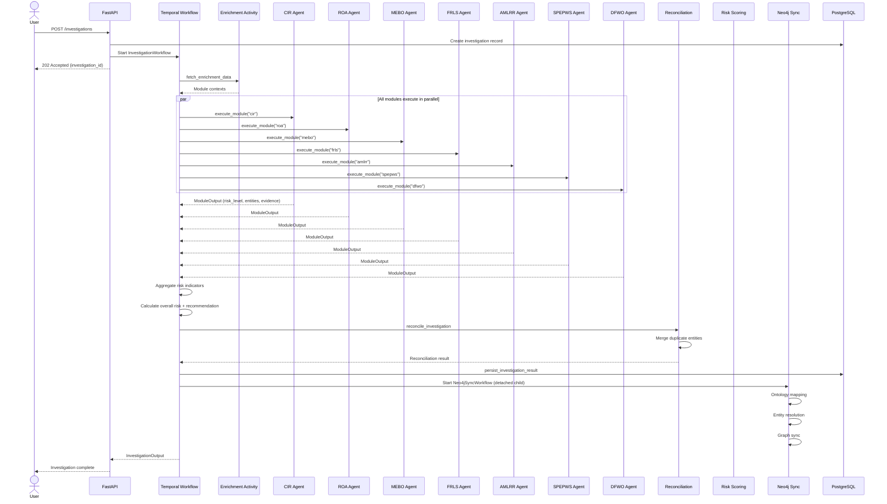
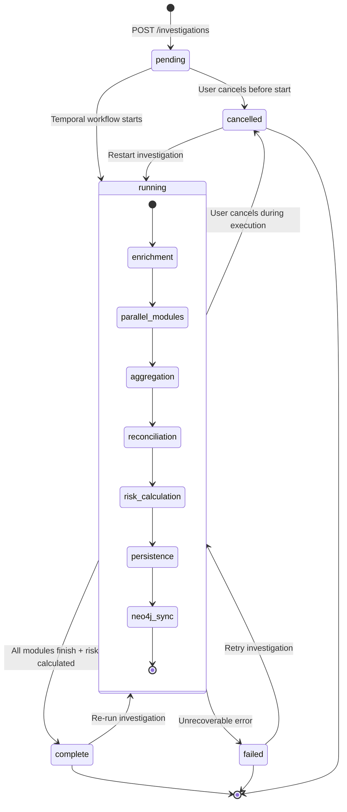

# Atlas — Investigation Pipeline

The investigation pipeline is Atlas's core runtime. It takes a company name, optional registration number, and country code as input, runs 7 specialized LLM agent modules in parallel via Temporal, reconciles the discovered entities, scores risk, and syncs everything to a Neo4j knowledge graph. This page documents every stage in detail.

## Starting an Investigation

An investigation begins with a `POST /investigations` request containing:

```json
{
  "company_name": "Acme Corp BV",
  "registration_number": "0123.456.789",
  "country_code": "BE",
  "website": "https://acme-corp.be",
  "modules": null
}
```

| Field | Required | Description |
|---|---|---|
| `company_name` | Yes | Legal name of the company to investigate |
| `registration_number` | No | Official registry number (enables enrichment) |
| `country_code` | No | ISO 2-letter country code (enables enrichment) |
| `website` | No | Company website URL (used by DFWO module) |
| `modules` | No | List of specific modules to run. `null` runs all 7 |

The API creates an investigation record in PostgreSQL, then starts a Temporal workflow with an `InvestigationInput` dataclass containing these fields plus a generated `investigation_id` and optional `company_id`.

## Temporal Workflow Orchestration

### InvestigationWorkflow

The `InvestigationWorkflow` class is the main entry point, decorated with `@workflow.defn`. It orchestrates the full investigation lifecycle:

1. **Enrichment** (optional) — if `registration_number` and `country_code` are provided, fetches data from external providers (North Data, etc.) to seed module context
2. **Parallel module execution** — all modules run simultaneously as Temporal activities
3. **Result aggregation** — collects module outputs, risk indicators, and evidence IDs
4. **Entity reconciliation** — merges duplicate entities discovered across modules
5. **Risk calculation** — computes overall risk level and recommendation
6. **Persistence** — writes results back to PostgreSQL
7. **Neo4j sync** — starts a detached child workflow for graph synchronization

### Retry Policy

Every activity uses the same retry configuration:

| Parameter | Value |
|---|---|
| Initial interval | 1 second |
| Maximum interval | 1 minute |
| Maximum attempts | 3 |
| Backoff coefficient | 2.0 |

Module execution activities have a **20-minute** start-to-close timeout. Enrichment and reconciliation activities use 2-5 minute timeouts.

### Cancellation Handling

The workflow handles `asyncio.CancelledError` gracefully. When a workflow is cancelled, it iterates through all activity handles and cancels them with `WAIT_CANCELLATION_COMPLETED`, ensuring clean shutdown without orphaned activities.

### Child Workflows

Neo4j sync runs as a **detached child workflow** (`Neo4jSyncWorkflow`) with `ParentClosePolicy.ABANDON`. This means the investigation workflow completes immediately after persisting results, while the graph sync continues running independently. If the sync fails, it never fails the investigation.

There is also a `SingleModuleWorkflow` for re-running individual modules or targeted investigations.

## The 8 Investigation Modules

Atlas defines 7 investigation modules plus a Summary module. Each module is defined by a `ModuleConfig` dataclass that specifies its prompts, result model, and template variables. All 7 primary modules execute in **parallel** with no inter-module dependencies.

### CIR — Corporate Identity Registration

**Role:** `registry_researcher`

Verifies the company's legal existence and registration details. Searches official company registries for the legal name, registration number, incorporation date, legal form, registered capital, and current status (active/dissolved/suspended).

### ROA — Registered & Operational Addresses

**Role:** `address_researcher`

Investigates the company's registered and operational addresses. Checks for virtual offices, mail drops, mismatches between registered and trading addresses, and whether the address is shared with many other entities (mass registration indicator).

### MEBO — Management, Employees & Beneficial Owners

**Role:** `ownership_researcher`

Identifies directors, officers, beneficial owners, and key employees. Maps the ownership structure including direct and indirect holdings. Flags nominee arrangements, circular ownership, high-risk jurisdictions in the ownership chain, and PEP connections.

### FRLS — Financial, Regulatory & Licensing Status

**Role:** `regulatory_analyst`

Assesses the company's financial health and regulatory standing. Checks for required licenses, regulatory filings, annual accounts availability, credit ratings, and any regulatory actions or warnings issued against the entity.

### AMLRR — Adverse Media, Litigation & Reputational Risk

**Role:** `media_analyst`

Scans for negative news coverage, court proceedings, regulatory enforcement actions, and reputational red flags. Covers fraud allegations, money laundering connections, tax evasion investigations, and environmental/social governance violations.

### SPEPWS — Sanctions, PEP & Watchlist Screening

**Role:** `screening_specialist`

Screens the company and its associated persons against sanctions lists (OFAC, EU, UN), PEP databases, and other watchlists. Checks for designations, frozen assets, travel bans, and any connections to sanctioned entities or jurisdictions.

### DFWO — Digital Footprint & Website Ownership

**Role:** `digital_analyst`

Analyzes the company's online presence. Performs WHOIS lookups, DNS analysis, SSL certificate inspection, and website content review. Checks domain age, hosting jurisdiction, privacy screen usage, and consistency between the website content and declared business activities.

### Summary — Consolidated Findings

After all 7 modules complete, the workflow aggregates results into an overall risk assessment with:
- Overall risk level (calculated from module risk levels)
- Overall risk score (numeric, aggregated from module results)
- Recommendation (approve / enhanced due diligence / reject)
- Complete list of risk indicators from all modules
- Evidence ID references for audit trail

## Pipeline Sequence



## Investigation State Machine



## Post-Investigation Pipeline

After the 7 modules complete, four processing stages run to transform raw agent outputs into structured, deduplicated, risk-scored knowledge:

### 1. Ontology Population

**File:** `src/ontology/populator.py` (1,537 lines)

The ontology populator extracts structured entities from free-text module results. It maps findings to a formal ontology schema with typed entities (Company, Person, Address, License, etc.) and relationships (OWNS, DIRECTS, LOCATED_AT, SANCTIONED_BY). The ontology package totals ~14,700 lines across schemas, transforms, matchers, and serializers.

Key components:
- `populator.py` — Main extraction engine, converts agent output to ontology entities
- `entity_matcher.py` (832 lines) — Fuzzy matching for entity deduplication
- `person_matcher.py` (505 lines) — Specialized matching for person names across cultures
- `reconciliation.py` (1,292 lines) — Cross-module entity reconciliation
- `ownership.py` (574 lines) — Ownership chain analysis and UBO detection
- `schema_loader.py` (1,027 lines) — Dynamic ontology schema loading
- `lineage.py` (515 lines) — Data lineage tracking per entity field

### 2. Entity Resolution

**File:** `src/ontology/entity_resolution.py` (1,028 lines)

Deduplicates entities discovered by different modules. When CIR finds "John Smith, Director" and MEBO finds "J. Smith, Board Member," entity resolution determines whether they are the same person. Uses blocking keys for efficient candidate generation and weighted scoring for match confidence.

### 3. Risk Scoring

**Files:** `src/temporal/risk_rules.py` (561 lines), `src/risk_matrix/scorer.py` (578 lines)

Two-layer risk scoring:
- **Rule-based scoring** (`risk_rules.py`) — Temporal-level risk aggregation from module risk levels and indicators. Calculates overall risk level and generates a human-readable recommendation
- **EBA risk matrix** (`scorer.py`) — Structured scoring across EBA-defined risk dimensions. Configurable weights and thresholds. Repository layer (`risk_matrix/repository.py`, 635 lines) persists risk matrix configurations

The risk matrix package totals ~3,400 lines including the version manager, ontology mapper, batch workflow, and API router.

### 4. Neo4j Graph Sync

**File:** `src/graph/neo4j_sync.py` (1,144 lines)

Syncs all discovered entities and relationships to Neo4j as a detached child workflow. Creates nodes for companies, persons, addresses, and other entity types. Creates edges for ownership, directorship, location, and other relationships. Supports incremental updates — re-running an investigation merges new findings with existing graph data.

Supporting graph components:
- `cypher_queries.py` — Parameterized Cypher query templates
- `cypher_generator.py` — Dynamic query generation from ontology entities
- `sync_service.py` — Sync orchestration and conflict resolution
- `parity_service.py` — Validates graph-DB consistency

## Focused Investigations

Atlas supports **focused investigations** — running a subset of modules for targeted research. By passing a `modules` list in the investigation input, users can run only the relevant modules:

```json
{
  "company_name": "Acme Corp",
  "modules": ["cir", "spepws", "amlrr"]
}
```

This is useful for:
- **Quick sanctions screening** — run only SPEPWS
- **Address verification** — run only CIR + ROA
- **Re-investigation** — re-run a specific module that previously failed
- **Cost optimization** — skip modules that are not relevant for the risk profile

The `SingleModuleWorkflow` enables re-running individual modules as standalone Temporal workflows with their own lifecycle.

## Tool Ecosystem

Each LLM agent module has access to a shared pool of tools, dynamically loaded from MCP servers and local implementations. Tools are defined as LangChain `BaseTool` subclasses.

| Category | Tools | Description |
|---|---|---|
| **Domain Tools** | `whois_lookup`, `dns_lookup`, `ssl_certificate_check` | WHOIS, DNS resolution, SSL certificate analysis |
| **Company Tools** | `opencorporates_search`, `companies_house_search` | Company registry lookups across jurisdictions |
| **Sanctions Tools** | `opensanctions_search` | OFAC, EU, UN sanctions + PEP screening via MCP |
| **VAT Tools** | `vat_vies_validation` | EU VAT number validation via VIES |
| **Search Tools** | Web search, news search | General and news-specific web search via MCP |
| **Web Tools** | Web scraping, content extraction | Website content analysis |
| **MCP Tools** | BrightData, Tavily, Exa, Google Maps, LinkedIn, news | Dynamic tools from configured MCP servers |
| **Builtins** | `think`, `calculator` | Agent reasoning scratchpad and calculations |

### MCP Server Integration

Atlas uses `langchain-mcp-adapters` (0.2.2) to bridge MCP tool servers into the LangChain tool ecosystem. MCP servers are configured per-tenant in the database and discovered dynamically at runtime. The `resilient_mcp.py` module wraps all MCP calls with circuit breakers (PyBreaker) and retries (Tenacity).

Available MCP clients:
- BrightData (web scraping)
- Tavily (search)
- Exa (semantic search)
- OpenCorporates (company registries)
- Companies House (UK registry)
- OpenSanctions (sanctions/PEP)
- Google Maps (address verification)
- News (adverse media)
- LinkedIn (professional profiles)

### Tool Resilience

Every MCP tool call is wrapped with a resilience layer (Phase 10):

```
Tool Call → Circuit Breaker Check → Retry Loop → MCP Server → Response
              ↓ (if open)            ↓ (if all retries fail)
          Fallback/Skip           Partial Result with Availability Metadata
```

Each module's `ModuleOutput` includes a `tool_availability` metadata dict tracking the status of each tool server (available, circuit_open, timeout, error), enabling partial result reporting when some data sources are unavailable.

## Comparison with Trust Relay's Pipeline

| Aspect | Atlas | Trust Relay |
|---|---|---|
| **Modules** | 7 fixed modules + Summary | 13 agents with country-specific routing |
| **Execution** | All modules in parallel | Sequential phases: pre-investigation, gap analysis, customer docs, validation |
| **Customer interaction** | None — pure OSINT investigation | Iterative loops — portal for document upload, officer review gates |
| **Country routing** | Single pipeline for all countries | Country-specific agents (BE, FR, NL, RO, CZ, etc.) with registry-specific tooling |
| **Tool integration** | LangChain tools + MCP adapters | PydanticAI tools + direct HTTP calls |
| **Entity extraction** | Ontology populator (RDFLib, 14,700 lines) | Inline extraction within agent activities |
| **Entity resolution** | Dedicated module (1,028 lines) | Entity matcher with blocking keys (ADR-0024) |
| **Risk scoring** | Two-layer: rule-based + EBA matrix | EBA risk matrix with weighted-max aggregation (ADR-0020) |
| **Graph sync** | Detached child workflow | 20-step ETL pipeline within workflow |
| **Re-investigation** | Re-run any module subset | Follow-up loop back to document upload |
| **Observability** | Langfuse (self-hosted, 5 containers) | Evidence bundles + audit log |
| **Resilience** | PyBreaker + Tenacity per tool | Temporal retry policy at activity level |

The fundamental architectural difference: Atlas is a **pure OSINT engine** — it investigates companies without any customer interaction. Trust Relay wraps investigation in a **compliance workflow** with customer document upload, officer review gates, iterative follow-up loops, and branded portals. The two systems are complementary: Atlas can serve as the OSINT investigation engine while Trust Relay manages the end-to-end compliance case lifecycle.
