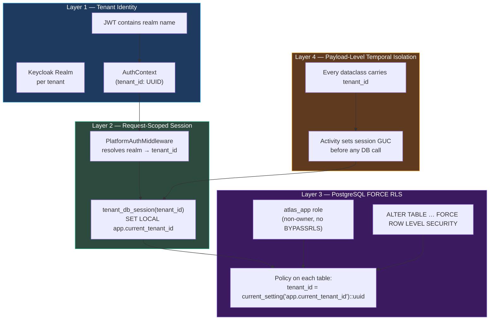

# Atlas — Multi-Tenancy & Row-Level Security

Atlas is a multi-tenant compliance platform: a single deployment serves many financial-services customers, each of which must be unable — by construction — to read or write another tenant's investigations, entities, credentials, or audit trails. This page documents the four-layer isolation architecture that delivers that guarantee, the threat model it defends against, and the explicit operational levers that exist to bend the guarantee under emergency conditions.

The architecture was introduced in milestone **v5.0 — Multi-Tenancy Architecture (ADR-022)**, executed across phases **84 → 86.1.1**, and hardened by phase **103** to flow tenant context through the credential plane. It is the substrate every other v5.x feature is built on.

## Threat Model

Atlas treats *cross-tenant data exposure* as the worst-case failure mode — worse than a service outage, worse than a slow query. The platform's customers are competitors; an entity row, a sanctions hit, or a discovered ultimate beneficial owner leaking from one tenant's investigations to another would be a contractual catastrophe.

Three classes of failure are explicitly defended against:

1. **Application-layer bug** — a router omits a `WHERE tenant_id = $1` clause; a repository forgets to pass the tenant context; a Temporal activity reads from a stale connection bound to the wrong tenant.
2. **Backend compromise** — an attacker gains code execution inside the FastAPI process and attempts to read another tenant's data through the application's database connection.
3. **Operator error** — a staging-style environment variable bleeds into production, a rollback mid-deploy leaves the system in a half-migrated state, a credential is rotated without invalidating in-flight workers.

The defenses are layered so that the failure of any single layer leaves the system isolated, not exposed.

## The Four Layers



### Layer 1 — Tenant Identity (Phase 84)

Atlas treats the **Keycloak realm** as the canonical tenant identifier on the wire and the **`tenants.id` UUID** as the canonical tenant identifier inside the platform. The two are joined by a `tenant_domains` table that maps realm names to UUIDs.

| Surface | What carries the tenant |
|---|---|
| Browser → API | JWT issued by `https://keycloak/realms/{realm}` |
| API request → middleware | Bearer token in `Authorization` header |
| Middleware → request scope | `AuthContext(tenant_id: UUID, is_platform_service: bool)` |
| Request → database | `app.current_tenant_id` PostgreSQL GUC, set per session |
| Workflow payload → activity | `tenant_id: UUID` field on every Temporal dataclass |

The migration from string-sentinel `"internal"` to a typed `is_platform_service: bool` is a deliberate choice. A boolean cannot be silently confused with a tenant name; an attacker who controls a realm string cannot create a realm called `"internal"` to elevate. The same reasoning produced the rule that no Temporal activity may use a sentinel UUID — every activity dataclass declares `tenant_id` as a required field with no default.

### Layer 2 — Request-Scoped Sessions (Phase 85)

Every database connection used to read or write tenant-scoped data flows through `tenant_db_session(tenant_id)`. The session sets the `app.current_tenant_id` GUC via `SET LOCAL` — meaning the GUC is automatically reverted at transaction commit or rollback, eliminating an entire class of "leaked context" bugs.

```python
async with tenant_db_session(tenant_id, "atlas") as conn:
    # All queries on `conn` are now RLS-scoped to tenant_id.
    # The GUC is unset automatically at scope exit.
    rows = await conn.fetch("SELECT * FROM ontology_entities WHERE registration_number = $1", reg_no)
```

Background tasks that legitimately need tenant context (Temporal activities, scheduled jobs) use `tenant_background_session(tenant_id, "atlas")`, which performs the same GUC binding outside an HTTP request lifecycle.

### Layer 3 — PostgreSQL FORCE Row-Level Security (Phase 85)

This is the load-bearing defense. Atlas does **not** rely on application code remembering to filter by tenant; the database refuses to return rows from the wrong tenant even if the query forgets the filter.

#### The `atlas_app` role

Two roles exist:

| Role | Purpose | RLS posture |
|---|---|---|
| `osint` (owner) | Schema migrations (Flyway), administrative scripts | Owns tables → bypasses RLS by default |
| `atlas_app` (application) | All runtime API and worker connections | Non-owner → RLS applies; explicitly forbidden `BYPASSRLS` |

The application pool connects as `atlas_app`. The owner role exists only for migrations and is gated by an explicit opt-in flag (`ALLOW_OWNER_DB_FALLBACK=true`) that, when set, emits a loud `WARNING` containing the verbatim phrase **"FORCE RLS IS NOT ENFORCED for this process. This MUST NOT be used in production."** A grep guard test in CI fails closed if the warning string is altered.

#### FORCE ROW LEVEL SECURITY

Approximately **46 tenant-owned tables** carry `tenant_id UUID NOT NULL` and the policy:

```sql
CREATE POLICY tenant_isolation_atlas_app ON <table>
  FOR ALL TO atlas_app
  USING       (tenant_id = current_setting('app.current_tenant_id', true)::uuid)
  WITH CHECK  (tenant_id = current_setting('app.current_tenant_id', true)::uuid);

ALTER TABLE <table> FORCE ROW LEVEL SECURITY;
```

`USING` filters reads; `WITH CHECK` filters writes — symmetrical so an attacker cannot insert into another tenant even if they could read. `FORCE ROW LEVEL SECURITY` is the critical clause: the default `ROW LEVEL SECURITY` is permissive against table owners, while `FORCE` makes the policy apply to *every* role including the owner if the owner connects without bypass privileges.

#### The override-capable exceptions

Two tables (`reference_datasets`, `ontology_schema_lines`) carry permissive `OR` policies — system defaults are visible to all tenants, tenant-specific rows are scoped. This is the only deliberate seam in the FORCE RLS surface, and it exists because compliance reference data (FATF country risk, sanctions list configurations) is platform-shared.

### Layer 4 — Payload-Level Temporal Isolation

Atlas does not shard Temporal task queues per tenant. The design choice — captured in PROJECT.md as a Key Decision — is that **payload-level isolation is sufficient for the first release**; per-tenant queues are a noisy-neighbor optimization deferred until tenant SLAs require it.

The mechanism: **every Temporal activity dataclass declares `tenant_id` as a required field** and the activity body's first responsibility is to bind a tenant-scoped session before touching the database.

```python
@dataclass
class HealthCheckActivityInputV2:
    tenant_id: UUID                    # required, no default
    provider_id: str
    # …
```

This means a misrouted task — even one routed to the wrong worker by a Temporal bug — cannot read another tenant's data, because the activity will either bind to the *correct* tenant from its payload, or fail to bind at all.

## What Tenant Identity Carries

`AuthContext` is the request-scoped object that flows through middleware, routers, services, and repositories.

| Field | Type | Purpose |
|---|---|---|
| `tenant_id` | `UUID \| None` | Canonical platform-internal tenant identifier |
| `realm` | `str \| None` | Keycloak realm name (wire identifier) |
| `user_id` | `UUID` | Authenticated user |
| `roles` | `list[str]` | Keycloak roles (admin, editor, viewer) |
| `is_platform_service` | `bool` | True for inter-service auth (e.g., Temporal worker → API) |
| `email` | `str \| None` | For audit trails |

The cardinality matters: `tenant_id` may be `None` only for `is_platform_service=True` requests or for unauthenticated public endpoints (`/health`, `/public/*`). Every router decorator in the dependency tree of a tenant-scoped resource includes `Depends(require_tenant)`, which raises HTTP 403 if `tenant_id` is `None`.

## Operational Levers

Three escape hatches exist, all explicit, all logged:

| Lever | Variable / SQL | Purpose | Production posture |
|---|---|---|---|
| **Owner-role fallback** | `ALLOW_OWNER_DB_FALLBACK=true` | Permits the application pool to connect as `osint` (RLS-bypass) | ❌ Loud `WARNING`; CI guard refuses to allow this in prod manifests |
| **Platform credential fallback** | `ATLAS_PLATFORM_FALLBACK_ENABLED=true` | Bypasses the per-tenant credential resolver and hands the platform credential to every request | ❌ Emergency rollback only; sampled `ERROR` log per provider per minute |
| **Grandfather entry** | `tenant_provider_grandfather` row | Allows a specific (tenant, provider) pair to use platform credentials during migration | ✅ Time-limited per-row; meant to expire as tenants onboard their own keys |

Two of the three are emergency levers — they exist so that, if the credential or RLS plumbing has a bug in production, an operator can keep the platform running while the bug is fixed. They are not load-bearing in the steady state.

## Verification Surfaces

The contract is enforced by tests, not just code review:

- **`tests/test_rls_raw_pool_guard.py`** — 44 pinning tests that fail-closed if any code path acquires a raw pool connection without a tenant scope.
- **`tests/test_phase_103_no_platform_creds.py`** — 258-case static-grep guard catching environment-variable and JSONB regressions in the credential resolver.
- **`tests/test_phase_106_2_no_llm_env_vars.py`** + **`tests/test_phase_106_2_dead_code_removed.py`** — fail-closed against `os.environ["OPENROUTER_API_KEY"]` regressions.
- **CI integration job (Phase 100 T-100-01)** — runs cross-tenant RLS isolation tests against a live PostgreSQL instance.
- **Phase 85 grep guard** — fails the build if the verbatim `"FORCE RLS IS NOT ENFORCED"` warning string is altered, ensuring operators always see the same recognizable text.

## Boundaries Not Yet in v5.0

The architectural decision record (ADR-022) explicitly defers four isolation refinements:

1. **Per-tenant Temporal task queues** — a shared queue with payload-level isolation is sufficient for first release; noisy-neighbor optimization deferred.
2. **Neo4j database-per-tenant** — shared graph with logical isolation (`tenant_id` on nodes/relationships, scoped Cypher queries) is sufficient.
3. **In-app tenant switcher** — single tenant per browser session.
4. **Tenant-specific settings override tables** — platform-admin-only settings for first release.

These boundaries are not gaps; they are decisions. Each will be revisited when a customer's SLA, regulator, or scale forces a re-evaluation.

## Reading Guide

- **[Credential Vault](./credential-vault)** — how tenant identity flows into credential resolution.
- **[Plugin Architecture](./plugin-architecture)** — how plugins declare which credentials they need.
- **[System Architecture](./architecture)** — request flow with tenant context overlay.
