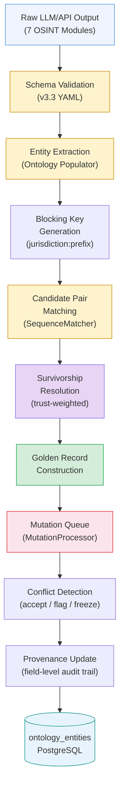

# Atlas — Ontology System

Atlas uses a schema-driven ontology to normalize every entity discovered during OSINT investigations. Each data source -- registry APIs, structured third-party services, web scrapers, screening providers, and LLM extractions -- feeds into a unified entity model. The ontology defines what entity types exist, what attributes they carry, what relationships connect them, and how conflicting data from multiple sources gets resolved into authoritative "golden records" with field-level provenance.

The system enforces three invariants:

1. **Every field has provenance.** No value exists without a recorded source, trust score, and timestamp.
2. **Risk signals are never suppressed.** Protected fields (PEP, sanctions) can only be set by authorized providers.
3. **All resolution decisions are auditable.** The full merge history is retained for EU AI Act Art. 12 and AML 5-year retention requirements.

---

## Schema Definition (YAML-Driven)

The ontology schema is defined in YAML and has evolved through four major versions:

| Version | Status | Key Changes |
|---|---|---|
| v1.0 | Deprecated | Basic entity types: Company, Person, Address. |
| v2.0 | Deprecated | Agent-optimized output format specifications for LangGraph crew agents. |
| v3.0 | Deprecated | Added Trust, Document entity types, jurisdiction risk flags, trust relationship types. |
| **v3.3** | **Active** | `registration_numbers` array, `immutable`/`deprecated` field metadata, `alias_of` field aliasing, per-field `survivorship` strategy declarations. |

All schemas live in `config/ontology_schema_v*.yaml`. The `SchemaCache` singleton loads the active schema at startup and caches it in-process with a 60-second TTL for database-loaded schemas.

### Entity Types

The v3.3 schema defines nine entity types:

| Entity Type | Color | Description | Key Attributes |
|---|---|---|---|
| **LegalEntity** | `#4A90D9` | Companies, organizations, legal entities | `legal_name`, `registration_number`, `registration_numbers[]`, `jurisdiction`, `status`, `incorporation_date`, `entity_type`, `is_sanctioned`, FATF/CPI/secrecy flags |
| **Person** | `#7B68EE` | Directors, shareholders, UBOs, trustees | `full_name`, `nationality`, `date_of_birth`, `is_pep`, `is_sanctioned`, `roles[]` |
| **Address** | `#20B2AA` | Physical or virtual locations | `full_address`, `city`, `country_code`, `address_type`, `is_virtual_office`, `mass_registration_count`, `latitude`/`longitude` |
| **Trust** | `#9370DB` | Legal trust arrangements (13 subtypes) | `trust_name`, `trust_type`, `jurisdiction`, `establishment_date`, `is_revocable`, `is_regulated`, `governing_law` |
| **Document** | `#708090` | Source documents and evidence | `title`, `document_type` (18 subtypes), `source_url`, `source_type`, `file_hash` (SHA-256), `retrieval_date`, `expiry_date` |
| **Domain** | `#48AFF0` | Internet domains owned by entities | `domain_name`, `registrar_name`, `hosting_provider`, `ssl_status`, `registration_date`, `expiry_date` |
| **SanctionsMatch** | `#DC143C` | Matches against sanctions/watchlists | `list_name`, `match_type` (exact/fuzzy/alias), `match_score` (0-100), `listed_date`, `reason` |
| **PEPExposure** | `#FF8C00` | Politically Exposed Person connections | `pep_name`, `position`, `country`, `pep_category`, `relationship` (direct/family/close_associate) |
| **AdverseMedia** | `#B22222` | Negative news or media mentions | `headline`, `source_url`, `publication_date`, `severity`, `categories[]`, `summary` |

### Relationship Types

Thirteen relationship types connect entities across the graph:

| Relationship | From Types | To Types | Neo4j Type | Key Attributes |
|---|---|---|---|---|
| **Directorship** | Person, LegalEntity | LegalEntity | `DIRECTS` | `role`, `is_current`, `appointed_date`, `resigned_date` |
| **Ownership** | Person, LegalEntity, Trust | LegalEntity | `OWNS` | `percentage`, `is_ubo`, `via_entity`, `effective_percentage` |
| **RegisteredAt** | LegalEntity, Trust | Address | `REGISTERED_AT` | `address_type`, `is_current` |
| **Trusteeship** | Person, LegalEntity | Trust | `TRUSTEE_OF` | `role` (trustee/co_trustee/successor/corporate), `appointed_date` |
| **Settlor** | Person, LegalEntity | Trust | `SETTLOR_OF` | `contribution_date`, `retains_control` |
| **Beneficiary** | Person, LegalEntity | Trust | `BENEFICIARY_OF` | `beneficiary_type` (income/capital/discretionary/remainder/contingent), `vested`, `percentage` |
| **Protector** | Person | Trust | `PROTECTOR_OF` | `appointed_date`, `powers[]` |
| **DocumentsEntity** | Document | Any entity | `DOCUMENTS` | `relevance` (primary/supporting/reference) |
| **OwnsDomain** | LegalEntity | Domain | `OWNS_DOMAIN` | `is_primary` |
| **MatchedTo** | LegalEntity, Person | SanctionsMatch, PEPExposure | `MATCHED_TO` | `match_confidence`, `screening_date` |
| **MentionedIn** | LegalEntity, Person | AdverseMedia | `MENTIONED_IN` | `relevance_score` |
| **OperatesAt** | LegalEntity | Address | `OPERATES_AT` | `is_current` |
| **FiledBy** | Document | LegalEntity | `FILED_BY` | `filing_date` |

### Per-Field Survivorship Declarations

Each attribute in the schema carries a `survivorship` strategy declaration that controls how conflicts are resolved when multiple sources provide different values:

```yaml
# From ontology_schema_v3.3.yaml
LegalEntity:
  attributes:
    legal_name:
      type: string
      required: true
      survivorship: most_trusted    # Highest-trust source wins
    status:
      type: enum
      survivorship: most_recent     # Latest retrieval wins
    registration_numbers:
      type: array
      survivorship: combine         # Merge arrays from all sources
```

---

## Entity Matching (EntityMatcher)

The `EntityMatcher` generates deterministic matching keys for cross-investigation deduplication. Rather than comparing every entity against every other entity (O(n^2)), it uses blocking keys to restrict comparisons to likely candidates (O(n)).

### Blocking Key Generation

Format: `{jurisdiction}:{first_3_chars_of_stripped_normalized_name}`

```
Input:  "Bolloré SE" in jurisdiction "BE"
Step 1: Strip legal suffix → "Bolloré"
Step 2: Normalize (NFKD + lowercase) → "bollore"
Step 3: Take first 3 chars → "bol"
Result: "BE:bol"
```

Entities with different blocking keys cannot be matches, dramatically reducing the comparison space. Only entities sharing a blocking key proceed to detailed comparison.

### Legal Suffix Stripping

The matcher strips 25+ legal suffix patterns (ordered longest-first to avoid partial matches):

| Pattern | Jurisdictions |
|---|---|
| `Sp. z o.o.` | Poland |
| `Corporation`, `Corp.` | US, Canada |
| `Limited`, `Ltd.` | UK, Ireland, Hong Kong |
| `GmbH`, `OHG`, `GbR`, `KG`, `AG`, `eG` | Germany, Austria, Switzerland |
| `SARL`, `SAS`, `SA` | France, Luxembourg, Belgium |
| `SRL` | Italy, Romania |
| `LLC`, `PLC` | US, UK |
| `SE` | Pan-European |
| `NV`, `BV` | Netherlands, Belgium |
| `AB` | Sweden |
| `AS` | Norway, Denmark |
| `OY` | Finland |
| `Inc.` | US |

### Registration Number Normalization

Registration numbers are normalized by stripping country/court prefixes to enable cross-border matching:

| Input | Transformation | Output |
|---|---|---|
| `BE0456789123` | Strip 2-letter country code | `0456789123` |
| `CHE123456789` | Strip CHE prefix (Switzerland) | `123456789` |
| `FR9201.552073785` | Strip dot-separated prefix | `552073785` |
| `LURCSL.B123456` | Strip dot-separated prefix | `B123456` |
| `CZ12345678` | Strip 2-letter country code | `12345678` |

Supported country prefixes: BE, DE, GB, FR, NL, AT, IT, ES, PT, DK, SE, NO, FI, PL, CZ, SK, HU, RO, BG, HR, SI, LT, LV, EE, IE, LU, MT, CY, GR, and CHE.

### Person Name Normalization (PersonMatcher)

Person names present unique matching challenges -- different name orders, diacritical marks, and abbreviations. The `PersonMatcher` applies:

1. **NFKD decomposition**: Strip diacritical marks ("Bolloré" becomes "Bollore", "Société" becomes "Societe")
2. **Lowercase normalization**: Case-insensitive comparison
3. **Alphabetical sort of name parts**: "Jean-Pierre Dupont" and "Dupont Jean-Pierre" both become `"dupont jean-pierre"`
4. **SequenceMatcher fuzzy comparison**: Handles spelling variations and partial matches

### Match Confidence Levels

| Level | Score Range | Action |
|---|---|---|
| **EXACT** | 1.0 | Auto-merge (registration number match) |
| **HIGH** | 0.85 - 0.99 | Auto-merge (strong name match) |
| **MEDIUM** | 0.70 - 0.84 | Queued for human review |
| **LOW** | 0.40 - 0.59 | Possible match, needs investigation |
| **NO_MATCH** | < 0.40 | Different entities |

Match logic for companies:

1. **Type gate**: Entity types must match (company vs. person).
2. **Registration number**: If both entities have registration numbers and they match after normalization, confidence is 0.99 (auto-merge).
3. **Jurisdiction gate**: For name-based matching, jurisdiction must match. Mismatched jurisdictions apply a 0.5 penalty to the name similarity score.
4. **Name similarity**: SequenceMatcher ratio after legal suffix stripping and normalization.
5. **Threshold**: > 0.85 = match, 0.70-0.85 = review queue, < 0.70 = no match.

---

## Survivorship Resolution (SurvivorshipResolver)

When the entity matcher identifies two records as the same entity, the `SurvivorshipResolver` resolves field-level data conflicts using per-source trust scores. Every resolution decision is logged in the provenance trail.

### Provider Trust Hierarchy

| Provider Tier | Trust Score | Examples |
|---|---|---|
| Government registries | 0.93 - 0.98 | KBO (0.98), GLEIF (0.97), NBB (0.95), VIES (0.93), EORI (0.93) |
| Screening providers | 0.96 | `sanctions_resolver` (0.96), `pep_resolver` (0.96) |
| Structured third-party APIs | 0.84 - 0.90 | PEPPOL (0.90), NorthData (0.85), OpenCorporates (0.84) |
| LLM extraction | 0.75 | `llm_extraction` (0.75) |
| Web scraping | 0.70 - 0.72 | BrightData (0.72), Crawl4AI (0.70) |

### Protected Fields

Certain high-risk fields can only be modified by authorized providers. This ensures that screening signals -- which are the foundation of compliance decisions -- are never accidentally overwritten by lower-trust sources:

| Field | Authorized Providers | Rationale |
|---|---|---|
| `is_sanctioned` | `sanctions_resolver`, `kbo`, `gleif` | Sanctions status is a critical compliance signal |
| `is_pep` | `pep_resolver`, `kbo` | PEP status drives enhanced due diligence |
| `sanctions_details` | `sanctions_resolver` | Only the screening provider has match context |
| `pep_details` | `pep_resolver` | Only the screening provider has classification context |

If an unauthorized source (e.g., `crawl4ai` or `llm_extraction`) attempts to set a protected field, the value is silently rejected and a `protected_field_no_authorized_source` entry is logged in the provenance trail.

### Merge Strategies

Seven strategies are available, configured per field in the schema:

| Strategy | Logic | Typical Use |
|---|---|---|
| `MOST_TRUSTED` | Highest trust score wins | `legal_name`, `registration_number`, `incorporation_date` |
| `MOST_RECENT` | Latest timestamp wins | `status`, `is_sanctioned`, `is_pep` |
| `MOST_COMPLETE` | Prefer non-null, longest value | `full_name`, `first_name`, `last_name` |
| `MOST_SPECIFIC` | Prefer more specific value | `jurisdiction` ("England & Wales" over "UK") |
| `AGGREGATE` | Union/combine from all sources | `trading_names`, `roles[]`, `nationalities[]` |
| `CANONICAL` | Normalize to canonical form | `country_code` (ISO 3166-1), `legal_name` (formatting) |
| `FIRST_NON_NULL` | First valid value encountered | `vat_number`, `lei` |

### Conflict Detection

When two sources have trust scores within a configurable delta (default: 0.02) and provide different values, a `ConflictRecord` is created for human review rather than silently choosing a winner:

```
Field:     legal_name
Source A:  "BOLLORÉ SE"     (kbo, trust=0.98)
Source B:  "Bollore SE"     (northdata, trust=0.85)
Delta:     0.13 > 0.02 → clear winner → kbo value selected

Field:     status
Source A:  "active"         (nbb, trust=0.95)
Source B:  "dormant"        (vies, trust=0.93)
Delta:     0.02 = 0.02 → conflict → flagged for review, nbb value selected tentatively
```

### Per-Entity-Type Field Strategies

**LegalEntity:**

| Field | Strategy | Rationale |
|---|---|---|
| `legal_name` | CANONICAL | Normalize to canonical form |
| `registration_number` | MOST_TRUSTED | Prefer registry API data |
| `jurisdiction` | MOST_SPECIFIC | Prefer "England & Wales" over "UK" |
| `country_code` | CANONICAL | Normalize to ISO 3166-1 alpha-2 |
| `status` | AGGREGATE | Combine status from multiple sources |
| `incorporation_date` | MOST_TRUSTED | Prefer registry API data |
| `vat_number` | FIRST_NON_NULL | First valid value |
| `lei` | FIRST_NON_NULL | First valid value |
| `trading_names` | AGGREGATE | Combine all known names |

**Person:**

| Field | Strategy | Rationale |
|---|---|---|
| `full_name` | CANONICAL | Normalize spacing, capitalization |
| `first_name` / `last_name` | MOST_COMPLETE | Prefer non-null, longest value |
| `date_of_birth` | MOST_TRUSTED | Prefer screening provider data |
| `nationality` | MOST_SPECIFIC | Prefer more specific value |
| `nationalities` | AGGREGATE | Combine from all sources |
| `roles` | AGGREGATE | Union of all discovered roles |
| `is_pep` / `is_sanctioned` | AGGREGATE | TRUE wins (risk signal never suppressed) |

---

## Reconciliation Pipeline

The full pipeline transforms raw, duplicated investigation outputs into canonical golden records:

```mermaid
flowchart LR
    A["Raw LLM/API Output"] --> B["Schema Validation"]
    B --> C["Entity Extraction\n(Ontology Populator)"]
    C --> D["Blocking Key\nGeneration"]
    D --> E["Candidate Pair\nMatching"]
    E --> F["Survivorship\nResolution"]
    F --> G["Golden Record\nConstruction"]
    G --> H["Mutation Queue"]
    H --> I["Conflict\nDetection"]
    I --> J["Provenance\nUpdate"]

    style A fill:#f0f4ff,stroke:#4A90D9
    style C fill:#fff3cd,stroke:#CA8A04
    style E fill:#fff3cd,stroke:#CA8A04
    style F fill:#fff3cd,stroke:#CA8A04
    style G fill:#d4edda,stroke:#16A34A
    style J fill:#e8f4fd,stroke:#0D9488
```



### Stage 1: Ontology Populator

The populator module extracts entities from the seven OSINT investigation modules (CIR, MEBO, ROA, SPEPWS, AMLRR, DFWO, FRLS). Each module returns structured JSON conforming to the schema's output format specification. The populator:

- Parses raw crew output (handles markdown code blocks wrapping JSON)
- Maps source fields to ontology entity attributes using `FieldMapping` and `TransformType` definitions
- Creates `OntologyEntity` instances with `TemporalMetadata` (version, valid_from/valid_until) and `ProvenanceInfo` (source, confidence)
- Enriches entities with source-specific metadata via `source_enrichment.py`

### Stage 2: EntityMatcher

Generates blocking keys and performs pairwise fuzzy matching within each block. The `MatchResult` carries: `matching_key`, `matching_key_hash` (SHA-256), `normalized_name`, and `confidence`.

### Stage 3: Survivorship Resolution

For each matched pair, applies field-level survivorship strategies from the schema. Produces a merged entity with full provenance tracking. Records conflicts for fields where the trust delta is below threshold.

### Stage 4: Golden Record Construction

The reconciled entity becomes the canonical "golden record" -- the single authoritative representation stored in `ontology_entities` with its `matching_key_hash` for future lookups.

### Cross-Investigation Reconciliation

When a new investigation discovers an entity that matches an existing golden record from a prior investigation, the reconciliation pipeline merges the new data into the existing record. The merge preserves all prior provenance and adds new source contributions. This enables entity profiles to accumulate intelligence over time across investigations.

---

## Mutation Queue System (v4.0)

The mutation queue system adds orchestrated conflict detection and resolution on top of the base reconciliation pipeline.

### MutationProcessor Pipeline

The `MutationProcessor` orchestrates incoming entity mutations through a three-stage pipeline:

1. **Validation**: Incoming data is validated against the active schema version. Invalid mutations are rejected with structured error reports.
2. **Conflict detection**: Each field mutation is compared against the current golden record. When a mutation would change an existing field value, the processor evaluates the trust delta and field protection rules.
3. **Resolution**: Based on the conflict severity and field configuration, one of three response modes is applied.

### Conflict Response Modes

| Mode | Trigger | Behavior |
|---|---|---|
| `accept_trusted` | Trust delta > threshold AND new source has higher trust | Accept the new value, log the override in provenance |
| `flag_review` | Trust delta < threshold AND values differ | Accept the higher-trust value tentatively, create a `ConflictRecord` for human review |
| `freeze_investigate` | Protected field from unauthorized source OR contradictory risk signals | Reject the mutation, freeze the field, create an investigation task |

### Field-Level Provenance Tracking

Every field mutation -- whether accepted, rejected, or flagged -- is recorded in the provenance log:

```json
{
  "field_name": "legal_name",
  "candidates": [
    { "value": "BOLLORÉ SE", "source": "kbo", "trust": 0.98, "timestamp": "2026-04-01T10:15:00Z" },
    { "value": "Bollore SE", "source": "northdata", "trust": 0.85, "timestamp": "2026-04-02T14:30:00Z" }
  ],
  "winner": { "value": "BOLLORÉ SE", "source": "kbo", "trust": 0.98 },
  "reason": "highest_trust",
  "resolved_at": "2026-04-02T14:30:01Z"
}
```

### Relationship Identity Resolution

When mutations affect relationships (e.g., a new directorship is reported), the processor must determine whether the relationship already exists or is genuinely new. Identity resolution on relationships uses:

- Source and target entity matching keys
- Relationship type
- Key relationship attributes (e.g., `role` for directorships, `percentage` for ownership)
- Temporal overlap (valid_from / valid_until windows)

---

## Schema Versioning

Ontology schemas follow a lifecycle that ensures production stability while enabling evolution.

### Lifecycle States

```
Draft → Published → Archived
```

| State | Description |
|---|---|
| **Draft** | Schema is being edited. Can be modified freely. Not used for production entity resolution. |
| **Published** | Active schema. Used for all entity extraction, matching, and reconciliation. Only one schema version can be published at a time. |
| **Archived** | Previously published schema. Retained for audit trail and historical entity reconstruction. |

### SchemaLine and FieldConfig Management

Each schema version contains:

- **Entity type definitions** (`EntityTypeDefinition`): Type name, display metadata, attribute list with per-attribute type, required flag, validation regex, survivorship strategy, immutable flag, deprecated flag, and alias_of references
- **Relationship type definitions** (`RelationshipTypeDefinition`): Type name, source/target entity type constraints, Neo4j relationship type mapping, and attribute definitions
- **Compliance rules**: UBO thresholds, sanctions auto-escalation, PEP review requirements, jurisdiction thresholds
- **Risk scoring weights**: Per-risk-category weights and severity thresholds

### Schema Composition

The schema can be composed from multiple sources:

1. **Base schema** (YAML file): Core entity types and relationship definitions
2. **Crew instructions**: Per-investigation-module focus areas, primary entities, and risk indicators
3. **Provider trust scores**: Per-provider, per-field trust levels for survivorship resolution
4. **Protected field declarations**: Which fields are restricted to which providers

### Schema Evaluation Engine

Test suites validate schema changes before publication:

- **Coverage tests**: Every entity type has at least one extraction mapping from a crew module
- **Survivorship completeness**: Every field has a declared survivorship strategy
- **Relationship constraint validation**: From/to type constraints are consistent with entity type definitions
- **Protected field authorization**: Every protected field has at least one authorized provider

---

## Source Contracts

Source contracts define the expected data format and trust level for each data provider integration.

### Contract Definition

Each source contract specifies:

| Property | Description |
|---|---|
| `provider_id` | Unique identifier (e.g., `northdata`, `kbo`, `crawl4ai`) |
| `version` | Contract version (semver) |
| `entity_types` | Which entity types this provider can produce |
| `field_coverage` | Per-field trust scores for each entity type |
| `refresh_interval` | How often data should be re-fetched |
| `rate_limits` | API rate limit constraints |

### Provider-Field Trust Matrix

The schema includes granular per-provider, per-field trust scores. For example, NorthData provides high-trust registration data but lower-trust contact information:

| Field | NorthData | KBO | Crawl4AI | LLM |
|---|---|---|---|---|
| `legal_name` | 0.98 | 0.98 | 0.70 | 0.75 |
| `registration_number` | 0.99 | 0.98 | -- | 0.75 |
| `jurisdiction` | 0.99 | 0.98 | 0.70 | 0.75 |
| `status` | 0.95 | 0.98 | -- | 0.75 |
| `directors` | 0.90 | 0.98 | 0.70 | 0.75 |
| `beneficial_owners` | 0.85 | 0.98 | -- | 0.75 |
| `contact_info` | 0.70 | -- | 0.70 | 0.75 |
| `financial_data` | 0.80 | -- | -- | 0.75 |

### Tenant Adapters

Different tenants may use different data providers or require custom field mappings. Tenant adapters sit between the raw provider output and the ontology populator, translating tenant-specific data formats into the schema's expected structure.

---

## Full Data Flow



---

## Database Tables

The ontology is persisted in two PostgreSQL tables:

### `ontology_entities`

| Column | Type | Description |
|---|---|---|
| `id` | UUID | Primary key |
| `external_id` | TEXT | Source-system identifier |
| `entity_type` | TEXT | Schema entity type (e.g., `LegalEntity`, `Person`) |
| `source_provider` | TEXT | Data source (e.g., `northdata`, `spepws`, `cir`) |
| `data` | JSONB | Full entity attributes per schema definition |
| `confidence` | FLOAT | Source confidence score (0.0-1.0) |
| `version` | INTEGER | Entity version (incremented on updates) |
| `deprecated` | BOOLEAN | Soft-delete flag |
| `matching_key_hash` | TEXT | SHA-256 of the normalized matching key |

### `ontology_relationships`

| Column | Type | Description |
|---|---|---|
| `source_entity_id` | UUID | FK to `ontology_entities.id` |
| `target_entity_id` | UUID | FK to `ontology_entities.id` |
| `relationship_type` | TEXT | Schema relationship type (e.g., `Ownership`, `Directorship`) |
| `data` | JSONB | Relationship attributes (percentage, role, dates) |

---

## Risk Categories

The ontology schema defines 12 risk categories that structure all risk indicators across investigation modules:

| Category | Description | Primary Module |
|---|---|---|
| `sanctions` | Sanctions list matches | SPEPWS |
| `pep` | Politically exposed person connections | SPEPWS |
| `adverse_media` | Negative news findings | AMLRR |
| `ownership` | Complex/opaque ownership structures | MEBO |
| `governance` | Corporate governance issues | MEBO |
| `corporate_status` | Entity status anomalies | CIR |
| `jurisdiction` | High-risk jurisdiction flags | CIR |
| `digital_footprint` | Online presence concerns | DFWO |
| `regulatory` | Regulatory compliance gaps | FRLS |
| `data_quality` | Data quality and consistency issues | All modules |
| `trust_structure` | Trust arrangement opacity | MEBO |
| `secrecy_jurisdiction` | Secrecy jurisdiction registration | CIR |

---

## Compliance Rules

The schema encodes compliance rules as declarative configuration:

| Rule | Value | Source |
|---|---|---|
| UBO identification threshold | 25% | AMLD6 Art. 30 |
| Significant control threshold | 10% | UK PSC regime |
| PEP review required | `true` | AMLD6 Art. 18 |
| Sanctions auto-escalate | `true` | Regulatory mandate |
| Adverse media severity threshold | `medium` | Configurable per tenant |
| Trust: require all parties identified | `true` | AMLD6 Art. 31 |
| Trust: discretionary trust enhanced DD | `true` | EBA guidelines |
