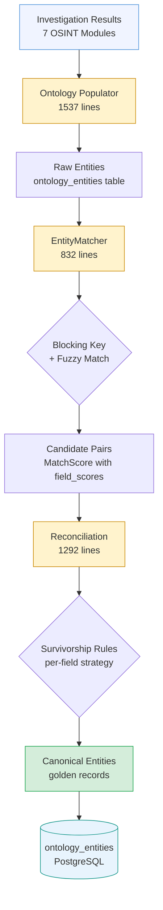

# Atlas — Ontology & Entity Resolution

Atlas uses a versioned ontology schema (YAML-defined) to normalize entities discovered during OSINT investigations. Every data source -- registry APIs, web scrapers, screening providers, LLM extractions -- feeds into a single entity model. The ontology defines what entity types exist, what attributes they carry, what relationships connect them, and how conflicting data from multiple sources gets resolved into authoritative "golden records."

## Schema Versions

The ontology schema has evolved through four major versions:

| Version | Status | Description |
|---|---|---|
| v1 | Deprecated | Initial schema. Basic entity types (Company, Person, Address). |
| v2 | Deprecated | Agent-optimized. Added crew extraction instructions and output format specifications for LangGraph agents. |
| v3.0 | Deprecated | Added Trust entity type, Document tracking, JurisdictionRiskFlags, trust relationship types (Trusteeship, Settlor, Beneficiary, Protector), and enhanced risk categories. |
| **v3.3** | **Active** | Current production schema. Adds `registration_numbers` array, `immutable` and `deprecated` field metadata, `alias_of` field aliasing, and per-field `survivorship` strategy declarations. |

All schemas live in `config/ontology_schema_v*.yaml`. The `SchemaCache` singleton loads the active schema at startup and caches it in-process with a 60-second TTL for database-loaded schemas.

## Entity Types

The v3.3 schema defines nine entity types:

| Entity Type | Icon | Description |
|---|---|---|
| **LegalEntity** | `office` | Companies, organizations, legal entities. Key fields: `legal_name`, `registration_number`, `jurisdiction`, `status`, `incorporation_date`, `lei`, `vat_number`, `trading_names`. |
| **Person** | -- | Individuals connected to entities. Key fields: `full_name`, `first_name`, `last_name`, `date_of_birth`, `nationality`, `is_pep`, `is_sanctioned`, `is_ubo`, `roles`. |
| **Address** | -- | Physical or virtual locations. Key fields: `full_address`, `street_address`, `city`, `postal_code`, `country`, `address_type`, `latitude`, `longitude`. |
| **Trust** | -- | Trust structures (discretionary, fixed, bare, charitable, etc.). Key fields: `trust_name`, `trust_type`, `jurisdiction`, `establishment_date`, `is_regulated`. |
| **Document** | -- | Official documents (filings, certificates, annual returns). Key fields: `title`, `document_type`, `source_url`, `issuing_authority`, `document_number`. |
| **Domain** | -- | Web domains owned by entities. Key fields: `domain_name`, `registrar`, `registration_date`, `expiry_date`, `ssl_valid`. |
| **SanctionsMatch** | -- | Matches against sanctions lists. Key fields: `list_name`, `match_type`, `match_confidence`, `listed_name`, `listed_date`. |
| **PEPExposure** | -- | Politically exposed person matches. Key fields: `pep_level`, `position`, `country`, `source`, `match_confidence`. |
| **AdverseMedia** | -- | Negative news articles. Key fields: `headline`, `source_url`, `source_name`, `published_date`, `sentiment`, `severity`. |

## Relationship Types

Eleven relationship types connect entities:

| Relationship | From | To | Neo4j Type | Description |
|---|---|---|---|---|
| **Directorship** | Person, LegalEntity | LegalEntity | `DIRECTS` | Board membership, corporate directorship |
| **Ownership** | Person, LegalEntity, Trust | LegalEntity | `OWNS` | Shareholding with `percentage`, `is_ubo`, `effective_percentage` |
| **RegisteredAt** | LegalEntity, Trust | Address | `REGISTERED_AT` | Registered office address |
| **Trusteeship** | Person, LegalEntity | Trust | `TRUSTEE_OF` | Trustee role |
| **Settlor** | Person, LegalEntity | Trust | `SETTLOR_OF` | Trust settlor/grantor |
| **Beneficiary** | Person, LegalEntity | Trust | `BENEFICIARY_OF` | Beneficial interest (income, capital, discretionary, remainder, contingent) |
| **Protector** | Person | Trust | `PROTECTOR_OF` | Trust protector with enumerated powers |
| **DocumentsEntity** | Document | Any | `DOCUMENTS` | Evidence link with relevance (primary, supporting, reference) |
| **OwnsDomain** | LegalEntity | Domain | `OWNS_DOMAIN` | Domain ownership |
| **MatchedTo** | LegalEntity, Person | SanctionsMatch, PEPExposure | `MATCHED_TO` | Screening match with confidence score |
| **MentionedIn** | LegalEntity, Person | AdverseMedia | `MENTIONED_IN` | Adverse media mention |

## Database Tables

The ontology is persisted in two PostgreSQL tables:

### `ontology_entities`

| Column | Type | Description |
|---|---|---|
| `id` | UUID | Primary key |
| `external_id` | TEXT | Source-system identifier |
| `entity_type` | TEXT | Schema entity type (e.g., `LegalEntity`, `Person`) |
| `source_provider` | TEXT | Data source (e.g., `northdata`, `spepws`, `cir`) |
| `data` | JSONB | Full entity attributes per schema definition |
| `confidence` | FLOAT | Source confidence score (0.0-1.0) |
| `version` | INTEGER | Entity version (incremented on updates) |
| `deprecated` | BOOLEAN | Soft-delete flag |
| `matching_key_hash` | TEXT | SHA-256 of the normalized matching key |

### `ontology_relationships`

| Column | Type | Description |
|---|---|---|
| `source_entity_id` | UUID | FK to `ontology_entities.id` |
| `target_entity_id` | UUID | FK to `ontology_entities.id` |
| `relationship_type` | TEXT | Schema relationship type (e.g., `Ownership`, `Directorship`) |
| `data` | JSONB | Relationship attributes (percentage, role, dates) |

## Entity Resolution Pipeline

The entity resolution pipeline transforms raw, duplicated investigation outputs into canonical entities. It runs as a five-stage process:

### Stage 1: Ontology Populator (1,537 lines)

The `populator.py` module extracts entities from crew (investigation module) outputs. Each investigation module -- CIR (Company Information & Registration), MEBO (Management & Beneficial Ownership), ROA (Registered Office & Address), SPEPWS (Sanctions, PEP & Watchlist Screening), AMLRR (AML Regulatory Review), DFWO (Digital Footprint & Web OSINT), FRLS (Financial Review & Legal Standing) -- returns structured JSON conforming to the output format specification in the schema.

The populator:
- Parses raw crew output (handles markdown code blocks wrapping JSON)
- Maps source fields to ontology entity attributes using `FieldMapping` and `TransformType` definitions
- Creates `OntologyEntity` instances with `TemporalMetadata` (version, valid_from/valid_until) and `ProvenanceInfo` (source, confidence)
- Enriches entities with source-specific metadata via `source_enrichment.py`
- Normalizes category values (handles strings, lists, enums, dicts)

### Stage 2: EntityMatcher (832 lines)

The `entity_matcher.py` module generates deterministic matching keys for deduplication. Each entity type has its own matching strategy:

**LegalEntity matching:**
1. Strip legal suffixes (GmbH, Ltd, S.A., B.V., Sp. z o.o., etc. -- 25+ patterns)
2. Remove country prefixes from registration numbers (BE, CHE, DE, GB, CZ, RO, etc.)
3. Generate matching key from normalized name + jurisdiction
4. SHA-256 hash the matching key for indexed lookup

**Person matching** (delegated to `PersonMatcher`):
1. Unicode normalization (NFD decomposition) to strip diacritics
2. Sort name parts alphabetically (handles "Jan de Vries" vs "de Vries, Jan")
3. Compare birth year and nationality as secondary signals
4. Configurable confidence thresholds (exact: 1.0, high: 0.85-0.99, medium: 0.6-0.84, low: 0.4-0.59)

The `MatchResult` carries: `matching_key`, `matching_key_hash`, `normalized_name`, and `confidence`.

### Stage 3: PersonMatcher (505 lines)

The `person_matcher.py` handles the inherent difficulty of person name matching. The `PersonCandidate` dataclass normalizes inputs from various field naming conventions (`name`, `full_name`, `fullName`, `first_name`/`last_name`). The `is_same_person()` function applies:

- Diacritic-insensitive comparison (e.g., "Muller" matches "Mueller")
- Word-order-independent matching (alphabetically sorted name parts)
- Birth year corroboration (boosts confidence when available)
- Role/nationality cross-referencing as tiebreakers

### Stage 4: Reconciliation (1,292 lines)

The `reconciliation.py` module (inspired by Palantir's entity resolution patterns, per ADR-010) performs multi-source conflict resolution. It defines:

**Match confidence levels:**
- `EXACT` (1.0) -- identical on all key fields
- `HIGH` (0.85-0.99) -- strong match with minor variations
- `MEDIUM` (0.6-0.84) -- probable match, some differences
- `LOW` (0.4-0.59) -- possible match, needs review
- `NO_MATCH` (< 0.4) -- different entities

**ReconciliationResult** contains: `golden_record` (the merged entity), `provenance` (per-field source tracking), `match_scores` (pairwise module scores), `conflicts` (unresolved disagreements), `merged_count`, and `confidence_score`.

### Stage 5: Address Geocoding

The `address_reconciler.py` uses Google Maps geocoding to add GPS coordinates to addresses, then clusters addresses by Haversine distance for proximity-based deduplication. This enables Neo4j spatial queries for geographic proximity analysis.

## Survivorship Rules

When multiple sources provide conflicting values for the same field, Atlas uses field-level survivorship strategies. These are defined per entity type, per field:

### LegalEntity Field Strategies

| Field | Strategy | Rationale |
|---|---|---|
| `legal_name` | `CANONICAL` | Normalize to canonical form |
| `registration_number` | `MOST_TRUSTED` | Prefer highest-trust source |
| `jurisdiction` | `MOST_SPECIFIC` | Prefer "England & Wales" over "UK" |
| `country_code` | `CANONICAL` | Normalize to ISO 3166-1 alpha-2 |
| `status` | `AGGREGATE` | Combine status from multiple sources |
| `incorporation_date` | `MOST_TRUSTED` | Prefer registry API data |
| `vat_number` | `FIRST_NON_NULL` | First valid value |
| `lei` | `FIRST_NON_NULL` | First valid value |
| `trading_names` | `AGGREGATE` | Combine all known trading names |

### Person Field Strategies

| Field | Strategy | Rationale |
|---|---|---|
| `full_name` | `CANONICAL` | Normalize spacing, capitalization |
| `first_name` / `last_name` | `MOST_COMPLETE` | Prefer non-null, longest value |
| `date_of_birth` | `MOST_TRUSTED` | Prefer screening provider data |
| `nationality` | `MOST_SPECIFIC` | Prefer more specific value |
| `nationalities` | `AGGREGATE` | Combine from all sources |
| `roles` | `AGGREGATE` | Union of all discovered roles |
| `is_pep` / `is_sanctioned` | `AGGREGATE` | TRUE wins (risk signal never suppressed) |

### Provider Trust Hierarchy

The `SurvivorshipResolver` in `survivorship.py` uses schema-driven trust scores to resolve conflicts:

| Provider Tier | Trust Score | Examples |
|---|---|---|
| Registry APIs | 0.95-0.98 | NorthData, official registries |
| Screening providers | 0.95 | SPEPWS (PEP/sanctions screening) |
| Module extraction | 0.85-0.90 | CIR, MEBO, ROA module outputs |
| LLM extraction | 0.75 | Lower trust, needs corroboration |

Protected fields (`is_pep`, `is_sanctioned`) can only be modified by authorized providers (SPEPWS, AMLRR). This ensures screening signals are never accidentally overwritten by lower-trust sources.

## Schema Loader

The `schema_loader.py` module provides runtime access to the ontology schema:

- **`OntologySchema`**: Parsed schema with typed `EntityTypeDefinition` and `RelationshipTypeDefinition` objects
- **`SchemaCache`**: Singleton with in-memory caching. Loads from YAML files or PostgreSQL (with 60-second TTL). Provides `get_entity_types()`, `get_provider_trust()`, `is_initialized()`
- **`AttributeDefinition`**: Per-field metadata including type, required, validation regex, survivorship strategy, immutable flag, deprecated flag, and alias_of
- Schema activation/deprecation via version management in the `ontology_schema` module

## How Trust Relay Differs

Trust Relay adopted the **EntityMatcher** and **SurvivorshipResolver** patterns from Atlas but reimplemented them with significant differences:

| Aspect | Atlas | Trust Relay |
|---|---|---|
| Schema format | YAML files with DB-backed activation | Pydantic models as code |
| Survivorship | 7 strategies (most_recent, most_trusted, most_complete, most_specific, aggregate, canonical, first_non_null) | Trust-weighted scoring with protected fields |
| Entity resolution | Palantir-inspired golden records (ADR-010) | Blocking keys + trust-weighted merge |
| Person matching | PersonMatcher with sorted name parts | Same pattern, simplified |
| RDF support | Full rdflib integration with SPARQL traversal | Not implemented (Neo4j-only graph) |
| Schema versions | 4 YAML versions, DB-activated | Single implicit version |
| Protected fields | Provider authorization (SPEPWS/AMLRR) | Not yet implemented |
| Address geocoding | Google Maps + Haversine clustering | Not yet implemented |
