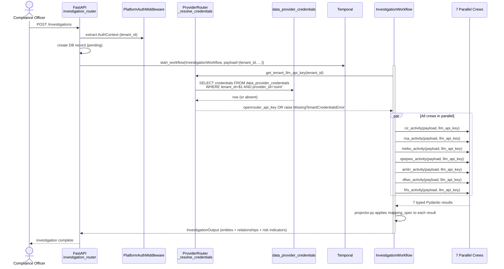

# Atlas — OSINT-as-Plugin

Atlas's OSINT engine is the most complex component in the platform: seven CrewAI-based investigation modules, each backed by an LLM agent with a specific prompt, a curated tool list (MCP servers + HTTP tools), and a typed Pydantic result model. Together they perform parallel research on a target company across registration data, addresses, beneficial owners, financial filings, adverse media, sanctions, and digital footprint.

For most of Atlas's history, the OSINT engine was structurally distinct from data providers — different table-storage, different configuration UX, different runtime path. As of milestone v5.1 (phases 104 → 106.3), OSINT is **just another plugin**. It satisfies the same `plugin.yaml` contract as KVK and NorthData, declares its credentials the same way, resolves them through the same five-branch chain, and lives in the same `plugins/` directory.

This page documents what's different about an async-mode plugin, the file-loader pattern that primes OSINT configuration at boot, and the redeploy-required immutability contract that prevents mid-flight tampering with prompts and agent definitions.

## Why OSINT-as-Plugin

The pre-v5.1 OSINT engine had three structural problems that the plugin contract solves:

1. **Credentials lived in `os.environ`.** `OPENROUTER_API_KEY`, `BRIGHTDATA_TOKEN`, and the four MCP keys were process-scoped environment variables. A multi-tenant deployment had no clean way to give each tenant their own LLM gateway billing.
2. **Prompts and agent configs were in PostgreSQL.** Every investigation read `agent_prompts` and `mcp_servers` rows at runtime. Hot-editing prompts via the Settings UI was possible — and exactly that flexibility caused incidents where a partially-edited prompt or a mid-investigation MCP swap produced inconsistent outputs across investigations.
3. **No shared contract with HTTP plugins.** The Compliance Studio Schema Designer couldn't show OSINT-discovered fields the same way it showed KVK fields. The Settings UI had two parallel "configure a data source" surfaces.

The cutover ran in three sub-phases:

| Phase | What it shipped |
|---|---|
| **104** | OSINT plugin skeleton — `plugins/osint/{plugin.yaml, mapping_spec.yaml, README.md}` and a 40-file snapshot of the live database content into `plugins/osint/{prompts,agents,tools}/` with a one-shot dump tool |
| **105** | OSINT populator declarative cutover — entity extraction routes through a declarative projector instead of bespoke Python; mapping_spec covers all seven crew types with byte-equality verification |
| **105.1** | Shadow plumbing deletion — once parity was proven, the legacy DB-driven path was removed |
| **106** | OSINT plugin immutability + CI tests — the three-layer harness now runs against OSINT, and a CI version-bump gate blocks PRs that change plugin content without bumping `plugin.yaml`'s version |
| **106.1** | OSINT runtime credentials per-tenant via `data_provider_credentials` |
| **106.2** | OpenRouter LLM credentials platform-wide per-tenant migration (eight LLM-construction call sites) |
| **106.3** | Per-tenant provider health probes — backend cutover |

Each sub-phase was independently revertable. The platform was working at every commit boundary.

## The OSINT `plugin.yaml`

```yaml
plugin_schema_version: "1"
plugin: "osint"
version: "0.2.0"
display_name: "OSINT (Open-Source Intelligence Investigations)"
description: "Async investigation provider — 7 crew modules powered by OpenRouter LLMs and MCP tools, executed via Temporal."
provider_type: "investigation"
allow_platform_fallback: false   # Phase 106.1 — secure-by-default

connection:
  base_url: "async://temporal/InvestigationWorkflow"   # SENTINEL — not a real URL
  rate_limits:
    requests_per_minute: 1                             # SENTINEL — async, upstream-rate-limited

credentials:
  schema:
    $schema: "http://json-schema.org/draft-07/schema#"
    type: object
    required: [openrouter_api_key]
    properties:
      openrouter_api_key:
        type: string
        title: "OpenRouter API Key"
        description: "LLM access for investigation modules. Mandatory."
        format: "password"
        minLength: 8
      mcp_brightdata_token:    { type: string, format: "password", description: "Optional. Required only if Brightdata MCP enabled." }
      mcp_exa_api_key:         { type: string, format: "password", description: "Optional. Required only if Exa MCP enabled." }
      mcp_tavily_api_key:      { type: string, format: "password", description: "Optional. Required only if Tavily MCP enabled." }
      mcp_google_maps_token:   { type: string, format: "password", description: "Optional. Required only if Google Maps MCP enabled." }

capabilities:
  jurisdictions: ["XX"]                                # SENTINEL — jurisdiction-agnostic
  entity_types: ["LegalEntity", "Person", "Address"]
  endpoints: ["cir", "roa", "mebo", "spepws", "amlrr", "dfwo", "frls"]   # the 7 module names

execution:
  mode: "async"
  workflow_name: "InvestigationWorkflow"               # verbatim Temporal class name
```

Three deliberate sentinels are documented in the file itself:

| Sentinel | Field | Why |
|---|---|---|
| `async://temporal/InvestigationWorkflow` | `connection.base_url` | The PluginSpec contract requires the field; this non-routable URL is self-documenting. Readers must check `execution.mode` before consulting `connection.*` |
| `requests_per_minute: 1` | `connection.rate_limits` | Pydantic enforces `gt=0`; async plugins are rate-limited by upstream LLMs and MCP servers, not by their own HTTP layer. Lowest valid positive int |
| `["XX"]` | `capabilities.jurisdictions` | OSINT investigates anywhere; `"XX"` is the unassigned ISO 3166-1 alpha-2 code reserved for "no specific jurisdiction" |

## Plugin Layout

`plugins/osint/` is significantly larger than `plugins/kvk/` because the plugin owns prompts, agent configs, and MCP tool definitions in addition to the standard contract files:

```
plugins/osint/
  plugin.yaml                    # the contract
  mapping_spec.yaml              # one entity_mappings block per crew type
  projector.py                   # declarative crew-output → ontology projector (457 lines)
  _serialize.py                  # internal helpers for projector

  prompts/                       # Jinja2 prompt templates per crew agent
    cir/system.j2
    cir/user.j2
    roa/system.j2
    …                            # 7 modules × {system, user} = 14 templates

  agents/                        # CrewAI agent + crew configs
    cir.yaml                     # role, goal, backstory, tools whitelist
    roa.yaml
    …                            # 7 modules

  tools/                         # MCP server registrations
    brightdata.yaml              # MCP — search-the-web class
    exa.yaml                     # MCP — semantic search
    tavily.yaml                  # MCP — web search
    google_maps.yaml             # MCP — places & geocoding
    vat_vies.yaml                # HTTP — EU VAT validation
    digital_footprint.yaml       # HTTP — composite footprint

  tests/                         # one line: run_plugin_tests(__file__)
  README.md                      # operator-facing — how to edit prompts, when to bump version
  __init__.py                    # @register_provider("osint")
```

The 40-file snapshot of `prompts/`, `agents/`, and `tools/` was performed in Phase 104-02 by a one-shot dump tool that read the live DB and wrote the canonical files. Every file has a version line in `plugin.yaml`'s ROOT `version:` field; changes to any file require a version bump (CI-enforced).

## The File Loader Pattern

A pre-v5.1 OSINT investigation issued database queries at every step — load the agent config, load the system prompt, load the MCP server list. This was the source of the "edit a prompt mid-flight" foot-gun.

Phase 106 introduced `src/database/osint_file_loader.py` (315 lines), a plain-dict cache primed at:

- **FastAPI lifespan startup** (`app.startup` event) — for the API process.
- **Temporal worker startup** — for the worker process.

The cache is read-only. There is no API to mutate it. Once primed, the in-process state is exactly the file state on disk. To change a prompt, an operator must:

1. Edit the file in `plugins/osint/prompts/<crew>/system.j2`.
2. Bump `plugin.yaml`'s `version:`.
3. Open a PR. The CI version-bump gate enforces (2) — the PR fails if files in `prompts/`, `agents/`, `tools/`, or `mapping_spec.yaml` change without a `plugin.yaml` ROOT `version:` bump.
4. Deploy. The new prompt is in effect at the next process restart.

This is the **redeploy-required immutability** contract. It trades the convenience of hot prompt edits for the reproducibility property: every investigation run by a given deployment is run against byte-identical agent configuration.

The `AgentPromptRepository` and `MCPServerRepository` route OSINT crew_types to the file-loader; non-OSINT continues to hit the DB. The boundary is at the repository, not at the call sites — so callers don't need to know that OSINT is special.

## The CI Version-Bump Gate

The gate is implemented as `scripts/check_osint_plugin_version_bump.py` (extracted to a separate script so it lives in column-0 source — Phase 106's review caught a Python-heredoc-indentation bug in the inline version). The job is gated to `if: github.event_name == 'pull_request'` so push events don't trip it on `base_ref`-empty.

The check uses YAML-aware parsing (`yaml.safe_load` of `plugin.yaml` ROOT-key compare), not a regex. A regex against `^\+version:` would be fooled by a context-only diff line that happens to start with `+version:`; the YAML parser cannot be.

## The Async Execution Path



Three properties of this flow are not shared by sync-mode plugins:

1. **Credential resolution happens inside the workflow, not at the request boundary.** Sync-mode KVK resolves at API request time. OSINT resolves at workflow start time and threads the key through the activity payload, because the activity may run on a different worker than the API.
2. **Activity payloads carry the LLM key as a string.** Re-resolving inside each activity would mean seven DB+KMS round-trips per investigation. The workflow resolves once at start and threads the resolved key through. (A short-TTL cache is the deferred optimization that would let us re-resolve safely; today, threading is cheaper.)
3. **The `projector.py` runs after all crews complete.** The legacy path had each crew's output mapped inline; the declarative projector runs as a single post-step against `mapping_spec.yaml`. This is what made the byte-equality cutover (Phase 105) possible — the projector is comparable to the legacy mappers fixture-by-fixture.

## The Seven Modules

Each crew is one Temporal activity backed by one CrewAI agent backed by one LLM call (or a small loop). The crew names are the same as `plugin.yaml`'s `capabilities.endpoints`:

| Crew | Full name | What it investigates |
|---|---|---|
| **CIR** | Corporate Identity & Registration | Official registration, legal name, incorporation date, jurisdiction, status, directors-from-registry |
| **ROA** | Registered & Operational Addresses | Registered office vs. operational locations, virtual offices, multi-jurisdictional presence |
| **MEBO** | Management, Employees & Beneficial Owners | Directors, officers, beneficial owners, ownership chains, nominee arrangements |
| **FRLS** | Financial, Regulatory & Licensing Status | Financial filings, regulatory licenses, credit ratings, compliance history |
| **AMLRR** | Adverse Media, Litigation & Reputational Risk | News media screening, court records, fraud allegations, regulatory actions |
| **SPEPWS** | Sanctions, PEP & Watchlist Screening | Sanctions lists (OFAC, EU, UN), Politically Exposed Persons databases |
| **DFWO** | Digital Footprint & Website Ownership | WHOIS, domain registration history, SSL certificates, social media |

A "Summary" post-processing step aggregates the seven outputs into a two-stage report (extraction with a fast/cheap model, narrative synthesis with a quality model). It is not a crew — it has no agent and no MCP tools — and it is not exposed as a `plugin.yaml` endpoint.

## The MCP Tool Boundary

Six MCP servers and HTTP tools are referenced by the agent configs; their connection details live in `plugins/osint/tools/<name>.yaml`:

| Tool | Type | Used by |
|---|---|---|
| **Brightdata** | MCP | Web search, SERP scraping (DFWO, AMLRR) |
| **Exa** | MCP | Semantic search (DFWO, AMLRR) |
| **Tavily** | MCP | Web search (general fallback) |
| **Google Maps** | MCP | Places & geocoding (ROA) |
| **VAT VIES** | HTTP | EU VAT validation (CIR, FRLS) |
| **Digital Footprint** | HTTP | Composite WHOIS/SSL/Social (DFWO) |

The MCP client layer is `ResilientMCPClient` — per-server circuit breakers (PyBreaker, 5-failure threshold, 30s reset) plus exponential-backoff retry (Tenacity, 1s base, 60s cap, 50% jitter). Tool availability is tracked on `ModuleOutput.tool_availability`, so a partial-tool-outage investigation produces a structured "this dimension was researched with reduced confidence" rather than a hard failure.

The MCP credentials (Brightdata token, Exa API key, Tavily API key, Google Maps token) are *optional* in `plugin.yaml` — required only if the corresponding MCP server is enabled for a tenant. A tenant that has not configured Tavily simply has Tavily-backed tools unavailable; investigations continue using the others.

## Verification Surfaces

- **`tests/test_phase_104_osint_snapshot.py`** — the 40-file snapshot integrity test.
- **`tests/test_osint_immutability.py`** — three-layer proof: route-table introspection, 16-case parametrized HTTP smoke test, authenticated-path test via `dependency_overrides`.
- **`tests/test_phase_106_1_no_osint_env_vars.py`** — fail-closed against `OPENROUTER_API_KEY` regressions in the OSINT path.
- **`plugins/osint/tests/test_coverage.py`** — the third (coverage) layer of the standard plugin harness, with 5 documented `coverage_exempt` entries.
- **`scripts/check_osint_plugin_version_bump.py` + GitHub Actions `osint-plugin-version-bump-required` job** — the immutability gate.
- **`tests/test_osint_runtime_cutover.py`** — proves the file-loader is the only source of OSINT runtime state.

## Reading Guide

- **[Plugin Architecture](./plugin-architecture)** — the contract OSINT satisfies.
- **[Credential Vault](./credential-vault)** — how `openrouter_api_key` resolves through the five-branch chain.
- **[Investigation Pipeline](./investigation-pipeline)** — what happens inside each of the seven crews.
- **[Ontology System](./ontology-system)** — what `projector.py` projects crew outputs onto.
