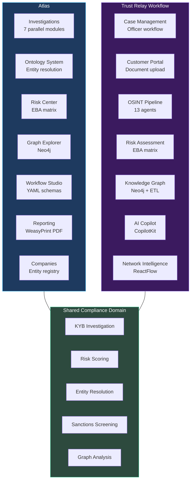
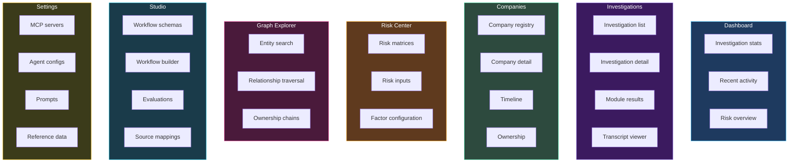

# Atlas — Overview

Atlas is a KYC/KYB/AML compliance operations platform developed independently by co-founder Valentin. It tackles the same compliance domain as Trust Relay Workflow but takes a different architectural path, using LangChain/LangGraph for AI orchestration, Blueprint.js for the UI, Flyway for migrations, and OpenRouter as an LLM gateway. Both systems are under active development within the same organization.

This documentation exists so our team understands how the parallel system works, what it does well, and where the two systems converge or diverge. It is written from Trust Relay's perspective but aims to be objective and educational.

## What Atlas Does

Atlas automates KYB/KYC investigations by deploying 7 specialized AI agents (called "modules") that run in parallel against a target company. Each module uses LLM-driven research with MCP-connected tools (web search, registry APIs, sanctions databases) to produce structured findings. After all modules complete, Atlas reconciles discovered entities, scores risk using a configurable EBA-aligned risk matrix, syncs the knowledge graph to Neo4j, and generates a compliance report.

Beyond investigations, Atlas provides a company registry, a configurable risk center, a Neo4j-backed graph explorer, a visual workflow studio (drag-and-drop workflow builder with Temporal execution), and an ontology system for entity management with field-level provenance tracking.

## Who Built It

Valentin, co-founder, built Atlas as a standalone product. The codebase lives at `trustrelay-atlas/` and runs on its own Docker Compose stack. Development started before the Trust Relay Workflow module and has accumulated a large feature surface including workflow schema compilation, ontology-driven entity resolution, mutation queues with conflict detection, and LLM observability via Langfuse.

## The 8 Investigation Modules

Atlas decomposes a KYB investigation into 7 parallel research modules plus a Summary synthesis step. Each module is an AI agent backed by a `ModuleConfig` dataclass that defines its prompts, result model, and dependencies. All 7 run concurrently as Temporal activities -- there are no inter-module dependencies.

### Module Details

| Module | Full Name | What It Investigates |
|--------|-----------|---------------------|
| **CIR** | Corporate Identity Registration | Official company registration data -- legal name, incorporation date, registration number, jurisdiction, company type, current status. Discovers directors and shareholders from registry sources. |
| **ROA** | Registered & Operational Addresses | Registered office address vs. actual operational locations. Flags virtual offices, mismatches between registered and operational addresses, multi-jurisdictional presence. |
| **MEBO** | Management, Employees & Beneficial Owners | Directors, officers, beneficial owners, ownership structures. Identifies complex ownership chains, nominee arrangements, and cross-directorship networks. |
| **FRLS** | Financial, Regulatory & Licensing Status | Financial filings, regulatory licenses, credit ratings, compliance history. Checks whether the company holds required licenses for its stated activities. |
| **AMLRR** | Adverse Media, Litigation & Reputational Risk | News media screening, court records, litigation history. Scans for negative press, fraud allegations, regulatory actions, and reputational concerns. |
| **SPEPWS** | Sanctions, PEP & Watchlist Screening | Sanctions lists (OFAC, EU, UN), Politically Exposed Persons databases, and other watchlists. Screens the company and its officers/owners against global sanctions and PEP databases. |
| **DFWO** | Digital Footprint & Website Ownership | Website WHOIS data, domain registration history, SSL certificates, social media presence. Verifies that digital presence matches claimed business identity. |
| **Summary** | Summary & Report Synthesis | Not a separate research module -- this is the post-processing step that aggregates findings from all 7 modules, generates a two-stage report (structured extraction then narrative synthesis), and produces the final compliance assessment with WeasyPrint PDF export. |

Each module produces a typed Pydantic result model (e.g., `CIRModuleResult`, `ROAModuleResult`) containing structured findings, risk indicators with severity levels, data quality scores, and source attribution. Risk indicators use a unified `RiskIndicator` model with category, severity, title, description, evidence, and linked entity fields.

## Key Capabilities

### Investigation Automation
- **Temporal-powered durability** -- each investigation runs as a Temporal workflow with retry policies, cancellation support, and persistent state
- **Parallel module execution** -- all 7 modules execute simultaneously, reducing total investigation time
- **MCP tool integration** -- modules use MCP servers for web search, registry lookups, sanctions screening, and VAT validation
- **Enrichment pipeline** -- pre-investigation enrichment from data providers (NorthData, etc.) provides context to modules
- **Ontology-validated output** -- LLM outputs are validated against an active ontology schema with feedback loops for correction

### Entity Management
- **Ontology-driven entities** -- a versioned ontology schema defines entity types, attributes, and relationships
- **Entity reconciliation** -- post-investigation deduplication merges entities discovered by different modules
- **Mutation queue** -- field-level updates flow through a mutation pipeline with provenance tracking, merge strategy resolution, and conflict detection
- **Survivorship rules** -- configurable trust-weighted field resolution determines which source wins when values conflict
- **Field-level lineage** -- every entity field tracks its source, confidence, and mutation history

### Risk Scoring
- **EBA-aligned 5-dimension matrix** -- deterministic scorer with per-factor evaluation, SHA-256 audit hashes, and multiple aggregation methods
- **Configurable risk rules** -- risk factors are defined per module with weighted scoring
- **Risk indicators with evidence** -- every risk finding links back to the evidence that generated it
- **Reference data driven** -- country risk, industry risk, and sanctions lists are loaded from a versioned reference data registry

### Graph Exploration
- **Neo4j knowledge graph** -- investigation entities are synced to Neo4j as a detached child workflow
- **Cypher-powered exploration** -- graph router exposes entity traversal, ownership chains, and relationship queries
- **Graph projections** -- pre-built graph projections for ownership analysis and network visualization

### Workflow Studio
- **Visual workflow builder** -- drag-and-drop interface for defining compliance workflows
- **Declarative YAML schemas** -- workflows are defined as YAML with phases, gates, and routing rules
- **Schema compiler** -- YAML schemas are compiled to execution plans with parallel group detection
- **Dynamic workflow engine** -- a generic Temporal workflow interprets compiled schemas, supporting investigation phases, review gates, rule evaluation, and portal data collection

### Reporting
- **Two-stage report generation** -- Stage 1 extracts structured findings with a fast model, Stage 2 synthesizes narrative prose with a quality model
- **WeasyPrint PDF export** -- HTML-to-PDF rendering for compliance reports
- **Report quality scoring** -- LLM-as-judge evaluates report quality via Langfuse observability

## How Atlas Relates to Trust Relay

Atlas and Trust Relay Workflow are parallel implementations solving the same compliance domain. They share the same organization but were developed independently with different technology choices.

| Aspect | Atlas | Trust Relay Workflow |
|--------|-------|---------------------|
| AI Framework | LangChain/LangGraph | PydanticAI |
| Frontend | React + Blueprint.js + Vite | Next.js + shadcn/ui |
| Migrations | Flyway (SQL-based) | Alembic (Python-based) |
| LLM Gateway | OpenRouter | Direct API calls |
| Observability | Langfuse (self-hosted) | Planned |
| Auth | Keycloak (implemented) | Keycloak (deferred for PoC) |
| Workflow Engine | Temporal | Temporal |
| Database | PostgreSQL + Neo4j | PostgreSQL + Neo4j |
| Document Processing | None (investigation-focused) | IBM Docling + MinIO |
| Customer Portal | Workflow Studio portal phases | Branded portal with token auth |

Trust Relay has adopted 8 architectural patterns from Atlas (reference data registry, quality scoring, model tiers, EBA risk matrix, domain events, entity matching, survivorship resolution, workflow schema compilation) -- see [Atlas Adoption](/docs/architecture/atlas-adoption) for details. The adoption principle is "adopt the pattern, not the code" -- every pattern was reimplemented in Trust Relay's native tech stack.

## Product Areas

Atlas organizes its frontend into 7 major areas, each corresponding to a section of the left navigation.

## Reading Guide

- **[Atlas -- System Architecture](./architecture)** -- deep dive into the layered architecture, domain organization, deployment topology, and key architectural decisions
- **[Atlas Adoption](/docs/architecture/atlas-adoption)** -- the 8 patterns Trust Relay adopted from Atlas, with reimplementation details
