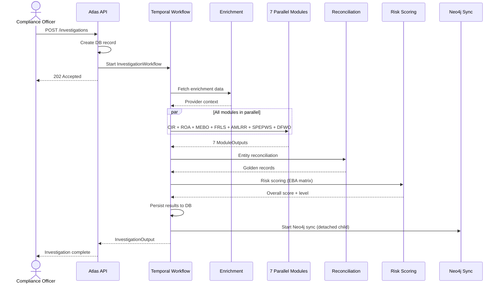
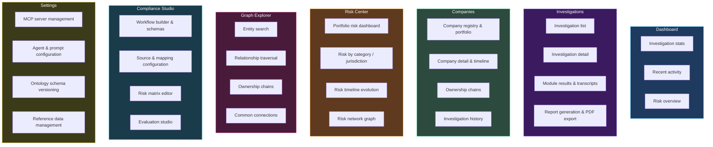

# Atlas — Product Overview

Atlas is an AI-powered KYC/KYB/AML compliance investigation platform. It automates due diligence by deploying specialized AI agents against target companies, reconciling discovered entities into a unified knowledge graph, scoring risk through a configurable EBA-aligned matrix, and presenting findings through an analyst-focused dashboard.

## Core Capabilities

Atlas provides six pillars of compliance automation:

1. **Parallel OSINT Investigation** -- 7 specialized AI modules execute simultaneously via Temporal, each researching a different compliance dimension. A full investigation completes in the time of its slowest module, not the sum of all modules.

2. **Ontology-Driven Entity Resolution** -- A versioned YAML schema defines entity types, attributes, relationships, and survivorship rules. Entities discovered by multiple modules are deduplicated through blocking-key matching, fuzzy scoring, and trust-weighted field resolution into canonical "golden records."

3. **EBA 5-Dimension Risk Matrix** -- Deterministic risk scoring across Customer, Geographic, Product/Service, Delivery Channel, and Transaction dimensions. Every evaluation produces four SHA-256 audit hashes for independent verification and tamper detection.

4. **Declarative Workflow Engine** -- Compliance workflows are defined as YAML schemas, compiled into parallel execution plans with topological sorting, and interpreted by a generic Temporal workflow. Supports investigation phases, human review gates with SLA escalation, automated rule evaluation, customer portal data collection, and post-decision actions.

5. **Knowledge Graph** -- Investigation entities are synced to Neo4j as a detached child workflow, enabling relationship traversal, ownership chain analysis, risk propagation across entity networks, and Cypher-powered exploration.

6. **Company Portfolio Management** -- A persistent company registry tracks all investigated entities across time, with investigation history, risk score evolution, and entity freshness monitoring.

## The 8 Investigation Modules

Atlas decomposes a KYB investigation into 7 parallel research modules plus a Summary synthesis step. Each module is an AI agent backed by a `ModuleConfig` dataclass that defines its prompts, result model, and dependencies. All 7 run concurrently as Temporal activities with no inter-module dependencies.

```mermaid
flowchart LR
    subgraph Input["Investigation Request"]
        REQ["Company Name<br/>Registration Number<br/>Country Code<br/>Website"]
    end

    subgraph Enrichment["Pre-Enrichment"]
        ENR["Data Provider<br/>Context Fetch"]
    end

    subgraph Modules["7 Parallel Modules"]
        direction TB
        CIR["CIR<br/>Corporate Identity<br/>& Registration"]
        ROA["ROA<br/>Registered &<br/>Operational Addresses"]
        MEBO["MEBO<br/>Management, Employees<br/>& Beneficial Owners"]
        FRLS["FRLS<br/>Financial, Regulatory<br/>& Licensing Status"]
        AMLRR["AMLRR<br/>Adverse Media,<br/>Litigation & Rep Risk"]
        SPEPWS["SPEPWS<br/>Sanctions, PEP &<br/>Watchlist Screening"]
        DFWO["DFWO<br/>Digital Footprint &<br/>Website Ownership"]
    end

    subgraph PostProcess["Post-Processing"]
        RECON["Entity Reconciliation"]
        RISK["Risk Scoring"]
        SYNC["Neo4j Sync"]
        SUM["Summary &<br/>Report Generation"]
    end

    REQ --> ENR --> Modules
    Modules --> RECON --> RISK --> SYNC --> SUM

    style Input fill:#1e3a5f,stroke:#38bdf8,color:#fff
    style Enrichment fill:#2d4a3e,stroke:#34d399,color:#fff
    style Modules fill:#3b1a5f,stroke:#a78bfa,color:#fff
    style PostProcess fill:#5f3a1e,stroke:#f59e0b,color:#fff
```

### Module Details

| Module | Full Name | What It Investigates |
|--------|-----------|---------------------|
| **CIR** | Corporate Identity & Registration | Official company registration data -- legal name, incorporation date, registration number, jurisdiction, company type, current status. Discovers directors and shareholders from registry sources. |
| **ROA** | Registered & Operational Addresses | Registered office address vs. actual operational locations. Flags virtual offices, mismatches between registered and operational addresses, multi-jurisdictional presence. |
| **MEBO** | Management, Employees & Beneficial Owners | Directors, officers, beneficial owners, ownership structures. Identifies complex ownership chains, nominee arrangements, and cross-directorship networks. |
| **FRLS** | Financial, Regulatory & Licensing Status | Financial filings, regulatory licenses, credit ratings, compliance history. Checks whether the company holds required licenses for its stated activities. |
| **AMLRR** | Adverse Media, Litigation & Reputational Risk | News media screening, court records, litigation history. Scans for negative press, fraud allegations, regulatory actions, and reputational concerns. |
| **SPEPWS** | Sanctions, PEP & Watchlist Screening | Sanctions lists (OFAC, EU, UN), Politically Exposed Persons databases, and other watchlists. Screens the company and its officers/owners against global sanctions and PEP databases. |
| **DFWO** | Digital Footprint & Website Ownership | Website WHOIS data, domain registration history, SSL certificates, social media presence. Verifies that digital presence matches claimed business identity. |
| **Summary** | Summary & Report Synthesis | Not a separate research module. This is the post-processing step that aggregates findings from all 7 modules, generates a two-stage report (structured extraction then narrative synthesis), and produces the final compliance assessment with WeasyPrint PDF export. |

Each module produces a typed Pydantic result model (e.g., `CIRModuleResult`, `ROAModuleResult`) containing structured findings, risk indicators with severity levels, data quality scores, and source attribution. Risk indicators use a unified `RiskIndicator` model with category, severity, title, description, evidence, and linked entity fields.

## Investigation Lifecycle

### Key Design Decisions

1. **All modules run in parallel** -- no inter-module dependencies. Each module discovers entities independently, and reconciliation merges duplicates after all complete.
2. **Enrichment is optional** -- if a registration number is provided, Atlas pre-fetches data from providers (NorthData, etc.) to seed module context. Otherwise, modules discover independently.
3. **Ontology validation with feedback loops** -- LLM output is validated against the active schema. If validation fails, the agent receives feedback and retries.
4. **Neo4j sync is non-blocking** -- graph sync runs as a detached child workflow with `ParentClosePolicy.ABANDON`, so the investigation completes immediately regardless of graph sync status.

## Pre-Enrichment Pipeline

When an investigation includes a registration number and country code, Atlas runs a pre-enrichment step before launching modules. This fetches structured company data from data providers (NorthData, official registries) and distributes the enriched context to all modules. Pre-enrichment reduces redundant external lookups across modules and provides higher-quality seed data for LLM agents.

## Post-Processing Pipeline

After all 7 modules complete, four processing stages transform raw agent outputs into structured, deduplicated, risk-scored knowledge:

1. **Ontology Population** -- The `EntityPopulator` extracts typed entities (Company, Person, Address, Domain, SanctionsMatch, PEPExposure, AdverseMedia) from module outputs and persists them to the ontology tables with full provenance metadata.

2. **Entity Reconciliation** -- The `EntityMatcher` generates blocking keys for efficient candidate generation, then applies fuzzy scoring with configurable thresholds. The `SurvivorshipResolver` merges duplicates using trust-weighted field resolution into canonical golden records.

3. **Risk Scoring** -- Two-layer scoring: rule-based aggregation from module risk levels and indicators, plus structured EBA matrix evaluation across 5 dimensions with per-factor weights and SHA-256 audit hashes.

4. **Neo4j Graph Sync** -- All entities and relationships are synced to the knowledge graph as a detached child workflow, enabling relationship traversal, ownership chain analysis, and cross-investigation entity linking.

## Product Areas

Atlas organizes its interface into 7 major areas, each corresponding to a section of the left navigation.

### Dashboard

The landing page provides operational overview: active investigation count and status breakdown, recent investigation activity feed, portfolio risk statistics, and a quick-start investigation form.

### Investigations

The investigation domain covers the full lifecycle: creating investigations with company details and module selection, monitoring progress, reviewing per-module results with LLM transcripts, exploring discovered entities against the ontology, and generating PDF compliance reports.

### Companies

The company registry maintains a persistent portfolio of all investigated entities. Each company has a detail page with timeline, ownership chain visualization, entity graph, and historical investigation results. Jurisdiction badges, risk level tags, and data freshness indicators surface key information at the list level.

### Risk Center

A multi-view risk analysis workspace with five perspectives: portfolio-level risk distribution (pie/spider charts), category-level breakdown (bar charts), jurisdiction-level aggregation, risk score evolution timeline, and entity-level risk network graph showing risk propagation through ownership chains.

### Graph Explorer

Entity relationship visualization powered by Cytoscape.js with three layout engines (force-directed, hierarchical, compound). Supports entity search, ownership chain drill-down, shared address/director discovery, common connections between entities, and risk network overlay.

### Compliance Studio

A unified workspace for compliance configuration:

| Tab | Purpose |
|-----|---------|
| **Sources** | Data provider configuration and testing |
| **Mappings** | Source-to-ontology field mapping designer |
| **Matrices** | Risk matrix schema CRUD with versioning |
| **Risk Inputs** | Configure risk scoring input fields |
| **Evaluations** | Run and review risk evaluations |
| **Workflows** | Workflow schema management, visual builder, and AI-powered schema generation |

### Settings

Platform configuration covering LLM providers and model selection, MCP server management with health checks, agent prompt templates, per-agent tool and model overrides, ontology schema versioning, business segments, data provider credentials, reference datasets, and pipeline configuration.

## Version History

Atlas has shipped 17 production milestones across **110+ development phases** with **126+ Flyway database migrations**. The current milestone (v5.1) is in progress at 84% complete (38 of 45 phases as of 2026-05-09).

| Version | Milestone | Shipped | Key Capabilities |
|---|---|---|---|
| **v1.0** | Foundation | 2026-03-20 | FastAPI backend, 7 OSINT modules, Temporal orchestration, basic investigation pipeline |
| **v1.1** | Functional Completeness | 2026-03-25 | Stable async runtime (anyio), reliable Neo4j sync, MCP circuit breakers, two-stage reports, Langfuse |
| **v2.0** | Workflow Ontology Engine | 2026-03-26 | Declarative YAML workflow schemas → Temporal execution; 5 phase types; review gates with SLA escalation; AI Workflow Builder |
| **v2.1** | Analyst Interaction Layer | 2026-03-27 | Schema field metadata, role-based task inbox, document service (MinIO), portal draft auto-save |
| **v2.2** | Builder Wizard UI | 2026-03-27 | Three-panel WorkflowBuilder, CodeMirror YAML editor, AI Schema Wizard, drag-and-drop reordering |
| **v3.0** | Reference Data Registry | 2026-03-28 | Tenant-aware versioned datasets (FATF, PEP, sanctions, UBO thresholds), publish-time snapshot freezing |
| **v3.1** | EBA Risk Matrix Engine | 2026-03-29 | Deterministic 5-dimension scorer with SHA-256 hash chain, MatrixVersionManager, 19-endpoint API |
| **v3.2** | Risk Matrix UI & Temporal Batch | 2026-03-29 | Full matrix editor, evaluation dashboard, BatchReEvaluationWorkflow, dimension drill-down |
| **v3.3** | Data Provider Plugin Architecture (preview) | 2026-03-30 | First-pass plugin scaffolding, KVK provider, authority-tier model, Health Check Workflow |
| **v3.4** | Compliance Studio UI | 2026-03-31 | Schema Mapping Designer, three-column field mapping, sources & versions UI |
| **v4.1** | Source Integration | 2026-03-31 | Provider mapping_spec → Schema Designer direct integration; unified Data Sources page |
| **v4.2** | Studio URL Navigation | 2026-04-01 | All 5 Studio pages migrated to URL search params; deep-linking & refresh persistence |
| **v4.3** | Port-and-Wire Schema Designer | 2026-04-02 | SVG Bezier wire interaction model replacing @dnd-kit; 8-state PortDot |
| **v4.4** | Evaluation Rework | 2026-04-04 | Live data preview in Schema Designer; Matrix Evaluation portfolio scoring; comparison with delta tints |
| **v4.5** | Risk Matrix Scoring Pipeline | 2026-04-06 | ADR-019 scoring engine (REFERENCE_LOOKUP / BOOLEAN / THRESHOLD_RANGES); rule-based escalation overrides |
| **v4.6** | Dynamic Risk Categories | 2026-04-08 | User-definable risk category types; generic list + scored-table editors; ADR-021 data shapes |
| **v5.0** | Multi-Tenancy Architecture | 2026-04-20 | `tenants` + `tenant_domains` tables; RLS on ~46 tables; `atlas_app` non-owner role; FORCE ROW LEVEL SECURITY; tenant-scoped sessions; payload-level Temporal isolation; **editorial-grade reports** |
| **v5.1** | Data Provider Plugin Architecture | in progress (84%) | Formal `plugin.yaml` contract; declarative `mapping_spec.yaml`; per-tenant credentials with AES-256-GCM + HKDF subkeys; OSINT-as-plugin with redeploy-required immutability; entity claims (claim-plus-rank); per-tenant LLM keys; per-tenant health probes |

**Current focus (v5.1):** Phase 110.2 — one-shot backfill of legacy entity data into the new `entity_claims` table with KVK + NorthData integration tests and operator runbook.

**Newly documented architectural pillars (this revision):**

- **[Multi-Tenancy & Row-Level Security](./multi-tenancy)** — four-layer isolation (Keycloak realm → request-scoped GUC → PostgreSQL FORCE RLS → Temporal payload isolation).
- **[Plugin Architecture](./plugin-architecture)** — `plugin.yaml` + `mapping_spec.yaml` contract, three-layer test harness, sync vs. async execution modes.
- **[Credential Vault & Resolution](./credential-vault)** — per-tenant AES-256-GCM credentials with HKDF subkeys; five-branch resolver chain.
- **[OSINT-as-Plugin](./osint-plugin)** — async-mode plugin with redeploy-required immutability and per-tenant LLM keys.
- **[Entity Claims & Claim-Plus-Rank](./entity-claims)** — Wikidata-style multiplicity model preserving every provider's view of every field.

## Technology Stack

| Layer | Technology |
|---|---|
| **Backend** | Python 3.14, FastAPI, Pydantic v2, asyncpg |
| **AI Framework** | LangChain 1.2 + LangGraph 1.0; CrewAI for multi-agent OSINT crews |
| **Workflow Engine** | Temporal (2 workers: investigation + workflow engine) |
| **Database** | PostgreSQL 15 with FORCE Row-Level Security and unprivileged `atlas_app` role; Neo4j 5.18; Redis 7 |
| **Object Storage** | MinIO (Atlas docs + Langfuse events) |
| **LLM Gateway** | OpenRouter — per-tenant API keys resolved through the Phase 103 chain |
| **Frontend** | React 18, Blueprint.js v5, Vite, TypeScript |
| **State Management** | Zustand + TanStack React Query v5 |
| **Graph Visualization** | Cytoscape.js (3 layout engines) |
| **Authentication** | Keycloak 26 (JWT/OIDC, RBAC; one realm per tenant) |
| **Observability** | Langfuse 3 (self-hosted with ClickHouse) |
| **PDF Generation** | WeasyPrint with Source Serif 4 + Inter Tight, 11 Jinja partials, 801-line theme CSS |
| **Cryptography** | AES-256-GCM for credentials at rest; HKDF-SHA256 for per-tenant subkey derivation |
| **Migrations** | Flyway 10 (126+ SQL migrations through V126 `entity_claims`) |
| **Plugin Substrate** | `plugins/<name>/` directory layout; `plugin.yaml` + `mapping_spec.yaml`; three-layer pytest harness |

## Reading Guide

### Foundations

- **[System Architecture](./architecture)** — layered architecture, domain organization, deployment topology, request flow, and architectural decisions.
- **[Technology Stack](./tech-stack)** — complete dependency inventory across backend, frontend, and infrastructure.
- **[Infrastructure & Deployment](./infrastructure)** — Docker Compose stack, container inventory, initialization chain, security posture.

### v5.0 — Multi-Tenancy

- **[Multi-Tenancy & Row-Level Security](./multi-tenancy)** — four-layer tenant isolation (Keycloak realm → request-scoped GUC → PostgreSQL FORCE RLS → Temporal payload isolation), threat model, and operational levers.

### v5.1 — Plugin Architecture

- **[Plugin Architecture](./plugin-architecture)** — `plugin.yaml` + `mapping_spec.yaml` contract, three-layer test harness, sync vs. async execution modes.
- **[Credential Vault & Resolution](./credential-vault)** — per-tenant AES-256-GCM credentials with HKDF subkeys, five-branch resolver chain, grandfather mechanism.
- **[Data Providers](./data-providers)** — KVK, NorthData, country routing, trust-weighted survivorship.
- **[OSINT-as-Plugin](./osint-plugin)** — async-mode plugin design with prompts/agents/tools, redeploy-required immutability, per-tenant LLM keys.

### Entity Resolution & Risk

- **[Investigation Pipeline](./investigation-pipeline)** — every investigation stage from request to report.
- **[Ontology & Entity Resolution](./ontology-system)** — entity schema, matching, reconciliation, survivorship strategies.
- **[Entity Claims & Claim-Plus-Rank](./entity-claims)** — Wikidata-style multiplicity preservation; `entity_claims` table; Phase 109 decision and Phase 110 write-path.
- **[Risk Engine](./risk-engine)** — EBA matrix dimensions, scoring pipeline, determinism proofs, portfolio risk.

### Workflow & Surfaces

- **[Workflow Engine](./workflow-engine)** — YAML schema authoring, compilation, execution engine, task routing.
- **[Frontend Architecture](./frontend)** — React SPA structure, page hierarchy, state management, visualization.
- **[Graph Database](./graph-database)** — Neo4j integration, sync pipeline, Cypher queries, parity checks.
- **[API Reference](./api-reference)** — complete endpoint inventory across 30+ domain routers.
