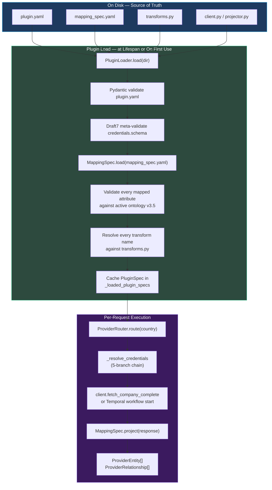

# Atlas — Plugin Architecture

A **data-provider plugin** in Atlas is a self-contained unit of code, configuration, and tests that teaches the platform to fetch and normalize data from one external source. The plugin architecture is the structural commitment behind milestone v5.1: adding a new data provider — a national company registry, an OSINT investigator, a sanctions feed — should be **O(1) plugin work** rather than **O(N) backend + frontend changes**.

This page documents the contract every plugin satisfies, the on-disk layout the platform expects, the three-layer test harness that gates merge, and the rationale for the unusual decision to keep mapping specifications **on disk** rather than in the database.

## What a Plugin Is

A plugin is a directory under `plugins/<name>/` containing six required artifacts and one optional one.

```
plugins/
  <provider>/
    plugin.yaml          # capability + credential contract (required)
    mapping_spec.yaml    # declarative ontology projection (required)
    client.py            # provider client — sync mode only (required for sync)
    transforms.py        # extracted transformation helpers (required)
    tests/               # 1-line wired into 3-layer harness (required)
    README.md            # operator/editor runbook (required)
    __init__.py          # provider registration side-effect (required)
    # OSINT-only:
    prompts/             # Jinja2 prompt templates per crew agent
    agents/              # CrewAI agent + crew configs
    tools/               # MCP server registrations
    projector.py         # declarative ontology projector for crew outputs
```

The on-disk layout is itself part of the contract. The `plugins.kvk` and `plugins.northdata` Python packages are reachable via `from plugins.kvk.client import KVKProvider` because each `__init__.py` triggers `@register_provider("kvk")` as a side effect.

## The Three Artifacts

### `plugin.yaml` — What the Plugin Claims

`plugin.yaml` is a Pydantic-validated, JSON-Schema-meta-validated declaration of what the plugin can do, what credentials it needs, and how it executes. Every field is required to pass `PluginLoader.load(plugin_dir)`; missing or malformed fields aggregate into a single `PluginValidationError` with a list of field-path-prefixed messages.

```yaml
plugin_schema_version: "1"
plugin: "kvk"                             # unique identifier, matches directory name
version: "1.0.0"                          # semver, advertises mapping_spec compatibility
display_name: "KVK (Dutch Chamber of Commerce)"
description: "Dutch Handelsregister provider — basisprofiel + vestigingsprofiel + naamgeving"
provider_type: "company_registry"         # allow-list: company_registry | aggregator | investigation | …

# CRED-07 — the most consequential field.
# false → the resolver demands a tenant credential row; missing → HTTP 424.
# true  → the platform-shared credential is acceptable (rare, deliberate).
allow_platform_fallback: false

connection:
  base_url: "https://api.kvk.nl/api"
  rate_limits:
    requests_per_minute: 60               # gt=0 enforced by Pydantic

credentials:
  schema:
    $schema: "http://json-schema.org/draft-07/schema#"
    type: object
    required: [api_key]
    properties:
      api_key:
        type: string
        title: "KVK API Key"
        format: "password"
        minLength: 8

capabilities:
  jurisdictions: ["NL"]                   # ISO 3166-1 alpha-2; "XX" = jurisdiction-agnostic
  entity_types: ["LegalEntity", "Address"]
  endpoints:
    - "basic_profile"
    - "establishment_profile"
    - "naming"

execution:
  mode: "sync"                            # sync | async
```

Three fields shape the plugin's place in the platform:

| Field | Effect |
|---|---|
| `provider_type` | Determines which platform surfaces show this provider (e.g., `investigation` plugins appear in OSINT module configuration; `company_registry` plugins appear in the country-routing matrix) |
| `allow_platform_fallback` | Controls branch (b) of the credential resolver. `false` means the plugin is "metered" — tenants must bring their own keys |
| `execution.mode` | `sync` plugins are HTTP-client-shaped; `async` plugins delegate to a Temporal workflow named in `execution.workflow_name` |

The `credentials.schema` is itself JSON Schema Draft-07 and is **meta-validated** at plugin load time using `jsonschema.Draft7Validator.check_schema`. Plugin authors cannot accidentally ship invalid schemas; the loader rejects them.

### `mapping_spec.yaml` — How the Provider Maps to the Ontology

`mapping_spec.yaml` is the declarative replacement for hand-written Python mappers. It states, in pure data, how the provider's API response projects onto the ontology — what fields go where, what transforms apply, what defaults fill missing values.

```yaml
target_schema: "ontology_schema_v3_5"   # version pinning — mapper version + ontology version travel together

entity_mappings:
  LegalEntity:
    discriminator: "_root"               # the response root produces a LegalEntity per fetch
    fields:
      legal_name:        { source: "$.handelsnaam" }
      registration_number: { source: "$.kvkNummer", transform: "strip_country_prefix" }
      registered_at:     { source: "$.startdatum", transform: "parse_iso_date" }
      legal_form:        { source: "$.rechtsvormCode", transform: "kvk_legal_form_lookup" }
      status:            { source: "$.status", default: "active" }

  Address:
    discriminator: "$.adressen[*]"        # list-shaped — one Address per element
    fields:
      address_type:      { value: "'registered'" }     # literal-bound
      street:            { source: "$.straatnaam" }
      city:              { source: "$.plaats" }
      postal_code:       { source: "$.postcode", transform: "normalize_postcode" }
      country:           { value: "'NL'" }

relationship_mappings:
  RegisteredAt:
    from: { entity_type: "LegalEntity", id_path: "$.kvkNummer" }
    to:   { entity_type: "Address",     id_path: "$.adressen[0].id" }
    fields:
      address_type:      { value: "'registered'" }
```

Three mapping primitives keep the spec declarative without becoming a programming language:

- **`source`** — JSONPath into the provider response.
- **`transform`** — a name resolved against `transforms.py` (the loader will raise a contract error if the transform doesn't exist).
- **`value`** — a literal expression evaluated as Python (`'string'`, `42`, `null`).

When a field needs three lines of Python, it goes in `transforms.py` and is called by name from the spec. When a field needs thirty lines of Python, the mapping is the wrong shape and the plugin needs a redesign.

### `transforms.py` — The Pure-Function Toolkit

Every transform name referenced in `mapping_spec.yaml` resolves to a function in `transforms.py`. Transforms are pure: input bytes/dicts → output bytes/dicts, no I/O, no DB, no network. This constraint is not enforced at runtime but is verified at PR review time because transforms run thousands of times per investigation and any side effect would be catastrophic.

```python
def strip_country_prefix(value: str | None) -> str | None:
    """Strip 'NL' / 'BE' / 'FR' style prefixes from registration numbers."""
    if value is None:
        return None
    if value[:2].isalpha() and value[2:3].isdigit():
        return value[2:]
    return value

def parse_iso_date(value: str | None) -> date | None:
    if value is None:
        return None
    return datetime.fromisoformat(value).date()
```

## The Plugin Lifecycle



The loader is **strict at load time**. A plugin that ships with a mapping referencing `LegalEntity.foundedOn` when the active ontology calls the field `incorporated_at` cannot start the platform — the validation aggregates every error into a single raise, listing every field path and the human-readable reason. This is deliberate: plugins fail loud at boot, not silently on the first investigation.

## The Three-Layer Test Harness

Every plugin opts in to a reusable pytest harness with one line:

```python
# plugins/<provider>/tests/test_<provider>.py
from tests.plugins.harness import run_plugin_tests
run_plugin_tests(__file__)
```

That single call generates three layers of tests. Each layer asserts a different invariant; failure of any layer blocks merge.

```mermaid
flowchart LR
    subgraph L1["Layer 1 — Contract"]
        C1["Every mapped attribute<br/>exists in the active ontology"]
        C2["Every type is compatible<br/>(string ↔ string, date ↔ date)"]
        C3["provider_type ∈ allow-list"]
        C4["Every transform name<br/>resolves in transforms.py"]
    end

    subgraph L2["Layer 2 — Mapping"]
        M1["For each fixture file:"]
        M2["Apply mapping_spec to fixture"]
        M3["DeepDiff vs golden file<br/>expected/<fixture>.claims.json"]
    end

    subgraph L3["Layer 3 — Coverage"]
        V1["Run mapping over all fixtures"]
        V2["Compute non-None field union"]
        V3["Compare to declared mappings"]
        V4["coverage_exempt: [] escape hatch"]
    end

    L1 --> L2 --> L3

    style L1 fill:#1e3a5f,stroke:#38bdf8,color:#fff
    style L2 fill:#3b1a5f,stroke:#a78bfa,color:#fff
    style L3 fill:#2d4a3e,stroke:#34d399,color:#fff
```



| Layer | Asserts | Failure example |
|---|---|---|
| **Contract** | The plugin's static claims align with the platform | `mapping_spec.yaml` maps `LegalEntity.founded_on` but the ontology calls it `incorporated_at` |
| **Mapping** | The plugin produces byte-identical output for known inputs | A `transforms.parse_iso_date` change drops the timezone — golden file diff fails the test |
| **Coverage** | The plugin actually populates everything it claims to populate | `mapping_spec` declares `Address.country` but every fixture leaves it null — coverage fails |

The `coverage_exempt: []` array in `mapping_spec.yaml` is the escape hatch for fields that legitimately can't be tested with the available fixtures (e.g., a paid-tier-only field). Each entry must be documented; the harness emits a `UserWarning` if the list is non-empty.

Golden file regeneration is a one-line CLI:

```bash
python -m tests.plugins.regenerate plugins/kvk
```

## Sync vs Async Execution Modes

The `execution.mode` field unlocks a structural insight: an HTTP-shaped registry plugin and an LLM-shaped investigation plugin are the same kind of thing — both produce normalized ontology entities with provenance — they just run on different substrates.

### Sync Mode — HTTP Plugins

`execution.mode: "sync"` plugins are HTTP clients. The `connection.base_url` is real, `connection.rate_limits.requests_per_minute` is enforced, the plugin defines `client.py` with a `fetch_company_complete()` method, and the `mapping_spec.yaml` projects the API response onto the ontology.

| Plugin | Provider | Coverage |
|---|---|---|
| `plugins/kvk/` | Dutch Chamber of Commerce | NL — primary authority |
| `plugins/northdata/` | NorthData aggregator | DE/AT/CH/BE/FR/NL/LU and ~15 more — supplementary |
| `plugins/_example/` | Reference implementation | Stays as the canary that the harness catches its own bugs |

### Async Mode — Temporal Plugins

`execution.mode: "async"` plugins delegate to a Temporal workflow. They have no HTTP base URL; the `connection.base_url` is a self-documenting sentinel like `async://temporal/InvestigationWorkflow`. The plugin's `mapping_spec.yaml` describes how the *workflow's output* projects onto the ontology — not how an API response does.

```yaml
execution:
  mode: "async"
  workflow_name: "InvestigationWorkflow"   # verbatim Temporal class name
```

The OSINT plugin (`plugins/osint/`) is the canonical async plugin and is documented in detail at **[OSINT Plugin](./osint-plugin)**. Future async plugins might wrap a Temporal-backed batch document classifier, a long-running risk re-evaluation, or a multi-step analyst handoff — anything where "fetch" is too thin a verb.

## The Disk-Authoritative Discipline

A choice that surprises new contributors: **mapping specs are not in the database**. The platform-wide rule, locked in v5.1's roadmap and reinforced in PROJECT.md as a Key Decision, is:

> Mapping specs are disk-authoritative — platform-wide, shipped in the plugin directory, not DB-overridable, not tenant-overridable.

Three reasons:

1. **Inspectability.** A `git blame` on `mapping_spec.yaml` tells you why a field maps the way it does. A `SELECT * FROM mapping_overrides` does not.
2. **Reproducibility.** Two Atlas deployments at the same git SHA produce byte-identical ontology projections. A DB-backed mapping introduces hidden state that bisects regressions across both schema and data.
3. **Versioning.** A plugin's `version` in `plugin.yaml` advertises the contract its mapping_spec satisfies. `version: "1.2.0"` and `version: "1.3.0"` of the same plugin can ship parallel mapping_specs in different deployments without coordinating a database migration.

The decision has costs — a customer cannot tweak a single field's transform without a code release — and that cost is accepted. The mutation queue (Phase 88-89) and the entity-claims layer (Phase 110) are the places where per-tenant variance is allowed; the projection contract is uniform.

## The KVK Migration as Template

The first plugin migrated onto the formal contract was KVK (Phase 96). The migration steps are now the template every subsequent plugin follows:

1. **`git mv`** the integration into `plugins/<name>/` so commit history is preserved.
2. **Author `plugin.yaml`** with the discoverable capabilities and credential schema.
3. **Author `mapping_spec.yaml`** alongside the existing hand-written mapper.
4. **Add a wrapping adapter** if the legacy mapper produces a flat shape and the harness expects wrapped (the KVK `_wrap_ontology_mapping` adapter; the NorthData `wrapper.py`).
5. **Wire the harness**: `run_plugin_tests(__file__)`.
6. **Author golden files** by running fixtures through the legacy mapper, capturing the output.
7. **Run shadow mode** in production where supported (NorthData phase 98 ran both old and new mappers and persisted divergences to `data_provider_shadow_diff` for review).
8. **Cut over** in a single revertable phase (Phase 99 deleted 567 lines of `NorthDataMapper` and the entire shadow-plumbing scaffold once parity was proven).

The shadow-mode pattern (`skeleton → parity → cutover+delete`) is itself a contract: every future provider migration will run shadow before cutover, so the operational risk of swapping a hand-written mapper is bounded by the divergence count visible in the dashboard.

## Per-Plugin CI Gates

Two CI gates protect plugin quality beyond the harness:

**Ontology drift check** (Phase 93): the active row of `ontology_schemas` in a freshly-migrated PostgreSQL is `diff -u`'d byte-exact against `schemas/ontology/ontology_v3.5.yaml` in the repo. If they diverge, CI fails with the unified diff and a fix recipe. Plugins cannot rely on a stale schema.

**Plugin version-bump check** (Phase 106): if any of `plugins/<name>/{prompts,agents,tools,mapping_spec.yaml}` changes in a pull request without a corresponding `version:` bump in `plugin.yaml`, the CI job fails closed. The version is treated as the contract identifier; changing the mapping without bumping the version is a contract violation.

The version-bump check uses YAML-aware parsing (`yaml.safe_load`) rather than a regex against `^\+version:`, so it cannot be fooled by a context-only diff line that happens to start with `+version:`.

## Plugin Inventory

As of milestone v5.1 (in progress, 84% complete):

| Plugin | Mode | Provider type | Tenants need their own creds? | Status |
|---|---|---|---|---|
| `plugins/kvk/` | sync | `company_registry` | ✅ (Phase 103 cutover) | Production |
| `plugins/northdata/` | sync | `aggregator` | ✅ (Phase 103 cutover) | Production |
| `plugins/osint/` | async | `investigation` | ✅ (Phase 106.1) | Production |
| `plugins/_example/` | sync | `company_registry` | n/a | Reference / harness self-test |

Backlog (deferred to v5.2+):

- **OpenCorporates plugin** — fallback coverage across 140+ jurisdictions.
- **Companies House plugin** — UK primary authority.

Adding either is, by the architecture's promise, plugin-only work.

## Reading Guide

- **[Credential Vault](./credential-vault)** — how `allow_platform_fallback` and `credentials.schema` thread into the resolver chain.
- **[OSINT Plugin](./osint-plugin)** — async-mode plugin design with prompts/agents/tools and the immutability contract.
- **[Data Providers](./data-providers)** — provider routing, country tier matrix, and trust-weighted survivorship.
- **[Ontology System](./ontology-system)** — what `mapping_spec.yaml` projects onto.
