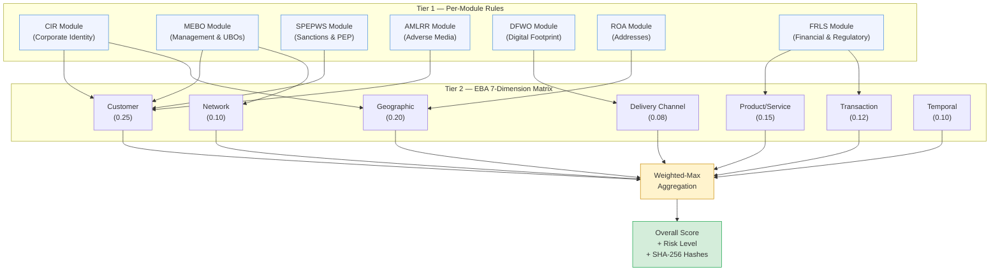
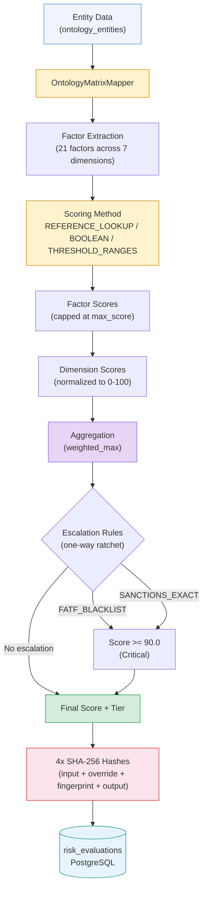
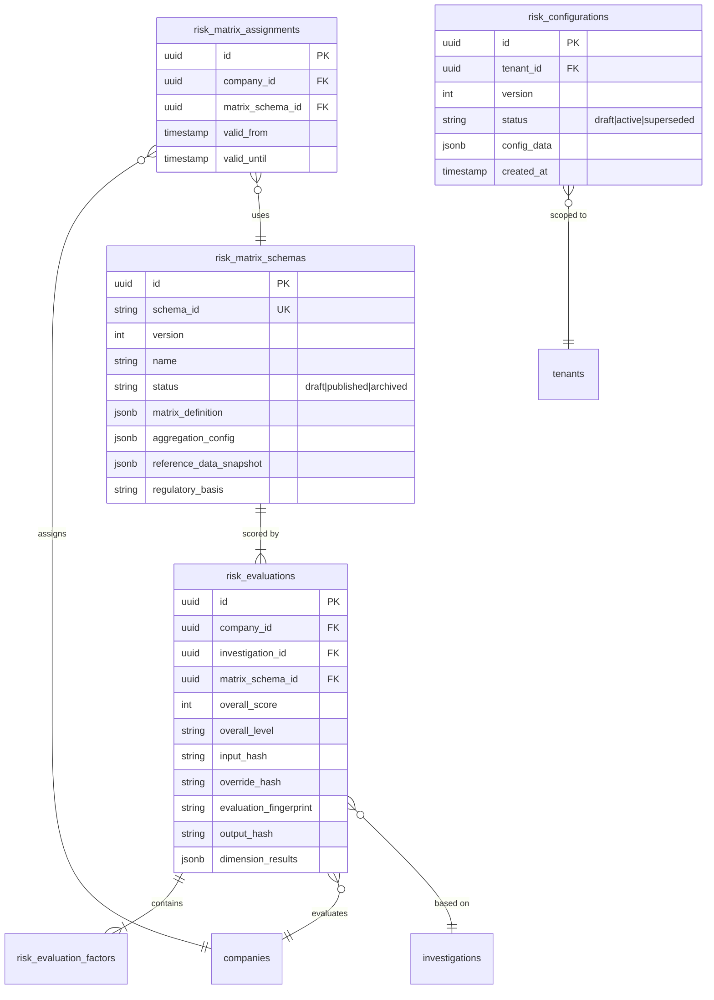

# Atlas — Risk Engine

Atlas implements an EBA/GL/2021/02-compliant risk matrix engine for multi-dimensional ML/TF risk scoring. The engine is deterministic, idempotent, and fully auditable -- every evaluation produces SHA-256 hashes that allow independent verification that the same inputs always produce the same outputs and that no tampering has occurred.

The risk engine operates in two tiers:

1. **Tier 1**: Per-module deterministic risk rules that produce additive scores within each investigation module.
2. **Tier 2**: An EBA 7-dimension risk matrix that aggregates investigation findings into a holistic, weighted risk assessment with configurable dimensions, factors, and escalation rules.

---

## Two-Tier Risk Architecture



---

## Tier 1: Per-Module Risk Rules

Each of the seven OSINT investigation modules produces risk indicators with additive scores. These indicators are defined in the ontology schema's `crew_instructions` section.

### Risk Level Thresholds

Module-level risk indicators aggregate into per-module scores with clear thresholds:

| Level | Score Range | Description |
|---|---|---|
| **Clear** | 0 or below | No risk signals detected |
| **Low** | 1 - 19 | Minor concerns, standard monitoring |
| **Medium** | 20 - 34 | Moderate concerns, enhanced review |
| **High** | 35 - 49 | Significant concerns, senior review |
| **Critical** | 50+ | Severe concerns, potential rejection |

### Module Risk Indicators

**CIR (Corporate Identity & Registration):**

| Indicator | Category | Description |
|---|---|---|
| `company_not_active` | `corporate_status` | Company status is not active/live |
| `missing_registration` | `data_quality` | Registration number not found in registry |
| `recent_incorporation` | `corporate_status` | Incorporated less than 1 year ago |
| `shell_company_indicator` | `ownership` | Single director with many directorships |
| `secrecy_jurisdiction` | `secrecy_jurisdiction` | Registered in known secrecy jurisdiction |
| `fatf_listed_jurisdiction` | `jurisdiction` | Entity in FATF grey/black list jurisdiction |

**MEBO (Management, Employees & Beneficial Owners):**

| Indicator | Category | Description |
|---|---|---|
| `complex_ownership` | `ownership` | Multiple ownership layers or circular structures |
| `missing_ubo` | `ownership` | Cannot identify ultimate beneficial owner |
| `nominee_directors` | `governance` | Evidence of nominee director arrangements |
| `governance_vacuum` | `governance` | No current executive directors found |
| `opaque_trust_structure` | `trust_structure` | Trust used in ownership chain with limited transparency |

**SPEPWS (Sanctions, PEP & Watchlist Screening):**

| Indicator | Category | Description |
|---|---|---|
| `sanctions_match` | `sanctions` | Entity or person appears on sanctions list |
| `pep_exposure` | `pep` | Connection to politically exposed person |
| `high_risk_jurisdiction` | `jurisdiction` | Entity in sanctioned or high-risk jurisdiction |

**AMLRR (Adverse Media, Litigation & Reputational Risk):**

| Indicator | Category | Description |
|---|---|---|
| `adverse_media_critical` | `adverse_media` | Critical negative news (fraud, sanctions evasion) |
| `litigation_active` | `adverse_media` | Active court cases or legal proceedings |
| `regulatory_action` | `regulatory` | Fines or sanctions by regulators |

**DFWO (Digital Footprint & Website Ownership):**

| Indicator | Category | Description |
|---|---|---|
| `domain_mismatch` | `digital_footprint` | Domain registered in different jurisdiction than company |
| `no_web_presence` | `digital_footprint` | No discoverable web presence |
| `suspicious_hosting` | `digital_footprint` | Domain hosted in high-risk location |

**ROA (Registered & Operational Addresses):**

| Indicator | Category | Description |
|---|---|---|
| `virtual_office` | `ownership` | Registered address is a virtual/serviced office |
| `mass_registration` | `ownership` | Many companies registered at same address |
| `address_mismatch` | `data_quality` | Registered vs operational address differ significantly |

**FRLS (Financial, Regulatory & Licensing Status):**

| Indicator | Category | Description |
|---|---|---|
| `missing_license` | `regulatory` | Required regulatory license not found |
| `expired_license` | `regulatory` | Regulatory license has expired |
| `regulatory_warnings` | `regulatory` | Warnings or notices from regulators |

### Ontology-Level Risk Weights

The ontology schema also defines global risk scoring weights for cross-module aggregation:

| Indicator | Weight |
|---|---|
| `sanctions_match` | 100 |
| `pep_exposure` | 50 |
| `adverse_media_critical` | 40 |
| `missing_ubo` | 35 |
| `shell_company_indicator` | 30 |
| `fatf_listed_jurisdiction` | 30 |
| `adverse_media_high` | 25 |
| `high_risk_jurisdiction` | 25 |
| `opaque_trust_structure` | 25 |
| `secrecy_jurisdiction` | 20 |
| `ownership_opacity` | 20 |
| `regulatory_finding` | 15 |
| `adverse_media_medium` | 10 |

---

## Tier 2: EBA 7-Dimension Risk Matrix

The EBA risk matrix implements EBA/GL/2021/02 consolidated risk factor guidelines. It scores entities across seven dimensions with 21 factors, producing a single 0-100 risk score.

### Dimension Overview

| # | Dimension | Weight | EBA Reference | Factors | Max Possible |
|---|---|---|---|---|---|
| 1 | Customer | 0.25 | GL 2.3-2.8 | 5 factors | 150 |
| 2 | Geographic | 0.20 | GL 2.9-2.15 | 3 factors | 80 |
| 3 | Product/Service | 0.15 | GL 2.16-2.17 | 2 factors | 50 |
| 4 | Delivery Channel | 0.08 | GL 2.18-2.19 | 2 factors | 35 |
| 5 | Transaction | 0.12 | GL 2.20-2.21 | 2 factors | 50 |
| 6 | Network/Association | 0.10 | -- | 3 factors | 75 |
| 7 | Temporal/Historical | 0.10 | -- | 3 factors | 75 |

### 1. Customer Dimension (weight: 0.25)

| Factor | Max Score | Scoring Method | Thresholds |
|---|---|---|---|
| `ownership_complexity` | 25 | THRESHOLD_RANGES | > 3 layers: 25, > 2 layers: 15, > 1 layer: 5; bearer shares: 25; nominee shareholders: 20 |
| `pep_exposure` | 30 | REFERENCE_LOOKUP | head_of_state/senior_government: 30, parliament/military: 25, regional/judicial: 20, family/associates: 15 |
| `sanctions_exposure` | 50 | REFERENCE_LOOKUP | exact match: 50, strong match: 40, partial match: 20 |
| `adverse_media` | 25 | REFERENCE_LOOKUP | critical: 25, high: 20, medium: 12, low: 5 |
| `business_profile` | 20 | REFERENCE_LOOKUP | industry risk from `industry_risk_classification` dataset; incorporation < 1yr: 10, < 2yr: 5 |

### 2. Geographic Dimension (weight: 0.20)

| Factor | Max Score | Scoring Method | Thresholds |
|---|---|---|---|
| `jurisdiction_risk` | 30 | REFERENCE_LOOKUP | FATF blacklist: 30 (auto-escalate), EU high-risk + FATF grey: 27, EU high-risk: 24, FATF grey: 21, CPI < 40: 15, secrecy: 9, EU/EEA: 1.5, default: 3 |
| `operational_geography` | 25 | REFERENCE_LOOKUP | Highest-risk operational country scored against same lists |
| `ubo_geography` | 25 | REFERENCE_LOOKUP | Highest-risk UBO/director nationality |

Country risk scoring uses a cascading lookup against five reference datasets:

| Dataset | Score | Action |
|---|---|---|
| `fatf_black_list` | 100 | Auto-escalation: `FATF_BLACKLIST` |
| `eu_high_risk_third_countries` + `fatf_grey_list` | 90 | Both lists = near-maximum |
| `eu_high_risk_third_countries` | 80 | EU delegated regulation |
| `fatf_grey_list` | 70 | Increased monitoring |
| `cpi_below_40` | 50 | High corruption perception |
| `secrecy_jurisdictions` | 30 | Financial Secrecy Index |
| EU/EEA member state | 5 | Common AML/CFT framework |
| Other | 10 | Default low risk |

### 3. Product/Service Dimension (weight: 0.15)

| Factor | Max Score | Scoring Method | Thresholds |
|---|---|---|---|
| `product_complexity` | 25 | REFERENCE_LOOKUP | From `product_risk_taxonomy` dataset, normalized to 0-25 range |
| `regulatory_status` | 25 | Module output | From FRLS module: missing licenses, regulatory violations |

### 4. Delivery Channel Dimension (weight: 0.08)

| Factor | Max Score | Scoring Method | Thresholds |
|---|---|---|---|
| `non_face_to_face` | 15 | BOOLEAN | Non-face-to-face relationship: 5 (baseline, since remote onboarding is standard) |
| `digital_presence` | 20 | THRESHOLD_RANGES | No website: 20, website not verified: 5, website verified accessible: 0 |

### 5. Transaction Dimension (weight: 0.12)

| Factor | Max Score | Scoring Method | Thresholds |
|---|---|---|---|
| `financial_profile` | 25 | THRESHOLD_RANGES | Annual volume > 10M EUR: 25, > 5M: 15, > 1M: 10, else: 5 |
| `transaction_patterns` | 25 | REFERENCE_LOOKUP | complex: 25, unusual: 20, normal: 5 |

### 6. Network/Association Dimension (weight: 0.10)

| Factor | Max Score | Scoring Method | Thresholds |
|---|---|---|---|
| `network_risk` | 30 | Pass-through | Network investigation score (0-100) scaled to 0-30 |
| `shared_address_risk` | 20 | THRESHOLD_RANGES | >= 5 co-tenants: 20, >= 3: 12, >= 1: 5 |
| `subsidiary_opacity` | 25 | THRESHOLD_RANGES | >= 10 subsidiaries: 25, >= 5: 15, >= 2: 5 |

### 7. Temporal/Historical Dimension (weight: 0.10)

| Factor | Max Score | Scoring Method | Thresholds |
|---|---|---|---|
| `company_age` | 20 | THRESHOLD_RANGES | < 1yr: 20, < 2yr: 15, < 5yr: 8, >= 5yr: 2, unknown: 10 |
| `filing_regularity` | 25 | REFERENCE_LOOKUP | none: 25, unknown: 8, irregular: 15, regular: 0 |
| `adverse_history` | 30 | BOOLEAN | Gazette events indicating distress: 30; tax/social debt (inhoudingsplicht): 20 |

---

## Scoring Methods

Three scoring methods are used across all factors:

| Method | Description | Example |
|---|---|---|
| **REFERENCE_LOOKUP** | Value looked up in a reference dataset. Returns the score associated with the matched entry. | PEP level `head_of_state` looked up in `pep_tiers` dataset returns 30 |
| **BOOLEAN** | Simple true/false flag. Returns a fixed score when the condition is true. | `is_non_face_to_face = true` returns 5 |
| **THRESHOLD_RANGES** | Numeric value compared against descending threshold ranges. First match wins. | `ownership_layers = 4` matches `> 3 layers` threshold, returns 25 |

---

## Aggregation Methods

Three aggregation methods combine dimension scores into an overall score:

### weighted_max (Default)

The `weighted_max` method ensures that a single high-risk dimension cannot be averaged away by low-scoring dimensions:

1. Compute weighted average: `sum(weight_i * score_i) / sum(weights)`
2. Find the maximum dimension score
3. If max dimension score exceeds the critical threshold (80.0):
   - Apply floor boost: `0.60 * max_score + 0.40 * weighted_average`
4. Otherwise: use the weighted average

```
Example — FATF blacklisted jurisdiction:
  Customer:         20.0 (low)
  Geographic:       100.0 (FATF blacklist)
  Product/Service:  10.0 (low)
  Delivery Channel: 25.0 (low)
  Transaction:      15.0 (low)
  Network:           5.0 (low)
  Temporal:         10.0 (low)

  Weighted average = 0.25*20 + 0.20*100 + 0.15*10 + 0.08*25 + 0.12*15 + 0.10*5 + 0.10*10 = 31.8
  Max dimension = 100.0 >= 80.0 (critical threshold)
  Floor boost = 0.60 * 100.0 + 0.40 * 31.8 = 72.72

  Without weighted_max, the score would be 31.8 (low risk) — hiding a FATF blacklisted entity.
  With weighted_max, the score is 72.72 (high risk) — correctly reflecting the severity.
```

### weighted_average

Pure weighted average across dimensions. Suitable when no single dimension should dominate:

```
overall = sum(weight_i * score_i) / sum(weights)
```

### highest_dimension

Overall score equals the highest dimension score. Maximum sensitivity to any single risk signal:

```
overall = max(score_1, score_2, ..., score_7)
```

---

## Escalation Rules (One-Way Ratchet)

Auto-escalation rules enforce minimum risk levels based on entity conditions. Escalation is a one-way ratchet -- the system can ADD scrutiny but NEVER suppress risk signals:

| Escalation Trigger | Minimum Score | Effect |
|---|---|---|
| `FATF_BLACKLIST` | 90.0 | Forces critical risk level |
| `SANCTIONS_EXACT_MATCH` | 90.0 | Forces critical risk level |
| `ADVERSE_CORPORATE_HISTORY` | 70.0 (implicit via auto_escalations) | Ensures high risk minimum |
| `TAX_SOCIAL_DEBT` | 70.0 (implicit via auto_escalations) | Ensures high risk minimum |

When auto-escalations are present, the overall score is raised to at least 70.0 (high risk), then further raised per individual escalation rules. The score is never lowered by escalation.

---

## Risk Levels

| Level | Score Range | Color | Recommended Action |
|---|---|---|---|
| **Critical** | 90 - 100 | `#DC2626` (red) | Reject or Enhanced Due Diligence |
| **High** | 70 - 89 | `#EA580C` (orange) | Enhanced Due Diligence |
| **Medium** | 40 - 69 | `#CA8A04` (yellow) | Standard Due Diligence |
| **Low** | 20 - 39 | `#16A34A` (green) | Simplified Due Diligence |
| **Clear** | 0 - 19 | `#0D9488` (teal) | Simplified Due Diligence |

Risk levels must form a contiguous range covering 0-100 with no gaps or overlaps. The risk config service validates this constraint at schema publish time.

### Risk Tier Mapping

Risk levels map to investigation scope tiers that determine which checks are mandatory, recommended, or optional:

| Risk Level | Investigation Tier | Description |
|---|---|---|
| Clear / Low | SDD | Simplified Due Diligence -- registry and sanctions only |
| Medium | CDD | Customer Due Diligence -- adds directors, UBOs, adverse media, website review |
| High / Critical | EDD | Enhanced Due Diligence -- adds financial analysis, network scan, source of funds, senior approval |

Tier boundaries are configurable per tenant risk appetite:

| Risk Appetite | SDD Max | CDD Max | EDD Threshold |
|---|---|---|---|
| Conservative | 30 | 60 | > 60 |
| Moderate | 40 | 70 | > 70 |
| Progressive | 50 | 80 | > 80 |

---

## Audit Trail

Every risk evaluation produces a deterministic audit trail with four SHA-256 hashes:

| Hash | Input | Purpose |
|---|---|---|
| `input_hash` | Canonicalized input data (sorted JSON) | Prove which data was scored |
| `override_hash` | Canonicalized analyst overrides | Prove which overrides were applied |
| `evaluation_fingerprint` | `matrix_schema_id + input_hash + override_hash` | Unique identifier for this exact evaluation scenario |
| `output_hash` | Dimension scores + overall score + risk level | Tamper detection on outputs |

### Deterministic Reproducibility

Canonical JSON uses `sort_keys=True` for deterministic serialization. The same inputs always produce the same hashes, enabling:

- **Independent audit verification**: A regulator can re-run the scoring with the same inputs and verify the same outputs
- **Tamper detection**: Any modification to inputs or outputs changes the corresponding hash
- **Cross-evaluation comparison**: `evaluation_fingerprint` uniquely identifies evaluation scenarios for delta analysis

### Analyst Overrides

Compliance officers can override individual factor scores with justification. Overrides are:

- Normalized to canonical order for deterministic hashing
- Indexed by `dimension.factor_id` for O(1) lookup
- Capped at the factor's `max_score`
- Tracked in the `override_hash` for audit trail
- Result in a "derived evaluation" linked to the original

---

## Wire Mappings

Wire mappings connect EBA matrix factors to ontology entity field paths and investigation module outputs. Each factor definition includes:

### Ontology Mapping

Maps factors to entity type fields with indicator types and threshold definitions:

```yaml
# From eba_standard_v1.yaml
- id: ownership_complexity
  ontology_mapping:
    entity_type: LegalEntity
    fields:
      - path: "ownership_structure.layers"
        indicator: "greater_than"
        thresholds:
          - { value: 3, score: 25 }
          - { value: 2, score: 15 }
          - { value: 1, score: 5 }
      - path: "ownership_structure.has_nominee"
        indicator: "equals"
        thresholds:
          - { value: true, score: 20 }
```

### Module Mapping

Maps factors to investigation module output fields:

```yaml
- id: ownership_complexity
  module_mapping:
    module: MEBO
    fields:
      - "ownership_chain_depth"
      - "nominee_shareholders_detected"
      - "circular_ownership_detected"
```

### Risk Indicator Mapping

Maps factors to risk indicator keys from the investigation pipeline:

```yaml
- id: ownership_complexity
  risk_indicator_mapping:
    - "complex_ownership"
    - "nominee_shareholders"
    - "hidden_ubos"
```

The scorer checks all three mapping types in priority order: ontology fields first, then risk indicators, then module output fields. The highest matching score wins within each factor.

---

## OntologyMatrixMapper

The `OntologyMatrixMapper` bridges the ontology entity model and the risk matrix scorer. It extracts entity data for scoring by:

1. **Resolving entity fields**: Traverses dotted field paths (e.g., `ownership_structure.layers`) from the ontology entity's JSONB `data` column
2. **Collecting module reports**: Gathers findings from all seven investigation modules (CIR, MEBO, ROA, SPEPWS, AMLRR, DFWO, FRLS)
3. **Extracting risk indicators**: Collects all risk indicator flags from investigation results
4. **Building the input dict**: Assembles the complete `EBARiskInput` dataclass for the scorer

### Indicator Types

Seven indicator types are supported for threshold matching:

| Indicator Type | Description | Example |
|---|---|---|
| `equals` | Exact value match | `is_pep = true` |
| `greater_than` | Numeric comparison (descending thresholds) | `ownership_layers > 3` |
| `less_than` | Numeric comparison (ascending thresholds) | -- |
| `in` | Value in set | `pep_level in [head_of_state, senior_government]` |
| `intersects` | Array overlap | `industry_codes intersects [gambling, crypto]` |
| `country_risk_list` | Country code against reference dataset | `jurisdiction in eu_high_risk_third_countries` |
| `recency_days` | Days since a date value | `incorporation_date < 365 days ago` |

---

## Schema Validation

The risk configuration service validates schema integrity before publication:

| Validation | Rule | Error |
|---|---|---|
| Threshold ordering | Risk level thresholds must be contiguous and non-overlapping | "Gap between levels: low max (39) != medium min (40)" |
| Weight consistency | Dimension weights must sum to 1.0 (within tolerance) | "Dimension weights sum to 0.95, expected 1.0" |
| Risk level coverage | Levels must cover the full 0-100 range | "No level covers score 75" |
| Duplicate factors | Factor IDs must be unique within each dimension | "Duplicate factor: ownership_complexity" |
| Missing reference data | All `REFERENCE_LOOKUP` factors must have corresponding datasets | "Missing reference data: pep_tiers" |
| Max score bounds | Each factor's max_score must be positive | "Factor ownership_complexity has max_score 0" |

---

## Scoring Flow



---

## Risk Configuration Management

Risk configurations are versioned, tenant-scoped, and managed through a dedicated service:

### Configuration Lifecycle

```
Draft → Active → Superseded
```

| State | Description |
|---|---|
| **Draft** | Configuration is being edited. Can be modified freely. Not used for scoring. |
| **Active** | The active configuration for a tenant. Used for all risk evaluations. |
| **Superseded** | Previously active configuration. Retained for historical reproducibility. |

### Default Configuration Assembly

The factory-default configuration is assembled from three sources:

1. **Scoring model**: EBA dimension weights, factor max scores, risk level thresholds, critical dimension threshold (80.0), floor boost factor (0.60), and auto-escalation rules
2. **Reference datasets**: 11 JSON datasets loaded from `config/reference_data/`:
   - `fatf_black_list`, `fatf_grey_list`, `eu_high_risk_third_countries`
   - `cpi_below_40`, `secrecy_jurisdictions`, `eu_tax_blacklist`
   - `industry_risk_classification`, `pep_tiers`, `product_risk_taxonomy`
   - `sanctions_defaults`, `ubo_thresholds`
3. **Check catalog**: 11 investigation checks with per-tier status (MANDATORY/RECOMMENDED/OPTIONAL/OFF)

### Segment Calibration

Different regulatory segments (banking, PSP, insurance) can apply weight multipliers to dimension weights. The `apply_risk_calibration` function multiplies each dimension weight by a segment-specific factor and re-normalizes to sum to 1.0:

```
Banking segment: customer_weight_multiplier = 1.2, geographic = 1.3
Result: customer and geographic dimensions receive proportionally more weight
```

### TTL-Based Caching

Active configurations are cached in-process with a 60-second TTL per tenant. This avoids database lookups on every risk evaluation while ensuring configuration changes propagate within one minute.

---

## Batch Evaluation via Temporal Workflow

Portfolio-wide risk evaluation is orchestrated through Temporal workflows:

- **Batch re-evaluation**: Score up to 100 companies against a matrix schema in a single Temporal workflow
- **Portfolio evaluation**: Score all companies (or a filtered subset) against a draft or published matrix
- **Matrix upgrade**: Migrate a company to a new matrix version and re-evaluate
- **Scheduled re-evaluation**: Periodic re-scoring to detect risk changes from updated reference data

---

## Portfolio Risk Assessment

The risk engine supports portfolio-level aggregation for compliance officers managing multiple entities:

| View | Description |
|---|---|
| Risk by category | Aggregate risk across the portfolio by dimension |
| Risk by jurisdiction | Geographic distribution of risk scores |
| Risk timeline | Evaluation history showing risk score trends |
| Schema version distribution | Which companies use which matrix version |
| Tier distribution | Count of companies at each risk tier (SDD/CDD/EDD) |

---

## Investigation Check Catalog

The check catalog defines 11 investigation checks with per-tier status:

| Check | SDD | CDD | EDD |
|---|---|---|---|
| Registry / KBO verification | MANDATORY | MANDATORY | MANDATORY |
| Company sanctions screening | MANDATORY | MANDATORY | MANDATORY |
| Director identity & verification | OFF | MANDATORY | MANDATORY |
| Director sanctions & PEP screening | OFF | MANDATORY | MANDATORY |
| UBO identification | OFF | MANDATORY | MANDATORY |
| Adverse media screening | OFF | MANDATORY | MANDATORY |
| Website & online presence review | OFF | RECOMMENDED | RECOMMENDED |
| Financial statements analysis | OFF | OFF | MANDATORY |
| Corporate network & subsidiary scan | OFF | OFF | MANDATORY |
| Source of funds verification | OFF | OFF | RECOMMENDED |
| Senior management approval | OFF | OFF | MANDATORY |

---

## Risk Data Model



---

## API Endpoints

All risk engine endpoints are under the `/risk-matrix` and `/risk-config` prefixes:

### Risk Matrix API (`/risk-matrix`)

| Method | Path | Description |
|---|---|---|
| `GET` | `/schemas` | List all matrix schemas (filterable by status) |
| `POST` | `/schemas` | Create a new draft schema |
| `GET` | `/schemas/{id}` | Get schema details |
| `PUT` | `/schemas/{id}` | Update a draft schema |
| `POST` | `/schemas/{id}/publish` | Publish a draft (freezes reference data) |
| `GET` | `/ontology-metadata` | Discoverable entity types, fields, modules, indicator types |
| `POST` | `/evaluate` | Trigger evaluation for a company |
| `POST` | `/evaluate/{id}/override` | Create derived evaluation with overrides |
| `POST` | `/batch/re-evaluate` | Batch re-evaluation (up to 100 companies) |
| `POST` | `/portfolio/evaluate` | Portfolio-wide evaluation |

### Risk Configuration API (`/risk-config`)

| Method | Path | Description |
|---|---|---|
| `GET` | `/` | Get active configuration for current tenant |
| `POST` | `/draft` | Create a new draft configuration |
| `PUT` | `/draft/{version}` | Update a draft configuration |
| `POST` | `/activate/{version}` | Activate a draft (validates, then replaces current active) |
| `GET` | `/diff/{v1}/{v2}` | Recursive diff between two configuration versions |
| `POST` | `/recalculate` | Re-evaluate all active cases with current configuration |
