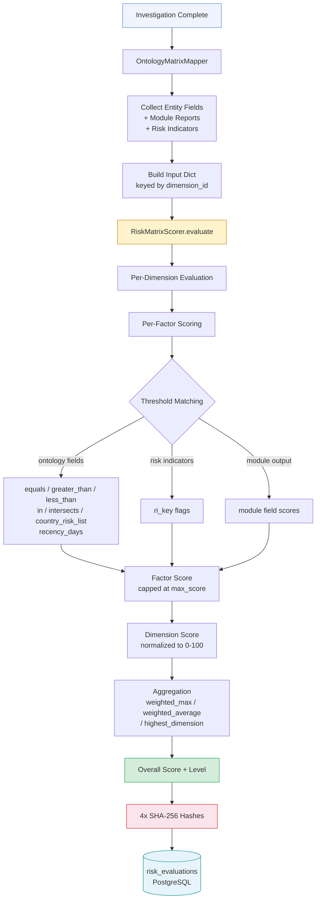
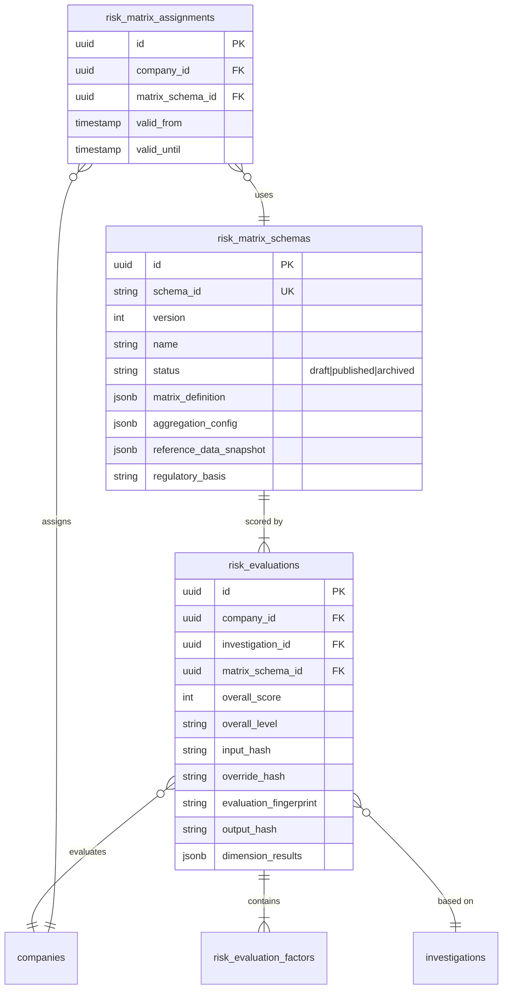

# Atlas — Risk Scoring Engine

Atlas implements an EBA/GL/2021/02-compliant risk matrix engine for multi-dimensional ML/TF risk scoring. The engine is deterministic, idempotent, and fully auditable -- every evaluation produces four SHA-256 hashes that allow independent verification that the same inputs always produce the same outputs and that no tampering has occurred.

## Architecture Overview

The risk matrix engine spans three core modules:

| Module | Lines | Responsibility |
|---|---|---|
| `risk_matrix/scorer.py` | 578 | Deterministic scoring engine. Evaluates all dimensions, factors, and thresholds. Produces hashed evaluation results. |
| `risk_matrix/repository.py` | 635 | Persistence layer. Three repository classes (`MatrixSchemaRepo`, `EvaluationRepo`, `AssignmentRepo`) for schema CRUD, evaluation storage, and company-to-matrix bindings. |
| `risk_matrix/ontology_mapper.py` | -- | Integration bridge. Maps ontology entities and investigation module outputs to the scorer's expected input format. |
| `risk_matrix/batch_workflow.py` | -- | Temporal workflow for portfolio-wide batch re-evaluation. |
| `risk_matrix/router.py` | -- | FastAPI router under `/risk-matrix` prefix. Schema CRUD, evaluations, assignments, batch operations. |
| `risk_matrix/version_manager.py` | -- | Schema lifecycle: draft, published, archived. Handles reference data snapshot freezing at publish time. |

## Risk Dimensions

The default EBA Standard ML/TF Risk Matrix (`eba_standard_v1.yaml`) defines five dimensions, each with weighted factors:

### 1. Customer Risk (weight: 0.30)

EBA reference: GL 2.3-2.8. Evaluates the inherent risk of the customer entity itself.

| Factor | Max Score | Description |
|---|---|---|
| `ownership_complexity` | 25 | Complex/opaque ownership structures, nominee shareholders, bearer shares, circular ownership |
| `pep_exposure` | 30 | PEP matches with tiered scoring (head of state: 30, senior government: 30, parliament/military: 25, regional/judicial: 20, family/associates: 15) |
| `sanctions_exposure` | 50 | Direct/indirect sanctions list matches (direct: 50, indirect: 40, sectoral: 30, formerly listed: 15) |
| `adverse_media` | 25 | Negative news severity (financial crime: 25, fraud/corruption: 20, regulatory: 15, reputational: 10) |
| `business_profile` | 20 | Business characteristics (industry risk, recent incorporation, cash-intensive indicators) |

### 2. Geographic Risk (weight: 0.25)

EBA reference: GL 2.9-2.15. Country-based risk using reference data lists.

| Factor | Max Score | Description |
|---|---|---|
| `jurisdiction_risk` | 30 | Registration country checked against EU high-risk third countries (30), FATF grey list (25), CPI below 40 (15) |
| `operational_geography` | 25 | Operational countries against the same risk lists |
| `ubo_geography` | 25 | UBO/director nationalities against risk lists |
| `address_risk` | 20 | Virtual offices, mass registration addresses, formation agent indicators |

### 3. Product / Service Risk (weight: 0.20)

EBA reference: GL 2.16-2.17.

| Factor | Max Score | Description |
|---|---|---|
| `product_complexity` | 25 | Complex financial products, anonymity features, new technologies (manual or workflow input) |
| `regulatory_status` | 25 | Missing licenses, regulatory violations, compliance gaps (from FRLS module) |

### 4. Delivery Channel Risk (weight: 0.10)

EBA reference: GL 2.18-2.19.

| Factor | Max Score | Description |
|---|---|---|
| `non_face_to_face` | 15 | Remote onboarding, no physical presence verification (manual input) |
| `digital_presence` | 20 | Domain ownership verification, website content match, domain age, SSL certificate validity (from DFWO module) |

### 5. Transaction Risk (weight: 0.15)

EBA reference: GL 2.20-2.21.

| Factor | Max Score | Description |
|---|---|---|
| `financial_profile` | 25 | Financial distress, revenue plausibility, missing financial statements (from FRLS module) |
| `transaction_patterns` | 25 | Unusual volumes, cross-border patterns, cash usage (manual input) |

## Scoring Pipeline

### Evaluation Flow

1. **Input collection**: The `OntologyMatrixMapper` gathers data from three sources: ontology entities (via entity_type and dotted field paths), investigation module reports (7 OSINT modules), and existing risk indicators.

2. **Factor evaluation**: Each factor is evaluated against its input data. The scorer checks ontology-mapped fields first (using threshold definitions), then risk indicator flags, then module output fields. The highest matching score wins within each factor.

3. **Threshold matching**: Seven indicator types are supported:
   - `equals` -- exact value match
   - `greater_than` -- numeric threshold (descending order)
   - `less_than` -- numeric threshold (ascending order)
   - `in` -- value in set
   - `intersects` -- array overlap
   - `country_risk_list` -- country code checked against a frozen reference data list
   - `recency_days` -- days since a date value

4. **Dimension normalization**: Raw factor scores are summed and normalized to 0-100 based on the dimension's max possible score.

5. **Aggregation**: Three aggregation methods are supported:
   - `weighted_max` (default): `max_score * 0.6 + weighted_average * 0.4` -- ensures the highest single dimension cannot be averaged away
   - `weighted_average`: Pure weighted average across dimensions
   - `highest_dimension`: Overall score equals the highest dimension score

6. **Level assignment**: The numeric score maps to a risk level via contiguous, validated ranges.

## Risk Levels

| Level | Range | Color | Recommended Action |
|---|---|---|---|
| **Critical** | 90-100 | `#DC2626` (red) | Reject or Enhanced Due Diligence |
| **High** | 70-89 | `#EA580C` (orange) | Enhanced Due Diligence |
| **Medium** | 40-69 | `#CA8A04` (yellow) | Standard Due Diligence |
| **Low** | 20-39 | `#16A34A` (green) | Simplified Due Diligence |
| **Clear** | 0-19 | `#0D9488` (teal) | Simplified Due Diligence |

Risk levels must form a contiguous range covering 0-100 with no gaps or overlaps. The scorer validates this at publish time.

## Determinism and Auditability

Every evaluation produces four SHA-256 hashes per ADR-008:

| Hash | Input | Purpose |
|---|---|---|
| `input_hash` | Canonicalized input data | Prove which data was scored |
| `override_hash` | Canonicalized analyst overrides | Prove which overrides were applied |
| `evaluation_fingerprint` | `matrix_schema_id + input_hash + override_hash` | Unique identifier for this exact evaluation scenario |
| `output_hash` | Dimension scores + overall score | Tamper detection on outputs |

Canonical JSON uses `sort_keys=True, separators=(",",":")` for deterministic serialization. The same inputs always produce the same hashes, enabling independent audit verification.

## Risk Data Model

## Reference Data Integration

The scorer resolves country risk indicators against frozen reference data lists. At schema publish time, the `MatrixVersionManager` takes a snapshot of the current reference data and freezes it into the schema's `reference_data_snapshot` JSONB column. This ensures evaluations are reproducible even if reference lists are updated later.

Reference data lists used by the default EBA matrix:

| List | Description |
|---|---|
| `eu_high_risk_third_countries` | EU delegated regulation list of high-risk third countries |
| `fatf_grey_list` | FATF jurisdictions under increased monitoring |
| `cpi_below_40` | Countries with Corruption Perceptions Index below 40 |

Additional reference data informing risk factors: PEP tiers and classification levels, sanctions list defaults, industry risk classification (MCC codes), UBO thresholds (25% default), EU tax blacklists/greylists, Financial Secrecy Index scores.

## Analyst Overrides

Compliance officers can override individual factor scores with justification. Overrides are:
- Normalized to canonical order for deterministic hashing
- Indexed by `dimension.factor_id` for O(1) lookup
- Capped at the factor's `max_score`
- Tracked in the `override_hash` for audit trail
- Result in a "derived evaluation" linked to the original

## Portfolio Risk

The batch workflow (`batch_workflow.py`) enables portfolio-wide operations:

- **Batch re-evaluation**: Score up to 100 companies against a matrix schema in a single Temporal workflow
- **Portfolio evaluation**: Score all companies (or a filtered subset) against a draft or published matrix
- **Matrix upgrade**: Migrate a company to a new matrix version and re-evaluate

The `/risk-matrix` API provides aggregated views:
- Risk by category across the portfolio
- Risk by jurisdiction
- Risk timeline (evaluation history)
- Schema version distribution

## Risk Propagation

Risk does not stop at the entity level. Through the Neo4j graph, Atlas propagates risk signals along ownership chains:

- A PEP-connected director at Company A raises the risk of Company B if A owns B
- Sanctions matches propagate through ownership chains up to 10 levels deep
- High-risk jurisdictions in the ownership tree contribute to geographic risk
- The `HIGH_RISK_NETWORK` Cypher query discovers risk sources within 3 degrees of connection

## API Endpoints

All endpoints are under the `/risk-matrix` prefix:

| Method | Path | Description |
|---|---|---|
| `GET` | `/schemas` | List all matrix schemas (filterable by status) |
| `POST` | `/schemas` | Create a new draft schema |
| `GET` | `/schemas/{id}` | Get schema details |
| `PUT` | `/schemas/{id}` | Update a draft schema |
| `POST` | `/schemas/{id}/publish` | Publish a draft (freezes reference data) |
| `GET` | `/ontology-metadata` | Discoverable entity types, fields, modules, indicator types |
| `POST` | `/evaluate` | Trigger evaluation for a company |
| `POST` | `/evaluate/{id}/override` | Create derived evaluation with overrides |
| `POST` | `/batch/re-evaluate` | Batch re-evaluation (up to 100 companies) |
| `POST` | `/portfolio/evaluate` | Portfolio-wide evaluation |

## How Trust Relay Differs

Trust Relay adopted the EBA risk matrix concept from Atlas but diverged in several architectural decisions:

| Aspect | Atlas (5 dimensions) | Trust Relay (5 dimensions) |
|---|---|---|
| Dimensions | Customer, Geographic, Product/Service, Delivery Channel, Transaction | Customer, Geographic, Product/Service, Delivery Channel, Transaction (same EBA basis, different factor decomposition) |
| Aggregation | weighted_max, weighted_average, highest_dimension | Same three methods with identical weighted_max formula |
| Determinism proofs | 4 SHA-256 hashes per evaluation | SHA-256 determinism proofs (same pattern) |
| Schema management | YAML-defined, DB-versioned, draft/published/archived lifecycle | DB-backed versioning with draft/activate lifecycle, diff, audit trail, and recalculation API (9 endpoints) |
| Reference data | Frozen snapshot at publish time via `ReferenceDataResolver` | 12 JSON reference datasets served via `reference_data_service` |
| Factor input | Ontology mapper extracts from entities + 7 module reports + risk indicators | Direct extraction from investigation results |
| Risk levels | 5 levels (clear/low/medium/high/critical) | 5 levels with same ranges |
| ARIA scoring | Not present | Removed in favor of EBA matrix (pre-Atlas adoption) |
