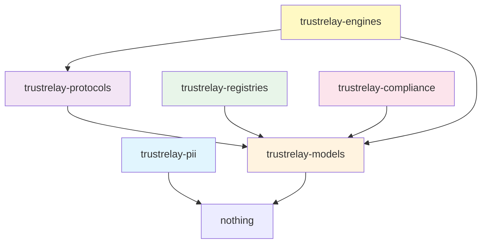

# Shared Packages

TrustRelay's portable code is extracted into 6 standalone Python packages. Each package has its own `pyproject.toml`, test suite, and clean dependency graph. Atlas (or any Python application) can `pip install` exactly the packages it needs.

## Package Overview

| Package | Description | Lines | Dependencies |
|---------|-------------|-------|-------------|
| **trustrelay-models** | Pydantic types — the typed contracts (43 files) | ~6,400 | pydantic |
| **trustrelay-protocols** | Protocol interfaces Atlas implements (9 files) | ~440 | models |
| **trustrelay-registries** | 12-country company registry library (38 files) | ~7,700 | models, httpx |
| **trustrelay-engines** | Decision algorithms + compliance features (16 files) | ~4,700 | models, protocols |
| **trustrelay-compliance** | GoAML, evidence, ref data, prompts, segments, conclusions (21 py + 71 data) | ~5,300 | models, pyyaml |
| **trustrelay-pii** | AES-256-GCM encryption, HMAC search (8 files) | ~660 | cryptography |

## Dependency Graph



## Installation

```bash
# Install individual packages
pip install -e packages/trustrelay-models
pip install -e packages/trustrelay-protocols

# Install all packages
pip install -e packages/trustrelay-models \
            -e packages/trustrelay-pii \
            -e packages/trustrelay-protocols \
            -e packages/trustrelay-registries \
            -e packages/trustrelay-engines \
            -e packages/trustrelay-compliance
```

## Quick Start

### Using typed models

```python
from trustrelay_models.case import CaseResponse, CaseStatus
from trustrelay_models.governance import PreExecutionCheck

# All models are Pydantic v2 — validated, serializable, documented
check = PreExecutionCheck(
    case_id="case-001",
    agent_name="registry_agent",
    iteration=1,
    prior_sanctions_hits=2,
)
```

### Implementing a Protocol

```python
from trustrelay_protocols.governance import GovernanceEngineProtocol
from trustrelay_models.governance import PreExecutionCheck, PreExecutionResult

class MyGovernanceEngine:
    def pre_execution_check(self, check: PreExecutionCheck) -> PreExecutionResult:
        # Your implementation here
        ...

# Structural typing — no inheritance required
engine = MyGovernanceEngine()
assert isinstance(engine, GovernanceEngineProtocol)
```

### Using decision engines

```python
from trustrelay_engines.review_scheduler import compute_review_schedule
from trustrelay_engines.document_expiry import compute_expiry
from trustrelay_engines.risk_override import validate_risk_override
from trustrelay_engines.case_completeness import compute_completeness
from datetime import datetime, timezone

# Review scheduling (AMLR Art. 26(2))
schedule = compute_review_schedule("high", datetime.now(timezone.utc))
print(f"Next review in {schedule.interval_months} months")

# Document expiry tracking
expiry = compute_expiry("ubo_register_extract", datetime.now(timezone.utc))
print(f"Expires: {expiry.expires_at}")

# Risk override validation (one-way ratchet)
result = validate_risk_override("medium", "high", "Sanctions hit found", "officer-1")
print(f"Allowed: {result.allowed}")  # True — escalation OK
```

### Loading the workflow schema

```python
import yaml
from pathlib import Path

workflow = yaml.safe_load(
    (Path("packages/trustrelay-compliance/src/trustrelay_compliance/workflows/kyb_standard.yaml")).read_text()
)
print(f"States: {len(workflow['states'])}")      # 14
print(f"Signals: {len(workflow['signals'])}")     # 5
print(f"Phases: {len(workflow['phases'])}")        # 6
```

## Package Details

### trustrelay-models

The foundation package. Contains 41 Pydantic model files covering:

- Case lifecycle (`CaseResponse`, `CaseStatus`, `CaseCreateRequest`)
- Governance (`PreExecutionCheck`, `GovernanceViolation`, ...)
- EVOI decision theory (`BeliefState`, `EVOIResult`, `AgentManifest`)
- Risk assessment (EBA dimensions, risk matrix)
- Entity models (canonical entities, company profiles)
- Regulatory classifications
- API response models (costs, graph, memory)

### trustrelay-protocols

8 Protocol interfaces defining service boundaries:

- **GovernanceEngineProtocol** — deterministic safety enforcement
- **EVOIEngineProtocol** — expected value of investigation
- **DecisionServiceProtocol** — officer decision processing
- **AuditProtocol** — compliance event logging
- **BrandingProtocol** — tenant branding management
- **CostCalculationProtocol** — agent cost computation
- **MonitoringProtocol** — continuous monitoring checks
- **EntityBaselineProtocol** — entity baseline tracking

### trustrelay-registries

12-country company registry library with the `DataProvider` ABC:

| Country | Registries |
|---------|-----------|
| Belgium | KBO/BCE, NBB CBSO |
| France | INPI, INSEE, BODACC |
| Czech Republic | ARES, ISIR, Justice.cz |
| Netherlands | KVK, Jaarrekeningen |
| Switzerland | Zefix |
| Denmark | CVR |
| Estonia | Ariregister |
| Finland | YTJ/PRH |
| Norway | Brreg, Regnskapsregisteret |
| Romania | ANAF, ONRC, Nomenclator |
| Slovakia | ORSR, RUZ |

### trustrelay-engines

Decision algorithms plus compliance features (16 modules):

- **GovernanceEngine** — mandatory agent enforcement, output validation, memory protection
- **EVOIEngine** — expected value of investigation computation
- **EBA Risk Matrix** — 5-dimension risk scoring with SHA-256 audit
- **Confidence Engine** — 4-dimension evidence confidence scoring
- **Red Flag Engine** — country-specific reasoning template evaluation
- **Cross Reference** — evidence corroboration matrix
- **Entity Matcher** — deduplication with blocking keys
- **Survivorship** — trust-weighted field resolution
- **Review Scheduler** — periodic KYC review by risk tier (AMLR Art. 26(2))
- **Document Expiry** — per-type document validity tracking
- **Risk Override** — one-way ratchet validation (escalation OK, suppression blocked)
- **Case Completeness** — weighted section scoring across 6 dimensions
- **Monitoring Checks** — continuous monitoring change detection (EORI, VoP, company status, UBO, sanctions)
- **Risk Questionnaire** — structured KYB risk questionnaire with EBA dimension scoring
- **KYC Questionnaire** — individual KYC risk assessment (diamond trader, PEP, sanctions)

### trustrelay-compliance

Regulatory reporting, reference data, prompts, segments, and workflow schemas (21 Python files + 71 data files):

- **GoAML/SAR Export** — FATF standard XML generation with 11 country profiles
- **Evidence Bundles** — EU AI Act Art. 12 automatic logging
- **Reasoning Templates** — 6 country-specific red flag rule sets
- **Workflow YAML** — 4 declarative workflow schemas (KYB standard, KYB onboarding, periodic review, vendor due diligence)
- **Reference Data** — 12 JSON datasets (FATF black/grey lists, EU high-risk countries, CPI, PEP tiers, sanctions defaults, industry risk, product risk, UBO thresholds, EU tax blacklist, secrecy jurisdictions)
- **Prompt Templates** — 36 Jinja2 templates for OSINT agents, synthesis, document extraction, sanctions resolution, and more
- **Segment Profiles** — 8 regulatory segment YAML definitions (banking, precious metals, customs, HVG, professional services, PSP, CZ banking)
- **Written Conclusion** — structured HTML compliance decision report with officer attestation and review scheduling

### trustrelay-pii

PII protection primitives:

- AES-256-GCM field-level encryption
- HMAC-SHA256 search hashes (query without decryption)
- 6-tier `PIICategory` classification
- Key provider with rotation support

## New Features (April 2026)

All features are implemented, tested, and included in the shared packages:

| Feature | Package | Description |
|---------|---------|-------------|
| Review scheduling (#11) | trustrelay-engines | Periodic KYC review by risk tier per AMLR Art. 26(2) |
| Decision conclusion (#12) | trustrelay-compliance | Structured HTML written conclusion with officer attestation |
| Document expiry (#13) | trustrelay-engines | Per-type document validity tracking with configurable rules |
| Monitoring checks (#14) | trustrelay-engines | Continuous monitoring change detection (EORI, VoP, company status, UBO, sanctions) |
| Risk override (#15) | trustrelay-engines | One-way ratchet validation -- escalation OK, suppression blocked |
| Case completeness (#16) | trustrelay-engines | Weighted section scoring across 6 dimensions |
| Portal guidance (#17) | app layer | Contextual guidance for portal users (app-specific, not shared) |
| Risk questionnaire | trustrelay-engines | Structured KYB questionnaire with EBA dimension scoring and AI pre-fill |
| Individual KYC models | trustrelay-models | Natural person profiles (diamond trader, UBO, director) with KYC config |
| KYC questionnaire | trustrelay-engines | Individual risk assessment -- diamond sector, Kimberley Process, source of wealth |

### Metrics

| Metric | Count |
|--------|-------|
| Total Python files | 161 |
| Total lines of code | 26,425 |
| Data files (JSON, YAML, Jinja2) | 71 |
| Test files | 20 |
| Total test functions | 127 |

## AWDC Gap Analysis

The AWDC (Antwerp World Diamond Centre) gap analysis identified 6 compliance gaps for diamond sector KYB/KYC. All 6 are now closed:

| Gap | Solution | Package |
|-----|----------|---------|
| No individual KYC (natural person) | `IndividualProfile`, `PersonType`, `KYC_DIAMOND_TRADER_CONFIG` | trustrelay-models |
| No diamond-specific risk questions | `KYC_INDIVIDUAL_QUESTIONNAIRE` with Kimberley Process, rough diamonds, conflict zones | trustrelay-engines |
| No structured risk questionnaire | `KYB_STANDARD_QUESTIONNAIRE` + `evaluate_questionnaire()` with EBA dimension scoring | trustrelay-engines |
| No written conclusion export | `ConclusionReportData` + `render_conclusion_html()` for regulatory-ready PDF | trustrelay-compliance |
| No continuous monitoring | `monitoring_checks.py` with 5 check types (EORI, VoP, company status, UBO, sanctions) | trustrelay-engines |
| No review scheduling | `compute_review_schedule()` with risk-based intervals per AMLR Art. 26(2) | trustrelay-engines |
