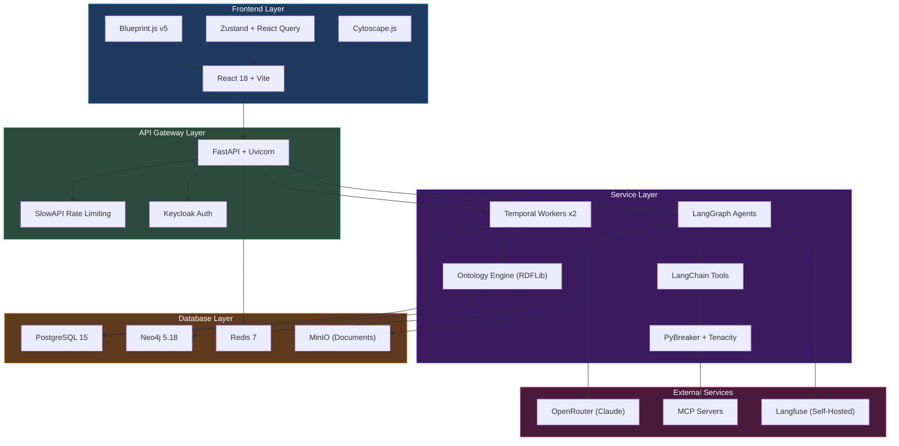

# Atlas — Tech Stack

Atlas is a full-stack KYB/KYC/AML compliance investigation platform built on Python and TypeScript. This page documents every major technology choice, organized by architectural layer.

## Production Dependencies

### Backend

| Technology | Version | Purpose |
|-----------|---------|---------|
| Python | 3.14 | Runtime |
| FastAPI | >=0.109 | HTTP API framework with automatic OpenAPI documentation |
| Pydantic | >=2.5 | Data validation, serialization, and model definitions |
| pydantic-settings | >=2.1 | Configuration management from environment variables and `.env` files |
| Uvicorn | latest | ASGI server with standard extras |

### AI Framework

| Technology | Version | Purpose |
|-----------|---------|---------|
| LangGraph | 1.0.10 | Pipeline orchestration -- investigation modules are LangGraph nodes executing in parallel |
| LangChain | 1.2.10 | Agent framework -- wraps LLM calls, tool invocations, and structured output behind a unified interface |
| langchain-mcp-adapters | 0.2.2 | MCP tool integration -- bridges MCP servers into the LangChain tool ecosystem |
| langchain-anthropic | 1.4.0 | Claude model adapter for direct Anthropic API access |
| langchain-openai | 1.1.12 | OpenAI model adapter for GPT-series models |
| langchain-openrouter | >=0.0.2 | OpenRouter multi-model gateway adapter |
| langchain-ollama | >=0.3.0 | Local model adapter for self-hosted LLMs via Ollama |
| langchain-core | 1.2.23 | Core abstractions shared across all LangChain adapters |

### LLM Gateway

| Technology | Version | Purpose |
|-----------|---------|---------|
| OpenRouter | -- | Primary multi-model routing gateway. Allows per-agent model selection without managing multiple API keys |

Atlas uses a three-tier model strategy through OpenRouter:

| Tier | Model | Use Case | Cost Profile |
|------|-------|----------|-------------|
| Primary | `claude-3.7-sonnet` | Investigation module agents -- quality-critical analysis | Standard |
| Fast | `claude-3.5-haiku` | Quick classification, entity extraction, report Stage 1 | ~82% cheaper |
| Reasoning | `claude-3.7-sonnet:thinking` | Complex risk analysis requiring extended chain-of-thought | Premium |

The `ModelFactory` supports fallback to direct Anthropic/OpenAI APIs and local providers (Ollama, vLLM, LM Studio). Agent-specific model overrides are stored in the `agent_configurations` database table and loaded per-module at runtime.

### Database

| Technology | Version | Purpose |
|-----------|---------|---------|
| PostgreSQL | 15 | Primary relational store for investigations, entities, risk scores, configurations, and all structured data |
| asyncpg | >=0.29 | Async PostgreSQL driver for non-blocking database access |
| Neo4j | 5.18 | Knowledge graph for entity relationships, ownership chains, and network analysis (Community Edition with APOC plugin) |
| Redis | 7 | Cache layer and rate limiting backend |

PostgreSQL is the system of record. Neo4j is a derived view -- investigation entities are synced to the graph asynchronously via a detached child workflow, so investigation completion is never blocked by graph operations.

### Migrations

| Technology | Version | Purpose |
|-----------|---------|---------|
| Flyway | 10 | SQL schema migrations. 105+ versioned migration files (`V001__` through `V105__+`) executed as a Docker init container before the API starts |

Flyway runs as a separate container (`flyway/flyway:10-alpine`) with a `service_completed_successfully` dependency, guaranteeing the schema is fully up to date before any application container starts.

### Workflow Orchestration

| Technology | Version | Purpose |
|-----------|---------|---------|
| Temporal (server) | 1.24 | Durable workflow execution engine with automatic retry, cancellation, and persistent state |
| Temporal (Python SDK) | >=1.4 | Python client for defining workflows and activities |
| Temporal UI | 2.26.2 | Web-based workflow monitoring dashboard |

Atlas runs two separate Temporal workers as distinct containers:
- **Investigation worker** (`temporal-worker`) -- executes the 7-module investigation pipeline
- **Workflow engine worker** (`workflow-engine-worker`) -- executes dynamic compliance workflows defined via the Workflow Studio

### Authentication

| Technology | Version | Purpose |
|-----------|---------|---------|
| Keycloak | 26.0 | OIDC/JWT authentication and authorization with role-based access control |
| python-keycloak | >=4.0 | Keycloak admin SDK for user and realm management |
| keycloak-js | 26 | Frontend OIDC client library |

JWT validation middleware on every API request extracts tenant and user context for multi-tenant isolation. Role-based access control is enforced at the router level.

### Object Storage

| Technology | Version | Purpose |
|-----------|---------|---------|
| MinIO | latest | S3-compatible document and blob storage for investigation evidence, reports, and exports |

Atlas runs two MinIO instances: one dedicated to the application (documents, reports) and one for Langfuse event storage.

### Observability

| Technology | Version | Purpose |
|-----------|---------|---------|
| Langfuse | 3 | LLM tracing, cost tracking, prompt versioning, and evaluation scoring. Self-hosted with web UI, background worker, and dedicated storage |
| ClickHouse | 24.3 | Columnar analytics backend for Langfuse trace data |
| structlog | >=24.1 | Structured JSON logging throughout the backend |

The Langfuse deployment includes 5 containers: web UI, background worker, ClickHouse, MinIO (event storage), and init containers for database and bucket setup. Every LLM call is traced with token counts, latencies, cost, and prompt metadata.

### Resilience

| Technology | Version | Purpose |
|-----------|---------|---------|
| pybreaker | >=1.4 | Circuit breaker pattern for MCP server calls -- prevents cascading failures when external tools are degraded |
| tenacity | >=9.0 | Retry with exponential backoff and jitter for transient failures |
| slowapi | >=0.1.9 | Rate limiting on API endpoints to prevent abuse |

### Security

| Technology | Version | Purpose |
|-----------|---------|---------|
| slowapi | >=0.1.9 | Rate limiting on API endpoints |
| nh3 | >=0.2 | HTML sanitization for user-supplied content |

### Document Processing

| Technology | Version | Purpose |
|-----------|---------|---------|
| WeasyPrint | >=62.0 | PDF report generation from HTML/CSS templates via Jinja2 |
| pdfplumber | >=0.11 | PDF document parsing for extracting text and tables from uploaded documents |
| python-docx | >=1.2 | DOCX document parsing for Microsoft Word files |

### Semantic / Ontology

| Technology | Version | Purpose |
|-----------|---------|---------|
| rdflib | >=7.0 | RDF/SPARQL support for the ontology system -- entity type definitions, attribute schemas, and relationship validation |
| pyld | >=2.0.3 | JSON-LD processing for linked data serialization |

### Other Backend Libraries

| Technology | Purpose |
|-----------|---------|
| SQLAlchemy >=2.0.25 | ORM and query builder alongside asyncpg |
| Alembic >=1.13.0 | Available for additional migration needs |
| Celery >=5.3.0 | Background task queue for non-Temporal async jobs |
| python-whois | WHOIS domain lookups for DFWO module |
| dnspython | DNS resolution for domain analysis |
| shodan | Network intelligence for infrastructure analysis |
| minio >=7.2.0 | MinIO Python client for object storage operations |

## Frontend

### Framework and Build

| Technology | Version | Purpose |
|-----------|---------|---------|
| React | 18.2 | UI framework -- single-page application with client-side rendering |
| TypeScript | 5.4.2 | Type system for compile-time safety across the entire frontend |
| Vite | 7.3.1 | Build tool with hot module replacement for fast development cycles |
| react-router-dom | 7.14 | Client-side routing with nested layouts |

Atlas is a single-page application (SPA) with client-side routing. Vite provides sub-second hot module replacement during development and optimized production builds with tree-shaking and code splitting.

### UI Component Library

| Technology | Version | Purpose |
|-----------|---------|---------|
| Blueprint.js | 5.10+ | Enterprise UI component library (Palantir). Provides data-dense tables, trees, overlays, form controls, and context menus out of the box |

Blueprint.js packages used:
- `@blueprintjs/core` -- Foundation components (buttons, dialogs, toasts, tabs)
- `@blueprintjs/icons` -- SVG icon set
- `@blueprintjs/select` -- Searchable select, multi-select, and suggest components
- `@blueprintjs/table` -- High-performance data tables with virtualization

### State Management

| Technology | Version | Purpose |
|-----------|---------|---------|
| Zustand | 4.5 | Client state management with minimal boilerplate |
| TanStack React Query | 5.28 | Server state management with automatic caching, background refetching, and optimistic updates |

React Query integrates with `@tanstack/query-sync-storage-persister` for offline persistence, enabling the UI to display cached data immediately while background refetches update stale entries.

### Data Visualization

| Technology | Version | Purpose |
|-----------|---------|---------|
| Cytoscape.js | 3.28 | Graph visualization for entity relationships, ownership chains, and network analysis. Supports dagre and fcose layout algorithms |
| Recharts | 2.12 | Charts for risk distributions, investigation statistics, and timeline visualizations |
| d3-geo + world-atlas | -- | Geographic visualization for mapping company locations across jurisdictions |

### Forms and Validation

| Technology | Version | Purpose |
|-----------|---------|---------|
| react-hook-form | 7.72 | Performant form handling with uncontrolled components |
| Zod | 3.24 | Schema-based validation for form inputs and API response parsing |

### Interactive Components

| Technology | Version | Purpose |
|-----------|---------|---------|
| @dnd-kit | 6.3 | Drag-and-drop for the Workflow Studio visual builder |
| CodeMirror | 6 | Code and YAML editors for workflow schema configuration and prompt editing |

### Utilities

| Technology | Version | Purpose |
|-----------|---------|---------|
| @react-pdf/renderer | 4.3 | Client-side PDF generation for investigation reports and exports |
| swagger-ui-react | 5.32 | Embedded API documentation within the application settings |
| axios | -- | HTTP client for all backend API communication |

## CI/CD

| Technology | Version | Purpose |
|-----------|---------|---------|
| GitHub Actions | -- | CI/CD pipeline with self-hosted runners |
| Dependabot | -- | Weekly automated dependency update pull requests |

## Development Dependencies

### Backend Development

| Technology | Purpose |
|-----------|---------|
| pytest | Test framework |
| pytest-asyncio | Async test support |
| ruff | Python linter and formatter |
| mypy | Static type checking |
| pre-commit | Git hook management |

### Frontend Development

| Technology | Purpose |
|-----------|---------|
| Vitest | Unit and integration test framework |
| ESLint | JavaScript/TypeScript linting |
| Sass | CSS preprocessing for Blueprint.js theme customization |
| @testing-library/react | Component testing utilities |

## Architecture Diagram

## Deployment Topology

Atlas runs as a Docker Compose stack with 15+ containers. See [System Architecture](./architecture) for the full deployment diagram and initialization chain.

| Category | Containers | Count |
|----------|-----------|-------|
| Application | API, UI, 2 Temporal workers | 4 |
| Databases | PostgreSQL 15, Neo4j 5.18, Redis 7 | 3 |
| Orchestration | Temporal server, Temporal UI | 2 |
| Authentication | Keycloak 26, DB init, Flyway | 3 |
| Observability | Langfuse web, Langfuse worker, ClickHouse, Langfuse MinIO | 4 |
| Storage | Atlas MinIO | 1 |

Total: ~17 containers including init containers.
