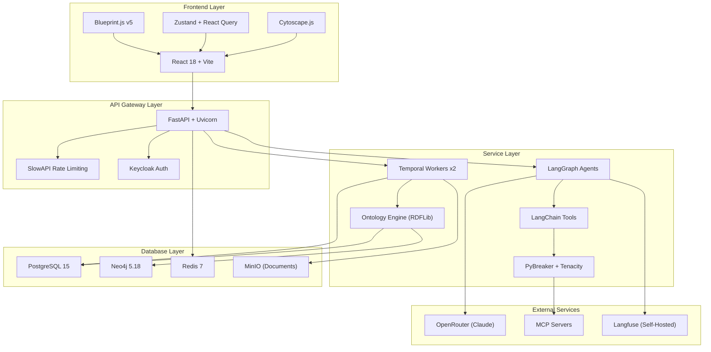

# Atlas — Technology Stack

Atlas is a Python/TypeScript full-stack KYB/KYC/AML compliance platform built by co-founder Valentin. This page documents every major technology choice in Atlas and compares it with Trust Relay's equivalent decisions. Understanding where the two systems converge and diverge is essential for planning their integration.

## Backend

### Language & Framework

Atlas runs on **Python 3.12-3.14** with **FastAPI** and **Pydantic v2** for request validation and settings management (`pydantic-settings`). The API server is served by **Uvicorn** with standard extras. This is identical to Trust Relay's backend stack, making shared code and libraries straightforward.

### AI / Agent Framework

Atlas uses **LangChain 1.2.10** with **LangGraph 1.0.10** as its agent orchestration layer. Agents are defined as LangGraph graphs where each investigation module is a node. The LangChain adapter pattern wraps LLM calls and tool invocations behind a unified interface:

| Dependency | Version |
|---|---|
| `langchain` | 1.2.10 |
| `langgraph` | 1.0.10 |
| `langchain-anthropic` | 1.4.0 |
| `langchain-openai` | 1.1.12 |
| `langchain-openrouter` | >=0.0.2 |
| `langchain-ollama` | >=0.3.0 |
| `langchain-core` | 1.2.23 |
| `langchain-mcp-adapters` | 0.2.2 |

Trust Relay uses **PydanticAI** with direct model calls instead of the LangChain abstraction layer. The trade-off: LangChain provides a broader tool ecosystem and model adapter coverage; PydanticAI gives tighter Pydantic integration and less indirection.

### Workflow Orchestration

Both systems use **Temporal** for durable workflow execution. Atlas pins `temporalio>=1.4.0`; Trust Relay pins `temporalio>=1.9`. The docker-compose runs `temporalio/auto-setup:1.24` with the Temporal UI at `temporalio/ui:2.26.2`.

Atlas runs **two separate Temporal workers** as distinct containers:
- `temporal-worker` — investigation workflow activities (`python -m src.temporal.worker`)
- `workflow-engine-worker` — workflow engine activities (`python -m src.workflows.worker`)

Trust Relay runs a single Temporal worker process.

### Database Access

Atlas uses **asyncpg** (>=0.29.0) for direct async PostgreSQL access alongside **SQLAlchemy** (>=2.0.25) and **Alembic** (>=1.13.0). Trust Relay also uses SQLAlchemy + asyncpg but has migrated to a Repository pattern with ORM models as the single source of truth.

### Resilience Patterns

Atlas has a dedicated resilience layer for MCP tool calls:

| Library | Purpose | Version |
|---|---|---|
| **PyBreaker** | Circuit breaker pattern for MCP servers | >=1.4.0 |
| **Tenacity** | Retry with exponential backoff | >=9.0.0 |
| **SlowAPI** | Rate limiting on API endpoints | >=0.1.9 |

Trust Relay handles retries at the Temporal activity level and does not currently use circuit breakers or explicit rate limiting middleware.

### Logging & Observability

Atlas uses **Structlog** (>=24.1.0) for structured JSON logging and **Langfuse** (>=3.0.0, self-hosted) for LLM observability. The Langfuse deployment includes a ClickHouse backend (`clickhouse/clickhouse-server:24.3`), a dedicated MinIO instance for event storage, and a web worker — 5 containers in total just for observability.

Trust Relay uses standard Python `logging` and does not yet have LLM-specific observability.

### PDF Generation

Atlas uses **WeasyPrint** (>=62.0) for generating PDF investigation reports from HTML/CSS templates. Trust Relay does not currently generate PDF reports.

### Other Notable Dependencies

| Library | Purpose |
|---|---|
| `python-keycloak` >=4.0.0 | Keycloak admin SDK |
| `rdflib` >=7.0.0 | RDF/OWL ontology support |
| `pyld` >=2.0.3 | JSON-LD processing |
| `celery` >=5.3.0 | Background task queue |
| `nh3` >=0.2.0 | HTML sanitization |
| `python-whois`, `dnspython`, `shodan` | OSINT domain tools |
| `pdfplumber`, `python-docx` | Document parsing |
| `minio` >=7.2.0 | Object storage client |

## Frontend

### Framework & Build

| Choice | Atlas | Trust Relay |
|---|---|---|
| React version | **18.2** | **19** |
| Meta-framework | None (SPA) | **Next.js 16** (SSR/RSC) |
| Build tool | **Vite** 7.3 | Next.js built-in (Turbopack) |
| TypeScript | 5.4 | 5.x |

Atlas is a single-page application with client-side routing via **React Router** v6. Trust Relay uses Next.js App Router with server components and server-side rendering.

### UI Component Library

Atlas uses **Blueprint.js v5** (`@blueprintjs/core`, `@blueprintjs/icons`, `@blueprintjs/select`, `@blueprintjs/table`). Blueprint provides data-dense enterprise UI components out of the box — tables, trees, overlays, and form controls.

Trust Relay uses **shadcn/ui** — a copy-paste component library built on Radix primitives and Tailwind CSS. shadcn gives full control over component source code but requires more assembly.

### State Management

| Concern | Atlas | Trust Relay |
|---|---|---|
| Client state | **Zustand** 4.5 | React `useState`/`useEffect` |
| Server state | **TanStack React Query** v5 | Axios + manual refetch |
| Form state | **React Hook Form** 7.72 + **Zod** 3.24 | Controlled components |
| Persistence | `@tanstack/query-sync-storage-persister` | None |

Atlas has a more mature state management architecture with Zustand stores, React Query caching with offline persistence, and form validation via Zod schemas. Trust Relay keeps state simpler by design (ADR-0010) but trades away offline support and automatic cache invalidation.

### Data Visualization

| Library | Atlas | Trust Relay |
|---|---|---|
| Graph visualization | **Cytoscape.js** 3.28 + dagre/fcose layouts | **ReactFlow** |
| Charts | **Recharts** 2.12 | **Recharts** |
| Maps | **d3-geo** + world-atlas TopoJSON | None |
| Drag & drop | **@dnd-kit** | None |

Atlas includes geographic visualization for mapping company locations across jurisdictions. Trust Relay focuses on network graph analysis through the Network Intelligence Hub with ReactFlow.

### Authentication

Atlas integrates **keycloak-js v26** for frontend authentication. Trust Relay defers authentication for PoC (ADR-0011) but plans Keycloak integration for production.

### Other Frontend Libraries

| Library | Purpose |
|---|---|
| `@react-pdf/renderer` | Client-side PDF generation |
| `@uiw/react-codemirror` | YAML/config editor |
| `swagger-ui-react` | Embedded API documentation |
| `axios` | HTTP client |

## Database Layer

### PostgreSQL

| Aspect | Atlas | Trust Relay |
|---|---|---|
| Version | **PostgreSQL 15** | **PostgreSQL 16** |
| Migration tool | **Flyway** 10 (100 versions) | **Alembic** (39 migrations) |
| Migration format | Numbered SQL files (`V001__` to `V100__`) | Python migration scripts |
| Container | `postgres:15-alpine` | `postgres:16` |

Atlas uses Java-based Flyway running as a separate Docker init container (`flyway/flyway:10-alpine`). Flyway executes before the API and worker containers start, enforced by `service_completed_successfully` dependency. Trust Relay uses Alembic integrated into the Python codebase with `alembic upgrade head`.

### Neo4j

Both systems use **Neo4j 5.18 Community Edition** with the APOC plugin for graph analytics. Atlas connects via `neo4j>=5.18.0`; Trust Relay uses the same driver version. Both use Neo4j for entity relationship visualization, ownership trees, and network analysis.

### Redis

Atlas runs **Redis 7** (`redis:7-alpine`) for caching and Langfuse event processing. Trust Relay also uses Redis 7 for caching.

## AI / LLM Configuration

### Model Selection

Atlas uses **OpenRouter** as its LLM gateway, routing to Anthropic models:

| Tier | Model | Use Case |
|---|---|---|
| Primary | `claude-3.7-sonnet` | Investigation module agents |
| Fast | `claude-3.5-haiku` | Quick classification, entity extraction |
| Reasoning | `claude-3.7-sonnet:thinking` | Complex risk analysis requiring chain-of-thought |

Trust Relay uses a **cost-optimized model tier system** (ADR-0029) with direct API calls via PydanticAI. Models are selected per-agent based on task complexity and cost constraints.

### LLM Observability

Atlas deploys a **self-hosted Langfuse** stack for complete LLM observability:

| Component | Image | Purpose |
|---|---|---|
| `langfuse-web` | `langfuse/langfuse:3` | Web UI and API |
| `langfuse-worker` | `langfuse/langfuse-worker:3` | Background trace processing |
| `langfuse-clickhouse` | `clickhouse/clickhouse-server:24.3` | Columnar storage for traces |
| `langfuse-minio` | `minio/minio:latest` | S3 storage for events/exports |

This gives Atlas full trace visibility: token counts, latencies, cost tracking, prompt versioning, and evaluation scores. Trust Relay does not yet have LLM-specific observability but captures agent outputs through evidence bundles and audit logs.

## Infrastructure Services

### Object Storage (MinIO)

Atlas runs **two separate MinIO instances**:

| Instance | Purpose | Ports |
|---|---|---|
| `langfuse-minio` | Langfuse event/export storage | Internal only |
| `atlas-minio` | Document service (DOC-01) | 9002 (API), 9092 (console) |

Trust Relay runs a single MinIO instance on ports 9000/9001.

### Authentication (Keycloak)

Atlas runs **Keycloak 26.0** (`quay.io/keycloak/keycloak:26.0`) on port 8180 with its own PostgreSQL database. Keycloak is fully wired into both frontend and backend. Trust Relay plans Keycloak but defers it for PoC.

## Architecture Diagram

## Full Technology Comparison

| Layer | Atlas | Trust Relay |
|---|---|---|
| **Language** | Python 3.12-3.14 | Python 3.11+ |
| **API Framework** | FastAPI + Pydantic v2 | FastAPI + Pydantic v2 |
| **Agent Framework** | LangChain 1.2.10 + LangGraph 1.0.10 | PydanticAI + AG-UI |
| **Workflow Engine** | Temporal (temporalio >=1.4.0) | Temporal (temporalio >=1.9) |
| **DB Access** | asyncpg + SQLAlchemy + Alembic | SQLAlchemy + asyncpg (Repository pattern) |
| **Rate Limiting** | SlowAPI | None (PoC) |
| **Circuit Breakers** | PyBreaker | None |
| **Retries** | Tenacity | Temporal retry policy |
| **Logging** | Structlog (structured JSON) | Python logging |
| **LLM Observability** | Langfuse (self-hosted, 5 containers) | Audit log + evidence bundles |
| **PDF Generation** | WeasyPrint | None |
| **Ontology** | RDFLib + JSON-LD (pyld) | N/A |
| **React** | 18.2 | 19 |
| **Meta-framework** | None (Vite SPA) | Next.js 16 |
| **UI Library** | Blueprint.js v5 | shadcn/ui |
| **State Management** | Zustand + React Query | useState/useEffect |
| **Forms** | React Hook Form + Zod | Controlled components |
| **Graph Viz** | Cytoscape.js | ReactFlow |
| **Charts** | Recharts | Recharts |
| **Auth (Frontend)** | keycloak-js v26 | Deferred (ADR-0011) |
| **PostgreSQL** | 15 (Flyway, 100 migrations) | 16 (Alembic, 39 migrations) |
| **Neo4j** | 5.18 Community | 5.18 Community |
| **Redis** | 7 | 7 |
| **Object Storage** | MinIO x2 (docs + Langfuse) | MinIO x1 |
| **LLM Gateway** | OpenRouter | Direct API (PydanticAI) |
| **Primary Model** | claude-3.7-sonnet | claude-3.7-sonnet |
| **Fast Model** | claude-3.5-haiku | claude-3.5-haiku |
| **Docker Services** | ~15 containers | ~9 containers |
