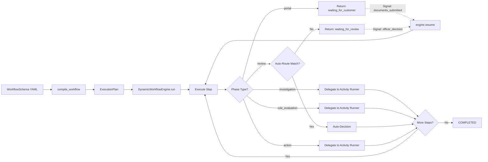
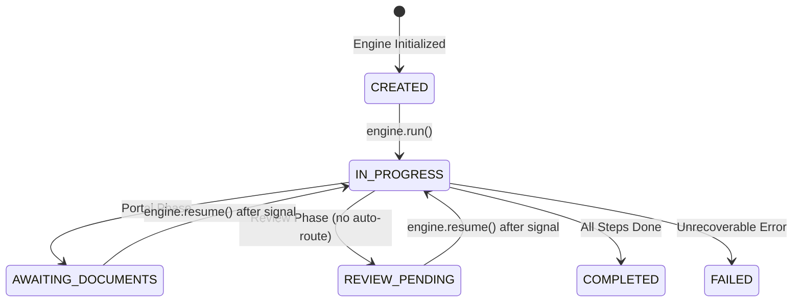

# Atlas — Workflow Engine

Atlas includes a declarative, YAML-based compliance workflow engine backed by Temporal for durable execution. Compliance workflows are authored as structured YAML schemas, validated and compiled at design time, and interpreted at runtime by a generic state machine that handles investigation dispatch, human review gates, risk scoring, customer data collection, and post-decision actions -- all without writing custom workflow code per use case.

## Architecture Overview

The workflow system spans three layers:

| Layer | Components | Purpose |
|-------|-----------|---------|
| **Schema** | `WorkflowSchema`, `WorkflowPhase`, `PhaseType` | YAML definition with Pydantic v2 validation |
| **Compiler** | `compile_workflow()`, `_topological_sort()`, `_detect_parallel_groups()` | Kahn's topological sort, parallel group detection, structural validation |
| **Engine** | `DynamicWorkflowEngine`, `DynamicWorkflowState`, `evaluate_condition()`, `should_auto_decide()` | State machine execution, pause/resume, conditional routing |

## Phase Types

The engine supports five phase types, each with distinct execution semantics:

| Phase Type | Purpose | Key Configuration Fields | Execution Behavior |
|-----------|---------|--------------------------|-------------------|
| `portal` | Customer-facing data collection | `steps` (form fields, document requirements), `timeout_hours`, `max_reminders` | Returns immediately with `waiting_for_customer`; resumes on external signal |
| `investigation` | Automated OSINT due diligence | `modules` (list of investigation module IDs), `timeout_hours` | Delegates to activity runner; runs investigation modules |
| `rule_evaluation` | Automated risk scoring via EBA matrix | `risk_matrix` (type, dimensions, weights, source fields), `gate` | Delegates to activity runner; produces risk scores |
| `review` | Human review with SLA and escalation | `assignee_role`, `sla_hours`, `decision_options`, `routes`, `escalation` | Evaluates auto-routes first; falls through to manual review if no match |
| `action` | Post-decision steps (entity creation, notifications, scheduling) | `action_steps`, `condition` | Conditionally executed based on prior phase outcomes |

## Workflow Schema Structure

Schemas are strongly-typed YAML definitions validated by Pydantic v2 models. A schema defines the complete compliance workflow: phases, dependencies, gates, routes, escalation policies, and audit requirements.

### Top-Level Schema

```yaml
schema_id: kyb_onboarding_v1
name: "KYB Standard Onboarding"
version: 1
category: kyb
description: >
  Standard KYB onboarding with portal collection, investigation,
  risk scoring, conditional routing, and post-decision actions.

inputs:
  - name: company_name
    type: string
    required: true
  - name: registration_number
    type: string
    required: false

subject_entity_types:
  - LegalEntity

phases:
  # ... phase definitions (see below)

audit:
  retention_years: 5
  hash_evidence: true
```

### Portal Phase Example

```yaml
- id: data_collection
  name: "Customer Data Collection"
  type: portal
  depends_on: []
  steps:
    - id: company_details
      type: form
      fields:
        - id: legal_name
          type: text
          label: "Legal Name"
          required: true
        - id: registration_number
          type: text
          label: "Registration Number"
          required: true
    - id: document_upload
      type: document_collection
      required_documents:
        - type: certificate_of_incorporation
          accept: [pdf, jpg, png]
          required: true
        - type: shareholder_register
          accept: [pdf, xlsx]
          required: true
  config:
    timeout_hours: 168
    max_reminders: 3
```

### Investigation Phase Example

```yaml
- id: investigation
  name: "Company Investigation"
  type: investigation
  depends_on:
    - data_collection
  modules:
    - company_profile
    - ownership_structure
    - officer_analysis
    - sanctions_screening
    - adverse_media
    - financial_analysis
    - regulatory_check
  config:
    timeout_hours: 2
```

### Rule Evaluation Phase Example

```yaml
- id: risk_assessment
  name: "EBA Risk Assessment"
  type: rule_evaluation
  depends_on:
    - investigation
  risk_matrix:
    type: weighted_average
    dimensions:
      - id: customer_risk
        weight: 0.30
        source_fields:
          - mebo.ownership_layers
          - cir.jurisdiction_risk_level
      - id: geographic_risk
        weight: 0.25
        source_fields:
          - roa.country_risk_classification
      - id: product_service_risk
        weight: 0.20
        source_fields:
          - inputs.business_activity_codes
      - id: channel_risk
        weight: 0.15
        source_fields:
          - dfwo.website_exists
      - id: transaction_risk
        weight: 0.10
        source_fields:
          - inputs.expected_transaction_volume
```

### Review Phase with Conditional Routing

```yaml
- id: compliance_review
  name: "Compliance Review"
  type: review
  depends_on:
    - risk_assessment
  assignee_role: analyst
  sla_hours: 24
  routes:
    - id: auto_reject
      condition:
        operator: OR
        rules:
          - field: phases.investigation.sanctions_match
            operator: equals
            value: true
          - field: phases.risk_assessment.overall_score
            operator: greater_than
            value: 95
      action:
        type: auto_decision
        decision: reject
    - id: auto_approve
      condition:
        field: phases.risk_assessment.risk_level
        operator: in
        value: ["clear", "low"]
      action:
        type: auto_decision
        decision: approve
    - id: full_review
      condition:
        field: phases.risk_assessment.risk_level
        operator: in
        value: ["high", "critical"]
      action:
        type: human_review
        assignee_role: senior_officer
        sla_hours: 4
  decision_options:
    - id: approve
      label: "Approve Onboarding"
      requires_rationale: false
    - id: reject
      label: "Reject Onboarding"
      requires_rationale: true
    - id: escalate
      label: "Escalate to Senior Officer"
      requires_rationale: true
  escalation:
    levels:
      - role: analyst
        sla_hours: 24
      - role: senior_officer
        sla_hours: 48
      - role: mlro
        sla_hours: 72
    notification_at_pct: 0.75
```

### Action Phase with Conditional Execution

```yaml
- id: activation
  name: "Customer Activation"
  type: action
  depends_on:
    - compliance_review
  condition:
    field: phases.compliance_review.decision
    operator: in
    value: [approve]
  action_steps:
    - id: create_customer_record
      action: create_entity
      entity_type: Customer
      map_from:
        source: phases.data_collection
        fields: [legal_name, registration_number, country_code]
    - id: set_review_schedule
      action: schedule_review
      config:
        low_risk: { months: 36 }
        medium_risk: { months: 12 }
        high_risk: { months: 6 }
        based_on: phases.risk_assessment.risk_level
    - id: enable_monitoring
      action: activate_pkyc
      config:
        triggers:
          - sanctions_update
          - registry_change
          - adverse_media
          - ownership_change
    - id: notify_approval
      action: notification
      template: onboarding_approved
      channel: [email, in_app]
      recipient: inputs.requesting_entity
```

## Schema Compiler

The `compile_workflow()` function transforms a `WorkflowSchema` into an `ExecutionPlan` with topologically sorted steps and parallel group detection. Invalid schemas are rejected at compile time -- they never reach the runtime engine.

### Compilation Pipeline

1. **Structural Validation** -- Checks for non-empty `schema_id`, at least one phase, no duplicate phase IDs, and all `depends_on` references pointing to existing phases.
2. **Topological Sort (Kahn's Algorithm)** -- Builds an adjacency list and in-degree map from phase dependencies. BFS from zero-in-degree nodes produces a deterministic ordering. Circular dependencies are detected when the sorted output length does not match the phase count.
3. **Parallel Group Detection** -- Groups phases with identical dependency sets (frozen sets). Groups with two or more members can execute concurrently.

### ExecutionPlan Output

The compiler produces an `ExecutionPlan` dataclass:

| Field | Type | Description |
|-------|------|-------------|
| `schema_id` | `str` | Source workflow schema ID |
| `steps` | `list[ExecutionStep]` | Topologically sorted execution steps |
| `parallel_groups` | `list[list[str]]` | Groups of phase IDs that can run concurrently |
| `has_errors` | `bool` | Whether compilation produced errors |
| `errors` | `list[str]` | Error messages if compilation failed |

Each `ExecutionStep` contains `phase_id`, `phase_type`, `config`, and `depends_on`.

## Dynamic Workflow Engine

The `DynamicWorkflowEngine` is a generic state machine that interprets any compiled schema. One engine definition handles all compliance workflow variants.

### Execution Model



### State Machine



### DynamicWorkflowState

The `DynamicWorkflowState` dataclass is the single source of truth during execution:

| Field | Type | Description |
|-------|------|-------------|
| `schema_id` | `str` | Workflow schema identifier |
| `case_id` | `str` | Compliance case identifier |
| `status` | `str` | Current state: `CREATED`, `IN_PROGRESS`, `AWAITING_DOCUMENTS`, `REVIEW_PENDING`, `COMPLETED`, `FAILED` |
| `current_phase` | `str | None` | Currently active phase ID |
| `completed_phases` | `list[str]` | Phase IDs that have finished |
| `phase_results` | `dict[str, Any]` | Results keyed by phase ID |
| `context` | `dict[str, Any]` | Shared execution context (accumulated results from all prior phases) |
| `error` | `str | None` | Error message if status is `FAILED` |

### Signal Injection

The engine supports external signal injection for pause/resume patterns:

```python
engine = DynamicWorkflowEngine(schema)
state = await engine.run(case_id="case-1", activity_runner=runner)
# state.status == "AWAITING_DOCUMENTS"

engine.inject_signal("documents_submitted", {"files": [...]})
state = await engine.resume(activity_runner=runner)
# state.status == "REVIEW_PENDING" or "COMPLETED"
```

The Temporal workflow wrapper maps these signals to `workflow.wait_condition()` calls:
- Portal pause maps to `wait_condition(documents_submitted)`
- Review pause maps to `wait_condition(officer_decision)`
- Activity runner maps to `workflow.execute_activity()`

### Conditional Routing and Auto-Decisions

The `should_auto_decide()` function evaluates review phase routes against the accumulated execution context. Routes are evaluated in declaration order -- first match wins.

Supported condition operators:

| Operator | Description | Example |
|----------|-------------|---------|
| `equals` | Exact match | `risk_level == "high"` |
| `greater_than` | Numeric comparison | `risk_score > 95` |
| `less_than` | Numeric comparison | `risk_score < 30` |
| `in` | Set membership | `risk_level in ["clear", "low"]` |
| `OR` | Composite: any rule matches | Multiple rules combined |
| `AND` | Composite: all rules match | Multiple rules combined |

Auto-decision routes follow the principle: the system can ADD scrutiny but NEVER suppress risk signals. Auto-approve routes only fire on explicitly low-risk conditions.

### SLA Monitoring and Escalation Hierarchy

Review phases define an escalation chain with configurable SLA thresholds:

```yaml
escalation:
  levels:
    - role: analyst
      sla_hours: 24
    - role: senior_officer
      sla_hours: 48
    - role: mlro
      sla_hours: 72
  notification_at_pct: 0.75
```

The escalation hierarchy follows three tiers:

| Level | Role | Typical SLA | Authority |
|-------|------|-------------|-----------|
| 1 | `analyst` | 24h | First-line investigation and review |
| 2 | `senior_officer` | 48h | Escalated review, complex cases |
| 3 | `mlro` | 72h | Money Laundering Reporting Officer, final authority |

A warning notification fires at the configured percentage of elapsed SLA time (default 75%). If the current assignee does not act within their SLA window, the task escalates to the next level.

## Pre-Built Templates

Atlas ships three production-ready workflow templates:

### KYB Standard Onboarding (`kyb_onboarding_v1`)

| Property | Value |
|----------|-------|
| Category | `kyb` |
| Phases | 6 (portal, investigation, rule_evaluation, review, 2x action) |
| Phase Types | All 5 types |
| Investigation Modules | 7 (company_profile, ownership_structure, officer_analysis, sanctions_screening, adverse_media, financial_analysis, regulatory_check) |
| Risk Dimensions | 5 (customer 30%, geographic 25%, product/service 20%, channel 15%, transaction 10%) |
| Routes | 4 (auto_reject on sanctions/score>95, auto_approve on clear/low, simplified_review on medium, full_review on high/critical) |
| Escalation | analyst (24h) -> senior_officer (48h) -> mlro (72h) |
| Actions | Customer activation with entity creation, review scheduling, pKYC monitoring, and notification; rejection handling with notification |

### Periodic Customer Review (`periodic_review_v1`)

| Property | Value |
|----------|-------|
| Category | `periodic_review` |
| Phases | 5 (portal, investigation, rule_evaluation, review, action) |
| Investigation Modules | 6 (re-runs all except officer_analysis) |
| Risk Dimensions | 5 (adds historical_risk at 10%) |
| Routes | 3 (auto_approve unchanged low-risk, escalate high/critical, EDD loopback on critical via `route_to: re_investigation`) |
| Decision Options | Continue Relationship, Trigger Enhanced Due Diligence, Exit Relationship |
| Actions | Risk profile update, next review scheduling (3-36 months by risk level), monitoring activation |

### Vendor Due Diligence (`vendor_due_diligence_v1`)

| Property | Value |
|----------|-------|
| Category | `vendor_dd` |
| Phases | 3 (investigation, rule_evaluation, review) |
| Phase Types | No portal or action phases |
| Investigation Modules | 5 (focused: company_profile, ownership, sanctions, financials, regulatory) |
| Risk Dimensions | 4 (customer 35%, geographic 30%, product/service 20%, transaction 15%) |
| Escalation | procurement_officer (48h) -> vendor_compliance_manager (48h) -> cpo (48h) |
| Decision Options | Approve Vendor, Reject Vendor, Request Additional Information |

## Workflow Schema Viewer

The frontend provides a read-only workflow schema viewer at `/admin/workflows`:

- **Two-panel layout** -- Schema list on the left (264px), detail view on the right
- **Phase pipeline visualization** -- Vertical card chain with arrow connectors between phases
- **Phase type badges** -- Color-coded by type (blue=portal, teal=investigation, amber=rule_evaluation, purple=review, emerald=action)
- **Parallel group indicators** -- Phases that can execute concurrently are tagged with a "parallel" badge
- **Compilation status** -- Green checkmark for valid schemas, red alert with error list for invalid schemas
- **Phase detail extraction** -- Each phase card shows contextual details: step count for portals, module list for investigations, dimension count for rule evaluations, route count (with auto-route breakdown) for reviews, and action step names for actions
- **Skeleton loading** -- Skeleton placeholders during schema list and detail loading
- **Role-gated access** -- Requires `super_admin` role

## Role-Based Task Assignment

Tasks are routed to users based on 6 canonical workflow roles:

| Workflow Role | Domain |
|--------------|--------|
| `analyst` | First-line investigation and review |
| `senior_officer` | Escalated review, complex cases |
| `mlro` | Money Laundering Reporting Officer, final authority |
| `procurement_officer` | Vendor due diligence workflows |
| `vendor_compliance_manager` | Third-party compliance oversight |
| `cpo` | Chief Procurement Officer, strategic decisions |

## Document Management

Document handling within workflow phases uses MinIO (S3-compatible) object storage:

- **Presigned upload URLs** -- Generated for secure direct-to-storage uploads
- **SHA-256 checksum confirmation** -- Upload integrity verified via checksum on confirmation
- **Presigned download URLs** -- Generated for secure document retrieval
- **Document listing** -- Filtered by execution and phase

## Workflow History and Audit Trail

Every workflow execution maintains a complete audit trail:

- Phase start/complete timestamps
- Decision records with rationale and `decided_by`
- Evidence hashing (SHA-256) for tamper detection
- Auto-decision records from route evaluation
- SLA breach and escalation events
- Audit retention configurable per schema (default: 5 years)

## API Endpoints

### Schema Management

| Method | Endpoint | Description |
|--------|----------|-------------|
| `GET` | `/api/workflow-schemas` | List all available workflow schemas |
| `GET` | `/api/workflow-schemas/{schema_id}` | Get schema detail with compiled execution plan |

### Execution

| Method | Endpoint | Description |
|--------|----------|-------------|
| `POST` | `/workflows/` | Start workflow execution |
| `GET` | `/workflows/{id}` | Get execution status |
| `POST` | `/workflows/{id}/phases/{phase_id}/decision` | Submit review decision |
| `POST` | `/workflows/{id}/phases/{phase_id}/data` | Submit portal form data |
| `GET` | `/workflows/{id}/audit` | Get full audit trail |

### Documents

| Method | Endpoint | Description |
|--------|----------|-------------|
| `POST` | `/workflows/documents/upload-url` | Generate presigned upload URL |
| `POST` | `/workflows/documents/{id}/confirm` | Confirm upload with SHA-256 checksum |
| `GET` | `/workflows/documents/{id}/download-url` | Generate presigned download URL |
| `GET` | `/workflows/documents` | List documents by execution/phase |

### Tasks

| Method | Endpoint | Description |
|--------|----------|-------------|
| `GET` | `/workflows/tasks` | Get tasks for current user's roles |
