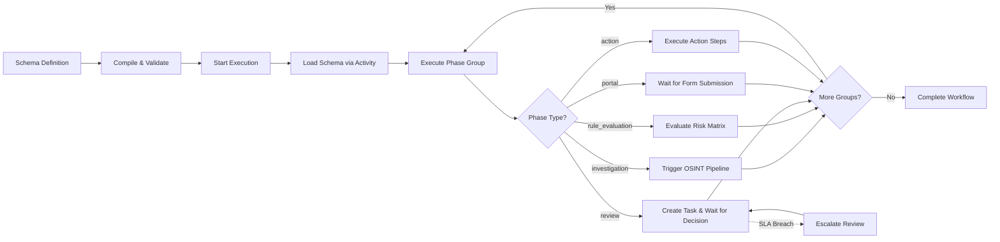
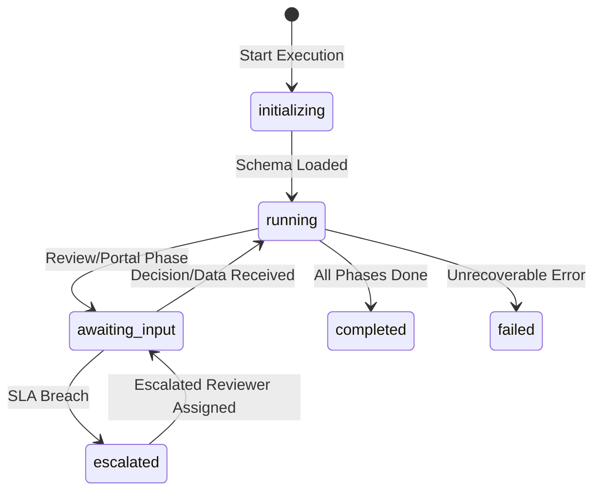

# Atlas — Workflow Studio

Atlas includes a full-featured **Workflow Studio** for creating, executing, and monitoring compliance workflows. The studio combines a visual builder, a rule-based execution engine backed by Temporal, role-based task routing, and a complete audit trail -- all configurable through YAML schemas validated at compile time.

## Architecture Overview

The workflow system spans three layers:

| Layer | Components | Purpose |
|-------|-----------|---------|
| **Schema** | `WorkflowSchema`, `WorkflowCompiler`, `WorkflowSchemaCache` | YAML definition, compile-time validation, in-memory caching |
| **Engine** | `DynamicComplianceWorkflow`, `GateEvaluator`, `WorkflowContext` | Temporal-based execution, conditional routing, state management |
| **Builder** | `SchemaGenerator`, `SemanticValidator`, `RequirementExtractor` | AI-powered schema generation from documents |

## Workflow Schemas

Workflow schemas are strongly-typed YAML definitions validated by Pydantic v2 models. A schema defines the complete compliance workflow -- phases, gates, routes, escalation policies, and audit requirements.

### Schema Structure

```yaml
workflow_id: kyb-standard
name: KYB Standard Investigation
version: 1
category: kyb
description: Standard KYB workflow with investigation and review
inputs:
  - name: company_name
    type: string
    required: true
phases:
  - id: investigation
    name: Initial Investigation
    type: investigation
    modules: [cir, roa, mebo, spepws, amlrr]
  - id: risk_evaluation
    name: Risk Scoring
    type: rule_evaluation
    depends_on: [investigation]
    risk_matrix:
      type: weighted_average
      dimensions:
        - id: jurisdiction
          source_fields: [country_code]
          weight: 1.5
  - id: review
    name: Analyst Review
    type: review
    depends_on: [risk_evaluation]
    assignee_role: analyst
    sla_hours: 24
    decision_options:
      - id: approve
        label: Approve
      - id: reject
        label: Reject
        requires_rationale: true
      - id: escalate
        label: Escalate to MLRO
    escalation:
      levels:
        - role: analyst
          sla_hours: 24
        - role: senior_officer
          sla_hours: 48
        - role: mlro
          sla_hours: 72
      notification_at_pct: 0.75
audit:
  retention_years: 5
  hash_evidence: true
```

### Phase Types

The workflow engine supports five phase types:

| Phase Type | Purpose | Key Fields |
|-----------|---------|------------|
| `investigation` | Run OSINT investigation modules | `modules` (list of crew types) |
| `review` | Human review with SLA and escalation | `assignee_role`, `sla_hours`, `decision_options`, `escalation` |
| `rule_evaluation` | Automated risk scoring via EBA matrix | `risk_matrix`, `rulesets` |
| `portal` | Customer data collection with forms | `steps` (form fields, document requirements) |
| `action` | Post-decision actions (entity creation, notifications) | `action_steps` |

### Compile-Time Validation

The `WorkflowCompiler` transforms a `WorkflowSchema` into a `CompiledWorkflow` with topologically sorted parallel groups. Invalid schemas are rejected at compile time -- they never reach runtime.

Validation includes:
- Phase dependency resolution (Kahn's topological sort)
- Gate condition syntax checking
- Role vocabulary validation against 6 canonical roles
- Field type validation for portal forms (10 supported field types)
- Semantic validation via `SemanticValidator` (detects orphan phases, missing dependencies, dead routes)

## Workflow Builder

The Workflow Builder provides an AI-powered schema generation pipeline:

1. **Document Upload** -- Upload regulatory requirements or compliance procedures
2. **Requirement Extraction** -- AI extracts compliance requirements from documents
3. **Capability Mapping** -- Maps requirements to available investigation modules
4. **Schema Generation** -- Generates a complete YAML workflow schema
5. **Semantic Validation** -- Validates the generated schema for correctness
6. **Human Review** -- Analyst reviews, edits, and approves the schema

Builder sessions track the full generation lifecycle with clarification loops:

```
POST /workflows/builder/sessions                        -- Create session (upload docs)
POST /workflows/builder/sessions/upload                 -- Upload document for parsing
GET  /workflows/builder/sessions                        -- List sessions
GET  /workflows/builder/sessions/{id}                   -- Get session status
POST /workflows/builder/sessions/{id}/clarification     -- Answer clarification questions
POST /workflows/builder/sessions/{id}/approval          -- Approve or reject generated schema
```

## Workflow Engine

The engine is a **generic Temporal workflow** (`DynamicComplianceWorkflow`) that interprets any compiled schema. One workflow definition handles all compliance scenarios.

### Execution Model



### State Machine



### Key Architectural Constraints

These constraints are enforced by design (from 16-CONTEXT.md):

| Constraint | Rule |
|-----------|------|
| **D-04** | Parallel phases as child workflows, not `asyncio.gather` |
| **D-05** | Continue-As-New after each phase group to bound event history |
| **D-06** | `asyncio.gather` forbidden in workflow code |
| **D-07** | All state initialized in `__init__` -- signal handlers safe immediately |
| **D-08** | Queries return in-memory state only -- no I/O in query handlers |

### Conditional Routing and Loopback

The `GateEvaluator` supports conditional phase execution and route-based loopback:

- **Simple conditions**: `risk_score > 70` evaluated against accumulated context
- **Structured conditions**: `{field: "risk_level", operator: "equals", value: "high"}` with `in`, `not_in`, `contains` operators
- **Phase loopback** (INTERP-03): Routes can jump back to earlier phases (e.g., EDD routing), capped at 3 loops to prevent infinite cycles
- **Auto-decisions**: Routes can auto-approve or auto-reject based on rule evaluation results

## Workflow Activities

The engine dispatches work through 8 Temporal activity modules:

| Activity Module | Purpose |
|----------------|---------|
| `schema_activities` | Load compiled workflow schema from DB |
| `investigation_activities` | Trigger Atlas investigation pipeline |
| `review_activities` | Notify reviewers, SLA warnings, escalation |
| `audit_activities` | Persist decisions, audit entries with evidence hashing |
| `rule_activities` | Evaluate risk matrix and rulesets |
| `portal_activities` | Validate portal form completeness |
| `task_activities` | Create and complete workflow tasks |
| `action_activities` | Execute post-decision action steps |

## Role-Based Task Assignment

Tasks are routed to users based on 6 canonical workflow roles that bridge Keycloak platform roles to fine-grained domain roles:

| Workflow Role | Domain |
|--------------|--------|
| `analyst` | First-line investigation and review |
| `senior_officer` | Escalated review, complex cases |
| `mlro` | Money Laundering Reporting Officer, final authority |
| `procurement_officer` | Vendor due diligence workflows |
| `vendor_compliance_manager` | Third-party compliance oversight |
| `cpo` | Chief Procurement Officer, strategic decisions |

Role assignments are stored in `workflow_role_assignments` table, mapping Keycloak `user_id` + `tenant_id` to workflow roles.

## Task Inbox

Users see their assigned work items through the Task Inbox:

- Tasks are created when a review or portal phase begins (`INBOX-01`)
- Filtered by the user's assigned workflow roles (`INBOX-02`)
- SLA deadlines are tracked per task (`INBOX-05`)
- Tasks are auto-completed when the phase finishes

## Evaluation Studio

The studio includes an **Evaluation Studio** for configuring risk evaluation logic:

- **Risk Matrix Schemas**: Define weighted dimensions (jurisdiction, industry, ownership complexity)
- **Risk Inputs**: Configure source fields and scoring rules
- **Live Preview**: Test evaluation against real company data
- **Schema Versioning**: Publish, archive, and diff matrix versions
- **Batch Re-evaluation**: Re-score entire portfolio when matrix changes

## Workflow History and Audit Trail

Every workflow execution maintains a complete audit trail (AUDIT-03):

- Phase start/complete timestamps
- Decision records with rationale and decided_by
- Evidence hashing (SHA-256) for tamper detection (AUDIT-02)
- Auto-decision records from route evaluation
- Phase loopback tracking
- SLA breach and escalation events

Audit entries are persisted via Temporal activities (not inline in workflow code) to maintain determinism.

## API Endpoints

### Schema Management

| Method | Endpoint | Description | Auth |
|--------|----------|-------------|------|
| POST | `/workflows/schemas` | Create and compile schema | Yes |
| POST | `/workflows/schemas/import` | Import schema from YAML file | Yes |
| GET | `/workflows/schemas` | List schemas (filter by category, active) | Yes |
| GET | `/workflows/schemas/{id}` | Get schema detail | Yes |
| PUT | `/workflows/schemas/{id}` | Update schema YAML, re-compile | Yes |
| POST | `/workflows/schemas/{id}/activate` | Activate schema version | Yes |
| POST | `/workflows/schemas/{id}/deactivate` | Deactivate schema version | Yes |
| POST | `/workflows/schemas/{id}/validate` | Validate via compilation + semantic checks | Yes |

### Execution

| Method | Endpoint | Description | Auth |
|--------|----------|-------------|------|
| POST | `/workflows/` | Start workflow execution | Yes |
| GET | `/workflows/{id}` | Get execution status (queries Temporal) | Yes |
| POST | `/workflows/{id}/phases/{phase_id}/decision` | Submit review decision | Yes |
| POST | `/workflows/{id}/phases/{phase_id}/data` | Submit portal form data | Yes |
| GET | `/workflows/{id}/audit` | Get full audit trail | Yes |

### Drafts

| Method | Endpoint | Description | Auth |
|--------|----------|-------------|------|
| GET | `/workflows/{id}/phases/{phase_id}/draft` | Get saved draft | Yes |
| PUT | `/workflows/{id}/phases/{phase_id}/draft` | Save draft (optimistic concurrency) | Yes |
| DELETE | `/workflows/{id}/phases/{phase_id}/draft` | Delete draft after submission | Yes |

### Tasks

| Method | Endpoint | Description | Auth |
|--------|----------|-------------|------|
| GET | `/workflows/tasks` | Get tasks for current user's roles | Yes |

### Documents

| Method | Endpoint | Description | Auth |
|--------|----------|-------------|------|
| POST | `/workflows/documents/upload-url` | Generate presigned upload URL | Yes |
| POST | `/workflows/documents/{id}/confirm` | Confirm upload with SHA-256 checksum | Yes |
| GET | `/workflows/documents/{id}/download-url` | Generate presigned download URL | Yes |
| GET | `/workflows/documents` | List documents by execution/phase | Yes |

## How Trust Relay Differs

Trust Relay's workflow system shares the same foundational concepts (the `WorkflowSchema` model was adopted from Atlas) but takes a different architectural approach:

| Aspect | Atlas | Trust Relay |
|--------|-------|-------------|
| **Schema authoring** | Visual builder + AI generation from documents | Declarative YAML with Kahn's topological sort compiler |
| **Execution engine** | `DynamicComplianceWorkflow` (generic interpreter) | Dedicated `ComplianceCaseWorkflow` (12-step state machine with iterative loops) |
| **Phase types** | 5 types (investigation, review, rule_evaluation, portal, action) | Investigation-first pipeline with pre-enrichment, gap analysis, and cross-referencing |
| **Task routing** | 6 canonical roles with Keycloak mapping | Officer-centric with autonomous/assisted/full-review tiers |
| **Portal** | Schema-driven forms within workflow phases | Standalone branded portal with token-based access |
| **Risk evaluation** | Inline `rule_evaluation` phase type | Separate EBA risk matrix service with 5-dimension weighted-max aggregation |
| **Builder** | AI-powered from regulatory documents | Manual YAML authoring (schema compiler validates) |
| **Loopback** | Capped at 3 loops via route evaluation | Unlimited follow-up iterations via officer decision signals |
