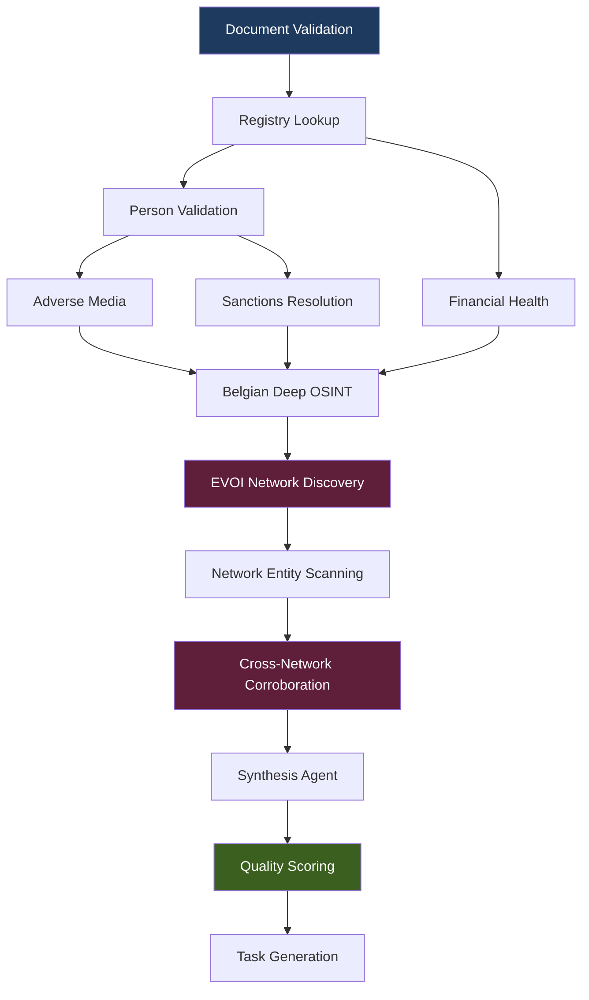
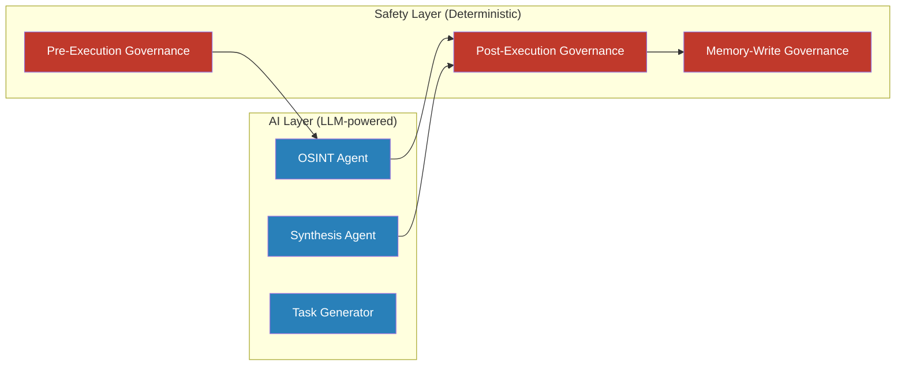
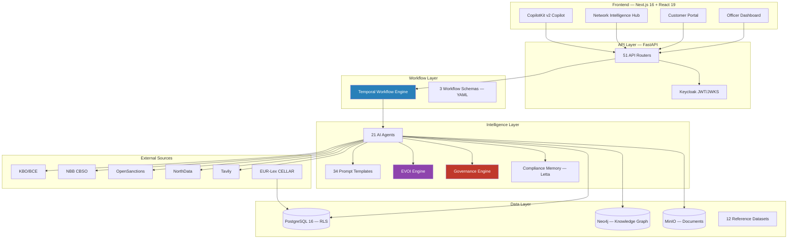

# Competitive Intelligence -- Why Trust Relay Wins

## Section 1: Executive Summary

Trust Relay is architecturally superior to every analyzed competitor because it is the only compliance platform that combines three capabilities no other vendor offers together: (1) a decision-theoretic investigation engine (EVOI) that mathematically determines optimal investigation depth using Bayesian belief states, (2) a deterministic governance layer that operates provably independently of all LLM components and cannot be prompt-injected, and (3) an iterative compliance workflow where investigations build cumulatively across multiple rounds of evidence collection, OSINT analysis, and officer review -- orchestrated by a durable Temporal workflow engine that survives infrastructure restarts. Every AI output carries input provenance, model identification, chain of thought, confidence scoring, and an immutable audit trail -- satisfying EU AI Act Articles 11-15 structurally, not as a retrofit. The platform covers the complete trust lifecycle (identify, verify, monitor, pay, prove) with an unbroken SHA-256 evidence chain. Competitors solve fragments of this problem. Trust Relay solves the whole thing.

---

## Section 2: Competitive Matrix -- Feature-by-Feature

The following matrix compares Trust Relay against 8 major competitors across 24 capability dimensions. Assessments are based on publicly available product documentation, analyst reports (Datos Insights 2025, Forrester Wave AML 2025, Chartis RiskTech100 2025), and direct architectural analysis as of March 2026.

**Legend:**
- ✅ Implemented and operational
- ⚠️ Partial implementation or limited capability
- ❌ Not available based on public documentation

### Investigation & Workflow

| Capability | Trust Relay | ComplyAdvantage | Sumsub | Unit21 | Lucinity | Sinpex | Dotfile | Alloy | Condukt |
|---|---|---|---|---|---|---|---|---|---|
| Investigation orchestration (iterative, multi-round) | ✅ | ❌ | ❌ | ❌ | ❌ | ❌ | ❌ | ❌ | ❌ |
| Durable workflow engine (survives restarts) | ✅ | ❌ | ❌ | ❌ | ❌ | ❌ | ❌ | ❌ | ❌ |
| Customer-facing document portal (branded) | ✅ | ❌ | ✅ | ❌ | ❌ | ⚠️ | ⚠️ | ❌ | ❌ |
| Document cross-referencing (upload vs. OSINT) | ✅ | ❌ | ❌ | ❌ | ❌ | ❌ | ❌ | ❌ | ❌ |
| Document conversion (PDF/DOCX to Markdown) | ✅ | ❌ | ❌ | ❌ | ❌ | ⚠️ | ❌ | ❌ | ❌ |
| Workflow flexibility (declarative YAML schemas) | ✅ | ❌ | ❌ | ❌ | ❌ | ❌ | ❌ | ⚠️ | ❌ |

### AI & Intelligence

| Capability | Trust Relay | ComplyAdvantage | Sumsub | Unit21 | Lucinity | Sinpex | Dotfile | Alloy | Condukt |
|---|---|---|---|---|---|---|---|---|---|
| AI-driven investigation (multi-agent pipeline) | ✅ | ❌ | ❌ | ❌ | ❌ | ❌ | ✅ | ❌ | ❌ |
| Agent manifests (formal capability declarations) | ✅ | ❌ | ❌ | ❌ | ❌ | ❌ | ❌ | ❌ | ❌ |
| Decision optimization (EVOI, Bayesian) | ✅ | ❌ | ❌ | ❌ | ❌ | ❌ | ❌ | ❌ | ❌ |
| Supervised autonomy (earned officer tiers) | ✅ | ❌ | ❌ | ❌ | ❌ | ❌ | ❌ | ❌ | ❌ |
| Governance engine (deterministic, zero-LLM safety) | ✅ | ❌ | ❌ | ❌ | ❌ | ❌ | ❌ | ⚠️ | ❌ |
| Compliance copilot (40+ tools, 8 domains) | ✅ | ✅ | ✅ | ❌ | ✅ | ❌ | ✅ | ❌ | ❌ |
| Compliance memory (per-officer, persistent) | ✅ | ❌ | ❌ | ❌ | ❌ | ❌ | ❌ | ❌ | ❌ |
| Quality scoring (LLM-as-judge) | ✅ | ❌ | ❌ | ❌ | ❌ | ❌ | ❌ | ❌ | ❌ |
| Prompt management (centralized, DB-backed, versioned) | ✅ | ❌ | ❌ | ❌ | ❌ | ❌ | ❌ | ❌ | ❌ |

### Knowledge Graph & Risk

| Capability | Trust Relay | ComplyAdvantage | Sumsub | Unit21 | Lucinity | Sinpex | Dotfile | Alloy | Condukt |
|---|---|---|---|---|---|---|---|---|---|
| Knowledge graph (Neo4j, cross-case) | ✅ | ⚠️ | ❌ | ⚠️ | ❌ | ❌ | ❌ | ❌ | ❌ |
| Network intelligence (3-view hub, 14 patterns) | ✅ | ❌ | ❌ | ❌ | ❌ | ❌ | ❌ | ❌ | ❌ |
| Cross-case pattern detection (5 fraud motifs) | ✅ | ⚠️ | ❌ | ❌ | ❌ | ❌ | ❌ | ❌ | ❌ |
| Risk scoring (EBA 5-dimension, SHA-256 audit) | ✅ | ⚠️ | ⚠️ | ⚠️ | ⚠️ | ⚠️ | ❌ | ⚠️ | ❌ |
| Entity resolution (survivorship, trust-weighted) | ✅ | ✅ | ❌ | ❌ | ⚠️ | ❌ | ❌ | ❌ | ❌ |
| Confidence scoring (4-dimension decomposition) | ✅ | ❌ | ❌ | ❌ | ❌ | ❌ | ❌ | ❌ | ❌ |
| Recursive network investigation (EVOI-driven) | ✅ | ❌ | ❌ | ❌ | ❌ | ❌ | ❌ | ❌ | ❌ |

### Regulatory & Compliance

| Capability | Trust Relay | ComplyAdvantage | Sumsub | Unit21 | Lucinity | Sinpex | Dotfile | Alloy | Condukt |
|---|---|---|---|---|---|---|---|---|---|
| EU AI Act Art. 11-15 (structural compliance) | ✅ | ❌ | ❌ | ❌ | ⚠️ | ❌ | ❌ | ❌ | ❌ |
| Regulatory knowledge corpus (Lex, 7 national laws) | ✅ | ❌ | ❌ | ❌ | ❌ | ❌ | ❌ | ❌ | ❌ |
| goAML/SAR FIU export (5 countries) | ✅ | ⚠️ | ❌ | ⚠️ | ⚠️ | ❌ | ❌ | ❌ | ❌ |
| Evidence provenance (SHA-256 content hashes) | ✅ | ❌ | ❌ | ❌ | ❌ | ❌ | ❌ | ❌ | ❌ |
| Reference data (12 structured datasets) | ✅ | ⚠️ | ❌ | ❌ | ❌ | ❌ | ❌ | ❌ | ❌ |

### Platform

| Capability | Trust Relay | ComplyAdvantage | Sumsub | Unit21 | Lucinity | Sinpex | Dotfile | Alloy | Condukt |
|---|---|---|---|---|---|---|---|---|---|
| Multi-tenancy (PostgreSQL RLS, 22 tables) | ✅ | ✅ | ✅ | ✅ | ✅ | ❌ | ⚠️ | ✅ | ❌ |
| Self-hosted / EU sovereign deployment | ✅ | ❌ | ❌ | ❌ | ❌ | ❌ | ❌ | ❌ | ❌ |
| White-label branding (WCAG AA validated) | ✅ | ⚠️ | ✅ | ❌ | ❌ | ❌ | ✅ | ⚠️ | ❌ |
| Tiered scanning (4 tiers, E-VAL to Full) | ✅ | ❌ | ❌ | ❌ | ❌ | ❌ | ❌ | ❌ | ❌ |

### Scorecard Summary

| Competitor | Capabilities Matched (of 24) | Partial | Not Available |
|---|---|---|---|
| **Trust Relay** | **24** | 0 | 0 |
| ComplyAdvantage | 2 | 6 | 16 |
| Sumsub | 2 | 2 | 20 |
| Unit21 | 1 | 3 | 20 |
| Lucinity | 1 | 4 | 19 |
| Sinpex | 0 | 3 | 21 |
| Dotfile | 1 | 2 | 21 |
| Alloy | 1 | 3 | 20 |
| Condukt | 0 | 0 | 24 |

---

## Section 3: Why Trust Relay Wins -- The 18 Unique Capabilities

The following capabilities exist in no analyzed competitor. They are not incremental improvements but architecturally novel approaches that would require fundamental platform redesign to replicate.

### 1. EVOI Decision-Theoretic Investigation Depth

The Expected Value of Investigation engine applies formal Bayesian decision theory to determine investigation depth. A BeliefState (p_clean, p_risky, p_critical) is maintained for each entity. A 50x cost asymmetry between false negatives and false positives drives the system toward deeper investigation when risk signals are present. The system recommends approval only when p_clean >= ~0.99.

*Implementation: `backend/app/services/evoi_engine.py`*

### 2. Recursive Network Investigation with EVOI-Driven Scanning

After evaluating the primary entity, the EVOI engine discovers connected entities via NorthData corporate network data and evaluates each for scanning worthiness. Tested at scale: Bollore SE triggered discovery of 22 connected entities across 4 countries, with 16 scanned and 7 additional entities found through recursive depth-1 expansion. Total investigation time under 3 minutes. Bounded by `max_network_depth=2` and a budget ceiling (3x primary investigation cost).

*Implementation: `backend/app/services/evoi_engine.py`, `backend/app/agents/osint_agent.py`*

### 3. Deterministic Governance Engine (Zero LLM in Safety Layer)

Three-mechanism safety architecture: pre-execution governance (mandatory agents that cannot be skipped), post-execution governance (sanctions loss checks, risk regression detection), and memory-write governance (JUDGMENT-classified signals are immutable). The system can ADD scrutiny but NEVER suppress risk signals. This layer is provably independent of all LLM components -- it cannot hallucinate or be prompt-injected.

*Implementation: `backend/app/services/governance_engine.py`*

### 4. Iterative Compliance Loop (Multi-Round Investigation)

Temporal-orchestrated workflow with up to 5 investigation iterations within a 60-day bounded timeline. Each iteration: customer uploads documents via branded portal, 18+ AI agents investigate, officer reviews, officer decides (approve/reject/escalate/follow-up). Follow-up re-opens the portal with targeted evidence requests. Each investigation round builds cumulatively on all previous findings. No competitor offers durable, multi-round compliance workflows.

*Implementation: `backend/app/workflows/compliance_case.py`*

### 5. Supervised Autonomy with Earned Trust

Three automation tiers -- Full Review, Guided Review, Express Approval -- earned per (officer, template, country) tuple based on demonstrated agreement with AI recommendations. Rolling window downgrade when officer accuracy degrades. GovernanceEngine safety net overrides any earned tier for sanctions proximity or critical risk flags. No competitor ties automation privileges to demonstrated officer competence.

*Implementation: `backend/app/services/automation_tier_service.py`*

### 6. 4-Dimension Confidence Scoring

Every investigation produces a 0-100 confidence score decomposed into Evidence Completeness (0-25), Source Diversity (0-25), Consistency (0-25), and Historical Calibration (0-25). Red flag rules cap individual dimensions. Officers see not just "how confident" but "which dimension to address." No competitor decomposes AI confidence into independently measurable, actionable dimensions.

*Implementation: `backend/app/services/confidence_engine.py`*

### 7. EBA 5-Dimension Risk Matrix with SHA-256 Determinism Proof

Risk scoring implements EBA Guidelines (EBA/GL/2021/02) as a 5-dimension matrix: Customer (0.30), Geographic (0.25), Product/Service (0.20), Delivery Channel (0.10), Transaction (0.15). Every result carries `input_hash` and `output_hash` (SHA-256 of canonical JSON). An auditor can verify that a stored risk result was produced from specific input without re-running the scorer. No competitor publishes a SHA-256 determinism proof for risk scoring.

*Implementation: `backend/app/services/eba_risk_matrix.py`*

### 8. Trust-Weighted Survivorship Resolution

When data sources conflict, the SurvivorshipResolver selects the winning value using calibrated per-source trust scores: government registries (KBO: 0.98, GLEIF: 0.97, NBB: 0.95) beat structured APIs (NorthData: 0.85) which beat web scraping (crawl4ai: 0.70). Protected fields (is_sanctioned, is_pep) can only be set by authorized sources regardless of trust score. Every resolution decision is logged with value, source, trust score, timestamp, and reason.

*Implementation: `backend/app/services/survivorship.py`*

### 9. Cross-Network Corroboration (4 Structural Patterns)

Analysis across all scanned entities detects: shared directors (diacritics-normalized fuzzy matching), jurisdiction concentration (multiple entities in secrecy jurisdictions), sanctions/PEP escalation (hits propagate as HIGH findings to parent case), and dissolved/terminated entities (phoenix company patterns). HIGH findings cascade upward automatically. No competitor performs multi-entity structural pattern detection across investigation networks.

*Implementation: `backend/app/agents/osint_agent.py`*

### 10. Compound Network Risk Scoring with Regulatory Recommendations

Each network entity receives a compound risk score (0-100) based on jurisdiction opacity (+30), dissolved status (+20), sanctions hits (+50), shared directors (+10 each), and complex boards (+5). The system produces network-level regulatory recommendations: BLOCK, ENHANCED DUE DILIGENCE, or STANDARD DUE DILIGENCE -- with specific required documentation. No competitor produces actionable regulatory recommendations from network topology.

*Implementation: `backend/app/agents/osint_agent.py`*

### 11. Regulatory Knowledge Corpus with Zero-Hallucination Citations (Lex)

8 EU regulations (AMLR, AMLD6, EU AI Act, GDPR, DORA, MiCA, IPR, PSD2) plus 7 national AML laws ingested from EUR-Lex CELLAR API. Hierarchy-aware chunking, 3072-dimension embeddings, PgVector hybrid search. A deterministic CitationVerifier (no LLM) validates every article reference before display. The copilot cannot cite an article that does not exist in the corpus. No KYB competitor offers a queryable regulatory text corpus integrated with investigation workflows.

*Implementation: `backend/app/services/lex_service.py`, `backend/app/services/citation_verifier.py`*

### 12. Service-Aware Investigation Pipeline

Agents are selected based on formal AgentManifest declarations specifying jurisdiction coverage, risk domains, cost, execution time, and information gain domains. Country routing dispatches Belgian cases to KBO + NBB + Gazette + PEPPOL + Inhoudingsplicht automatically. Agent selection is optimized by EVOI -- agents are skipped when expected information gain does not justify cost. No competitor combines formal agent capability declarations with decision-theoretic agent selection.

*Implementation: `backend/app/services/agent_manifests.py`*

### 13. LLM-as-Judge Quality Scoring

Every investigation synthesis report is automatically scored on 4 dimensions by a second LLM (GPT-4.1-mini): Completeness, Accuracy, Formatting, Actionability (each 1-10). Score below 5.0 triggers automatic re-investigation before `REVIEW_PENDING` transition. Creates a measurable feedback loop: prompt changes and model switches can be evaluated by impact on quality scores. No competitor applies automated quality measurement to AI-generated investigation reports.

*Implementation: `backend/app/services/quality_scorer.py`*

### 14. Investigation Flow Visualization (EVOI Belief State)

A Trust Relay unique in the Network Intelligence Hub: three-column Sankey-inspired layout showing data sources (left), subject entity with EVOI belief state as stacked bar (center), and findings grouped by severity (right). Click any source to trace which findings it produced. Click any finding to trace which sources contributed. EU AI Act Article 13 (transparency) made visual. No competitor visualizes the investigation process itself.

*Implementation: `frontend/src/components/dashboard/network/InvestigationFlowView.tsx`*

### 15. Centralized Prompt Management with EU AI Act Traceability

All 34 AI agent prompts centralized in a PromptRegistry with Jinja2 templates and DB-backed versioning (PostgreSQL `prompt_versions` table). Every agent execution records the exact `prompt_version_id` that produced it. The exact prompt text that produced any AI finding is retrievable at audit time, months or years later. Satisfies EU AI Act Article 12 (automatic logging of AI operations).

*Implementation: `backend/app/prompts/registry.py`, `backend/app/prompts/templates/`*

### 16. Case Intelligence Decision Support

A PydanticAI agent analyzes the current case against historical precedents: dominant pattern (approved/rejected/mixed), key differences, confidence score. The panel aggregates similar cases (real company names, clickable), applicable rules (filtered by country and template), and officer corrections (feedback loop). Assessment regenerates on new data. Intelligence improves with every case reviewed.

*Implementation: `backend/app/agents/case_intelligence_agent.py`, `backend/app/api/case_intelligence.py`*

### 17. Document-to-OSINT Cross-Referencing

IBM Docling converts uploaded PDFs to Markdown. AI agents then compare extracted data (addresses, director names, financial figures) against registry data, adverse media, and financial statements. Discrepancies (e.g., uploaded certificate lists old address while KBO shows recent change) are flagged automatically. No competitor combines document ingestion with OSINT cross-referencing in a single workflow.

*Implementation: `backend/app/services/docling_service.py`, `backend/app/agents/document_validator.py`*

### 18. Bi-Temporal Entity Intelligence

Every entity in the knowledge graph carries valid time (when a fact was true) and system time (when the system learned it). Officers see how entities changed over time on an interactive timeline. Temporal patterns (recent restructuring, rapid director changes) carry investigative meaning that static snapshots miss. No competitor offers bi-temporal entity views.

*Implementation: `backend/app/services/graph_service.py`, `backend/app/services/graph_etl.py`*

---

## Section 4: Investigation Pipeline -- Why Sequential Beats Parallel

### The Industry Default: Parallel Screening

Most compliance platforms run screening checks in parallel: sanctions screening, adverse media search, and registry lookup execute simultaneously and return independent results. This is fast. It is also shallow. Each check operates in isolation -- the sanctions screening does not know that the adverse media search found a director under investigation, and the registry lookup does not know that the sanctions screening found a near-match requiring additional context.

### The Trust Relay Design: Sequential Pipeline with Cross-Agent Enrichment

Trust Relay's investigation pipeline is deliberately sequential where data dependencies exist. This is not a performance limitation -- it is an architectural advantage.



**How cross-agent enrichment works in practice:**

1. **Registry Lookup** discovers that Adriatic Maritime BVBA has three directors: Viktor Janssens, Sofie De Moor, and Pieter Van Hoeck.
2. **Person Validation** receives those three names and screens each individually against OpenSanctions (831K entities), checking for sanctions, PEP status, and enforcement actions.
3. **Adverse Media** receives the same three names -- plus the company name -- and runs targeted searches. It knows to search for "Viktor Janssens director" rather than just "Viktor Janssens" because the registry agent provided the role context.
4. **Sanctions Resolution** takes near-matches from Person Validation and runs deep analysis with LLM-powered disambiguation, using the company context to resolve ambiguous name matches.
5. **EVOI Network Discovery** receives the full finding set and discovers connected entities via corporate network data. It evaluates each with decision theory -- entities connected to directors with sanctions near-matches get higher expected information gain.
6. **Cross-Network Corroboration** sees that Viktor Janssens also serves on Borealis Capital NV's board. Through the shared director, contagion risk flows -- Borealis Capital's sanctions link via a dissolved OFAC-sanctioned subsidiary extends a shadow over Adriatic Maritime.

**This cascade of enrichment is impossible in a parallel architecture.** Parallel screening would screen the company name against sanctions and call it done. The director-level screening, the role-contextualized adverse media search, the network discovery, and the cross-entity corroboration -- all of these require the output of a prior stage as input to the next.

### The Cost of Depth: Managed by EVOI

Sequential does not mean slow or expensive. The EVOI engine continuously evaluates whether the next agent in the pipeline is worth running. For a clean Belgian BV with no risk signals after registry lookup, Person Validation might run but Adverse Media, Network Discovery, and Belgian Deep OSINT are skipped -- the expected information gain does not justify the cost. For a complex holding structure with sanctions near-matches, every agent runs.

The result: clean entities are investigated in 2-8 seconds (Tier 1). Complex entities with network ramifications take 60-160 seconds (Tier 3). No time or money is wasted on unnecessary depth for clean entities, and no depth is skipped for risky ones.

---

## Section 5: Regulatory Architecture -- Built for EU AI Act

Trust Relay is classified as a **high-risk AI system under EU AI Act Annex III** (AI systems used for creditworthiness assessment and credit scoring). The architecture was designed from the ground up to satisfy Articles 11-15 and 17 -- not as a post-launch compliance exercise.

### EU AI Act Mapping

| Article | Requirement | Trust Relay Implementation |
|---|---|---|
| **Art. 11** | Technical documentation | Architecture documentation site (162+ backend modules documented), ADR registry (17 decisions), `docs/architecture-index.json` maps every backend file to its documentation page |
| **Art. 12** | Automatic logging | `@audited_tool` decorator on every AI tool invocation with SHA-256 I/O hashes. `audit_events` table (append-only, immutable). Prompt version ID recorded per agent execution via `prompt_versions` table. Every EVOI decision logged in `evoi_decisions` table with belief state snapshots |
| **Art. 13** | Transparency to users | Investigation Flow View visualizes the complete investigation pipeline. Source badges on every data field ([KBO], [VIES], [GLEIF]). Reasoning chains expandable per risk signal. 4-dimension confidence decomposition shows officers exactly why the system is confident or uncertain |
| **Art. 14** | Human oversight | "AI suggests, officer decides" is structural, not optional. Mandatory dismiss reasons when overriding AI recommendations. Officer finding feedback (thumbs up/down) with automated root-cause analysis (FindingDebuggerAgent). No auto-approval without earned Supervised Autonomy tier + GovernanceEngine clearance |
| **Art. 15** | Accuracy and robustness | LLM-as-judge quality scoring on every investigation (4-dimension, 1-10 each). Historical Calibration dimension in confidence scoring tracks prediction accuracy over time. Session diagnostics with 12-stage pipeline telemetry. FailureClassifier identifies systematic quality degradation patterns |
| **Art. 17** | Quality management system | S4U Development Methodology with 12 skills, 25 agent types. Pre-commit hooks (Ruff F-codes, TypeScript type-check). 258 backend test files. Coverage targets: 90% for workflow layer, 70% for endpoints. Continuous documentation synchronization via `scripts/check-docs-sync.sh` |

### The Governance Engine: Zero LLM in the Safety Layer



The safety layer that governs AI agents is itself fully predictable and auditable:

- **Pre-execution**: Mandatory agents (sanctions screening, registry lookup) cannot be skipped regardless of automation tier or EVOI recommendation
- **Post-execution**: Sanctions loss detection (did the investigation miss a sanctions hit?), risk regression detection (did risk decrease without new evidence?)
- **Memory-write**: JUDGMENT-classified compliance memory signals are immutable -- they can never be overwritten or downgraded

This architectural separation means: the system that decides whether to investigate cannot be influenced by the system that performs the investigation. The safety layer is pure computation -- deterministic rules that produce identical output for identical input, every time.

### Evidence Chain Integrity

Every finding in every investigation carries:

| Evidence Element | How It Works | Regulatory Purpose |
|---|---|---|
| Source identification | [KBO], [VIES], [GLEIF], [OpenSanctions] badges on every data field | AMLR Art. 19 -- evidence provenance |
| Content hash | SHA-256 hash of tool input and output, stored in `tool_audit_log` | Tamper evidence detection |
| Timestamp | UTC timestamp on every audit event, evidence bundle, and finding | Temporal ordering for reconstruction |
| Model ID | Model name and version recorded per agent execution | EU AI Act Art. 12 -- model identification |
| Prompt version | `prompt_version_id` linking to exact prompt text used | EU AI Act Art. 12 -- reproducibility |
| Chain of thought | PydanticAI `all_messages()` captured in evidence bundles | EU AI Act Art. 13 -- transparency |
| Officer override reason | Mandatory text when dismissing AI recommendation | EU AI Act Art. 14 -- human oversight |

---

## Section 6: The Atlas Adoption -- Absorbing the Best

In March 2026, Trust Relay analyzed a co-founder's parallel Atlas codebase (219 Python files, 85 Flyway migrations, 293 API endpoints built in 10 days). Rather than discarding competing work, we identified 14 architectural patterns worth adopting and integrated 8 into the platform. This process itself demonstrates the system's absorptive capacity.

### What We Adopted

| Pattern | Origin | What It Adds | Implementation |
|---|---|---|---|
| **EBA 5-dimension risk matrix** | Atlas risk engine | Regulatory-grade scoring per EBA/GL/2021/02 with SHA-256 determinism proof | `eba_risk_matrix.py` |
| **Trust-weighted survivorship** | Atlas ontology system | Per-field trust scores, protected fields, conflict detection with human review | `survivorship.py` |
| **LLM-as-judge quality scoring** | Atlas report pipeline | Automated quality measurement on every investigation (Completeness, Accuracy, Formatting, Actionability) | `quality_scorer.py` |
| **Reference data registry** | Atlas regulatory data | 12 structured datasets: FATF grey/black, EU high-risk countries, CPI, PEP tiers, industry/product risk, UBO thresholds, secrecy jurisdictions, sanctions config | `config/reference_data/` |
| **Declarative workflow schemas** | Atlas workflow engine | 3 YAML templates (KYB onboarding, periodic review, vendor DD) with topological compilation | `config/workflow_schemas/` |
| **Entity matching with blocking keys** | Atlas ontology | 25 legal suffix patterns for cross-investigation entity deduplication | `entity_matcher.py` |
| **Domain event correlation chains** | Atlas event system | Correlation/causation chains linking events for full audit trail reconstruction | Event infrastructure |
| **Tiered model assignments** | Atlas cost optimization | Right-sized model per agent (~60% cost savings vs. using frontier model for everything) | Agent configuration |

### What We Kept From Our Own Architecture

| Capability | Why Atlas Could Not Replace It |
|---|---|
| Customer-facing branded portal | Atlas explicitly deferred to v3.4+. Our iterative document collection loop IS the compliance workflow. |
| Multi-tenant RLS (22 tables) | Atlas was explicitly single-tenant. |
| Belgian regulatory depth (5 sources) | Atlas had KVK (Dutch) and NorthData (generic). Our KBO + NBB + Gazette + PEPPOL + Inhoudingsplicht integration is unmatched. |
| Lex regulatory knowledge corpus | Atlas had no regulatory text integration. |
| goAML export (5 countries) | Atlas had no FIU export capability. |
| Network Intelligence Hub (3 views) | Atlas had basic Cytoscape.js. Our Hub was designed from 10-platform competitive analysis. |
| CopilotKit copilot (40+ tools) | Atlas had no officer-facing AI assistant. |
| EVOI decision theory | Atlas had no formal decision-theoretic investigation optimization. |
| GovernanceEngine (3-mechanism) | Atlas had no deterministic safety layer. |
| Supervised autonomy (earned tiers) | Atlas had no officer competence tracking. |

### The Strategic Insight

Atlas proved that a second, independent team building for the same market converges on the same problems (entity resolution, risk scoring, workflow orchestration, reference data). Where they produced better solutions (EBA matrix, survivorship, quality scoring), we adopted them. Where our solutions were deeper (EVOI, governance, multi-tenancy, regulatory knowledge), we kept them. The combined platform is stronger than either codebase alone.

---

## Section 7: Technology Stack Depth

Trust Relay is not a thin wrapper on third-party APIs. It is a vertically integrated compliance investigation platform with measurable engineering depth.

### Platform Metrics

| Metric | Count | Detail |
|---|---|---|
| **Backend Python modules** | 275 | Services, agents, models, API routers, workflows, prompts |
| **Backend services** | 105 | `backend/app/services/` -- graph, OSINT, branding, audit, confidence, EVOI, governance, survivorship, quality scoring, and more |
| **AI agents** | 21 | Investigation pipeline: document validation, registry, person validation, adverse media, financial health, MCC classification, sanctions, Belgian OSINT, scan tiers, synthesis, task generation, case intelligence, finding debugger, dashboard, memory admin |
| **API routers** | 51 | `backend/app/api/` -- cases, decisions, documents, analysis, evidence, portal, dashboard, graph, PEPPOL, regulatory, intelligence, confidence, reasoning, memory, scan, lex, and more |
| **Prompt templates** | 34 | `backend/app/prompts/templates/` -- Jinja2 templates with regulatory basis inclusions, severity matrices, and guardrails |
| **Alembic migrations** | 38 | Schema evolution from initial tables through multi-tenancy, RLS, pillars, lex, diagnostics, intelligence, prompt management |
| **Reference data files** | 12 | FATF grey/black lists, EU high-risk countries, CPI scores, secrecy jurisdictions, PEP tiers, UBO thresholds, industry/product risk, sanctions config, EU tax blacklist |
| **Workflow templates** | 3 | KYB onboarding, periodic review, vendor due diligence (declarative YAML) |
| **Frontend TypeScript files** | 311 | Components, pages, hooks, utilities, API clients |
| **Frontend views/pages** | 25+ | Dashboard, case detail (5 tabs), portal, admin (workflows, prompts, reference data), settings (risk matrix), memory, intelligence, network hub, regulatory, ontology, onboarding, PEPPOL, inhoudingsplicht, standards, graph explorer |
| **Backend test files** | 258 | pytest with testcontainers (real PostgreSQL, MinIO, Temporal) |
| **Frontend test files** | 69 | Jest + React Testing Library |
| **E2E test specs** | 10 | Playwright (onboarding, network intelligence, memory, scan API, case detail, dashboard intelligence, MCC, chatbot portal/dashboard) |
| **Total automated tests** | 3,600+ | Backend (pytest) + frontend (Jest) + E2E (Playwright) |
| **Docusaurus documentation pages** | 60+ | Architecture, API reference, features, methodology, ADRs, competitive analysis |
| **Docker services** | 11 | FastAPI, Temporal (server + worker), PostgreSQL, MinIO, Redis, Neo4j, Keycloak, frontend |
| **External data source integrations** | 15+ | KBO, NBB CBSO, VIES, GLEIF, PEPPOL, OpenSanctions, NorthData, Tavily, BrightData, crawl4ai, Belgian Gazette, Interpol, email security, Wayback Machine, consumer reviews |

### Architecture Diagram



---

## Section 8: Market Positioning

### "Investigation Orchestrator, Not Screening Provider"

Trust Relay occupies a distinct position in the compliance technology stack:

```
┌─────────────────────────────────────────────────────────┐
│  RAW DATA PROVIDERS                                     │
│  ComplyAdvantage (400M entities)                        │
│  LSEG World-Check (sanctions gold standard)             │
│  Moody's Orbis (600M company profiles)                  │
│  Dow Jones (17,000+ news sources)                       │
│  OpenSanctions (831K entities, open data)               │
├─────────────────────────────────────────────────────────┤
│  TRUST RELAY — Investigation Orchestration Layer        │
│                                                         │
│  ┌────────┐  ┌────────┐  ┌────────┐  ┌────────┐       │
│  │Tier 0  │→ │Tier 1  │→ │Tier 2  │→ │Tier 3  │       │
│  │Graph   │  │Registry│  │Standard│  │Full    │       │
│  │$0.00   │  │$0.01   │  │$0.05   │  │$0.50   │       │
│  │<100ms  │  │2-8s    │  │10-20s  │  │60-160s │       │
│  └────────┘  └────────┘  └────────┘  └────────┘       │
│                                                         │
│  Decision Theory (EVOI) determines escalation           │
│  Sequential pipeline enables cross-agent enrichment     │
│  Knowledge graph connects cases across portfolio        │
│  Governance engine ensures safety independently         │
├─────────────────────────────────────────────────────────┤
│  COMPLIANCE OFFICERS                                    │
│  Entity 360 view with risk-first information hierarchy  │
│  Iterative investigation loops with customer portal     │
│  Copilot with 40+ tools across 8 intelligence domains   │
│  Earned autonomy tiers based on demonstrated competence │
└─────────────────────────────────────────────────────────┘
```

### The Key Insight

> Screening tells you whether an entity appears on a list.
> Investigation tells you whether an entity *should* be on a list.
> Trust Relay tells you whether to **pay** it -- and **proves** you were right to.

Trust Relay does not compete with ComplyAdvantage on entity data breadth (400M entities) or with World-Check on sanctions data quality (30+ years of curation). Instead, it **orchestrates** the investigation workflow that consumes those data sources, adds document cross-referencing, builds entity graphs, manages iterative compliance loops, and produces EU AI Act-compliant evidence chains.

### Integration Strategy: Premium Data Within Tiered Pipeline

The architecture is designed to integrate premium data sources at the appropriate tier:

- **Tier 1** (lightweight): Self-hosted registries (KBO, NBB) + OpenSanctions (open data) -- near-zero marginal cost
- **Tier 2** (standard): Tavily adverse media + LLM synthesis. Future: ComplyAdvantage API, Dow Jones adverse media feed
- **Tier 3** (full investigation): Complete OSINT pipeline + document collection. Future: World-Check sanctions verification, Moody's financial data

Only 3% of entities in a typical PSP portfolio escalate to Tier 3. The economics work because 97% of entities are handled at $0.00-$0.05 each, subsidizing deep investigation of the 3% that need it.

### The Trust Lifecycle: Beyond Investigation

Trust Relay covers five phases that no single competitor spans:

| Phase | Product | Status | Competitors |
|---|---|---|---|
| **Identify** | Atlas KYB + NP-KYC | Implemented | Sumsub, Dotfile, Sinpex (partial) |
| **Verify** | Atlas Investigation | Implemented | No competitor matches investigation depth |
| **Monitor** | Sentry | Architecture ready | Condukt, ComplyAdvantage (partial) |
| **Pay** | Shield | PRD complete | No compliance platform gates payments |
| **Prove** | Ledger | Audit Ledger implemented | No competitor produces end-to-end evidence chains |

The complete trust lifecycle -- from entity identification through payment verification to regulatory evidence -- is fragmented across point solutions in the market. Trust Relay is the only platform where the evidence chain never breaks because it was designed as a single system from the start.

### Why This Matters Now

Three regulatory deadlines create an unprecedented window:

| Deadline | Date | Distance |
|---|---|---|
| EU AI Act full enforcement (high-risk AI, Annex III) | August 2, 2026 | **4 months** |
| AMLR beneficial ownership rules transposed | July 10, 2026 | **4 months** |
| AMLR full application + AMLD6 transposition | July 10, 2027 | **16 months** |

Organizations that invest in evidence-grade compliance platforms before July 2027 will be positioned when the new standards become mandatory. Organizations that wait will be retrofitting under regulatory pressure with penalties up to EUR 35M or 7% of global turnover.

Trust Relay is built for this moment -- not because we predicted the regulatory timeline, but because we designed the platform to produce audit-grade evidence from day one. The regulations are catching up to our architecture.

---

## Sources

### Industry Analysis Reports

- Datos Insights, "Case Management Matrix 2025: AML and Compliance Technology," 2025
- Forrester Research, "The Forrester Wave: Anti-Money Laundering Solutions, Q1 2025," 2025
- Chartis Research, "RiskTech100 2025," 2025
- KPMG, "Pulse of Fintech H2 2025," 2025

### Platform Documentation

- ComplyAdvantage Mesh Platform Documentation, mesh.complyadvantage.com, accessed March 2026
- Sumsub KYB Verification Documentation, docs.sumsub.com, accessed March 2026
- Unit21 Case Management Platform, unit21.ai/product, accessed March 2026
- Lucinity Luci AI Case Management, lucinity.com/product, accessed March 2026
- Alloy pKYB Documentation, alloy.com/product/perpetual-kyb, accessed March 2026
- Dotfile Autonomy AI Agent Documentation, dotfile.com/product, accessed March 2026
- Sinpex Series A Announcement, sinpex.com, January 2026
- Condukt Seed Round, TechCrunch, November 2025

### Graph Visualization Research

- Linkurious Platform Design Manual, doc.linkurious.com, accessed March 2026
- Neo4j Bloom User Guide, neo4j.com/docs/bloom-user-guide, accessed March 2026
- Cambridge Intelligence Styling and Glyphs, cambridge-intelligence.com, accessed March 2026
- Chainalysis Reactor Investigation Workflow, chainalysis.com/product/reactor, accessed March 2026

### Trust Relay Internal

- [Competitive Landscape & Differentiation](./competitive-landscape.md) -- full competitor capability analysis
- [UX Best Practices -- Industry Comparison](./ux-best-practices.md) -- 10-platform UX pattern analysis
- [Why Trust Relay](./why-trust-relay.md) -- strategic positioning
- [Trust Lifecycle & Product Vision](./trust-lifecycle.md) -- five-phase product roadmap
- [Portfolio Audit Mode](./portfolio-audit-mode.md) -- batch investigation with Trust Capsules
- Atlas Codebase Comparison Report, `docs/research/2026-03-30-atlas-codebase-comparison.md`
- Graph Visualization Competitive Analysis, `docs/research/2026-03-30-graph-visualization-competitive-analysis.md`
