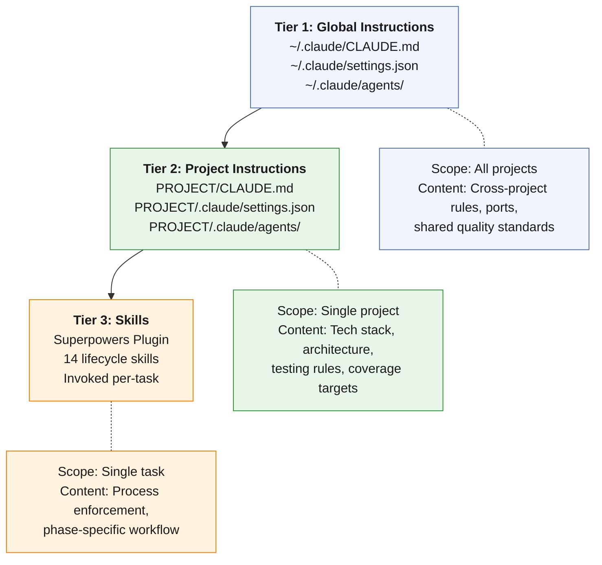

# The Instruction Hierarchy

Claude Code reads instructions from multiple sources at session start. These sources form a three-tier hierarchy where each level provides a different scope of guidance. Understanding this hierarchy is essential because instructions at the wrong level either lack the context to be useful or clutter sessions where they do not apply.

## Three-Tier Architecture



**How the tiers interact:**

Claude Code reads all three tiers at session start, but they serve fundamentally different purposes. Tier 1 (global) provides rules that apply regardless of which project is open — port assignments that prevent collisions between projects, quality standards that should be uniform across all work, and behavioral preferences that reflect the developer's working style. Tier 2 (project) provides the technical context that makes the AI useful for a specific codebase — the tech stack, the architecture, the testing conventions, the data flow. Tier 3 (skills) provides process enforcement at the task level — the brainstorm → design → plan → implement → verify → review lifecycle.

Instructions do not conflict across tiers because they address different concerns. Tier 1 says "always use Alembic for database migrations" (a cross-project rule). Tier 2 says "this project uses 31 Alembic migrations with RLS on 33 tables" (project-specific context). Tier 3 says "before marking this migration task complete, verify the migration applies and rolls back cleanly" (task-level process). Each tier adds precision without contradicting the others.

---

## Tier 1: Global Instructions

**What:** Global instructions live in `~/.claude/CLAUDE.md` and `~/.claude/settings.json`. They configure behavior that should be consistent across every project the developer works on.

**Why:** Without global instructions, every project's CLAUDE.md must independently specify the same cross-cutting rules — port assignments, database migration tooling preferences, UI patterns, testing philosophy. This leads to drift: one project says "use port 3000 for frontend" while another uses 3001, causing port collisions during parallel development. Global instructions establish the baseline once and every project inherits it.

The second purpose is encoding the developer's working style and preferences into infrastructure. Rules like "always use subagent-driven development," "design before code," and "no native dialogs" reflect judgment calls that the developer made once and does not want to re-make for every session. Encoding them as global instructions ensures the AI collaborator follows these preferences without being reminded.

**What belongs here:**

| Category | Example | Rationale |
|---|---|---|
| Port assignments | Frontend :3001, Backend :8002, PostgreSQL :5432 | Prevents collisions between projects running simultaneously |
| Cross-project rules | "Always use Alembic for DB migrations" | Consistency across all projects using the same database tooling |
| Shared quality standards | "Design before code: brainstorm, spec, plan, execute" | Methodology rules that apply regardless of tech stack |
| Behavioral preferences | "Use subagent-driven development," "No native dialogs" | Working style encoded as structure, not discipline |
| Permission configuration | `defaultMode: dontAsk` with explicit allowlist | Trust calibration — tools the developer has validated as safe to run without confirmation |
| Plugin enablement | Superpowers, Pyright LSP, Frontend Design | Plugin availability across all projects |

**What does NOT belong here:**

- Technology-specific rules (asyncpg cast syntax, Temporal testing patterns) — these belong in project CLAUDE.md because they only apply to projects using those technologies.
- Architecture descriptions (data flow diagrams, service module inventories) — these are project-specific context.
- File path references (unless they point to cross-project resources like shared architecture documents).

---

## Tier 2: Project Instructions

**What:** Project instructions live in `PROJECT/CLAUDE.md` and `PROJECT/.claude/settings.json`. They provide the AI with everything it needs to work effectively in a specific codebase: the technology stack, architecture, build commands, testing conventions, data flow, coverage targets, and known constraints.

**Why:** The AI collaborator has no prior knowledge of any specific project. Without project instructions, every session begins with the AI guessing at conventions, proposing approaches that conflict with established patterns, and generating code that uses the wrong database access pattern, the wrong test framework configuration, or the wrong directory structure. Project instructions eliminate this cold-start problem by giving the AI the same context that a human developer would acquire during their first month on the project.

**What belongs here:**

| Category | Example | Rationale |
|---|---|---|
| Tech stack | Python 3.11+, FastAPI, Pydantic v2, Next.js 16, React 19 | AI needs to know which libraries and versions to use |
| Architecture overview | 9-step data flow, case status state machine | Structural context that shapes every implementation decision |
| Build & run commands | `cd backend && uvicorn app.main:app --port 8002 --reload` | AI must be able to start, test, and verify the system |
| Testing rules | `asyncio_mode=auto`, no `@pytest.mark.asyncio` needed | Framework-specific conventions that prevent common errors |
| Coverage targets | 90% for workflow layer, 70% for all other layers | Quality thresholds enforced by tooling |
| Directory structure | `app/api/`, `app/services/`, `app/models/`, `app/workflows/` | Navigation context — where to put new code and where to find existing code |
| Known constraints | `CAST(:param AS jsonb)` not `::jsonb` for asyncpg | Hard-won knowledge that prevents recurring bugs |
| Hook definitions | Stop hook with verification prompt | Quality gates specific to this project's risk profile |

**Evidence:** Trust Relay's CLAUDE.md describes 40 API router files, 102 service modules, 43 ORM models, and the complete 9-step compliance workflow data flow. This level of detail means that when Claude is asked to add a new API endpoint, it immediately knows to follow the split-router pattern, use `Depends(get_current_user)` for authentication, and place business logic in a service module rather than in the router. See the [Evidence appendix](../evidence/trust-relay-metrics) for the full codebase scale metrics.

---

## Tier 3: The Superpowers Skills System

**What:** Superpowers is an open-source Claude Code plugin that provides 14 development lifecycle skills. Each skill governs a specific phase of the development process — brainstorming, designing, planning, implementing, debugging, verifying, reviewing, and finishing. Skills are invoked per-task using slash commands (e.g., `/brainstorming`, `/test-driven-development`) and enforce the process structure described in the [Development Lifecycle](../lifecycle/lifecycle-overview).

**Why:** Process enforcement through documentation (wikis, runbooks, README files) does not work because it depends on the developer or AI reading and following the documentation for every task. Process enforcement through skills works because the skills are the process — invoking `/test-driven-development` does not just remind you to write tests first, it structures the session around the red-green-refactor cycle with an anti-rationalization table that prevents skipping failing tests.

**The 14 Skills:**

| Skill | Purpose | Lifecycle Phase |
|---|---|---|
| `/brainstorming` | Structured problem exploration with constraint analysis | Design |
| `/designing` | Formal specification from brainstorm output | Design |
| `/writing-plans` | Decompose design into ordered implementation tasks | Planning |
| `/executing-plans` | Execute plan tasks sequentially in current session | Implementation |
| `/subagent-driven-development` | Execute plan via fresh subagent per task with two-stage review | Implementation |
| `/dispatching-parallel-agents` | Run independent tasks concurrently across subagents | Implementation |
| `/test-driven-development` | Red-green-refactor cycle with anti-rationalization table | Implementation |
| `/systematic-debugging` | Four-phase investigation: root cause, pattern, hypothesis, fix | Bug Fix |
| `/verification-before-completion` | Evidence-based completion gate (tests, coverage, linting) | Verification |
| `/requesting-code-review` | Two-stage review: spec compliance then code quality | Review |
| `/receiving-code-review` | Process review findings: evaluate, respond, track dispositions | Review |
| `/using-git-worktrees` | Filesystem-isolated feature branches | Git |
| `/finishing-a-development-branch` | Merge, clean up worktree, update memory | Git |
| `/using-superpowers` | Meta-skill: when and how to invoke other skills | Meta |

**Installation:**

```bash
claude plugins install superpowers@superpowers-marketplace
```

The plugin installs globally and is available in all projects. Skills are invoked by name and provide their own instruction context to Claude — each skill's `SKILL.md` file contains the process definition, decision trees, prompt templates, and output format specifications.

**How skills integrate with agents, hooks, and memory:**

- **Skills + Agents:** The `/subagent-driven-development` skill dispatches fresh subagent sessions. Reviewer agents can be invoked during the review phases. The skill's prompt templates include guidance on which agent model to select based on task complexity.

- **Skills + Hooks:** The `/verification-before-completion` skill and the Stop hook serve the same purpose at different levels. The skill provides the structured verification process; the hook provides the fallback check if the skill was not explicitly invoked. Together, they ensure that no task is marked complete without evidence.

- **Skills + Memory:** The `/finishing-a-development-branch` skill includes a memory update step. After merging a feature branch, the skill prompts the AI to update memory files that should reflect the new state of the system.

**Evidence:** The Superpowers plugin is one of 3 enabled plugins in the Trust Relay environment. The 14 skills govern every phase of the development lifecycle that produced 1,264 commits across 25 active development days. See the [Evidence appendix](../evidence/trust-relay-metrics) for the methodology infrastructure metrics.
