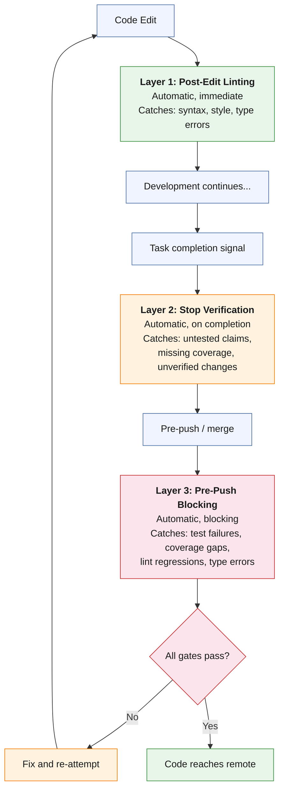

# Quality Gates

Quality gates are automated checkpoints that catch defects at three progressively more expensive stages. The earlier a defect is caught, the cheaper it is to fix. A lint error caught immediately after editing costs seconds. The same error caught during code review costs minutes. The same error caught in production costs hours or days.

The quality gate system is designed so that each layer is independent and no single gate is the sole defense against any category of defect.

## Three-Layer Defense



**Layer 1: Post-Edit Linting.** Runs automatically after file edits. The linter checks for syntax errors, style violations, and type errors. Feedback is immediate — the developer sees the issue within seconds of introducing it, while the code is still fresh in context.

**Layer 2: Stop Verification.** Runs automatically when the AI signals task completion. A verification prompt asks whether tests were run, coverage was checked, and linting passed. This layer catches the "it should work now" failure mode — the AI's tendency to declare completion based on confidence rather than evidence.

**Layer 3: Pre-Push Blocking.** Runs before code reaches the remote repository. This is a hard gate — if tests fail, coverage is below threshold, or linting has regressions, the push is blocked. This is the last line of defense before code enters the shared codebase.

---

## Hook Architecture

Claude Code hooks are automated actions triggered at specific points in the development flow. They execute without developer intervention and provide the structural enforcement that makes quality gates automatic rather than voluntary.

**Why:** Without hooks, quality checks depend on the developer (or AI) remembering to run them. Hooks convert "remember to lint" into "linting happens automatically."

### Hook Types

Claude Code supports three hook trigger points:

**PreToolUse** — fires before a tool is invoked. Use for validation, permission checks, or context injection before an action occurs.

**PostToolUse** — fires after a tool completes. Use for validation, formatting, or quality checks after an action has occurred. This is how Layer 1 (post-edit linting) is implemented.

**Stop** — fires when the AI is about to conclude its response. Use for completion verification — ensuring that claims of completion are backed by evidence.

### Trust Relay's Stop Hook

```json
{
  "hooks": {
    "Stop": [
      {
        "hooks": [
          {
            "type": "prompt",
            "prompt": "Before completing: Have you verified with actual command output that (1) all relevant tests pass, (2) ruff check has zero errors on changed files, (3) pyright has zero errors on changed files, and (4) TypeScript compiles with zero errors if frontend was changed? If any of these were NOT verified, run them now before completing."
          }
        ]
      }
    ]
  }
}
```

This prompt fires every time Claude is about to finish a response. It asks four specific questions, each requiring verifiable evidence. The prompt is not a suggestion — it is a structural gate that makes unverified completion claims difficult to produce.

### Hook Implementation Patterns

Hooks can be implemented as:

- **Prompt hooks** (`"type": "prompt"`) — inject a prompt into the conversation at the trigger point. The AI processes the prompt and responds to it. This is the mechanism used by the Stop hook.
- **Command hooks** (`"type": "command"`) — execute a shell command at the trigger point. The command's output is injected into the conversation. This is the mechanism used by post-edit linting hooks.

Hooks are configured in `.claude/settings.json` (project-level) or `~/.claude/settings.json` (global-level). Project-level hooks take precedence when both exist for the same trigger point.

---

## Automated Review Gates

Review gates determine when to dispatch reviewer agents and which reviewer to use. The decision is based on what changed, not on the developer's judgment about whether a review is needed.

| What Changed | Reviewer to Dispatch | Rationale |
|---|---|---|
| API route files (`app/api/*.py`) | API Reviewer | Convention violations in routes affect external API consumers |
| Authentication or authorization code | Security Reviewer | Auth changes have outsized impact |
| Database models or migrations | Migration Reviewer | Schema changes are irreversible in production |
| AI decision logic, audit trail, or evidence collection | Compliance Reviewer | Regulatory requirements are non-negotiable |
| Files with `FORCE ROW LEVEL SECURITY` patterns | Security Reviewer + Migration Reviewer | Tenant isolation failures are data breaches |
| New service modules | API Reviewer + Security Reviewer | New services often introduce new data access patterns |

**Dispatch timing:** Reviews are most effective after implementation is complete but before merge. In [subagent-driven development](../lifecycle/subagent-driven-development), reviews happen after each task — not at the end of all tasks.

**Review output format:** All project reviewers produce structured output with:

- **Severity** — Critical (must fix before merge), Important (should fix, may defer), Minor (optional improvement)
- **Location** — File path and line number
- **Issue** — What is wrong, stated specifically
- **Fix** — What to do about it, stated specifically
- **Regulation** (compliance reviewer only) — Which regulation is violated

**Evidence:** Trust Relay uses all three layers. The post-edit layer (Pyright LSP plugin) catches type errors in real-time. The Stop hook fires on every task completion. The combined effect is that defects are caught at the cheapest possible stage. See the [Evidence appendix](../evidence/trust-relay-metrics) for the quality gate configuration.
