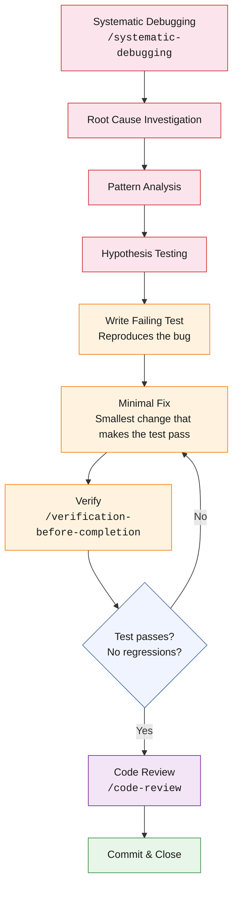

# The Bug Fix Cycle

The bug fix cycle is a compressed lifecycle designed for defect resolution. It differs from the full cycle in two ways: it starts with investigation rather than brainstorming, and it requires a failing test before any code changes.

## The Four-Phase Investigation

**The Systematic Debugging skill (`/systematic-debugging`)** enforces a four-phase investigation process:

### Phase 1: Root Cause Investigation

Gather evidence before forming hypotheses. Read the failing code. Read the test (if one exists). Read the error message. Read the relevant logs. Trace the data flow from input to failure point. The skill explicitly prohibits "guess-and-check" debugging — the practice of trying random changes until the error disappears, which frequently produces fixes that mask the root cause rather than resolving it.

### Phase 2: Pattern Analysis

Categorize the failure. Is it a data issue (wrong value, missing value, type mismatch)? A flow issue (wrong execution path, missing state transition)? A timing issue (race condition, async ordering)? An integration issue (API contract mismatch, schema drift)? The category determines where to look for the root cause and what kind of fix is appropriate.

### Phase 3: Hypothesis Testing

Form a specific, testable hypothesis: "The bug occurs because function X receives a null value when the upstream caller Y passes an empty result set." Verify the hypothesis by adding logging, inserting breakpoints, or writing a targeted test. If the hypothesis is wrong, return to Phase 1 with the new evidence.

### Phase 4: Implementation

Once the root cause is confirmed through hypothesis testing, write a failing test that reproduces the exact failure mode. Then implement the minimal fix — the smallest code change that makes the test pass without introducing new behavior. Verify that all existing tests still pass (no regressions).

:::warning The Mandatory Failing Test
The failing test is the critical gate. It serves two purposes: it proves the root cause hypothesis is correct (the test reproduces the bug), and it prevents regression (the test will catch this bug if it is reintroduced). A bug fix without a failing test is a fix without proof.
:::
