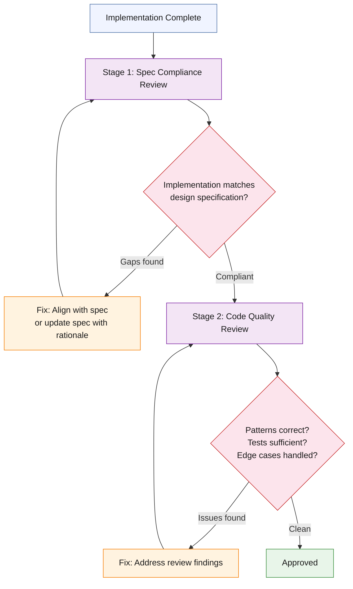

# The Code Review Cycle

Code review in this methodology is a two-stage process. The stages serve different purposes and catch different categories of defects.

## Stage 1: Spec Compliance Review

The reviewer (human or agent) reads the design specification and the implementation, and checks whether the implementation delivers what the specification promised. This catches:

- Missing features that were specified but not implemented
- Divergences where the implementation chose a different approach than the specification without documenting why
- Scope creep where the implementation added behavior not in the specification

If divergences are found, there are two valid resolutions: fix the implementation to match the spec, or update the spec with a rationale for the change. "Silently diverging" — implementing something different from the spec without updating the spec — is never acceptable because it makes the spec unreliable as a reference.

## Stage 2: Code Quality Review

The reviewer checks the implementation for engineering quality independent of the specification:

- Are established patterns followed? (Repository pattern for database access, service layer for business logic, router layer for HTTP concerns)
- Are tests sufficient? (Coverage thresholds met, edge cases covered, error paths tested)
- Is error handling appropriate? (Not silently swallowing exceptions that should propagate, not leaking internal details in error responses)
- Are security concerns addressed? (SQL injection, authentication bypass, tenant isolation, PII exposure)
- Is the code maintainable? (Reasonable function sizes, clear naming, no unnecessary complexity)

## Receiving a Code Review

The methodology establishes explicit norms for how to receive code review feedback. This matters because the default behavior of AI assistants when receiving criticism is to agree immediately and implement all suggested changes — performative compliance rather than technical engagement. The receiving-code-review principles counter this:

1. **Evaluate each finding on technical merit.** Not all review findings are correct. A finding might be based on outdated context, a misunderstanding of the design, or a pattern that does not apply to this specific case. Evaluate each finding independently.

2. **Agree with evidence, not deference.** When a finding is correct, explain why it is correct and what the fix will be. When a finding is incorrect, explain the technical reason it does not apply. "You're right, I'll fix that" is insufficient — state *what* is wrong and *how* the fix addresses it.

3. **Push back when appropriate.** If a reviewer suggests a change that would violate the design specification, introduce unnecessary complexity, or degrade performance without commensurate quality benefit, the correct response is to push back with technical reasoning, not to implement the change to avoid disagreement.

4. **Track all findings.** Every review finding gets one of three dispositions: fixed (with the fix described), acknowledged (accepted as valid but deferred with a tracking issue), or disputed (with technical reasoning). No finding is silently ignored.
