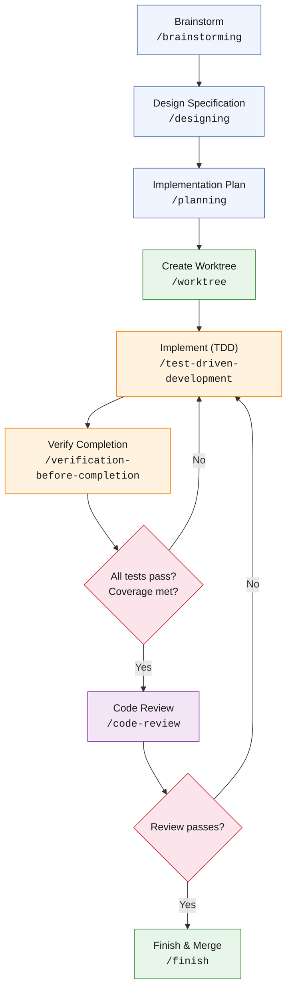

# The Full Development Cycle

The methodology defines three lifecycle patterns — the full development cycle for new features, the bug fix cycle for defects, and the code review cycle for quality validation. Each lifecycle is governed by Superpowers skills that enforce phase transitions and prevent phase-skipping.

## The Full Cycle

The full development cycle applies to any non-trivial new feature or architectural change. Trivial changes (configuration updates, typo fixes, single-line adjustments with no architectural impact) may skip directly to implementation.

## Phase Details

**Brainstorm (`/brainstorming`).** Open-ended problem exploration. The skill guides the conversation through problem statement articulation, constraint identification, and generation of at least 3 candidate approaches with explicit tradeoffs. The output is a conversation log, not a document. Its purpose is to prevent the common failure mode of committing to the first approach that seems reasonable.

Duration: 10-30 minutes. Skip threshold: if the implementation approach is obvious and has no meaningful alternatives (e.g., "add a new column to an existing table with an obvious type and no migration concerns"), skip to design or planning.

**Design Specification (`/designing`).** Converts the brainstorm into a formal specification document. The skill uses the project's design document template, which includes: audience, problem statement, design decisions table (decision / choice / rationale), data flow, API contracts, error handling strategy, and testing strategy. The specification is committed to `docs/` before any implementation begins.

Duration: 30-60 minutes. The output is the most important artifact in the lifecycle because it captures the *reasoning* behind the approach, not just the approach itself.

**Implementation Plan (`/planning`).** Decomposes the design specification into an ordered list of tasks. Each task specifies:

- Task number and title
- Dependencies (which tasks must complete first)
- Acceptance criteria (how to verify the task is done)
- Estimated complexity (used for session planning, not for time tracking)
- Files likely to be created or modified

Tasks are sized so that each can be completed in a single subagent session. A task that requires more than ~60 minutes of implementation is too large and should be split.

**Create Worktree (`/worktree`).** Creates a git worktree for the feature branch. Worktrees provide filesystem isolation: the feature branch exists in a separate directory, preventing accidental commits to the wrong branch. The skill handles branch creation, worktree setup, and context transfer (copying relevant memory files to the worktree's context).

**Implement with TDD (`/test-driven-development`).** The implementation phase uses test-driven development as the default execution model. The skill enforces the red-green-refactor cycle:

1. Write a failing test that describes the desired behavior.
2. Write the minimal implementation that makes the test pass.
3. Refactor the implementation while keeping tests green.

The skill includes an **anti-rationalization table** — a structured check that prevents the developer or AI from rationalizing why a test failure is "expected" or "not a real problem." Every test failure must either be fixed or explicitly documented as a known limitation.

:::info PoC Mode
In PoC mode, the cycle is relaxed: code-first, tests-after is acceptable. The tests are still mandatory; only the ordering is flexible.
:::

**Verify Completion (`/verification-before-completion`).** Before marking any task complete, this skill requires evidence:

- Fresh test output with timestamps
- Coverage report showing threshold compliance
- Linter output with zero new warnings
- For UI changes: visual verification

This is the skill that implements the [Evidence Over Claims](../philosophy/evidence-over-claims) principle at the task level.

**Code Review (`/code-review`).** Two-stage review process (detailed in [Code Review Cycle](code-review-cycle)). First stage: spec compliance (does the implementation match the design?). Second stage: code quality (are patterns correct, tests sufficient, edge cases handled?).

**Finish & Merge (`/finish`).** Merges the feature branch, cleans up the worktree, and updates any memory files that should reflect the new state of the system. The skill ensures that documentation was updated alongside code (documentation commit pattern) and that the merge is clean.

## Skill Chaining

Each Superpowers skill produces output that serves as input for the next skill in the lifecycle:

| Skill | Output | Consumed By |
|---|---|---|
| `/brainstorming` | Problem analysis, candidate approaches | `/designing` |
| `/designing` | Design specification document | `/planning` |
| `/planning` | Ordered task list with acceptance criteria | `/test-driven-development` or `/executing-plans` |
| `/test-driven-development` | Implemented code with passing tests | `/verification-before-completion` |
| `/systematic-debugging` | Root cause analysis, reproduction steps | `/test-driven-development` (for the fix) |
| `/verification-before-completion` | Verified completion evidence | `/code-review` |
| `/code-review` | Review findings and dispositions | `/finish` or back to implementation |
| `/finish` | Merged branch, updated documentation | Next task or session end |

The skills do not share state directly. Each skill operates on files (source code, design documents, plan files, test output) that persist in the repository. This file-based integration means that skill transitions are auditable — the design document, the plan, the test output, and the review findings are all committed artifacts that can be inspected after the fact.

## Lifecycle Transition Triggers

| Trigger | Lifecycle | Entry Point |
|---|---|---|
| New feature request or architectural change | Full Cycle | `/brainstorming` |
| Bug report or test failure | [Bug Fix Cycle](bug-fix-cycle) | `/systematic-debugging` |
| Pull request from another developer | [Code Review Cycle](code-review-cycle) | Stage 1: Spec Compliance |
| Refactoring initiative | Full Cycle (abbreviated) | `/designing` (skip brainstorm if scope is clear) |
| Dependency update or migration | Full Cycle | `/brainstorming` (if breaking changes) or `/planning` (if straightforward) |
| Documentation update | Direct implementation | No lifecycle required for content-only changes |
