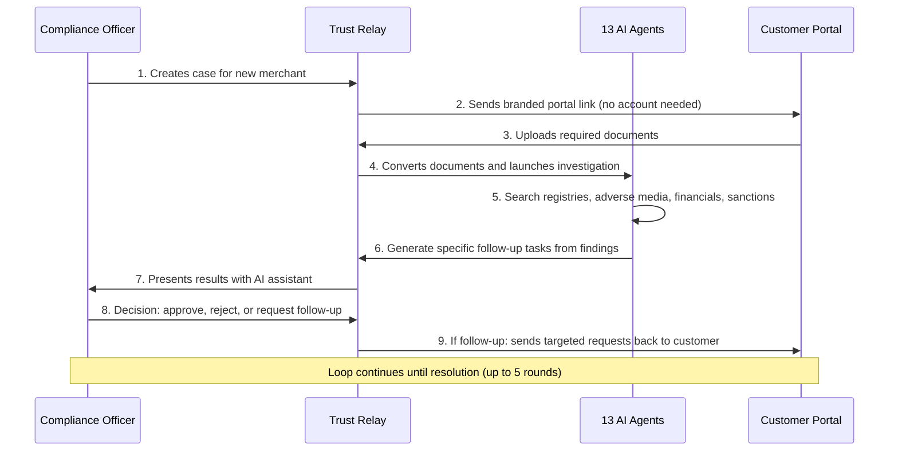

# Trust Relay — Product Overview

## In One Sentence

Trust Relay is a compliance investigation platform that automates the full KYB (Know Your Business) due diligence lifecycle — from document collection to AI-powered investigation to officer decision — in a single, self-hosted system.

## The Problem

Every financial institution, payment service provider, and regulated business faces the same challenge: before onboarding a new merchant or client, they must verify that the business is real, legitimate, and not involved in financial crime. This process is called Know Your Business (KYB) due diligence, and today it is overwhelmingly manual.

A compliance officer creates a case, then begins searching — company registries, sanctions lists, adverse media, financial filings, court records. They compare what the customer submitted against what public records actually show. When something does not match — a director's name is spelled differently, an address is outdated, a filing is missing — they email the customer asking for clarification. The customer responds days later, sometimes weeks later, sometimes never. The officer repeats the investigation with the new evidence, and the cycle continues.

This back-and-forth typically repeats two to five times before enough evidence exists to make a decision. For Enhanced Due Diligence cases, the average resolution time is five to fourteen business days. During that time, the officer is switching between dozens of browser tabs, copying data into spreadsheets, and writing summary reports from memory. There is no structured audit trail linking evidence to decisions. When regulators ask "why did you approve this merchant?", the answer is often reconstructed from email threads and personal notes.

There is also a consistency problem. Two officers reviewing the same case may reach different conclusions — not because one is wrong, but because they searched different sources, weighed discrepancies differently, or simply had different thresholds for what counts as a red flag. Without a structured methodology enforced by tooling, the quality of due diligence depends entirely on who happens to be assigned the case.

Worst of all, the institutional knowledge that officers build over years — which registries are reliable for which countries, which patterns indicate shell companies, which discrepancies are serious versus cosmetic — lives entirely in their heads. When an officer leaves the company, that knowledge leaves with them. The next officer starts from zero. Training takes months. Mistakes that were already learned from get repeated.

## How Trust Relay Works

The system operates as a continuous loop between three participants: the compliance officer, the customer, and a team of 13 specialized AI agents. Rather than a linear process that runs once and produces a verdict, Trust Relay treats compliance investigation as an iterative conversation — each round sharpens the picture until the officer has enough evidence to make a confident decision.

A durable workflow engine orchestrates the entire process, ensuring nothing falls through the cracks and every step is recorded. Here is the flow:

Each round of investigation builds on the previous one. The system does not start over — it carries forward everything that was already verified, flagged, and provided by the customer. Agents that already completed their work in a previous round are not re-run unnecessarily; only the parts of the investigation affected by new evidence are updated. This means follow-up rounds are faster than the initial investigation, because the system is refining its understanding rather than rebuilding it from scratch.

Follow-up requests are not generic templates. They reference specific findings: "We found that the address on your certificate of incorporation differs from the current entry in the commercial registry. Please provide a recent utility bill or bank statement showing your current business address." This precision reduces round trips and shortens the overall investigation timeline.

The workflow engine guarantees that no case is forgotten or dropped. If a customer has not responded in a configurable number of days, the system can escalate automatically. If the maximum number of investigation rounds is reached without resolution, the case is flagged for manual escalation. Every state transition — from "awaiting documents" to "processing" to "review pending" — is recorded in a permanent audit log that regulators can examine.

## Three Screens That Tell the Story

### The Officer Dashboard

The dashboard is where compliance officers spend their working day. It presents a case queue showing all active investigations, color-coded by risk level so officers can prioritize the most urgent cases at a glance. Each case card shows the current status, iteration count, and time elapsed — the information an officer needs to triage without opening every file.

When an officer opens a case, they see a real-time pipeline visualization — a visual map showing which AI agents have completed their work, which are still running, and what each one found. This is not a progress bar; it is a directed graph that shows the actual flow of the investigation, including which agents depend on which others. If an agent found something concerning, its node is highlighted so the officer knows where to look first.

Investigation results are presented as a structured comparison: what the customer claimed on one side, what public records show on the other, with discrepancies highlighted by severity. Critical discrepancies (mismatched registration numbers, inactive company status) are visually distinct from minor ones (address formatting differences, transliteration variants between languages).

A built-in AI assistant sits alongside the investigation results — not a generic chatbot, but a domain-expert copilot with 37 specialized tools that understand the entire investigation context. Officers can ask questions in natural language: "What did we find about this company's directors?" or "Is this address discrepancy significant?" or "Show me all findings related to financial health." The assistant does not make decisions — the officer always has final authority — but it surfaces relevant context, suggests next actions based on institutional patterns, and proactively guides officers toward insights they would not know to ask about.

The copilot adapts to the officer's experience level. A novice officer sees guided suggestions like "Review the 2 high-severity discrepancies before deciding." An experienced officer sees strategic prompts like "This entity's director also appears in another case — check cross-entity connections." The suggestions are dynamically generated from the case context, not static templates. They span eight intelligence domains: case urgency, entity networks, financial trends, regulatory standards, temporal patterns, portfolio insights, and compliance memory.

### The Customer Portal

The customer-facing portal is a branded, white-label interface — it carries the officer's organization's identity, not Trust Relay's. There is no "Powered by Trust Relay" footer. Customers see only their service provider's brand. This matters because trust is the currency of compliance interactions; customers are far more likely to upload sensitive business documents to a portal that looks and feels like their service provider's own platform.

Customers access the portal through a secure link; no account creation is required. They click the link, land on the page, and see exactly what they need to provide. No passwords to remember, no registration forms, no waiting for account approval. The link itself is the authentication.

The portal presents only what is needed for the current round: specific documents to upload and specific questions to answer, each tied to a finding from the investigation. Instead of receiving a generic checklist ("Please provide: Certificate of Incorporation, Proof of Address, UBO Declaration..."), customers see targeted requests that explain why each item is needed. For example: "Your certificate of incorporation lists 123 Commerce Street as your registered address, but the national registry shows 456 Market Avenue. Please upload a recent utility bill or bank statement confirming your current address."

Progress tracking shows customers exactly where they are in the process, reducing "Where does my application stand?" inquiries that consume officer time.

### The Knowledge Graph and Entity 360

Behind every investigation, Trust Relay builds a knowledge graph — a map of relationships between the entities involved in a case. Think of it as an interactive diagram where companies, people, addresses, and documents are connected by lines that represent real-world relationships: "is director of," "registered at," "filed by," "owns shares in."

This is not a static org chart. It is an interactive, explorable visualization that reveals connections a flat document list never would: shared directors across multiple companies, overlapping registered addresses, ownership chains that trace through multiple jurisdictions, and patterns that may indicate shell company structures. An officer looking at a spreadsheet of findings might miss that two seemingly unrelated companies share the same registered agent. The knowledge graph makes that connection visible immediately.

The graph is constructed from actual evidence gathered during the investigation — registry filings, corporate records, director listings, financial data. Each node and connection links back to its source document or registry entry, so officers can verify any relationship with one click. The graph grows as the investigation progresses; each round of evidence collection adds new nodes and edges.

**Entity 360 — Temporal Intelligence.** Every entity in the graph carries a bi-temporal dimension: when a fact was true in the real world (valid time) and when the system first learned about it (system time). This means officers can see not just the current state of a company, but how it changed over time. A director appointed three days before the investigation, an address changed last month, an ownership structure restructured recently — these temporal patterns carry investigative meaning that a static snapshot misses. The Entity 360 view presents this as an interactive timeline, with each change linked to its source and timestamp.

**Regulatory Standards Mapping.** Every investigation finding is automatically mapped to the regulatory articles it satisfies. An address verification maps to AMLR Article 19(1) on CDD identity verification. A beneficial ownership check maps to AMLD6 Article 30. The officer sees not just "what was found" but "which regulatory requirement this finding addresses." When a regulator asks "how do you demonstrate compliance with Article 19?", the answer is a structured list of findings with timestamps, sources, and evidence citations — assembled automatically during the investigation, not reconstructed afterward.

**Financial Intelligence.** For entities with published financial statements — particularly Belgian companies whose filings are available through the National Bank of Belgium — the system computes key financial ratios (solvency, debt ratio, profitability) and tracks them across multiple filing years. Officers see trend lines, not just snapshots: a company with declining solvency over three years tells a different story than one with a single weak quarter. The AI assistant interprets these trends in context: "Revenue grew 15% year-over-year but profit margins are compressing — operating costs increased faster than revenue."

## What Makes It Different

| Traditional Approach | Trust Relay Approach |
|---|---|
| Email-based document collection | Branded portal with targeted, finding-specific requests |
| Manual registry searches across dozens of tabs | 13 AI agents with 37 tools search in parallel across registries, media, and financial sources |
| Spreadsheet case tracking | Workflow engine with complete audit trail and state management |
| One-shot verification — check once, decide | Iterative investigation with up to 5 rounds of evidence gathering |
| Generic follow-up templates ("Please provide additional documents") | AI-generated tasks linked to specific findings with clear explanations |
| Officer knowledge lost when staff turns over | System learns and retains institutional knowledge across the team |
| Static snapshot of company data | Entity 360 with bi-temporal timeline showing how facts changed over time |
| Findings without regulatory context | Every finding mapped to AMLR, AMLD6, EU AI Act articles automatically |
| Generic AI chatbots that answer questions | Domain-expert copilot that proactively surfaces insights across 8 intelligence domains |
| Financial data as isolated numbers | Multi-year trend analysis with contextual interpretation |
| Portfolio screening produces risk scores and alerts | [Portfolio Audit Mode](./portfolio-audit-mode.md) produces cited-evidence verification reports with cross-entity relationship analysis |
| SaaS platforms with data stored in vendor infrastructure | Self-hosted deployment with full data sovereignty |

## Key Concepts

A few terms that appear throughout Trust Relay documentation, explained in plain language:

- **Case** — A single investigation into one business entity. A case has a lifecycle: it is created, documents are collected, agents investigate, the officer decides, and the case is closed (approved, rejected, or escalated).

- **Iteration** — One complete round of the investigation loop. The first iteration happens when the customer initially submits documents. If the officer requests follow-up, a second iteration begins. Up to five iterations are supported before the case must be escalated.

- **Agent** — A specialized AI component that performs one specific type of investigation. For example, the Registry Agent checks commercial registries, the Adverse Media Agent searches news sources, and the Financial Health Agent analyzes published financial filings. Agents are not general-purpose chatbots; each has a defined scope and output format.

- **Signal** — A piece of feedback from an officer's decision that the system can learn from. When an officer overrides a suggestion, dismisses a finding, or flags something the system missed, that action is recorded as a signal and used to improve future investigations for the entire team.

- **Portal Token** — A secure, single-use link that gives a customer access to their specific case portal. No username or password is needed. The token identifies the case and controls what the customer can see and submit.

- **Discrepancy** — A mismatch between what the customer provided and what public records show. Discrepancies are classified by severity: critical (wrong registration number, inactive company status), high (name or country mismatch), medium (address differences), and low (formatting or transliteration variants). Officers focus their attention on the highest-severity items first.

- **Pipeline** — The sequence of AI agents that run during an investigation. The pipeline is visualized in the officer dashboard as a directed graph, showing dependencies between agents and the status of each one. Officers can see at a glance whether the investigation is still running, where it found issues, and which agents completed without findings.

- **Audit Trail** — A complete, tamper-evident record of every action taken during an investigation: when the case was created, when documents were uploaded, what each agent found, when the officer made a decision, and what that decision was. The audit trail is the artifact that regulators examine when assessing the quality of due diligence.

- **Trust Capsule** — A self-contained, tamper-evident evidence pack for a single entity. Contains all investigation findings with SHA-256 content hashes, timestamped source citations, and the deterministic rule version that produced each finding. Trust Capsules are the atomic unit of evidence in Trust Relay — designed to be attached to regulatory reports, shared with counterparties, or archived as a permanent compliance record. In [Portfolio Audit Mode](./portfolio-audit-mode.md), every entity in a batch produces its own Trust Capsule, and the set is aggregated into a structured Independent Verification Report.

## Who It's For

### Payment Service Providers (PSPs)

Merchant onboarding is the core use case. When a PSP signs a new merchant, Trust Relay automates the full KYB investigation — from initial document collection through registry verification, adverse media screening, financial health assessment, and Merchant Category Code (MCC) classification. The iterative loop means edge cases that would normally stall in email threads are resolved within the platform.

A typical scenario: a new merchant submits their incorporation certificate and proof of address. Trust Relay's agents discover that the registered address on the certificate does not match the current entry in the national commercial registry. Instead of a generic "please provide additional documents" email, the customer portal shows the merchant exactly what was found and asks for a specific document to resolve it. The merchant uploads a recent utility bill, the system re-verifies, and the officer can approve — all within one platform, with a complete evidence chain.

For PSPs operating under PSD2 or similar regulations, the built-in MCC (Merchant Category Code) classification helps ensure merchants are categorized correctly from the start, reducing the risk of processing payments in prohibited categories.

For portfolio-level oversight, [Portfolio Audit Mode](./portfolio-audit-mode.md) lets a PSP verify the entire merchant portfolio in a single batch — producing cited-evidence reports that demonstrate compliance quality across the book, not just for individually investigated cases.

### Banks and Financial Institutions

For banks conducting KYB lifecycle management, Trust Relay provides regulatory-grade audit trails that link every decision to its supporting evidence. The knowledge graph reveals entity relationships that flat-file reviews miss — shared directors between applicant entities, address overlaps with previously flagged companies, or ownership structures that span multiple jurisdictions.

The self-hosted deployment model means customer data never leaves the institution's infrastructure — a requirement for many European regulators. Every investigation step, every piece of evidence gathered, and every officer decision is recorded with timestamps and provenance information, ready for regulatory examination.

With the AMLR raising the evidentiary bar for CDD across the EU from July 2027, institutions need more than screening results — they need cited, time-stamped verification evidence. [Portfolio Audit Mode](./portfolio-audit-mode.md) provides exactly this at portfolio scale, with cross-entity relationship analysis that reveals hidden connections between clients that individual case reviews cannot detect.

### Compliance Consultancies and Auditors

Independent verification firms acting as second-line or third-line defense can use Trust Relay as their investigation workbench. The platform provides consistent, reproducible investigation methodology across cases, making it straightforward to demonstrate the rigor of the verification process to regulators or clients.

Because the system records the full investigation trail — which sources were checked, what was found, what discrepancies were identified, and how they were resolved — audit reports can be generated directly from the case record rather than reconstructed from memory after the fact. The knowledge graph provides a visual artifact that can be included in reports to illustrate entity relationships and evidence provenance.

For portfolio-scale verification, [Portfolio Audit Mode](./portfolio-audit-mode.md) extends the same 9-domain investigation framework to batch processing — upload a CSV of entity identifiers, and receive a structured Independent Verification Report with evidence-cited Trust Capsules for every entity. Cross-entity relationship analysis reveals patterns invisible in single-entity reviews: shared directors, overlapping addresses, and undeclared ownership chains across the portfolio.

## Deployment and Data Sovereignty

Trust Relay is designed to run entirely on your infrastructure. There is no mandatory cloud service, no data phoning home, no vendor lock-in on where your compliance data lives.

The platform is packaged as a set of containers that can be deployed with a single command. All components — the workflow engine, the database, the document storage, the AI agents, the knowledge graph — run within your environment. There is no "phone home" telemetry, no required connection to an external cloud service, and no vendor-held encryption keys. For organizations subject to GDPR, the EU AI Act, or sector-specific data residency requirements, this is not a feature; it is a prerequisite.

The architecture separates human judgment from AI assistance by design. AI agents gather evidence, identify discrepancies, and suggest follow-up actions, but they never make compliance decisions. The officer always has final authority. This separation is documented in the audit trail and is aligned with the EU AI Act's requirements for human oversight of high-risk AI systems.

Critically, the compliance memory system — which learns from officer decisions over time — is designed with a safety invariant: it can add scrutiny (flag additional risks, suggest deeper investigation), but it can never suppress risk signals. An officer's decision to dismiss a finding is recorded, but it does not train the system to ignore that class of finding in the future. This asymmetry is deliberate and non-negotiable.

## Country Coverage

Trust Relay currently supports investigations across all 30 European Economic Area (EEA) countries. For Belgium specifically, the system includes deep integration with national data sources: the Crossroads Bank for Enterprises (KBO/BCE), the Belgian Official Gazette, the National Bank of Belgium's financial filings database, notary records, and the social/tax debt verification system (inhoudingsplicht).

For other EEA countries, the system routes through international commercial registries and open data sources. The agent architecture is designed to be extensible — adding a new country means configuring a new set of data sources and routing rules, not rewriting the investigation logic.

The system also supports PEPPOL (Pan-European Public Procurement OnLine) verification, which checks whether a business is registered in the European e-invoicing network and whether it has outstanding social or tax debts — a common requirement for payment service providers operating in Belgium and other EU markets.

Document handling is language-aware. Certificates and filings in Dutch, French, German, and English are all processed by the document intelligence layer, and the AI agents account for multilingual variations (for example, recognizing that "Brussel" and "Bruxelles" refer to the same city).

## Technology at a Glance

For those who want to understand what powers the platform without a computer science degree:

- **13 specialized AI agents with 37 tools** — not one generic chatbot, but a team of purpose-built agents, each responsible for a specific part of the investigation (registry checks, adverse media, financial health, sanctions screening, and more). They work in parallel, the same way a team of analysts would divide the work. The tools include entity network traversal, financial trend analysis, standards gap detection, and temporal intelligence.

- **Intelligent compliance copilot** — the AI assistant that sits alongside investigation results is not a Q&A bot. It has 37 specialized tools spanning 8 intelligence domains: case analysis, entity networks, temporal patterns, financial trends, regulatory standards, portfolio insights, and compliance memory. It proactively suggests what to investigate next based on the officer's experience level and the case context.

- **Durable workflow engine** — the same category of technology used by Netflix, Uber, and Stripe to run mission-critical processes. If a server restarts mid-investigation, the workflow picks up exactly where it left off. Nothing is lost.

- **Knowledge graph with Entity 360** — a relationship database that maps how companies, people, addresses, and documents connect to each other, with a bi-temporal dimension tracking how facts change over time. It surfaces patterns that spreadsheets and PDFs cannot — and shows when those patterns emerged.

- **Regulatory standards mapping** — every investigation finding is automatically linked to the regulatory articles it satisfies (AMLR, AMLD6, EU AI Act). Officers and auditors see coverage, not just findings.

- **Document intelligence** — uploaded PDFs and scanned documents are converted into structured data that the AI agents can actually read and cross-reference, not just stored as files.

- **Self-hosted deployment** — the entire platform runs on your infrastructure using standard containerization. Setup takes minutes, not months. No data leaves your environment.

- **2,632+ automated tests** — the system is continuously verified against a comprehensive test suite (2,071 backend + 561 frontend), covering the workflow engine, 95 API endpoints, AI agents, and user interface.

- **EU AI Act ready** — the architecture is designed with European regulatory requirements in mind, including data sovereignty, auditability, and the separation of human judgment from AI assistance.

- **Compliance memory** — the system captures officer feedback, decision patterns, and corrections over time, building an institutional knowledge base that survives staff turnover and helps new officers make consistent, well-informed decisions from day one. Officers teach rules in natural language; the system applies them automatically to future cases.

## What Happens Next

If you are evaluating Trust Relay, here are the recommended next steps depending on your role:

**For compliance officers and business stakeholders:**
- Read [Portfolio Audit Mode](./portfolio-audit-mode.md) to understand how batch portfolio verification works — from CSV upload to cited-evidence reports.
- Read the [Competitive Landscape](./competitive-landscape.md) to understand how Trust Relay compares to existing KYB platforms like Sumsub, Onfido, and Comply Advantage.

**For technical evaluators and architects:**
- The [Architecture Overview](./architecture/overview.md) explains the full technical design, including the workflow engine, AI agent pipeline, and knowledge graph.
- The [API Reference](./api/overview.md) documents every endpoint, from case creation to document upload to officer decisions.
- The [ADR Index](./adr/index.md) records every significant architectural decision and the reasoning behind it.

**For deployment and operations teams:**
- The [Deployment Guide](./architecture/deployment.md) covers infrastructure requirements, container configuration, and environment setup.

**For everyone:**
- The system is open for inspection. Every architectural decision is documented, every data flow is explained, and the test suite is available for review. Trust Relay is built on the principle that compliance tooling should itself be transparent and auditable.
