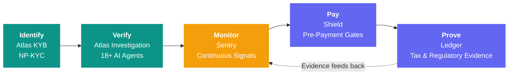
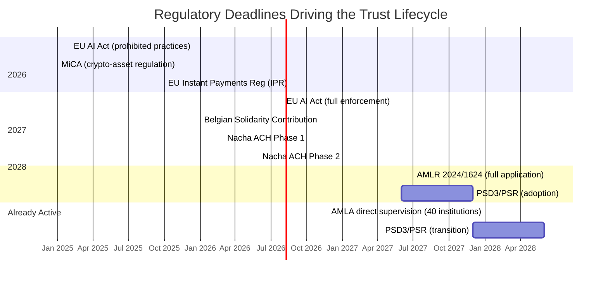

# Trust Lifecycle & Product Vision

> Screening tells you if an entity is on a list.
> Investigation tells you if it *should* be on a list.
> Trust Relay tells you whether to **pay** it — and **proves** you were right to.

---

## The Gap in Every Compliance Stack

Today's compliance tooling solves fragments. One vendor verifies the entity. Another monitors for changes. A third gates the payment. A fourth generates the regulatory report. Four vendors, four data silos, four integration projects — and the evidence chain breaks at every handoff.

When a regulator asks "why did you pay this entity?", the answer requires stitching together artifacts from multiple systems, hoping the timestamps align and the evidence references match. They rarely do.

Trust Relay closes this gap by treating compliance as a **continuous lifecycle**, not a sequence of disconnected checkpoints. Every phase produces evidence that flows into the next. Every decision is traceable to the evidence that supported it. The chain never breaks because it was never separate to begin with.

---

## The Trust Lifecycle

Five phases, one evidence chain:

```
identify  →  verify  →  monitor  →  pay  →  prove
```



| Phase | Product | What It Delivers | Status |
|-------|---------|-----------------|--------|
| **Identify** | Atlas KYB + NP-KYC | Know who the entity is — legal entity verification, natural person identity | Implemented |
| **Verify** | Atlas Investigation | Determine if the entity is trustworthy — 18+ AI agents, iterative evidence loops | Implemented |
| **Monitor** | Sentry | Watch for changes after approval — regulatory radar, cross-case patterns, signal capture | Architecture ready |
| **Pay** | Shield | Gate payments based on verification status — payee verification, payout policy, reconciliation | PRD complete |
| **Prove** | Ledger | Generate regulatory evidence for transactions — tax calculations, evidence capsules, FIU exports | PRD complete |

Each phase inherits the evidence chain from the previous one. A Shield payout decision references the Atlas verification that established trust. A Ledger tax calculation references the Shield transaction that triggered it. An auditor following the chain from "payment made" back to "entity first identified" finds an unbroken, tamper-evident evidence trail with SHA-256 content hashes at every step.

---

## Atlas — Counterparty Investigation

**Phase:** Identify + Verify | **Status:** Implemented

Atlas is where Trust Relay starts — and where it already surpasses every competitor in the market. It is the investigation orchestration engine described throughout the [product overview](./product-overview.md) and [competitive analysis](./competitive-landscape.md).

**What it delivers:**

- **Iterative compliance workflow** — up to 5 rounds of evidence gathering with a customer-facing portal, orchestrated by Temporal durable workflows
- **18+ specialized AI agents** with 37 tools — registry checks, adverse media, financial health, sanctions screening, document cross-referencing
- **Case-scoped knowledge graph** — Neo4j with 30+ node types, bi-temporal tracking, 5 structural motif detectors
- **4-dimension confidence scoring** — Evidence Completeness, Source Diversity, Consistency, Historical Calibration
- **Learning compliance copilot** — per-officer persistent memory with safety invariants (can ADD scrutiny, never suppress risk signals)
- **Deterministic red flag engine** — 10 condition types, 5 action types, zero LLM hallucination
- **Supervised autonomy** — 3 automation tiers earned per (officer, template, country) through demonstrated competence

Atlas establishes the trust foundation that every subsequent phase builds on. Without rigorous initial verification, monitoring is noise, payment gating is guesswork, and regulatory evidence is incomplete.

**Natural Person KYC (NP-KYC)** extends Atlas to individual identity verification for market verticals that require it — precious metals dealers, high-value goods sellers, and other entities where AMLR mandates Customer Due Diligence on natural persons. NP-KYC integrates with eID Easy for Belgian eID, itsme, Smart-ID, iDIN, and passport/biometric verification, providing the same evidence-grade audit trail as Atlas KYB.

---

## Sentry — Continuous Monitoring

**Phase:** Monitor | **Status:** Architecture ready

Compliance verification is not a one-time event. An entity approved today can change directors tomorrow, restructure ownership next month, or appear in adverse media next quarter. Sentry transforms Trust Relay from a point-in-time investigation tool into a continuous compliance platform.

**What it delivers:**

- **Signal capture pipeline** — detects changes in entity state from registries, regulatory databases, adverse media, and financial filings
- **Regulatory Radar** — 16 EU regulations, 67 articles, 32 obligations, with retroactive case impact analysis when regulations change
- **Cross-case pattern detection** — entity overlap, phoenix companies, circular ownership, temporal clusters, and risk contagion across the full case portfolio
- **Event-triggered re-investigation** — when a signal exceeds a risk threshold, Sentry can automatically initiate a new Atlas investigation round for the affected entity
- **Portfolio-level intelligence** — aggregated risk dashboards showing which entities in the portfolio have the highest drift from their last verification

**The architectural foundation is already built.** The signal capture service, Regulatory Radar, cross-case pattern detector, and portfolio scanning infrastructure exist as production code. What remains is the continuous monitoring scheduler and the external change-feed integrations (registry webhooks, gazette subscriptions, commercial data provider streams).

Sentry's evidence feeds directly into the trust lifecycle chain. When a monitored entity's risk profile changes, the updated evidence is available to Shield for payout policy decisions — automatically, without manual intervention.

---

## Shield — Pre-Payment Verification

**Phase:** Pay | **Status:** PRD complete

Shield answers the question that Atlas and Sentry cannot: **should we release the payment?**

Knowing that an entity is trustworthy (Atlas) and monitoring for changes (Sentry) is necessary but not sufficient. The moment money moves, a new set of regulatory obligations activates — payee verification, sanctions screening at time of payment, bank account validation, and reconciliation evidence. Shield gates every payout through a policy engine that enforces these obligations in real time.

**What it delivers:**

### Payee Verification Engine

Before any payment is released, Shield verifies that the payee is who they claim to be and that the destination account belongs to them:

- **IBAN-Name verification** — SurePay and Sumsub integration for real-time account-holder matching
- **Open banking validation** — PSD2 Account Information Service Provider (AISP) integration for bank account verification
- **Sanctions screening at time of payment** — real-time PEP and sanctions checks against the current entity state, not the state at time of onboarding

### Payout Policy Engine

A configurable rule engine that evaluates whether a payout should proceed, hold, or escalate:

- **Entity verification status** — is the Atlas KYB current and approved?
- **Monitoring status** — has Sentry flagged any changes since the last verification?
- **Bank account verification** — has the destination account been validated?
- **Transaction-level rules** — amount thresholds, frequency limits, jurisdiction-specific constraints
- **Regulatory gates** — country-specific CDD thresholds (AMLR Article 19: EUR 10,000 for occasional transactions, EUR 3,000 for cash)

### Reconciliation Bridge

After a payment is released, Shield tracks the settlement lifecycle:

- **Payout intent → settlement confirmation → evidence closure** — every payment produces a complete audit trail from authorization through settlement
- **Evidence capsules** — each payout generates a tamper-evident evidence pack linking the payment decision to the verification evidence that supported it
- **Regulatory mapping** — payout decisions are mapped to the regulatory articles they satisfy (PSD3/PSR fraud liability, IPR verification of payee, SOX/SOC2 internal controls)

### Why Shield Matters Now

Three regulatory deadlines converge to make pre-payment verification mandatory:

| Regulation | Deadline | Requirement |
|------------|----------|-------------|
| **EU Instant Payments Regulation (IPR)** | October 2025 | Verification of Payee mandatory for SEPA instant credit transfers |
| **PSD3/PSR** | H2 2027 – H1 2028 | Fraud liability shift to PSPs that fail to implement effective verification |
| **AMLR 2024/1624** | July 2027 | CDD thresholds for high-value goods dealers; transaction monitoring obligations |

PSPs that cannot demonstrate payee verification, transaction-level CDD, and evidence-grade audit trails face both regulatory penalties and fraud liability. Shield is not an optional add-on — it is the compliance infrastructure that makes payments legally defensible.

---

## Ledger — Regulatory Evidence & Tax Compliance

**Phase:** Prove | **Status:** PRD complete (Belgian module)

Ledger completes the trust lifecycle by generating the regulatory evidence that proves compliance after the fact. When a regulator, tax authority, or auditor asks "show me your records," Ledger produces structured, tamper-evident evidence packs — not spreadsheets reconstructed from memory.

**What it delivers:**

### Country-Specific Tax Compliance

Ledger operates as a plugin architecture — each country module implements jurisdiction-specific tax rules while sharing a common evidence infrastructure. The first module targets Belgium:

**Ledger (BE) — Belgian Solidarity Contribution on Financial Assets:**

- **Lot register** — discrete asset acquisitions per customer (gold bullion, coins, silver, platinum variants) with full provenance
- **FIFO calculation engine** — capital gains computed using First-In-First-Out principle for post-2026 assets, weighted-average for pre-2026 lots
- **Annual exemption tracking** — EUR 10,000 per person with carry-forward rules (1/10 unused per year, max 5 years, cap EUR 15,000)
- **Tax position computation** — per-customer, per-year calculation of gains, losses, exemptions, and net tax liability (10% solidarity contribution + communal surcharge)
- **Tax Evidence Capsule** — PDF/JSON export with SHA-256 hashes, source citations, lot-level detail, and regulatory article mapping

### Evidence Pipeline Integration

Ledger does not operate independently. It plugs into the Shield evidence pipeline:

1. Every buy/sell transaction processed through Shield creates a Ledger transaction record
2. Ledger computes the tax implications in real time
3. Evidence capsules are generated per customer and per tax year
4. The evidence chain traces from the original Atlas verification through the Shield payment to the Ledger tax calculation

### The Country Plugin Model

Belgium is the first module, but the architecture is designed for expansion:

| Module | Jurisdiction | Tax/Regulatory Focus | Status |
|--------|-------------|---------------------|--------|
| **Ledger (BE)** | Belgium | 10% solidarity contribution on financial asset capital gains | PRD complete |
| Ledger (NL) | Netherlands | Box 3 capital gains / wealth tax reporting | Planned |
| Ledger (DE) | Germany | Abgeltungsteuer (25% flat tax) on capital gains | Planned |
| Ledger (FR) | France | PFU (30% flat tax) on financial gains | Planned |

Each module follows the same pattern: lot register, FIFO/calculation engine, exemption tracking, evidence capsule generation. Country-specific rules plug into a shared infrastructure, reducing the development effort from months to weeks per new jurisdiction.

---

## Market Verticals

### High-Value Goods Dealers

**Regulatory catalyst:** AMLR 2024/1624 (effective July 10, 2027) creates the first EU-wide AML rulebook for high-value goods dealers — precious metals, precious stones, luxury goods, and art dealers.

This is the first market vertical built on the full trust lifecycle:

| Lifecycle Phase | HVG Application |
|----------------|-----------------|
| **Identify** | NP-KYC for customer identity (eID Easy, itsme, Belgian eID) + Atlas KYB for legal entity verification |
| **Verify** | Enhanced Due Diligence at EUR 10,000 (occasional) or EUR 3,000 (cash) thresholds per AMLR Art. 19 |
| **Monitor** | Transaction monitoring for threshold breaches, UBO change detection |
| **Pay** | Shield payout policy with HVG-specific rules (Art. 80 cash limit enforcement) |
| **Prove** | Ledger (BE) lot register, FIFO capital gains, STR export in CTIF-CFI format |

**Reference customer:** Goud999 Safe BV (Belgium) — 25,000+ customers, EUR 250M+ revenue, precious metals dealer requiring AMLR compliance for the first time under the 2024 regulation.

**New HVG-specific capabilities:**

- **Dual-path identity verification** — eID login (itsme, Smart-ID, Belgian eID, iDIN) OR document upload with biometric matching
- **Customer-Facing Onboarding Portal (CFOP)** — white-label portal extending the existing Atlas customer portal with identity verification flows
- **Transaction context capture** — CDD triggered automatically at regulatory thresholds
- **EDD escalation interface** — when Enhanced Due Diligence is required, additional document requests flow through the existing iterative loop
- **Structured STR export** — Suspicious Transaction Reports formatted for Belgian CTIF-CFI / Financial Intelligence Unit requirements (AMLR Articles 50-56)
- **Cash payment limit enforcement** — AMLR Article 80 EUR 10,000 cash payment ceiling with real-time transaction validation

The HVG vertical demonstrates the expansion model: the trust lifecycle platform serves a specific market by combining general-purpose capabilities (Atlas investigation, Shield payment gating, Ledger evidence) with vertical-specific rules (AMLR HVG articles, CTIF-CFI reporting format, precious metals lot tracking).

---

## The Full-Chain Competitive Advantage

No competitor in the KYB/compliance market covers the complete trust lifecycle. The market is fragmented by phase:

| Phase | Typical Vendors | What They Miss |
|-------|----------------|----------------|
| Identify/Verify | Sumsub, Onfido, Trulioo, Sinpex, Dotfile | No payment gating, no tax evidence, no continuous monitoring |
| Monitor | ComplyAdvantage, Hawk AI, Unit21 | No investigation depth, no payment gating, no evidence capsules |
| Pay | Banking Rails, SurePay, Sumsub VoP | No investigation context — verification is disconnected from the KYB that established trust |
| Prove | ERP/accounting systems, tax advisors | Manual evidence reconstruction, no connection to verification or monitoring data |

Trust Relay is the only platform where:

1. The **investigation evidence** (Atlas) flows directly into **monitoring rules** (Sentry)
2. **Monitoring signals** inform **payout policy** decisions (Shield) in real time
3. **Payment transactions** generate **tax and regulatory evidence** (Ledger) automatically
4. The **evidence chain** from entity identification to payment proof is unbroken and tamper-evident

This is not a feature comparison. It is a structural advantage. A competitor building payment verification (Shield-equivalent) would need to either build their own investigation engine (12-18 months) or integrate with a third-party KYB provider — breaking the evidence chain at the integration boundary. Trust Relay never breaks the chain because it was designed as a single system from the start.

### Revenue Model

The trust lifecycle creates a revenue model that grows with customer depth:

| Product | Pricing Model | Typical ACV Range |
|---------|--------------|-------------------|
| **Atlas** | Per-investigation + platform fee | EUR 12,000 – 120,000 |
| **Sentry** | Per-entity monitored / month | EUR 6,000 – 60,000 |
| **Shield** | Per-payout verification + platform fee | EUR 24,000 – 180,000 |
| **Ledger** | Per-customer tax position / year | EUR 6,000 – 60,000 |
| **Full Lifecycle** | Bundled | EUR 48,000 – 300,000 |

A customer starting with Atlas for KYB investigation has a natural expansion path through Sentry, Shield, and Ledger. Each product adds value *and* deepens the data moat — the calibration data, compliance memory, and evidence chains become more valuable and harder to replicate with every phase adopted.

---

## Regulatory Timeline

The trust lifecycle is not aspirational — it is driven by regulatory deadlines that are already in effect or approaching:



Each deadline activates new obligations that the trust lifecycle addresses:

- **EU AI Act (Aug 2026)** — Atlas is designed as a high-risk AI system under Annex III; evidence provenance, human oversight, and automatic logging are built in
- **Belgian Solidarity Contribution (Jan 2026)** — Ledger (BE) computes capital gains tax on physical precious metals with FIFO calculation
- **IPR (Oct 2025)** — Shield's Payee Verification Engine implements mandatory Verification of Payee for SEPA instant transfers
- **AMLR (Jul 2027)** — CDD thresholds for HVG dealers, transaction monitoring, STR reporting — the full lifecycle from Atlas through Ledger
- **PSD3/PSR (2027-2028)** — Fraud liability shift to PSPs without effective verification — Shield's payout policy engine with Atlas-backed verification evidence
- **AMLA (2028)** — Direct supervision of 40 high-risk institutions with audit requirements that demand the unbroken evidence chain the trust lifecycle provides

---

## Delivery Phases

The trust lifecycle is delivered incrementally. Each phase is independently valuable, and each phase amplifies the value of the previous ones:

| Phase | What Ships | Prerequisite | Outcome |
|-------|-----------|-------------|---------|
| **Phase 0** | Atlas KYB + Platform Foundation | — | Full investigation orchestration with evidence-grade audit trails |
| **Phase 1** | Intelligence Stack (Pillars 1-5) | Atlas | Confidence scoring, reasoning templates, cross-case patterns, supervised autonomy, regulatory radar |
| **Phase 2** | Sentry Continuous Monitoring | Atlas + Intelligence | Event-triggered re-investigation, portfolio-level risk dashboards |
| **Phase 3** | Shield Pre-Payment Verification | Atlas + Sentry | Payee verification, payout policy engine, reconciliation bridge |
| **Phase 4** | Ledger (BE) Tax Evidence | Shield | Belgian solidarity contribution calculation, lot register, tax evidence capsules |
| **Phase 5** | HVG Vertical | Atlas + Shield + Ledger | NP-KYC, CFOP, AMLR compliance, CTIF-CFI reporting |
| **Phase 6** | Collaborative Intelligence | All | Cross-tenant benchmarks, calibration bootstrap, network effects |

Phases 0 and 1 are **implemented**. Phase 2 has its **architecture in place**. Phases 3-5 have **complete PRDs**. Phase 6 is **designed** as the network-effect capstone.

---

## The Vision

Trust Relay started as an investigation orchestrator — the system that closes the loop between evidence gathering and compliance decisions. It is becoming the platform that covers the entire trust lifecycle: from the moment you first encounter an entity, through ongoing monitoring, payment verification, and regulatory evidence generation.

The vision is not "build everything." It is "build the evidence chain that never breaks." Every product in the trust lifecycle shares the same evidence infrastructure, the same audit trail, the same compliance memory. An auditor examining a Ledger tax calculation can trace it back through the Shield payout decision, the Sentry monitoring period, the Atlas investigation, and the original entity identification — all within one system, with one unbroken chain of SHA-256 hashed, timestamped, source-cited evidence.

This is what the compliance industry needs. Not more point solutions. Not more integrations. A single platform where trust is established, maintained, verified, and proven — end to end.

---

## Learn More

- **Current capabilities:** [Product Overview](./product-overview.md)
- **Competitive positioning:** [Why Trust Relay](./why-trust-relay.md) and [Competitive Landscape](./competitive-landscape.md)
- **Data moat strategy:** [Data Moat Strategy](./data-moat-strategy.md)
- **Technical architecture:** [Architecture Overview](./architecture/overview.md)
