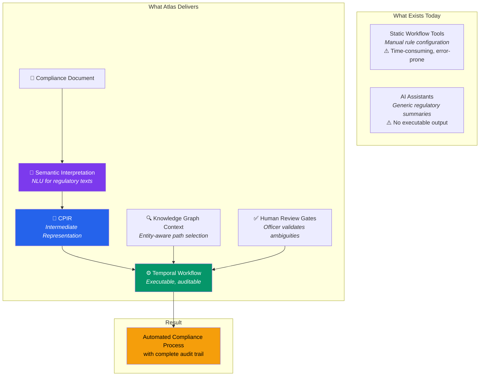
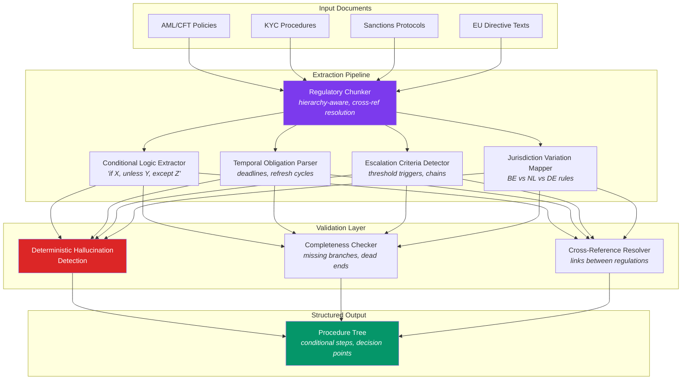
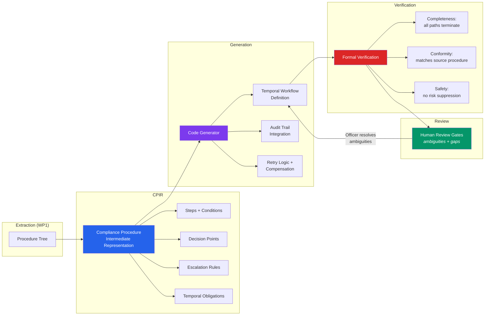
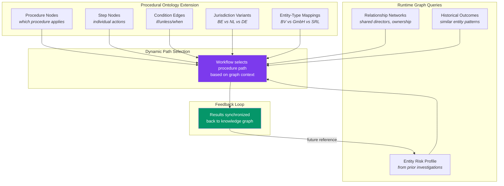
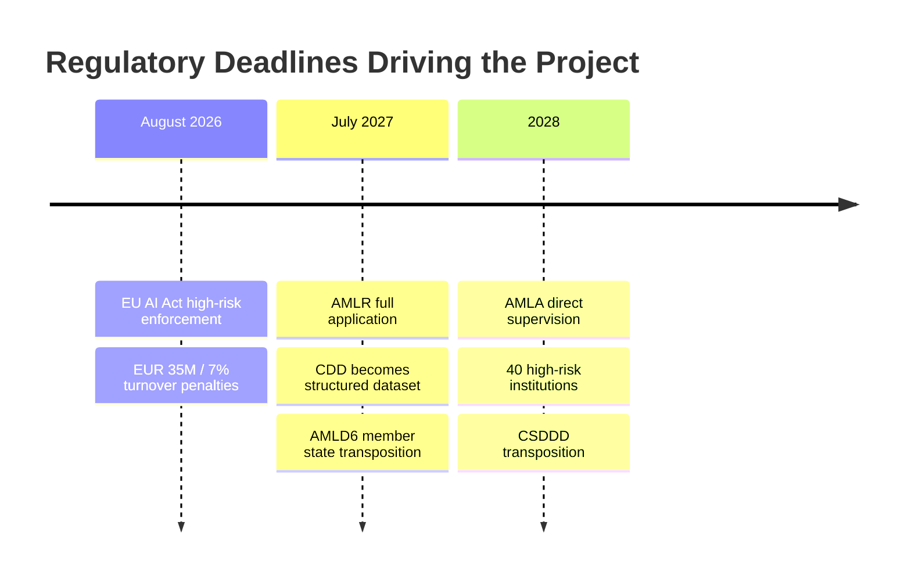
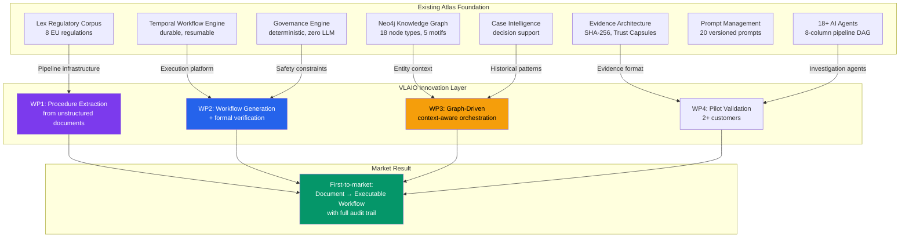

# VLAIO Development Project

**Intelligent Ingestion of Compliance Procedures and Automated Workflow Orchestration**

This development project builds a fundamentally new capability into the Atlas platform: the ability to **analyze, interpret, and transform unstructured compliance documents into executable digital workflows** — orchestrated through a durable, auditable workflow engine with human review gates and knowledge graph context.

## Innovation Thesis



**No player in the market** — neither LexisNexis, Moody's, ComplyAdvantage, Dotfile, nor Vespia — currently offers an end-to-end system that automatically ingests compliance documents, interprets them, and converts them into orchestrated workflows with complete audit trails and human review gates.

## Work Package Architecture

```mermaid
gantt
    title VLAIO Project Timeline (12 Months)
    dateFormat  YYYY-MM
    axisFormat  %b %Y

    section WP1: Regulatory Analysis
    Regulatory corpus construction    :wp1a, 2026-04, 2M
    RAG pipeline + chunking           :wp1b, 2026-05, 2M
    Extraction models                 :wp1c, 2026-06, 2M
    Validation layer                  :wp1d, 2026-07, 1M
    M1: 85% extraction accuracy       :milestone, m1, 2026-08, 0d

    section WP2: Workflow Generation
    CPIR design                       :wp2a, 2026-06, 2M
    Code generator                    :wp2b, 2026-08, 3M
    Formal verification               :wp2c, 2026-09, 2M
    Human review gates                :wp2d, 2026-10, 1M
    M2: Working prototype             :milestone, m2, 2026-11, 0d

    section WP3: Graph Integration
    Procedural ontologies             :wp3a, 2026-09, 2M
    Real-time graph queries           :wp3b, 2026-10, 2M
    Dynamic path determination        :wp3c, 2026-11, 2M
    M3: Context-aware orchestration   :milestone, m3, 2027-01, 0d

    section WP4: Validation
    Pilot testing (2 customers)       :wp4a, 2026-12, 3M
    Performance optimization          :wp4b, 2027-01, 2M
    Documentation                     :wp4c, 2027-02, 1M
    M4: Market-ready                  :milestone, m4, 2027-03, 0d
```

## WP1: Regulatory Document Analysis Engine

**Objective:** AI-driven extraction of structured compliance logic from unstructured documents.



**Foundation already built:** The [Lex Regulatory Knowledge Layer](/docs/architecture/lex-regulatory-knowledge) provides the ingestion infrastructure — EUR-Lex CELLAR fetcher, hierarchy-aware parser, context-prefixed chunker, PgVector hybrid search. WP1 extends this from *reference text* to *procedure extraction*.

**Milestone M1 (Month 4):** ≥85% accuracy on an annotated test corpus of 3+ compliance document categories.

## WP2: Workflow Generation and Formal Verification

**Objective:** Translation of extracted procedure logic into executable, verifiable Temporal workflows.



**Foundation already built:** Atlas's [Temporal workflow engine](/docs/architecture/temporal-workflows), [editable workflow templates](/docs/architecture/platform-foundation), and the [Governance Engine](/docs/architecture/agentic-os)'s deterministic safety checks provide the execution platform. WP2 adds *generation* on top of *execution*.

**Milestone M2 (Month 8):** Working prototype converting a compliance document into an executable workflow.

## WP3: Knowledge Graph Integration

**Objective:** Context-aware workflow execution via the Neo4j knowledge graph.



**Foundation already built:** Atlas's [Neo4j knowledge graph](/docs/architecture/knowledge-graph) with 18 node types, 5 structural motif detectors, bi-temporal entity tracking, and the [EVOI engine](/docs/architecture/evoi-engine) for depth optimization. WP3 adds *procedural reasoning* to *entity intelligence*.

**Milestone M3 (Month 10):** Dynamic procedure path selection based on entity data from the knowledge graph.

## Technical Challenges (R&D)

| Challenge | Why It's Hard | Atlas Advantage |
|---|---|---|
| **Semantic interpretation of regulatory text** | Nested conditionals, implicit obligations, jurisdiction-dependent variations | Lex pipeline + 8 EU regulations already parsed |
| **Correct workflow generation** | Ambiguities, incomplete specs, implicit knowledge — errors cause regulatory violations | Temporal engine + formal verification + human review gates |
| **Context-aware graph orchestration** | Real-time graph queries during execution with latency constraints | Neo4j + EVOI depth optimization already operational |
| **Hallucination mitigation** | LLMs fabricate procedure steps that don't exist in the source | CitationVerifier (deterministic, no LLM) already deployed |

## Regulatory Alignment

This project directly addresses upcoming regulatory deadlines:



## From Atlas Foundation to VLAIO Innovation



## Economic Impact in Flanders

**Direct employment** — specialized developers and researchers during the project, structural growth post-completion.

**Revenue growth** — Atlas evolves from point-investigation tool to full compliance orchestration platform, increasing revenue per customer substantially.

**Export potential** — European regulatory harmonisation creates a pan-European market. First-mover from Flanders.

**Ecosystem strengthening** — demonstrates Flanders as a competitive location for advanced AI in financial services.

**Societal impact** — strengthens the financial supervisory system, improves working conditions for compliance professionals, promotes European digital sovereignty.
