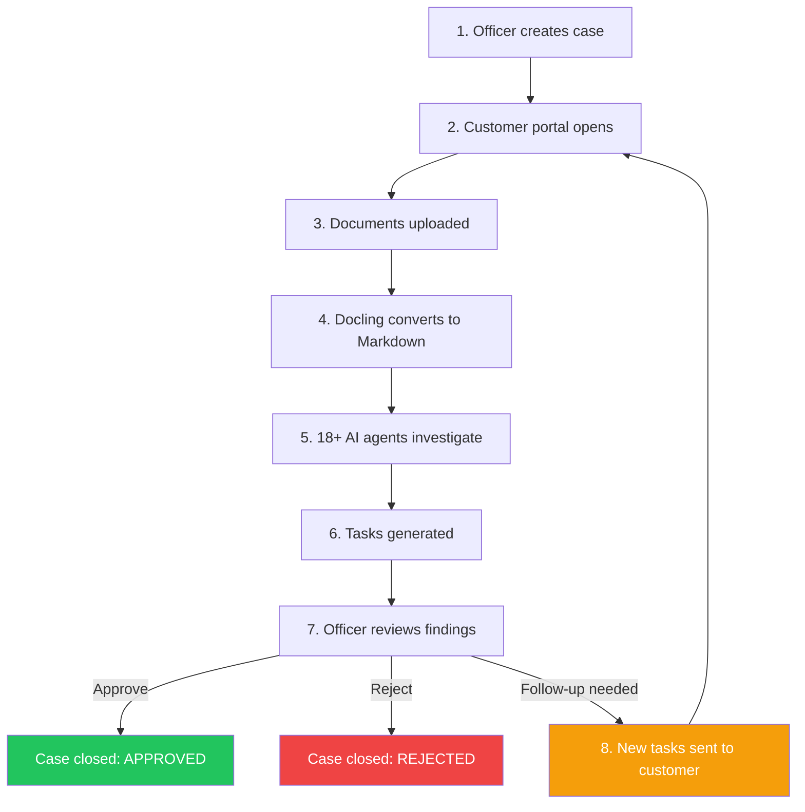
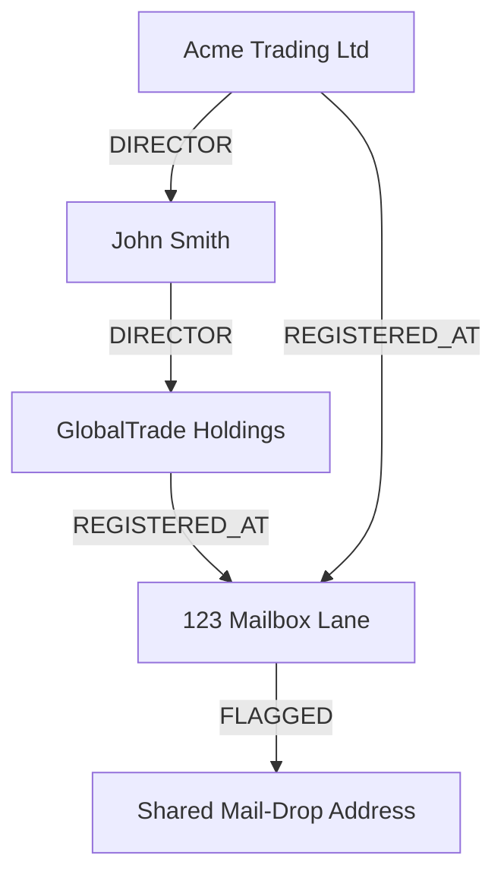

# Why Trust Relay

> Screening tells you whether an entity appears on a list.
> Investigation tells you whether an entity *should* be on a list.
> Trust Relay tells you whether to **pay** it — and **proves** you were right to.

Trust Relay is a **trust lifecycle platform** — not just a screening provider, not just an investigation orchestrator. It covers the complete chain from entity identification through payment verification to regulatory evidence: **identify → verify → monitor → pay → prove**. Today, the investigation engine (Atlas) is production-ready with 18+ AI agents, iterative evidence loops, and a learning compliance copilot. The monitoring infrastructure (Sentry) is architecturally in place. Pre-payment verification (Shield) and regulatory evidence generation (Ledger) have complete product requirement documents and are next in the delivery sequence.

Every compliance platform on the market solves a piece of the problem. Some screen against sanctions lists. Some verify documents. Some monitor transactions. Some gate payments. None of them connect these phases with an unbroken evidence chain — and none close the loop with iterative, multi-round investigation. That is the gap Trust Relay fills.

For the full product vision across all lifecycle phases, see the [Trust Lifecycle & Product Vision](./trust-lifecycle.md) page.

This page is written for two audiences: investors evaluating technical depth and market positioning, and business leaders evaluating whether Trust Relay solves a real problem. Every claim is backed by either a public statistic or an architectural fact from the codebase.

---

## The Problem Nobody Solved

The compliance industry has a measurement problem: it optimizes for speed of screening while ignoring the cost of investigation. Four structural failures persist across the entire market, from Tier 1 banks to fintech startups.

### 1. The Email Chase

After OSINT findings surface issues, compliance officers manually chase documents via email. They send requests, wait for responses, reconcile what arrives against what was asked for, and repeat. The industry average for Enhanced Due Diligence turnaround is **5 to 14 business days** -- dominated not by analysis time, but by waiting for evidence to arrive and chasing missing items.

The officer's actual analytical work might take 30 minutes. The collection process takes days. And each email exchange is untracked -- there is no audit trail of what was requested, what was received, or what is still outstanding. When regulators review the case file, they see a decision but not the investigation process that led to it.

### 2. Corporate Amnesia

When experienced compliance officers leave, institutional knowledge walks out the door. The reasoning behind past decisions -- why a particular corporate structure warranted a live interview, why a specific address pattern indicates nominee arrangements, which registry discrepancies are benign in Belgian law -- disappears from the organization.

Knowledge loss costs organizations an estimated **$72 million per year** in a 30,000-employee organization. More specifically for compliance, **43% of global banks report that regulatory work goes undone due to staffing gaps** (Deloitte 2025). New officers repeat mistakes that predecessors already learned from.

### 3. The False Positive Tax

Up to **95% of AML alerts are false positives**. Global compliance spending has reached **$274 billion annually**. Yet the financial crime detection rate remains at approximately **2% of global illicit flows** (McKinsey/Interpol estimates). The industry spends more, catches less, and drowns analysts in noise.

The problem is not detection sensitivity -- it is investigation capacity. Every false positive that reaches a human analyst consumes the same investigation time as a true positive. Without a way to learn from prior investigations, each alert starts from zero.

### 4. Five Products, One Job

A typical compliance team stitches together screening tools (ComplyAdvantage), document collection (email or ad-hoc portals), case management (spreadsheets or GRC platforms), investigation tools (manual OSINT), and monitoring dashboards (separate vendor). Five products, five logins, five data silos, one job: determine whether this entity is trustworthy.

No single system collects the evidence, investigates it, presents findings, captures the decision, and loops back for more when needed. The integration burden falls on compliance teams, who become middleware between their own tools.

---

## What We Built

### 1. Close the Loop -- The Iterative Compliance Workflow

**Outcome:** What took 5-14 business days of email-based evidence chasing compresses to under 4 hours. The officer's active work drops from days to minutes -- the system handles collection, conversion, and cross-referencing automatically.

**How it works:**

A Temporal-orchestrated durable workflow manages the entire lifecycle. The nine-step process works as follows:

1. Officer creates a case, selects an investigation template, and enters the subject entity details
2. A branded customer portal opens automatically -- the customer receives a link, no account required
3. The customer uploads requested documents (incorporation certificates, UBO declarations, financial statements)
4. IBM Docling converts every uploaded document to structured Markdown
5. Eighteen specialized AI agents cross-reference document content against commercial registries, adverse media, financial databases, and government publications
6. A task generation agent analyzes all findings and produces recommended follow-up actions
7. The officer reviews investigation results, discrepancies, and AI-generated task suggestions
8. If follow-up is needed, new tasks are generated and the customer portal re-opens for the next round

Up to 5 iterations within a 60-day bounded timeline. The entire state machine is enforced by Temporal -- if the system restarts mid-investigation, it resumes exactly where it left off. No lost state, no orphaned cases, no manual recovery.

**Why nobody else has it:** Every competitor is either one-shot verification (Sumsub, Onfido, Trulioo), ongoing monitoring (ComplyAdvantage, Hawk AI), or perpetual KYB (Alloy, Condukt). None orchestrate multi-round investigation with a customer-facing collection portal. Sinpex (EUR 10M Series A, January 2026, BlackFin Capital) is the closest competitor in the investigation space with OCR + LLM document extraction and lifecycle management, but lacks the iterative loop and integrated document collection. Dotfile Autonomy (September 2025) has multi-agent AI but operates single-pass. Condukt ($10M seed, Lightspeed, November 2025) already serves Wise, Mollie, and Rakuten but focuses on perpetual monitoring, not investigation depth.

Consider the current workflow at most compliance teams: officer finds a discrepancy, drafts an email asking for clarification, waits 3-5 days, receives a reply with an attachment, downloads it, opens it alongside the original finding, makes a note, realizes another document is needed, drafts another email. Trust Relay replaces that entire cycle with a structured, tracked, auditable process where the customer sees exactly what is needed and the officer sees exactly what was provided -- with AI cross-referencing happening automatically between rounds.

---

### 2. AI That Remembers -- The Learning Compliance Copilot

**Outcome:** The 50th investigation benefits from the knowledge accumulated in the first 49. Officers teach the system once -- "Belgian management companies with a single representative always need a live interview" -- and that rule applies to every future case. When officers leave, institutional compliance knowledge stays.

**How it works:** Per-officer persistent memory captures three types of signals:

| Signal Type | Example | Behavior |
|---|---|---|
| **JUDGMENT** | "This risk pattern warrants escalation" | Non-suppressible. System can add scrutiny, never remove it. |
| **PREFERENCE** | "Show me financial data before adverse media" | Adapts workflow presentation order. |
| **BEHAVIORAL** | "Officer reviews graph tab first on Belgian cases" | Optimizes information layout. |

The system progresses through maturity stages -- from cautious novice (asks before applying learned rules) to confident peer (applies established patterns with explanation). The maturity curve is deliberate: trust must be earned through demonstrated accuracy, not assumed by default.

Each officer maintains their own memory space. Organizational policies are shared as read-only baselines that individual officers cannot override downward. An officer can add stricter rules for their own workflow; they cannot weaken the organizational floor.

**Safety invariant:** The system can ADD scrutiny but NEVER suppress risk signals. This constraint is enforced deterministically at the classification layer, not by LLM judgment. A JUDGMENT-type signal that increases scrutiny is always applied; a request to reduce scrutiny on a flagged entity is structurally impossible to encode.

**Why nobody else has it:** SymphonyAI Sensa Copilot claims 70% productivity improvement but starts every investigation from zero. Sumsub Summy is stateless. Lucinity Luci summarizes findings intelligently but does not learn from officer decisions. Unit21 learns at the detection rule level (which patterns generate alerts), not at the officer judgment level (what those alerts mean in context). Dotfile Autonomy has multi-agent AI but operates single-pass with no persistent learning. Every compliance AI on the market starts from scratch on every case.

---

### 3. Documents Meet Intelligence -- Cross-Referencing at Scale

**Outcome:** Discrepancies that would take a human analyst hours to spot across multiple sources are surfaced in seconds, with severity classification and side-by-side comparison. A director listed on incorporation documents who does not appear in the commercial registry. A registered address that matches a known mail-drop. An ownership percentage in shareholder agreements that conflicts with the UBO declaration.

**How it works:** Customer-uploaded documents are converted to structured Markdown via IBM Docling. Eighteen specialized AI agents then compare every verifiable claim -- company name, address, directors, ownership percentages, legal form, registration numbers -- against structured data from commercial registries, financial databases, adverse media sources, and government publications.

Discrepancy severity is classified automatically:

- **CRITICAL:** Registration number or VAT number mismatch
- **HIGH:** Company name, legal status, or country discrepancy
- **MEDIUM:** Address or director list differences
- **LOW:** Legal form variations, language-specific address formatting

**Why nobody else has it:** Sumsub verifies document *authenticity* (is this a real document?) but not document *content* against OSINT (does what this document says match public records?). No competitor combines document ingestion with investigative cross-referencing in a single automated pipeline.

---

### 4. See the Network -- Case-Scoped Knowledge Graph

**Outcome:** Hidden connections that screening tools miss -- shared directors across shell companies, mail-drop addresses serving multiple entities, phoenix patterns where dissolved companies reappear under new names, nominee structures obscuring beneficial ownership -- become visible in an interactive graph with full provenance.

**How it works:** A Neo4j knowledge graph is built per investigation with entity resolution across documents and registries. N-hop traversal exposes connections that flat, tabular data cannot reveal. Every node and edge carries provenance metadata: which source, which document, which timestamp, which agent produced the finding.

This is not a global entity graph with 400 million records. It is a focused, per-case investigation graph that finds connections *specific to the entity under review*. The trade-off is intentional: depth over breadth.

Every entity, relationship, and risk flag in the graph traces back to a specific source -- a specific document page, a specific registry query, a specific adverse media article. When an auditor asks "why did you flag this connection?", the answer is not "the AI said so" but "KBO registry query on 2026-02-15 returned director X for both companies, cross-referenced against uploaded shareholder agreement page 3."

---

### 5. Pay for What You Need -- 4-Tier Cost Optimization

**Outcome:** A PSP monitoring 10,000 merchants pays approximately **$220 per scan cycle** versus **$2,900 per month** for flat-rate screening. Projected savings of 92-96% at portfolio scale, depending on risk distribution.

**How it works:**

| Tier | Cost | What Happens | Typical Distribution |
|---|---|---|---|
| Tier 0 | $0.00 | Cache hit from prior scan | ~20% |
| Tier 1 | ~$0.01 | Registry lookup, basic checks | ~70% |
| Tier 2 | ~$0.05 | Adverse media, enhanced screening | ~7% |
| Tier 3 | ~$0.50 | Full investigation with graph + document collection | ~3% |

Entities only consume expensive investigation resources when risk signals from cheaper tiers warrant escalation. A clean entity costs one cent. A flagged entity gets a full investigation.

*Note: Cost projections are based on a modeled 90/7/3 tier distribution across non-cached entities. Actual savings depend on portfolio risk profile. Infrastructure costs (Temporal, Neo4j, AI inference) are not included in per-entity figures. A high-risk portfolio with 15% Tier 3 escalation would see different economics.*

The economic logic is simple: most entities in a PSP portfolio are legitimate businesses that pass basic registry checks. Only a small percentage show risk signals that warrant expensive investigation. Flat-rate screening charges the same price for a clean bakery and a flagged shell company. Tiered scanning charges one cent for the bakery and fifty cents for the shell company.

These economics are what make [Portfolio Audit Mode](./portfolio-audit-mode.md) possible. When a full portfolio of 10,000 entities can be investigated for ~$220 per cycle instead of $5,000, regular portfolio-wide verification becomes economically feasible — not just for annual reviews, but for continuous monitoring. And because the investigation runs at full depth (not just screening), it produces cited evidence and cross-entity relationship analysis, not just a list of screening hits.

---

### 6. Entity 360 -- Temporal Intelligence That Reveals What Changed

**Outcome:** Officers see not just what a company looks like today, but how it got there. A director appointed three days ago. An address changed last month. An ownership restructuring completed just before the application. These temporal patterns carry investigative meaning that a static snapshot misses — and Trust Relay surfaces them automatically.

**How it works:** The knowledge graph operates with a bi-temporal model: valid time (when a fact was true in the real world) and system time (when Trust Relay first learned about it). Every entity relationship carries both dimensions. The Entity 360 view presents this as an interactive timeline, with each change linked to its source — a registry filing, a gazette publication, a document upload, a financial statement.

An officer reviewing a Belgian BVBA sees: "Director Marc Dupont appointed 2026-01-15 (source: KBO/BCE). Previous director Pieter Janssens resigned 2025-12-20 (source: Belgian Gazette). Registered address changed from Antwerp to Brussels 2025-11-30 (source: KBO/BCE). Company legal form changed from VOF to BVBA 2024-06-01."

The AI copilot interprets these patterns: "Three significant corporate changes in the last 90 days — director change, address change, and legal form conversion. This pattern is consistent with corporate restructuring, possibly to obscure prior history. Consider requesting explanation for the timing of these changes."

**Why nobody else has it:** Screening platforms check the current state of a company. Registry databases show what was filed. Neither reconstructs the temporal narrative — the sequence of changes and what it means. Trust Relay's bi-temporal graph is architecturally unique: it tracks not just the facts, but when facts changed, creating an investigation timeline that tells a story.

---

### 7. Standards Mapping -- Every Finding Traced to Regulation

**Outcome:** When a regulator asks "how do you demonstrate compliance with AMLR Article 19?", the answer is not a PowerPoint slide — it is a structured list of investigation findings with timestamps, sources, and evidence citations, assembled automatically during every investigation.

**How it works:** Each investigation finding is automatically mapped to the regulatory articles it satisfies. The mapping covers three regulatory frameworks: the Anti-Money Laundering Regulation (AMLR, applicable from July 2027), the Anti-Money Laundering Directive (AMLD6), and the EU AI Act (high-risk system requirements, enforceable August 2026).

An address verification maps to AMLR Article 19(1) on CDD identity verification. A beneficial ownership check maps to AMLD6 Article 30. The AI system's human oversight architecture maps to EU AI Act Article 14. The officer sees a standards coverage dashboard: which articles are covered by findings, which have gaps, and what additional evidence would close those gaps.

The AI copilot uses this mapping proactively: "This investigation covers 8 of 12 AMLR CDD requirements for enhanced due diligence. The remaining gaps are: source of funds verification, purpose of business relationship, and ongoing monitoring plan. Consider adding follow-up tasks to address these before approval."

**Why nobody else has it:** Compliance platforms produce findings. Regulatory compliance teams produce gap analyses. Nobody produces both simultaneously. Trust Relay's standards mapping turns every investigation into a regulatory readiness assessment — not as an afterthought, but as a structural property of the investigation itself.

---

### 8. Intelligent Compliance Copilot -- 37 Tools, 8 Domains

**Outcome:** One compliance officer becomes as productive as ten. Not because the AI makes decisions — the officer always has final authority — but because the AI handles the cognitive overhead of connecting evidence across sources, remembering institutional knowledge, and surfacing the questions the officer should be asking but does not know to ask.

**How it works:** The copilot is not a generic LLM answering questions about compliance. It is a specialized agent with 37 tools that can query the knowledge graph, analyze financial trends, check standards coverage, retrieve entity timelines, compare investigation iterations, access compliance memory, and synthesize multi-source evidence. The tools span 8 intelligence domains:

| Domain | What It Does | Example |
|---|---|---|
| **Case Analysis** | Compare iterations, summarize findings, highlight changes | "Risk dropped from 0.42 to 0.28 after the customer provided updated address proof" |
| **Entity Intelligence** | Traverse knowledge graph, find cross-entity connections | "This director also appears in another case — Borealis Capital, which was escalated for fraud indicators" |
| **Temporal Analysis** | Surface how entities changed over time | "Three corporate changes in the last 90 days — unusual for an established company" |
| **Financial Intelligence** | Analyze trends across filing years | "Revenue grew 15% but profit margins compressed — operating costs outpaced growth" |
| **Standards & Regulatory** | Map findings to regulatory articles, identify gaps | "8 of 12 AMLR CDD requirements covered. Remaining gaps: source of funds, monitoring plan" |
| **Portfolio Intelligence** | Cross-case patterns, portfolio-level insights | "Belgian BVBAs have a 23% higher escalation rate in your portfolio — consider enhanced scrutiny" |
| **Compliance Memory** | Recall institutional knowledge, apply learned rules | "Based on a rule you taught: Belgian management companies with sole directors require live interview" |
| **Memory & Learning** | Track what the system has learned, show maturity progression | "System has learned 3 procedures and processed 47 decision signals from your reviews" |

The suggestions adapt to the officer's experience level. A novice officer gets guided prompts: "Review the 2 high-severity discrepancies before making a decision." An experienced officer gets strategic insights: "This entity pattern matches 3 prior escalations — check the knowledge graph for cross-entity connections."

**Why nobody else has it:** Every compliance AI on the market is either a search tool (query data, get answers), a summarizer (read documents, produce summaries), or a chatbot (answer questions from a knowledge base). None of them combine domain-specific tools, institutional memory, proactive guidance, and adaptive experience levels in a single copilot. The 37-tool architecture means the copilot can perform actual investigation tasks — not just talk about them.

---

### 9. Your Data, Your Infrastructure -- EU-Native Architecture

**Outcome:** When regulators ask "show me exactly why you approved this merchant," the answer is a tamper-evident evidence pack with SHA-256 content hashes, timestamped source citations, and deterministic rule versions. Not a screenshot of a dashboard. Not a PDF export from a SaaS vendor's portal.

**How it works:** The entire platform is self-hosted via Docker Compose. All data -- documents, investigation results, audit logs, knowledge graphs, learned compliance patterns -- stays within customer infrastructure. The codebase is open source and auditable.

Built for compliance with:

- **EU AI Act Article 13** -- Explainability requirements for high-risk AI systems
- **EU AI Act Article 14** -- Human oversight requirements (Trust Relay's "AI suggests, officer decides" architecture)
- **AMLA** -- Auditable decision logs with full provenance chains
- **AMLR** -- Evidence standards for compliance documentation
- **GDPR** -- Data residency through self-hosted deployment
- **EU Data Act** (enforceable September 2025) -- Data sovereignty beyond personal data
- **DORA** (January 2025) -- Digital operational resilience for financial entities

**Why this matters now:** EU AI Act high-risk system requirements become enforceable **August 2, 2026** -- five months away. Non-compliance penalties reach up to **EUR 35 million or 7% of global annual turnover**. The AMLR applies directly from **July 10, 2027**. AMLA became operational in Frankfurt in July 2025 and will directly supervise 40 high-risk institutions from 2028.

The enforcement environment has already shifted. In 2025 alone: Danske Bank EUR 1.8B, Commerzbank EUR 1.5B (sanctions), Coinbase Ireland EUR 21.46M (30M+ unchecked transactions). EMEA enforcement rose 767% year-over-year. Global AML fines surpassed $6 billion by July 2025.

The convergence of EU Data Act, DORA, AMLR, and AI Act is creating a regulatory environment where self-hosted, auditable, evidence-grade platforms are not a preference but a requirement. US-based SaaS vendors face a structural disadvantage: the US CLOUD Act directly conflicts with EU data sovereignty requirements.

The regulatory timing creates a strategic window. Established SaaS vendors will spend 12-18 months retrofitting explainability and data residency into architectures that were not designed for it. Trust Relay starts with these requirements as foundational constraints, not afterthoughts.

---

## AI-Powered Compliance Intelligence

The features above describe the investigation *workflow*. The features below describe the *intelligence* embedded inside it. These are the capabilities that separate Trust Relay from every other compliance platform architecturally -- not as marketing claims, but as implemented, tested subsystems with full audit trails.

### 4-Dimension Confidence Scoring

Every investigation produces a 0-100 confidence score, decomposed into four independently measurable dimensions:

| Dimension | What It Measures | Example |
|---|---|---|
| **Evidence Completeness** (0-25) | How much of the required evidence was gathered | 23/25: all documents received, one registry query timed out |
| **Source Diversity** (0-25) | How many independent sources corroborate the findings | 18/25: 4 of 6 source categories contributed data |
| **Consistency** (0-25) | How well the evidence agrees across sources | 25/25: no contradictions between documents and registries |
| **Historical Calibration** (0-25) | How well past confidence scores predicted outcomes | 20/25: similar scores in past cases led to correct decisions 92% of the time |

Officers see *how certain* the AI is, not just what it found. A score of 72 with full consistency but low source diversity tells a different story than 72 with high diversity but contradictions. The decomposition makes the AI's uncertainty transparent and actionable -- the officer knows exactly which dimension to address to increase confidence.

Reasoning templates can cap dimension scores based on case characteristics. A high-risk jurisdiction template might cap Historical Calibration at 15/25, ensuring the overall score never reaches "high confidence" without additional human scrutiny.

### Deterministic Red Flag Engine

Ten condition types, five action types, zero LLM hallucination. The Red Flag Engine is a rule-based system that flags risks using deterministic logic -- no language model interprets the rules, no probability distribution decides whether a flag applies.

Condition types include: threshold comparisons (solvency ratio below 0.3), pattern matches (address matching known mail-drop list), temporal triggers (director change within 30 days of application), entity relationships (shared director with a previously rejected entity), and jurisdiction-specific rules (Belgian management company with single representative). Action types include: flag severity escalation, mandatory follow-up task generation, officer notification, investigation scope expansion, and case hold.

The engine executes jurisdiction-specific compliance playbooks. A Belgian KYB template fires different rules than a Dutch or German template. The playbooks are version-controlled and auditable -- when a regulator asks "what rules were in effect when you processed this case?", the answer is a specific deterministic rule version with a SHA-256 hash, not "the AI decided."

### Cross-Case Pattern Detection

Individual case investigation misses systemic risk. Trust Relay detects entity overlap, structural motifs, temporal clusters, and risk trends across the entire case portfolio -- automatically.

| Pattern Type | What It Detects | Example |
|---|---|---|
| **Entity Overlap** | Same person, address, or company appearing in multiple cases | Director Jan Peeters is also director at a previously escalated entity |
| **Structural Motifs** | Phoenix companies, circular ownership, shared-director networks, dormant entity reactivation | Company dissolved in 2024 reappears under a new name at the same address with the same director |
| **Temporal Clusters** | Bursts of similar applications or corporate changes within a time window | 5 Belgian BVBAs with the same registered agent all applied within 2 weeks |
| **Risk Contagion** | Risk signals from one entity propagating to connected entities via the knowledge graph | A flagged entity shares a director with 3 clean entities -- those entities are now flagged for review |

This is the intelligence layer that surfaces systemic risk no single officer would see. A compliance officer reviewing case #47 has no visibility into whether the same director appeared in case #12 three months ago. The cross-case pattern detector does.

### EVOI Decision Engine

When should an investigation stop gathering evidence and make a decision? Trust Relay answers this question mathematically using Expected Value of Investigation (EVOI) -- an information-theoretic framework based on Bayesian belief states.

The system maintains a belief state for each entity: `p_clean`, `p_risky`, `p_critical`. Each new piece of evidence updates this belief. The EVOI calculation quantifies the expected value of gathering one more piece of evidence, accounting for a **50x cost asymmetry** between false negatives (approving a criminal entity) and false positives (rejecting a legitimate business). This asymmetry reflects regulatory reality -- the cost of a missed money laundering case dwarfs the cost of an extra day of investigation.

The practical effect: the system recommends approval only when `p_clean >= ~0.99`. Below that threshold, it identifies which additional evidence would most efficiently resolve remaining uncertainty and recommends specific investigation actions ranked by expected information gain.

### Supervised Autonomy

Not all cases require the same level of human attention. Trust Relay implements three automation tiers that are *earned*, not configured:

| Tier | Name | What Happens | How It's Earned |
|---|---|---|---|
| **Tier 1** | Full Review | Officer reviews all findings and makes decision manually | Default for all new (officer, template, country) combinations |
| **Tier 2** | Guided Review | System pre-fills decision recommendation; officer confirms or overrides | Demonstrated competence: consistent decisions across 20+ cases with &lt;5% override rate |
| **Tier 3** | Express Approval | Low-risk cases auto-approved with one-click confirmation queue | Tier 2 track record + GovernanceEngine safety net confirms no high-risk signals |

Autonomy is earned per (officer, template, country) tuple. An officer who has demonstrated competence on Belgian KYB cases does not automatically earn Express Approval on Dutch cases. A rolling window monitors for decision quality regression -- if an officer's override rate increases, the system downgrades their tier automatically. A Compliance Manager can override tier assignments in either direction.

The GovernanceEngine acts as a safety net: even Express Approval cases are checked for sanctions hits, risk regression, and mandatory governance constraints. If any safety check fails, the case is elevated back to Full Review regardless of the officer's tier.

### Regulatory Radar

A living knowledge base covering **16 EU regulations**, **67 articles**, and **32 compliance obligations**. Not a static reference document -- an active system that tracks regulatory changes and analyzes their impact on existing cases.

Key capabilities:
- **Change tracking**: When a regulation is updated, the system identifies which active and historical cases are affected
- **Retroactive impact analysis**: New regulatory requirements are evaluated against past investigation evidence to identify compliance gaps
- **Compliance calendar**: Upcoming enforcement deadlines with case portfolio impact assessment
- **Standards coverage dashboard**: For any case, shows which regulatory articles are satisfied by gathered evidence and which have gaps

The Regulatory Radar transforms compliance from reactive ("what does the new regulation require?") to proactive ("here are the 12 cases in your portfolio that don't yet meet the new standard, ranked by remediation urgency").

### EU AI Act Compliance -- Built In, Not Bolted On

Trust Relay is designed as a high-risk AI system under EU AI Act Annex III from day one. Compliance is architectural, not cosmetic:

- **Article 11 (Technical Documentation)**: 17 Architectural Decision Records, full system documentation, model identification for every AI output
- **Article 12 (Automatic Logging)**: Immutable `audit_events` table records every AI action, officer decision, and state transition with timestamps and provenance
- **Article 13 (Transparency)**: 4-dimension confidence scoring, deterministic red flag engine, full reasoning chain capture via PydanticAI `all_messages()`
- **Article 14 (Human Oversight)**: "AI suggests, officer decides" architecture enforced structurally; mandatory dismiss reasons when officers override AI findings
- **Article 15 (Accuracy & Robustness)**: Historical calibration dimension in confidence scoring, rolling window monitoring for decision quality regression

Every AI output carries: input provenance (what data was it based on), model identification (which model and prompt template), chain of thought (full reasoning captured), and confidence scoring (quantified certainty with methodology). When a regulator asks "how did your AI reach this conclusion?", the answer is a complete, immutable evidence chain -- not a post-hoc explanation.

---

## The Market

| Metric | Value | Source |
|---|---|---|
| KYB market size (2024) | $3.7 billion | Market research consensus |
| KYB market projected (2033) | $10.6 billion | 18% CAGR |
| EU RegTech funding (2025) | $1.1 billion, +51% YoY | RegTech Analyst |
| Global compliance spending | $274 billion annually | Industry estimates |
| Global AML fines (2025, by July) | $6 billion+ | ComplyAdvantage |
| EMEA enforcement increase (2025) | 767% year-over-year | Fenergo |
| AML false positive rate | Up to 95% | Industry benchmark |
| Financial crime detection rate | ~2% of global illicit flows | McKinsey / Interpol |
| Banks with compliance staffing gaps | 43% | Deloitte 2025 |
| EU AI Act full enforcement | August 2, 2026 (5 months) | EU AI Act text |
| AMLR full application | July 10, 2027 (16 months) | AMLR text |
| EU AI Act maximum fine | EUR 35M or 7% global turnover | EU AI Act text |

The market is large, growing fast, and structurally inefficient. Spending increases year over year while detection rates remain flat. The gap is not in screening technology -- it is in investigation orchestration.

Three converging forces create the opportunity:

1. **Regulatory escalation.** The EU AML Package (AMLR/AMLD6), EU AI Act, MiCA for crypto, and FinCEN beneficial ownership rules are all expanding KYB obligations simultaneously. Compliance is no longer optional for any financial services entity.

2. **The perpetual KYB shift.** The industry is transitioning from periodic review (annual re-checks) to perpetual KYB -- continuous monitoring with event-triggered re-investigation. This demands automated workflow orchestration, not just faster screening.

3. **Digital payments explosion.** PSPs, neobanks, and marketplace platforms onboard merchants at scale, each requiring KYB verification. A PSP with 10,000 merchants cannot afford $0.50 per entity for monthly comprehensive screening. The market needs tiered investigation depth where cost scales with risk, not with portfolio size.

---

## Competitive Matrix

| Capability | Trust Relay | Sinpex | Dotfile | Condukt | Alloy | ComplyAdvantage | Unit21 | Lucinity |
|---|---|---|---|---|---|---|---|---|
| Iterative compliance loop | Yes | No | No | No | No | No | No | No |
| Customer document portal | Yes | Unknown | No | No | No | No | No | No |
| Officer-adaptive memory | Yes | No | No | No | No | No | Partial | No |
| Safety invariant (no risk suppression) | Yes | No | No | N/A | N/A | N/A | No | N/A |
| Multi-agent OSINT pipeline (37 tools) | Yes | No | Yes (Autonomy) | No | No | No | No | Partial |
| Document-to-OSINT cross-referencing | Yes | Partial | No | No | No | No | No | No |
| Knowledge graph with provenance | Yes | No | No | No | No | No | No | No |
| Entity 360 (bi-temporal intelligence) | Yes | No | No | No | No | No | No | No |
| Regulatory standards mapping | Yes | No | No | No | No | No | No | No |
| Intelligent copilot (8 domains) | Yes | No | No | No | No | No | No | Partial |
| Financial trend analysis | Yes | No | No | No | No | Partial | No | No |
| Portfolio verification with cited evidence | Yes | No | No | No | No | No | No | No |
| Self-hosted / EU data sovereign | Yes | No | No | No | Partial | No | No | No |
| Perpetual KYB | Partial | Partial | No | Yes | Yes | Yes | No | No |
| Open source | Yes | No | No | No | No | No | No | No |
| EU AI Act ready | Yes | Medium | Low | Low | Medium | Low | Low | Medium |
| Tiered cost optimization | Yes | No | No | No | No | No | No | No |
| Pre-payment verification (payee + policy) | Planned | No | No | No | No | No | No | No |
| Tax/regulatory evidence generation | Planned | No | No | No | No | No | No | No |
| Full trust lifecycle (identify→pay→prove) | Yes | No | No | No | No | No | No | No |

"Partial" indicates limited capability. "Planned" indicates PRD-complete with architectural foundations in place. "N/A" indicates the capability is not applicable to that vendor's product category. Competitor assessments based on publicly available product documentation as of early 2026.

The pattern in this matrix is clear: Trust Relay is the only platform that combines investigation orchestration, adaptive learning, document cross-referencing, and EU-native deployment in a single system. Competitors excel in individual dimensions -- ComplyAdvantage in entity data breadth, Sumsub in verification speed, Lucinity in summarization quality -- but none integrate the full investigation lifecycle.

For a deeper analysis of each competitor's strengths and weaknesses, including pricing comparisons and gap assessments, see the [Competitive Landscape](./competitive-landscape.md).

---

## What's Coming Next

Trust Relay's investigation engine (Atlas) is production-ready. The next phases of the [trust lifecycle](./trust-lifecycle.md) extend the platform from "know the entity" to "gate the payment" to "prove compliance":

**Shield — Pre-Payment Verification (PRD complete).** Before any payment is released, Shield verifies the payee, evaluates payout policy rules, and generates tamper-evident evidence linking the payment decision to the Atlas investigation that established trust. Driven by the EU Instant Payments Regulation (Verification of Payee mandatory from October 2025), PSD3/PSR fraud liability shift (2027-2028), and AMLR transaction monitoring obligations (July 2027). See [Trust Lifecycle](./trust-lifecycle.md#shield--pre-payment-verification).

**Sentry — Continuous Monitoring (architecture ready).** The signal capture pipeline, Regulatory Radar, and cross-case pattern detection are already operational code. What remains is the continuous monitoring scheduler and external change-feed integrations. Sentry transforms Trust Relay from point-in-time verification to perpetual KYB — the direction the entire industry is moving.

**Ledger — Regulatory Evidence (PRD complete, Belgian module).** Country-specific tax compliance plugins that generate evidence capsules from Shield transactions. The first module targets Belgium's 10% solidarity contribution on physical precious metals capital gains (effective January 2026), with lot registers, FIFO calculations, and structured tax evidence exports. The country plugin architecture is designed for rapid expansion to Netherlands, Germany, and France.

**High-Value Goods Vertical (PRD complete).** The first market-specific expansion, targeting precious metals, stones, and luxury goods dealers under AMLR 2024/1624. Adds Natural Person KYC (eID Easy integration), customer-facing onboarding portal, transaction context capture at CDD thresholds, and structured STR export for Belgian CTIF-CFI. Reference customer: Goud999 Safe BV (Belgium, 25,000+ customers, EUR 250M+ revenue).

---

## Current Limitations — Stated Openly

Credibility in compliance is earned through honesty, not marketing claims. These are genuine gaps today:

**Global sanctions screening.** Trust Relay uses OpenSanctions for sanctions matching -- open data with Jaro-Winkler string similarity and LLM analysis. This is adequate for proof of concept but not production-grade for Tier 1 banks that require World-Check or Dow Jones data. The architecture supports plugging in licensed sanctions providers as a data source within the tier pipeline.

**Biometric KYC.** The NP-KYC module (planned for the HVG vertical) will add natural person identity verification via eID Easy. Today, Trust Relay verifies businesses, not individual identities. Production deployment for business KYB would integrate a biometric KYC partner (Sumsub, Onfido, or similar) for individual identity verification within the workflow.

**400M+ entity database.** Trust Relay investigates deeply, not broadly. ComplyAdvantage and Moody's Orbis have pre-computed global entity graphs with hundreds of millions of records. Trust Relay builds focused, case-scoped graphs per investigation. The trade-off is intentional but real -- broad entity coverage requires data licensing partnerships.

**Production deployment history.** Trust Relay is at proof-of-concept stage. There are no production customers, no SOC 2 certification, no regulatory audit trail. What does exist: 3,391+ automated tests (2,830+ backend + 561+ frontend), 63 service modules, 95 API endpoints across 28 routers, 37 AI agent tools, 17 architectural decision records, and a codebase that demonstrates engineering discipline typically associated with later-stage products.

**Global geographic coverage.** Currently deep in Belgium with EEA country routing architecture in place. The Belgian implementation (KBO, NBB, Gazette, PEPPOL, Inhoudingsplicht) establishes a repeatable pattern -- each new country requires 2-4 weeks to build country-specific registry scrapers and wire them into the routing layer. The architecture is designed for expansion, but today, deep OSINT coverage outside Belgium is limited. Thirty EEA countries are supported for basic entity creation and routing; five Belgian data sources are fully integrated.

We state these gaps openly because in a regulated industry, overpromising is worse than underdelivering.

---

## The Engineering Behind the Claims

Numbers that demonstrate execution maturity, not just vision:

| Metric | Value |
|---|---|
| Automated tests | 3,391+ (2,830+ backend + 561+ frontend) |
| Backend service modules | 63 |
| AI agent tools | 37 (across dashboard, synthesis, task generator, memory admin agents) |
| AI agents in investigation pipeline | 18+ |
| API endpoints | 95 |
| Pydantic model files | 25 |
| Architectural Decision Records | 17 |
| Database migrations | 21 (Alembic-managed) |
| Belgian OSINT data sources | 5 (KBO, NBB, Gazette, PEPPOL, Inhoudingsplicht) |
| External data integrations | 7+ (NorthData, BrightData, Tavily, VIES, OpenSanctions, Crunchbase, crawl4ai) |
| Copilot intelligence domains | 8 (case, entity, temporal, financial, standards, portfolio, memory, learning) |
| Workflow states in state machine | 11 |
| Maximum investigation iterations | 5 per case |
| Maximum case timeline | 60 days |

The codebase follows documented engineering standards (Golden Standard v6) with explicit rules about test quality, coverage thresholds (90% for workflow layer, 70% for API and UI), and architectural decisions recorded before implementation. No mocking by default -- tests run against real databases via testcontainers. Temporal workflow tests use the official time-skipping test server.

---

## Recognition

- **FinTech Belgium** -- Member
- **imec.istart 2025** -- Launch program participant
- **VLAIO** -- Innovation funding recipient
- **PXL-Digital** -- Research collaboration partner

---

## The Bottom Line

Trust Relay exists because compliance has been fragmented into disconnected checkpoints — screening, investigation, monitoring, payment, reporting — each handled by a different vendor with a different data silo and a different evidence format. The chain breaks at every handoff.

We built the system that connects the entire trust lifecycle: from entity identification through investigation, monitoring, payment verification, and regulatory evidence — with one unbroken evidence chain. Today, that means the most advanced investigation orchestrator on the market (Atlas): durable investigation workflows, adaptive AI that accumulates institutional knowledge, document-to-OSINT cross-referencing, knowledge graphs with temporal intelligence, regulatory standards mapping, an intelligent copilot that makes one officer as productive as ten, and tiered cost economics. Tomorrow, it means pre-payment verification (Shield), continuous monitoring (Sentry), and country-specific regulatory evidence (Ledger) — all sharing the same evidence infrastructure, the same compliance memory, the same audit trail.

The result is not incremental improvement. It is a fundamentally different approach to compliance. The officer is not drowning in browser tabs and email threads. The officer is reviewing structured evidence, guided by an AI that remembers what the team has learned, surfaces connections across entities, maps findings to regulatory requirements, and handles the evidence chase automatically. The officer focuses on judgment. The system handles everything else.

The problems are real. The market is large. The timing is right. The engineering is demonstrably solid. And the vision extends far beyond what any single competitor is attempting.

For the full product vision, see the [Trust Lifecycle & Product Vision](./trust-lifecycle.md).

---

## Next Steps

For the full product vision — Atlas, Sentry, Shield, Ledger, and the HVG vertical — see the [Trust Lifecycle & Product Vision](./trust-lifecycle.md).

For the technical architecture behind everything described on this page, see the [Architecture Overview](./architecture/overview.md).

For a detailed, evidence-based competitor analysis with pricing models and gap assessments, see the [Competitive Landscape](./competitive-landscape.md).
